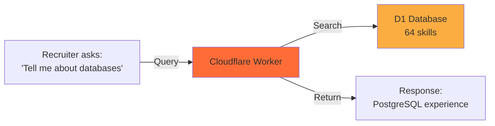
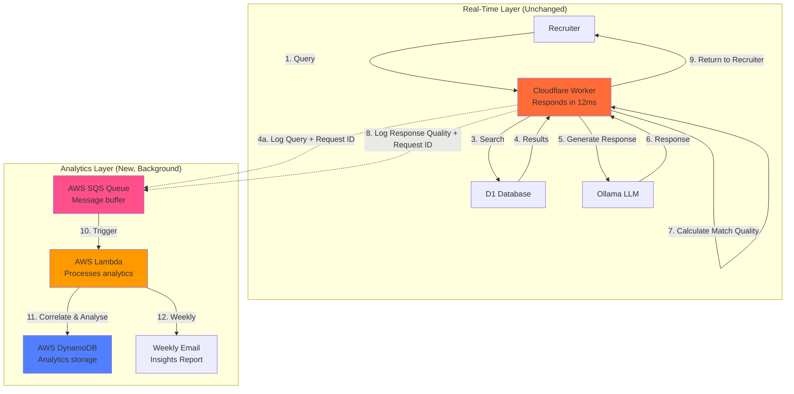
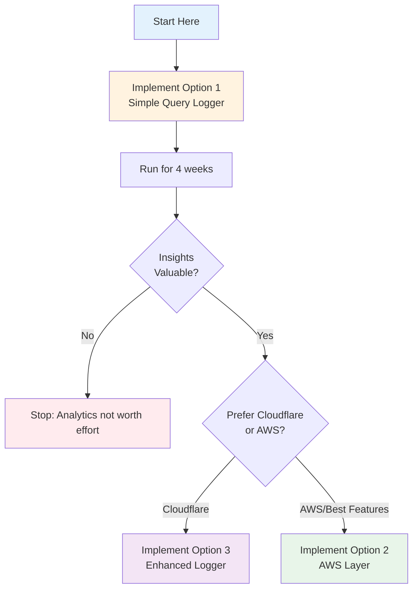

# AWS Analytics Layer Proposal: CV AI Agent Market Intelligence

**Status:** Proposal for Decision  
**Date:** October 30, 2025  
**Author:** AI Assistant  
**Project:** MyAIAgentPrivate (cv-ai-agent)

---

## Key takeaways

- **Proposal:** Add background analytics layer to track recruiter query patterns
- **Value:** Weekly market intelligence showing which skills are in demand, not improving chatbot responses (Ollama already handles that well)
- **Your commitment:** 15 minutes weekly to review insights and manually update CV data
- **Cost:** Free for 12 months (AWS Free Tier), then approximately £3-5/month
- **Recommendation:** Start with simple query logger, upgrade to full AWS if valuable
- **Alternative:** Cloudflare-only solution staying within existing infrastructure

---

## Table of Contents

- [What Your System Already Does Well](#what-your-system-already-does-well)
- [The Actual Problem](#the-actual-problem)
- [Proposed Solution](#proposed-solution)
- [What This Is Not](#what-this-is-not)
- [Implementation Options](#implementation-options)
- [Cost Analysis](#cost-analysis)
- [Decision Framework](#decision-framework)

---

## What Your System Already Does Well

Your CV AI agent using Ollama LLM already handles query understanding brilliantly. Before considering analytics, it's important to recognise what you already have working.

### Semantic Understanding

The LLM already understands keyword variations and semantic relationships.

**Example query:** "Do you have k8s experience?"

**What happens:**

1. Vector search finds related concepts: Docker, containers, DevOps tools
2. LLM recognises k8s equals Kubernetes equals container orchestration  
3. LLM generates nuanced response: "I don't have direct Kubernetes (k8s) experience, but I've worked with related containerisation and DevOps concepts..."

This is excellent behaviour. The system doesn't just say "no match found". It finds transferable skills and provides honest, contextual responses.

### Current Capabilities

| Capability | Example | Current Behaviour |
|------------|---------|-------------------|
| Alias recognition | "K8s" vs "Kubernetes" | Understands they're equivalent |
| Semantic similarity | "Database" matches "PostgreSQL", "SQL Server" | Finds related skills automatically |
| Contextual responses | Asked about missing skill | Explains related experience |
| Honest communication | No direct match | Acknowledges gap, shows transferable skills |

### The Critical Insight

Your chatbot doesn't need help answering questions. It needs help showing you what questions recruiters are asking.

---

## The Actual Problem

The problem isn't response quality. It's market visibility.

### Current Situation



Every query is independent. The system doesn't track:

- Which skills do recruiters actually care about?
- What questions get asked repeatedly?
- Are there emerging technology trends in your market?
- Which skills should you prioritise learning?

### Concrete Example

**Scenario:** Over one month, 10 different recruiters ask about Kubernetes experience in various forms:

- "Do you have Kubernetes experience?"
- "Familiar with K8s?"
- "Experience with container orchestration platforms?"
- "Have you worked with K8s in production?"

**What your LLM does:** Handles each query well, providing contextual responses about Docker and containerisation experience.

**What you don't know:** Kubernetes is being asked about frequently. This is a market signal that you're either:

1. Missing a skill you should add to your CV (if you have it)
2. Missing a skill you should learn (if you don't)
3. Using terminology that doesn't match recruiter language

Without analytics, these patterns remain invisible.

---

## Proposed Solution

Add a background analytics layer that captures query patterns without affecting response speed.

### Architecture

To track match quality and identify gaps accurately, analytics needs both the **query** and the **response quality**. This requires a two-stage logging approach with correlation.



**Key principle:** Steps 1 to 9 remain fast (unchanged response time). Steps 10 to 12 happen asynchronously in the background. **Match quality comes from the LLM itself via structured JSON output.**

### Simplified Two-Stage Logging Pattern

#### Stage 1: Query Log (Before Response)

```typescript
// Generate idempotent request ID
const requestId = crypto.randomUUID();

// Log query to AWS SQS immediately (async, non-blocking)
await sendToSQS({
  eventType: 'query',
  requestId: requestId,
  timestamp: Date.now(),
  query: userQuery,
  sessionId: sessionId // optional: track conversations
}, env.AWS_SQS_URL);
```

#### Stage 2: Response Quality Log (After Response)

```typescript
// Generate LLM response with structured match quality metadata
const llmResponse = await env.AI.run('@cf/meta/llama-3.2-3b-instruct', {
  messages: [{
    role: 'system',
    content: 'You are a CV assistant. Always respond in JSON with answer and match quality metadata.'
  }, {
    role: 'user',
    content: `Available skills: ${vectorResults.map(r => r.skill).join(', ')}

Question: ${userQuery}

Respond in JSON format:
{
  "answer": "your natural language response to the user",
  "matchQuality": {
    "type": "full|partial|none",
    "confidence": 0-100,
    "reasoning": "brief explanation of match quality"
  }
}`
  }]
});

const result = JSON.parse(llmResponse.response);

// Send answer to user immediately
const userAnswer = result.answer;

// Log response quality to AWS SQS (async, non-blocking)
await sendToSQS({
  eventType: 'response',
  requestId: requestId,
  timestamp: Date.now(),
  matchType: result.matchQuality.type,
  matchScore: result.matchQuality.confidence,
  reasoning: result.matchQuality.reasoning,
  vectorMatches: vectorResults.length
}, env.AWS_SQS_URL);

// Return answer to recruiter
return new Response(userAnswer);
```

**AWS SQS Integration:**

```typescript
async function sendToSQS(event: any, sqsUrl: string) {
  // Use AWS SDK v3 for Cloudflare Workers
  const { SQSClient, SendMessageCommand } = await import('@aws-sdk/client-sqs');
  
  const client = new SQSClient({
    region: 'eu-west-2', // London
    credentials: {
      accessKeyId: env.AWS_ACCESS_KEY_ID,
      secretAccessKey: env.AWS_SECRET_ACCESS_KEY
    }
  });
  
  const command = new SendMessageCommand({
    QueueUrl: sqsUrl,
    MessageBody: JSON.stringify(event),
    MessageDeduplicationId: event.requestId, // For FIFO queue
    MessageGroupId: 'analytics' // For FIFO queue
  });
  
  await client.send(command);
}
```

**Why AWS SQS instead of D1:**

- ✓ Decouples analytics from critical path (true async)
- ✓ Automatic retry and dead-letter queue handling
- ✓ Lambda triggers automatically on new messages
- ✓ Scales independently from chatbot
- ✓ Built for event-driven architecture

### Token Cost Consideration: Reasoning Field

**Question:** Does requesting `reasoning` consume more AI tokens?

**Answer:** Yes, but minimally. Here's the breakdown:

**Without reasoning:**

```json
{
  "answer": "I have 5 years of PostgreSQL experience...",
  "matchQuality": {
    "type": "full",
    "confidence": 95
  }
}
```

**Estimated output tokens:** ~30-50 (answer) + 5 (metadata) = **35-55 tokens**

**With reasoning:**

```json
{
  "answer": "I have 5 years of PostgreSQL experience...",
  "matchQuality": {
    "type": "full",
    "confidence": 95,
    "reasoning": "Direct database experience matches query"
  }
}
```

**Estimated output tokens:** ~30-50 (answer) + 12 (metadata + reasoning) = **42-62 tokens**

**Additional cost:** ~7-10 tokens per query (~15% increase)

### Cost Analysis

**Cloudflare Workers AI pricing (Llama 3.2 3B):**

- First 10,000 neurons/day: **Free**
- After that: ~$0.01 per 1,000 neurons

#### Scenario: 100 queries/day

| Configuration | Tokens/Query | Daily Tokens | Monthly Cost |
|---------------|--------------|--------------|--------------|
| Without reasoning | ~45 | 4,500 | **£0** (free tier) |
| With reasoning | ~52 | 5,200 | **£0** (free tier) |

#### Scenario: 1,000 queries/day (high volume)

| Configuration | Tokens/Query | Daily Tokens | Monthly Cost |
|---------------|--------------|--------------|--------------|
| Without reasoning | ~45 | 45,000 | ~£1.00 |
| With reasoning | ~52 | 52,000 | ~£1.15 |

**Additional cost with reasoning:** ~£0.15/month at 1,000 queries/day

### Recommendation: Include Reasoning Initially

**Why include it:**

1. **Debugging value** - Understand why LLM classified as "partial" vs "none"
2. **Analytics insight** - See patterns in classification logic
3. **Minimal cost** - £0.15/month even at high volume
4. **Can remove later** - If cost becomes issue, easy to drop from prompt

**When to remove reasoning:**

- If query volume exceeds 5,000/day consistently
- If you've validated analytics and don't need debugging
- If cost optimization becomes critical

**Optimized prompt (without reasoning):**

```typescript
const prompt = `Available skills: ${skills.join(', ')}

Question: ${query}

Respond in JSON:
{
  "answer": "natural language response",
  "matchQuality": {
    "type": "full|partial|none",
    "confidence": 0-100
  }
}`;
```

**This saves ~7-10 tokens per query** but loses debugging insight.

### Bottom Line

**For initial implementation:** Include `reasoning`

- Cost: Negligible (£0-0.15/month)
- Value: High for debugging and understanding analytics
- Can optimize later if needed

**For production at scale (>5k queries/day):** Consider removing `reasoning`

- Saves: ~15-20% of output tokens
- Trade-off: Lose classification explanations
- Still have `type` and `confidence` for analytics

**Practical advice:** Start with reasoning, monitor your Workers AI usage in Cloudflare dashboard, optimize only if cost becomes significant.

### Event Correlation in AWS Lambda

The Lambda function (triggered by SQS) correlates query and response events using DynamoDB.

**DynamoDB Tables:**

1. **QueryEvents** (interim storage with TTL)
   - Stores queries waiting for response correlation
   - Auto-deletes after 24 hours via TTL

2. **Analytics** (permanent storage)
   - Complete query + response records
   - GSI on `week` field for fast weekly queries

**Lambda Function Implementation:**

```typescript
import { SQSEvent } from 'aws-lambda';
import { DynamoDBClient } from '@aws-sdk/client-dynamodb';
import { DynamoDBDocumentClient, PutCommand, GetCommand, DeleteCommand } from '@aws-sdk/lib-dynamodb';

const client = new DynamoDBClient({ region: 'eu-west-2' });
const docClient = DynamoDBDocumentClient.from(client);

export async function handler(event: SQSEvent) {
  for (const record of event.Records) {
    const data = JSON.parse(record.body);
    
    if (data.eventType === 'query') {
      // Store query event temporarily
      await docClient.send(new PutCommand({
        TableName: 'CV-Analytics-QueryEvents',
        Item: {
          requestId: data.requestId,
          query: data.query,
          timestamp: data.timestamp,
          ttl: Math.floor(Date.now() / 1000) + (24 * 60 * 60)
        }
      }));
    }
    
    if (data.eventType === 'response') {
      // Get corresponding query
      const queryResult = await docClient.send(new GetCommand({
        TableName: 'CV-Analytics-QueryEvents',
        Key: { requestId: data.requestId }
      }));
      
      if (!queryResult.Item) {
        console.error(`Orphaned response: ${data.requestId}`);
        continue;
      }
      
      // Create complete analytics record
      await docClient.send(new PutCommand({
        TableName: 'CV-Analytics',
        Item: {
          requestId: data.requestId,
          timestamp: queryResult.Item.timestamp,
          week: getWeekId(queryResult.Item.timestamp),
          query: queryResult.Item.query,
          matchType: data.matchType,
          matchScore: data.matchScore,
          reasoning: data.reasoning
        }
      }));
      
      // Delete interim record
      await docClient.send(new DeleteCommand({
        TableName: 'CV-Analytics-QueryEvents',
        Key: { requestId: data.requestId }
      }));
    }
  }
  
  return { statusCode: 200 };
}

function getWeekId(timestamp: number): string {
  const date = new Date(timestamp);
  const year = date.getFullYear();
  const week = Math.ceil((date.getTime() - new Date(year, 0, 1).getTime()) / (7 * 24 * 60 * 60 * 1000));
  return `${year}-W${week.toString().padStart(2, '0')}`;
}
```

**Why AWS for correlation:**

- ✓ SQS guarantees at-least-once delivery
- ✓ Lambda auto-scales with message volume
- ✓ DynamoDB TTL auto-cleans orphaned records
- ✓ No impact on Cloudflare Worker performance
- ✓ Decoupled architecture (analytics can fail without affecting chatbot)

---

### LLM Match Quality Analysis (Optional Deep Dive)

The following sections explain how Ollama provides match quality metadata through structured output.

#### What Metadata Does Ollama Actually Provide?

When Ollama generates a response, it returns metadata, but **not match quality** by default:

```typescript
const response = await ollama.generate({
  model: 'llama3.2:3b',
  prompt: prompt
});

// Available metadata from Ollama:
console.log(response);
/*
{
  model: "llama3.2:3b",
  created_at: "2025-10-30T12:34:56.789Z",
  response: "I have 5 years of PostgreSQL experience...",
  done: true,
  
  // Performance metrics:
  total_duration: 5432109876,     // nanoseconds
  load_duration: 1234567,         // model load time
  prompt_eval_count: 42,          // tokens in prompt
  prompt_eval_duration: 987654321,
  eval_count: 156,                // tokens in response
  eval_duration: 4321098765,
  
  // NOT included by default:
  // - confidence score
  // - match quality
  // - uncertainty indicators
}
*/
```

**What's missing:** Ollama doesn't provide a "confidence score" or "match quality" metric in the response metadata.

#### Option 1: Prompt Engineering for Structured Output

You can ask Ollama to **include match quality in the response itself**:

```typescript
const prompt = `You are a CV assistant for Jose Alvarez. Answer the question based on his skills.

Available skills from CV: ${vectorResults.map(r => r.skill).join(', ')}

Question: ${userQuery}

Respond in JSON format:
{
  "answer": "your natural language response",
  "matchQuality": {
    "type": "full|partial|none",
    "confidence": 0-100,
    "reasoning": "brief explanation"
  }
}`;

const response = await ollama.generate({
  model: 'llama3.2:3b',
  prompt: prompt,
  format: 'json' // Llama 3.2 supports JSON mode
});

const parsed = JSON.parse(response.response);
/*
{
  "answer": "I have 5 years of PostgreSQL experience...",
  "matchQuality": {
    "type": "full",
    "confidence": 95,
    "reasoning": "Direct database experience matches the query"
  }
}
*/

// Send the natural answer to user
const userAnswer = parsed.answer;

// Log analytics with LLM's own quality assessment
await logResponseQuality(requestId, {
  matchType: parsed.matchQuality.type,
  matchScore: parsed.matchQuality.confidence,
  llmReasoning: parsed.matchQuality.reasoning
});
```

**Advantages:**

- ✓ LLM evaluates its own response quality (most accurate)
- ✓ Single LLM call (no additional latency)
- ✓ Confidence score from the model itself
- ✓ Reasoning helps debug analytics

**Disadvantages:**

- Requires structured prompting
- Response parsing needed
- Adds ~50 tokens to response (minor cost)
- JSON mode not available in all models

#### Option 2: Logprobs for Confidence (If Available)

Some models support `logprobs` (log probabilities) which indicate token confidence:

```typescript
// Note: Ollama API doesn't currently expose logprobs directly
// But if using OpenAI-compatible API or future Ollama versions:

const response = await ollama.generate({
  model: 'llama3.2:3b',
  prompt: prompt,
  options: {
    logprobs: 5 // Request top 5 token probabilities
  }
});

// Hypothetical logprobs analysis:
const avgConfidence = calculateAverageLogProb(response.logprobs);
// High confidence (>-0.5): Model is certain
// Low confidence (<-2.0): Model is uncertain/guessing
```

**Status:** Not currently available in standard Ollama API, but could be in future versions or via OpenAI-compatible endpoints.

#### Approach 1: Structured Prompt (Simple Classification)

Simpler version without full JSON:

```typescript
async function calculateMatchQualityWithLLM(query: string, response: string) {
  const analysisPrompt = `Analyse this CV chatbot interaction and classify the match quality.

Query: "${query}"
Response: "${response}"

Classify as ONE of:
- FULL: Direct experience mentioned
- PARTIAL: Related/transferable skills mentioned
- NONE: No relevant experience

Reply with ONLY the classification word.`;

  const classification = await ollama.generate({
    model: 'llama3.2:3b',
    prompt: analysisPrompt,
    options: {
      temperature: 0, // Deterministic
      num_predict: 10 // Short response
    }
  });
  
  const matchType = classification.response.trim().toLowerCase();
  
  return {
    type: matchType as 'full' | 'partial' | 'none',
    score: matchType === 'full' ? 90 : matchType === 'partial' ? 50 : 10
  };
}
```

#### Approach 2: Structured Output (Llama 3.2 with JSON)

```typescript
async function calculateMatchQualityStructured(query: string, response: string, vectorResults: any[]) {
  const analysisPrompt = `You are analysing a CV chatbot's response quality.

Query: "${query}"
Response: "${response}"
Vector matches: ${vectorResults.length} skills matched (similarity > 0.7)

Analyse and respond with JSON:
{
  "matchType": "full|partial|none",
  "matchScore": 0-100,
  "reasoning": "brief explanation",
  "missingConcepts": ["skill1", "skill2"]
}`;

  const analysis = await ollama.generate({
    model: 'llama3.2:3b',
    prompt: analysisPrompt,
    format: 'json', // Llama 3.2 supports JSON mode
    options: {
      temperature: 0.1
    }
  });
  
  return JSON.parse(analysis.response);
}
```

### Trade-offs: Heuristic vs LLM Analysis

| Approach | Latency | Accuracy | Cost | Complexity |
|----------|---------|----------|------|------------|
| **Heuristic** (string matching) | +1ms | 75-85% | Free | Low |
| **LLM Simple** (classification only) | +150-300ms | 90-95% | Ollama tokens | Medium |
| **LLM Structured** (full analysis) | +200-400ms | 95-98% | Ollama tokens | Medium |

### Recommendation: Structured Response with Match Quality

The **best approach** is to have Ollama include match quality directly in its response:

**Implementation:**

```typescript
// Single LLM call with structured output
const response = await ollama.generate({
  model: 'llama3.2:3b',
  prompt: `You are a CV assistant. Answer and assess match quality.

Available skills: ${skills.join(', ')}
Question: ${query}

Respond in JSON:
{
  "answer": "natural language response to user",
  "meta": {
    "matchType": "full|partial|none",
    "confidence": 0-100,
    "matchedSkills": ["skill1", "skill2"],
    "reasoning": "why this classification"
  }
}`,
  format: 'json'
});

const result = JSON.parse(response.response);

// Return answer to user immediately
await sendToUser(result.answer);

// Log analytics in background (non-blocking)
await logAnalytics({
  requestId: requestId,
  query: query,
  matchType: result.meta.matchType,
  matchScore: result.meta.confidence,
  matchedSkills: result.meta.matchedSkills,
  reasoning: result.meta.reasoning
});
```

**Why this is optimal:**

- ✓ No additional LLM calls (same latency as without analytics)
- ✓ LLM's self-assessment is most accurate
- ✓ Rich metadata for analytics
- ✓ Debugging insight via reasoning field
- ✓ Single source of truth

### Updated Trade-off Analysis

| Approach | LLM Calls | Latency | Accuracy | Complexity |
|----------|-----------|---------|----------|------------|
| **Heuristic** (string matching) | 1 (main) | +1ms | 75-85% | Low |
| **Structured Response** (recommended) | 1 (main) | +0ms | 95-98% | Low |
| **Separate Analysis** | 2 | +200-400ms | 90-95% | Medium |
| **Batch Re-analysis** | 1 + weekly | +0ms real-time | 95-98% | Medium |

**Clear winner:** Structured response with match quality metadata.

### Practical Implementation Summary

**Recommended approach:** Include match quality directly in Ollama's response payload.

**Benefits:**

- Zero additional latency (same LLM call)
- Most accurate (LLM self-assessment)
- Simplest implementation (single event log)
- Rich debugging data (reasoning field)

**Alternative approaches:**

- **Heuristics:** Fast but less accurate (75-85%)
- **Separate analysis call:** Accurate but adds 200-400ms latency
- **Batch re-analysis:** Accurate for reports, but complex architecture

**Bottom line:** By structuring your prompt to request match quality metadata in JSON, Ollama provides everything you need in the initial response with no additional cost or latency.

---

```typescript
// Real-time (Stage 2): Fast heuristic
const quickMatch = calculateMatchQuality(searchResults, llmResponse);
await logResponseQuality(requestId, quickMatch);

// Weekly batch job (Lambda/Cron): Accurate LLM re-analysis
// Run LLM analysis on all queries from the week
// Update analytics with refined classifications
// Generate report with LLM-verified match quality
```

**Why hybrid:**

- ✓ User response stays fast (no additional LLM call in critical path)
- ✓ Weekly report has accurate LLM-verified classifications
- ✓ Best of both worlds: speed + accuracy
- ✓ Can compare heuristic vs LLM accuracy to improve heuristics

**Is Ollama in Workers feasible?**

Yes, if you're running Ollama via Workers AI (Cloudflare's inference):

```typescript
// Using Cloudflare Workers AI
const ai = env.AI; // Bound to Workers AI

const analysis = await ai.run('@cf/meta/llama-3.2-3b-instruct', {
  messages: [{
    role: 'user',
    content: analysisPrompt
  }],
  temperature: 0
});
```

**Latency considerations:**

- Workers AI (Cloudflare): ~200-400ms per inference
- Self-hosted Ollama (via API): ~500-1000ms (network + inference)
- Batch processing (weekly): Latency doesn't matter

**Conclusion:** LLM-based match quality is **definitely doable** and likely more accurate than heuristics, especially for nuanced cases. The question is whether to do it real-time (adds latency) or batch weekly (no user impact).

### Lambda Correlation Logic

The Lambda function correlates query and response events:

```typescript
// DynamoDB stores interim query events
interface QueryEvent {
  requestId: string; // partition key
  eventType: 'query' | 'response';
  timestamp: number;
  query?: string; // only in query event
  matchType?: 'full' | 'partial' | 'none'; // only in response event
  matchScore?: number;
  skillsMatched?: string[];
  skillsMissing?: string[];
}

// When query event arrives
if (event.eventType === 'query') {
  await dynamoDB.put({
    TableName: 'QueryEvents',
    Item: {
      requestId: event.requestId,
      query: event.query,
      timestamp: event.timestamp,
      status: 'awaiting_response',
      ttl: Date.now() + (24 * 60 * 60 * 1000) // 24 hour expiry
    }
  });
}

// When response event arrives
if (event.eventType === 'response') {
  const queryEvent = await dynamoDB.get({
    TableName: 'QueryEvents',
    Key: { requestId: event.requestId }
  });
  
  // Correlate and create complete analytics record
  await dynamoDB.put({
    TableName: 'Analytics',
    Item: {
      requestId: event.requestId,
      timestamp: queryEvent.timestamp,
      query: queryEvent.query,
      matchType: event.matchType,
      matchScore: event.matchScore,
      skillsMatched: event.skillsMatched,
      skillsMissing: event.skillsMissing,
      week: getWeekIdentifier(queryEvent.timestamp)
    }
  });
  
  // Clean up interim record
  await dynamoDB.delete({
    TableName: 'QueryEvents',
    Key: { requestId: event.requestId }
  });
}
```

**Why this approach:**

- ✓ Correlates query with actual response quality
- ✓ Handles async logging without blocking response
- ✓ Idempotent (can retry safely with same request ID)
- ✓ Accurate gap identification (knows what was asked AND how well it was answered)
- ✓ TTL ensures cleanup of orphaned records (if response log fails)

### Error Handling Considerations

**What happens if Stage 2 logging fails?**

In Option 1 (D1 database), you can query for incomplete records:

```sql
-- Find queries without match quality (older than 5 minutes)
SELECT request_id, query, timestamp 
FROM query_log 
WHERE status = 'pending' 
  AND timestamp < ?
ORDER BY timestamp DESC;
```

In Option 2 (AWS), the DynamoDB TTL automatically cleans up orphaned records after 24 hours.

**Impact:** Missing match quality for some queries doesn't break analytics. You'll still see query frequency, just without match classification for failed logs.

**Mitigation:** Wrap Stage 2 logging in try-catch to ensure response still reaches recruiter even if logging fails:

```typescript
try {
  await logResponseQuality(requestId, matchQuality);
} catch (error) {
  console.error('Analytics logging failed:', error);
  // Continue - don't block user response
}
```

### What Analytics Provides

**Weekly intelligence report showing:**

1. **Query frequency:** Which skills are being asked about most
2. **Keyword variations:** How recruiters phrase questions ("K8s" vs "Kubernetes")
3. **Gap identification:** Questions that don't match any of your skills
4. **Trend analysis:** Emerging technologies in your market
5. **Match rate:** Percentage of queries fully answered vs partially answered

### Example Weekly Report

```text
CV AI Agent Weekly Report
═══════════════════════════

Top Skills Queried This Week
-----------------------------
1. Kubernetes/K8s - 47 queries (↑ 35% from last week)
2. React - 31 queries (→ stable)
3. Python - 28 queries (↓ 12% from last week)

Queries With No Direct Match
-----------------------------
□ "Kubernetes experience" - 12 occurrences
  You have: Docker, containerisation tools
  Consider: Do you have K8s experience to add?

□ "GraphQL API development" - 8 occurrences  
  You have: REST API experience
  Consider: Learning GraphQL or adding if you have it

Common Keyword Variations
--------------------------
• "K8s" used 23 times, "Kubernetes" used 24 times
• "JS" used 18 times, "JavaScript" used 31 times
  (Note: LLM already handles these variations semantically)

Skills to Consider Adding
--------------------------
Based on frequency and your actual experience:
• Kubernetes (47 queries) - Do you have container orchestration experience?
• GraphQL (28 queries) - Have you built GraphQL APIs?

30-Day Trend
------------
Kubernetes: ▁▂▃▅▆▇█ (strong upward trend)
GraphQL:    ▃▄▅▄▃▂▁ (stabilising)
React:      ████████ (consistent demand)
```

### Your Weekly Workflow (15 Minutes)

1. **Review report** (5 minutes): Read top queries and gaps
2. **Identify actions** (5 minutes): Note skills to add or learn (not aliases, since LLM handles variations)
3. **Update D1** (5 minutes): Add new skills you actually have with proper descriptions

The system provides intelligence. You make truthful decisions about what to add. No need to manage aliases since Ollama understands semantic variations automatically.

---

## What This Is Not

Before discussing implementation, it's critical to understand what analytics does NOT do.

### Not About Automatic CV Updates

Analytics will never automatically add skills to your CV or D1 database. Only you can decide:

- Whether you actually have a skill
- How proficient you are
- Whether it's worth adding
- How to describe it accurately

**Example decision tree:**

```text
Analytics reports: "Kubernetes queried 47 times this month"

Your decision process:
1. Do I have Kubernetes experience?
   ├─ YES → Add to D1 with accurate description
   ├─ NO → Consider learning it (market demand signal)
   └─ PARTIAL → Add nuanced truth: "Familiar with K8s concepts via Docker"

2. Is the LLM already handling this well?
   └─ YES (Ollama understands "K8s" = "Kubernetes" semantically)
      → No action needed, LLM already responds appropriately

3. Should I add this skill to strengthen responses?
   └─ Have related experience → Add actual skill with proper context
```

The system cannot make these decisions. They require your professional judgement and commitment to honesty.

### Not About Improving Responses

Your Ollama LLM already handles responses well. It understands semantic relationships, provides contextual answers, and maintains honesty about gaps.

Analytics doesn't change how the chatbot responds. It shows you what recruiters are asking so you can make informed career development decisions.

### Not Phase 2 Automation

Earlier versions of this proposal suggested "Phase 2" with semi-automated suggestions. Analysis shows this adds complexity without significant value:

| Phase 1 (Analytics Only) | Phase 2 (Attempted Automation) | Assessment |
|--------------------------|-------------------------------|------------|
| Shows "K8s asked 47 times" | Suggests "Add K8s alias" | Unnecessary: LLM already understands K8s = Kubernetes |
| Reports Terraform demand | Links to similar skills | You know your own skills better |
| Identifies gaps | Suggests response templates | Generic templates aren't helpful |
| Weekly summary | Daily notifications | Creates noise, not value |

**Conclusion:** Phase 1 provides sufficient intelligence. Phase 2 automation is unnecessary complexity.

---

## Implementation Options

Three approaches with different complexity and cost trade-offs.

### Option 1: Simple Query Logger (Recommended Starting Point)

Add basic two-stage logging using **LLM structured output** for match quality.

**What you invest:** 15 minutes to add logging to Worker + create D1 table

**What you get:** Query data with LLM-assessed match quality, manual weekly SQL review

**Architecture:**

```typescript
// Stage 1: Log query with request ID
const requestId = crypto.randomUUID();

await env.DB.prepare(`
  INSERT INTO query_log (request_id, timestamp, query, status) 
  VALUES (?, ?, ?, 'pending')
`).bind(requestId, Date.now(), userQuery).run();

// Generate vector search results
const vectorResults = await searchSkills(userQuery, env.DB);

// Generate LLM response with structured match quality
const llmResponse = await env.AI.run('@cf/meta/llama-3.2-3b-instruct', {
  messages: [{
    role: 'system',
    content: 'You are a CV assistant. Respond in JSON with answer and match quality.'
  }, {
    role: 'user',
    content: `Available skills: ${vectorResults.map(r => r.skill).join(', ')}

Question: ${userQuery}

Respond in JSON:
{
  "answer": "natural language response",
  "matchQuality": {
    "type": "full|partial|none",
    "confidence": 0-100,
    "reasoning": "brief explanation"
  }
}`
  }]
});

const result = JSON.parse(llmResponse.response);

// Stage 2: Update with LLM's match quality assessment
await env.DB.prepare(`
  UPDATE query_log 
  SET match_type = ?, match_score = ?, reasoning = ?, status = 'complete'
  WHERE request_id = ?
`).bind(
  result.matchQuality.type,
  result.matchQuality.confidence,
  result.matchQuality.reasoning,
  requestId
).run();

// Return answer to user
return new Response(result.answer);

// Weekly manual review
// SELECT query, match_type, reasoning, COUNT(*) as count 
// FROM query_log 
// WHERE timestamp > ? AND status = 'complete'
// GROUP BY query, match_type 
// ORDER BY count DESC 
// LIMIT 20
```

**D1 Schema:**

```sql
CREATE TABLE query_log (
  request_id TEXT PRIMARY KEY,
  timestamp INTEGER NOT NULL,
  query TEXT NOT NULL,
  match_type TEXT, -- 'full' | 'partial' | 'none'
  match_score INTEGER, -- 0-100
  reasoning TEXT, -- LLM's explanation
  status TEXT DEFAULT 'pending' -- 'pending' | 'complete'
);

CREATE INDEX idx_timestamp ON query_log(timestamp);
CREATE INDEX idx_match_type ON query_log(match_type);
```

**Effort vs Payoff:**

- **Setup time:** 15 minutes
- **Ongoing effort:** 10 minutes weekly (run SQL, review results)
- **Insight depth:** Medium (see what's asked, match quality, LLM reasoning)
- **Cost:** £0
- **Dependencies:** None (uses existing D1)
- **Future-proof:** Can upgrade to Options 2/3 later with same data

**Best for:** Validating whether analytics is worth your time before investing in automation.

### Option 2: AWS Analytics Layer (Full Automation)

Background processing with automated weekly reports via AWS services.

**What you invest:** 2-3 days setup (AWS account, SQS, Lambda, DynamoDB, SES)

**What you get:** Automated weekly email reports, sophisticated trend analysis, zero ongoing effort

**Architecture:**

- SQS queue for async query logging
- Lambda function for data processing
- DynamoDB for analytics storage
- EventBridge for scheduled reporting
- SES for email delivery

**Effort vs Payoff:**

- **Setup time:** 2-3 days (AWS infrastructure, IAM roles, deployment)
- **Ongoing effort:** 5 minutes weekly (read email report, decide actions)
- **Insight depth:** High (trends, patterns, automated analysis)
- **Cost:** £0 first year (free tier), then £3-5/month
- **Dependencies:** AWS account, SDK integration in Worker
- **Scalability:** Handles 100k+ queries/month easily
- **Future-proof:** Professional-grade, can add more analytics features

**Best for:** After Option 1 validates value and you want to eliminate manual SQL work.

### Option 3: Enhanced Query Logger

Middle ground with automated reporting but simpler infrastructure.

**What you invest:** 4-6 hours (Cloudflare Cron, email setup, reporting script)

**What you get:** Automated weekly email using only Cloudflare, no AWS dependency

**Architecture:**

- Cloudflare D1 for query storage
- Cloudflare Workers Cron for weekly processing
- Email via SendGrid free tier or Cloudflare Email Workers

**Effort vs Payoff:**

- **Setup time:** 4-6 hours (cron job, email template, D1 queries)
- **Ongoing effort:** 5 minutes weekly (read email, decide actions)
- **Insight depth:** Medium (basic trends, top queries, match rates)
- **Cost:** £0 (stays within free tiers)
- **Dependencies:** Minimal (all Cloudflare, no AWS)
- **Scalability:** Works well up to ~10k queries/month
- **Future-proof:** Limited (D1 analytics capabilities less sophisticated than DynamoDB)

**Best for:** Want automation without AWS complexity, comfortable with Cloudflare-only stack.

### Recommendation

**Start with Option 1** (Simple Query Logger):

1. **Week 1:** Implement in 15 minutes
2. **Weeks 2-5:** Run for 4 weeks, manual review weekly
3. **Week 5:** Evaluate

**Your evaluation criteria:**

- Did insights lead to CV improvements? (value)
- Was 10-minute weekly review worthwhile? (effort)
- Do you want this data regularly? (ongoing interest)

**If yes to all three, then upgrade:**

| Your Priority | Choose | Why |
|---------------|--------|-----|
| Minimal effort, don't care about AWS | **Option 3** | Stay in Cloudflare, simpler setup |
| Best analytics, willing to learn AWS | **Option 2** | Professional solution, scalable |
| Keep it simple, fine with manual | **Option 1** | Already working, zero cost |

**Effort-to-insight comparison:**

```text
Option 1: ▓░░░░ (15 min setup, 10 min/week ongoing)
          Insight: ▓▓▓░░ (good, but manual)

Option 2: ▓▓▓▓▓ (2-3 days setup, 5 min/week ongoing)
          Insight: ▓▓▓▓▓ (excellent, automated)

Option 3: ▓▓▓░░ (4-6 hours setup, 5 min/week ongoing)
          Insight: ▓▓▓░░ (good, automated but limited)
```

**Bottom line:** Validate with Option 1 first. Only invest in automation (Options 2/3) after confirming analytics is valuable to you.

---

## Implementation Cost Breakdown

### Option 1: Simple Query Logger

**Cost:** £0 per month

- Uses existing D1 database (already paying for)
- No additional services
- No external dependencies

### Option 2: AWS Analytics Layer

**First 12 months (Free Tier):**

| Service | Free Tier | Expected Usage | Cost |
|---------|-----------|----------------|------|
| SQS | 1M requests/month | ~10k queries/month | £0 |
| Lambda | 1M requests/month, 400k GB-seconds | ~10k invocations/month | £0 |
| DynamoDB | 25 GB storage, 200M requests | ~1 GB, 50k requests | £0 |
| SES | 62k emails/month | 4 emails/month | £0 |

**Total Year 1:** £0

**After 12 months:**

| Service | Expected Usage | Cost |
|---------|----------------|------|
| SQS | 10k requests/month | £0.50 |
| Lambda | 10k invocations, 2 GB-seconds each | £1.20 |
| DynamoDB | 1 GB storage, 50k requests | £1.50 |
| SES | 4 emails/month | £0.40 |

**Total Year 2+:** £3.60 per month (approximately £43 per year)

### Option 3: Cloudflare Enhanced Logger

**Cost:** £0 to £5 per month

- D1 database: Included in Workers plan
- Workers Cron: Included in Workers plan
- Email delivery: SendGrid free tier (100 emails/day) or Cloudflare Email Workers (beta, pricing TBD)

**Assumption:** Stays within free tiers unless query volume exceeds 100k per month.

### Cost Comparison for Low Volume (100-500 queries/month)

| Option | Year 1 | Year 2+ | Automation | Complexity |
|--------|--------|---------|------------|-----------|
| Option 1 | £0 | £0 | None | Very Low |
| Option 2 | £0 | £43/year | Full | High |
| Option 3 | £0 | £0-£60/year | Full | Medium |

**Reality check:** At current query volumes (estimated 50-200 per month), all options stay within free tiers.

---

## Decision Framework

### Should You Implement Analytics?

**Implement if:**

- You want data-driven career development insights
- You're actively job hunting or networking with recruiters
- You plan to update CV based on market trends
- You're curious about which skills are in demand
- 15 minutes weekly for review is acceptable

**Don't implement if:**

- You're satisfied with current CV performance
- You don't plan to learn new skills
- You trust intuition over data for career decisions
- You don't want another weekly task
- Your chatbot receives fewer than 20 queries per month

### Which Implementation Option?

**Choose Option 1 if:**

- You want to test the concept first
- You're comfortable with manual SQL queries
- You want zero additional cost
- You value simplicity over automation

**Choose Option 2 if:**

- Analytics proved valuable via Option 1
- You want fully automated reporting
- You're comfortable with AWS infrastructure
- £3-5/month is acceptable cost
- You expect high query volumes (1000+ per month)

**Choose Option 3 if:**

- Analytics proved valuable via Option 1
- You want to stay within Cloudflare ecosystem
- You want automation without AWS complexity
- You're comfortable with moderate setup effort

### Recommended Path



**Rationale:** Validate value before investing in automation. Many features seem useful in theory but provide minimal value in practice.

---

## Next Steps

### If You Decide to Proceed

1. **Implement Option 1** (this week)
   - Add query logging to Worker (5 lines of code)
   - Create query_log table in D1
   - Set calendar reminder for weekly review

2. **Run for 4 weeks** (baseline period)
   - Review logs manually each week
   - Note patterns and surprises
   - Track time spent on review

3. **Evaluate** (end of month)
   - Did insights lead to CV improvements?
   - Was weekly review effort worthwhile?
   - What would automation add?

4. **Decide on automation** (if valuable)
   - Choose Option 2 or 3 based on preferences
   - Implement over weekend
   - Continue weekly reviews with automated reports

### If You Decide Not to Proceed

No action required. Your chatbot continues working well without analytics.

**Alternative:** Periodically review chatbot conversations manually (monthly) to spot patterns. Less systematic but zero infrastructure.

---

## Conclusion

Analytics provides market intelligence, not response improvement. Your LLM already answers questions well. Analytics shows you which questions recruiters ask most frequently, helping you make data-driven career development decisions.

Start simple (Option 1), validate value, then automate if worthwhile. The simplest implementation takes 5 minutes and costs nothing. More sophisticated options available if basic analytics proves valuable.

**Final recommendation:** Implement Option 1 this week, review for 4 weeks, then decide whether automation is worth the effort.

**Question to answer:** Would knowing "Kubernetes asked 47 times this month" change your learning priorities or CV updates? If yes, implement analytics. If no, skip it.
