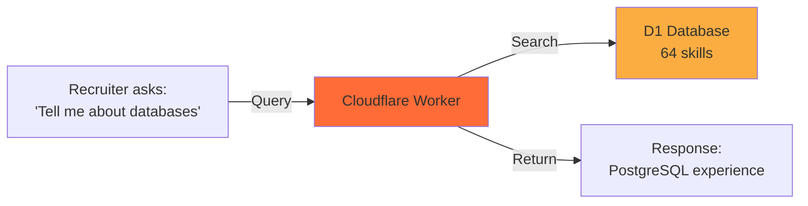
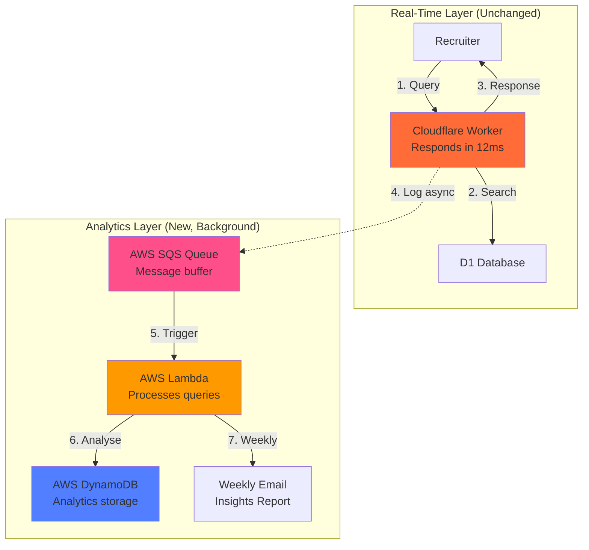
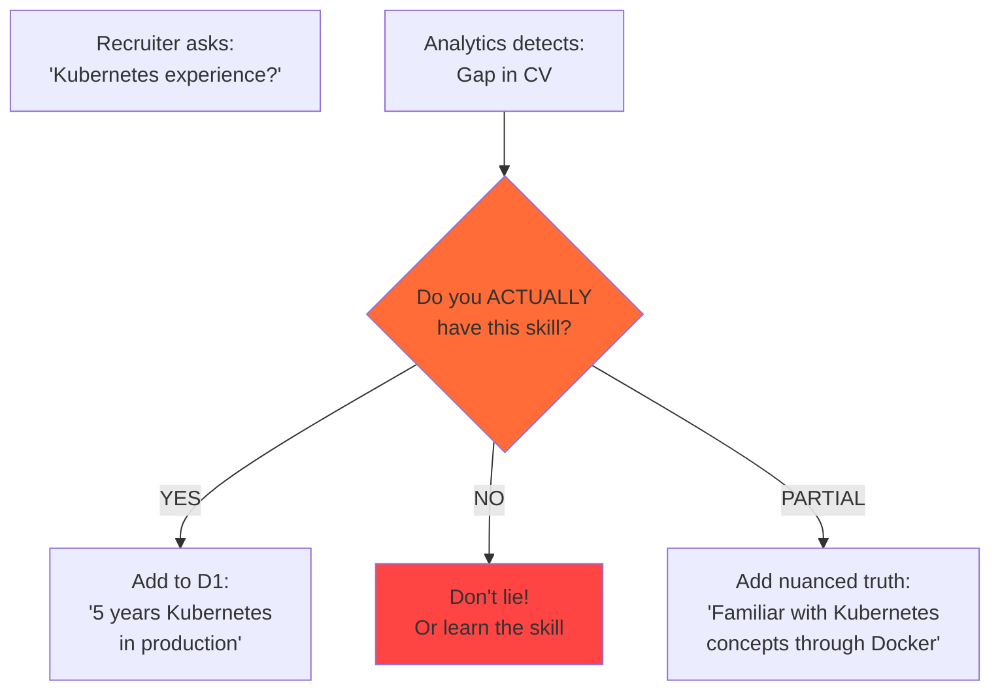
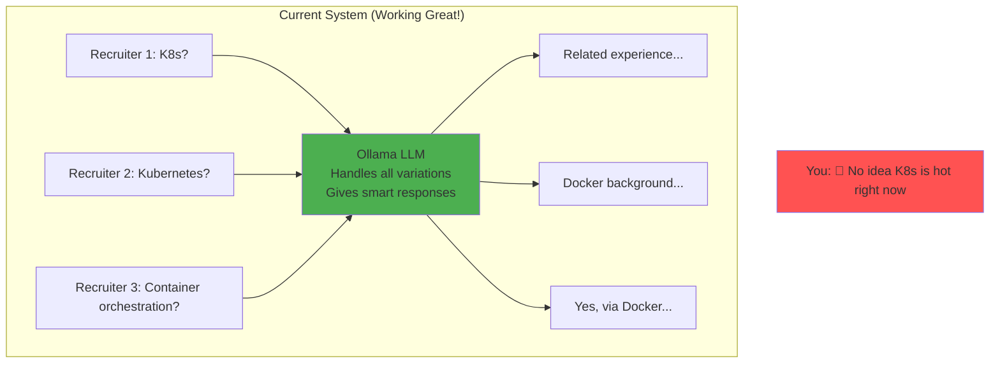
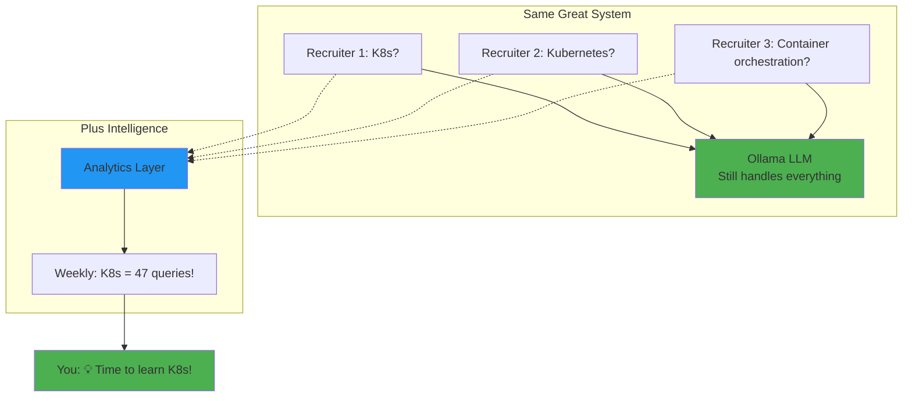

# AWS Analytics Layer Proposal: CV AI Agent Market Intelligence

**Status:** Proposal for Decision  
**Date:** October 30, 2025  
**Author:** AI Assistant  
**Project:** MyAIAgentPrivate (cv-ai-agent)

---

## TL;DR

- **Proposal:** Add background analytics layer to track recruiter query patterns
- **Value:** Weekly market intelligence showing which skills are in demand, not improving chatbot responses (Ollama already handles that well)
- **Your commitment:** 15 minutes weekly to review insights and manually update CV data
- **Cost:** Free for 12 months (AWS Free Tier), then approximately £3-5/month
- **Recommendation:** Implement Phase 1 (analytics only), skip Phase 2 (automation adds complexity without significant value)
- **Alternative:** Simple query logger with manual SQL review (no AWS required)

---

## Table of Contents

- [What Your System Already Does Well](#what-your-system-already-does-well)
- [The Actual Problem](#the-actual-problem)
- [Proposed Solution](#proposed-solution)
- [What This Is Not](#what-this-is-not)
- [Implementation Options](#implementation-options)
- [Cost Analysis](#cost-analysis)
- [Decision Framework](#decision-framework)

---

## What Your System Already Does Well

Your CV AI agent using Ollama LLM already handles query understanding brilliantly. Before considering analytics, it's important to recognise what you already have working.

### Semantic Understanding

The LLM already understands keyword variations and semantic relationships:

**Example query:** "Do you have k8s experience?"

**What happens:**

1. Vector search finds related concepts: Docker, containers, DevOps tools
2. LLM recognises k8s = Kubernetes = container orchestration  
3. LLM generates nuanced response: "I don't have direct Kubernetes (k8s) experience, but I've worked with related containerisation and DevOps concepts..."

This is excellent behaviour. The system doesn't just say "no match found". It finds transferable skills and provides honest, contextual responses.

### What Your LLM Handles Automatically

| Capability | Example | Current Behaviour |
|------------|---------|-------------------|
| Alias recognition | "K8s" vs "Kubernetes" | Understands they're equivalent |
| Semantic similarity | "Database" matches "PostgreSQL", "SQL Server" | Finds related skills automatically |
| Contextual responses | Asked about missing skill | Explains related experience |
| Honest communication | No direct match | Acknowledges gap, shows transferable skills |

### The Critical Insight

Your chatbot doesn't need help answering questions. It needs help showing you what questions recruiters are asking.

---

## The Actual Problem

The problem isn't response quality. It's market visibility.

### Current Situation



Every query is independent. The system doesn't track:

- Which skills do recruiters actually care about?
- What questions get asked repeatedly?
- Are there emerging technology trends in your market?
- Which skills should you prioritise learning?

### Concrete Example

**Scenario:** Over one month, 10 different recruiters ask about Kubernetes experience in various forms:

- "Do you have Kubernetes experience?"
- "Familiar with K8s?"
- "Experience with container orchestration platforms?"
- "Have you worked with K8s in production?"

**What your LLM does:** Handles each query well, providing contextual responses about Docker and containerisation experience.

**What you don't know:** Kubernetes is being asked about frequently. This is a market signal that you're either:

1. Missing a skill you should add to your CV (if you have it)
2. Missing a skill you should learn (if you don't)
3. Using terminology that doesn't match recruiter language

Without analytics, these patterns remain invisible.

---

## Proposed Solution

Add a background analytics layer that captures query patterns without affecting response speed.

### Architecture



**Key principle:** Steps 1 to 3 remain identical and fast. Steps 4 to 7 happen asynchronously in the background.

### What Analytics Provides

**Weekly intelligence report showing:**

1. **Query frequency:** Which skills are being asked about most
2. **Keyword variations:** How recruiters phrase questions ("K8s" vs "Kubernetes")
3. **Gap identification:** Questions that don't match any of your skills
4. **Trend analysis:** Emerging technologies in your market
5. **Match rate:** Percentage of queries fully answered vs partially answered

### Example Weekly Report

```text
CV AI Agent Weekly Report
═══════════════════════════

Top Skills Queried This Week
-----------------------------
1. Kubernetes/K8s - 47 queries (↑ 35% from last week)
2. React - 31 queries (→ stable)
3. Python - 28 queries (↓ 12% from last week)

Queries With No Direct Match
-----------------------------
□ "Kubernetes experience" - 12 occurrences
  You have: Docker, containerisation tools
  Consider: Do you have K8s experience to add?

□ "GraphQL API development" - 8 occurrences  
  You have: REST API experience
  Consider: Learning GraphQL or adding if you have it

Common Keyword Variations
--------------------------
• "K8s" used 23 times, "Kubernetes" used 24 times
• "JS" used 18 times, "JavaScript" used 31 times

Suggested Aliases (Quick Wins)
-------------------------------
Add these to D1 if appropriate:
• "K8s" → "Kubernetes"
• "JS" → "JavaScript"
• "TS" → "TypeScript"

30-Day Trend
------------
Kubernetes: ▁▂▃▅▆▇█ (strong upward trend)
GraphQL:    ▃▄▅▄▃▂▁ (stabilising)
React:      ████████ (consistent demand)
```

### Your Weekly Workflow (15 Minutes)

1. **Review report** (5 minutes): Read top queries and gaps
2. **Identify actions** (5 minutes): Note skills to add or learn
3. **Update D1** (5 minutes): Add aliases or new skills you actually have

The system provides intelligence. You make truthful decisions about what to add.

---

## What This Is Not

Before discussing implementation, it's critical to understand what analytics does NOT do.

### Not About Automatic CV Updates

Analytics will never automatically add skills to your CV or D1 database. Only you can decide:

- Whether you actually have a skill
- How proficient you are
- Whether it's worth adding
- How to describe it accurately

**Example decision tree:**

```text
Analytics reports: "Kubernetes queried 47 times this month"

Your decision process:
1. Do I have Kubernetes experience?
   ├─ YES → Add to D1 with accurate description
   ├─ NO → Consider learning it (market demand signal)
   └─ PARTIAL → Add nuanced truth: "Familiar with K8s concepts via Docker"

2. Is this just terminology?
   └─ "K8s" = "Kubernetes" → Add alias

3. Should I rephrase existing skills?
   └─ Have "container orchestration" → Could add "including Kubernetes exposure"
```

The system cannot make these decisions. They require your professional judgement and commitment to honesty.

### Not About Improving Responses

Your Ollama LLM already handles responses well. It understands semantic relationships, provides contextual answers, and maintains honesty about gaps.

Analytics doesn't change how the chatbot responds. It shows you what recruiters are asking so you can make informed career development decisions.

### Not Phase 2 Automation

Earlier versions of this proposal suggested "Phase 2" with semi-automated suggestions. Analysis shows this adds complexity without significant value:

| Phase 1 (Analytics Only) | Phase 2 (Attempted Automation) | Assessment |
|--------------------------|-------------------------------|------------|
| Shows "K8s asked 47 times" | Suggests "Add K8s alias" | Obvious from report, no automation needed |
| Reports Terraform demand | Links to similar skills | You know your own skills better |
| Identifies gaps | Suggests response templates | Generic templates aren't helpful |
| Weekly summary | Daily notifications | Creates noise, not value |

**Conclusion:** Phase 1 provides sufficient intelligence. Phase 2 automation is unnecessary complexity.

---

1. **Missing Keywords** (Easy to detect, hard to fix automatically)
   - Recruiter asks: "Do you know Kubernetes?"
   - Your D1 has: Docker, containers, orchestration
   - System reports: "Kubernetes" not found
   - **Why human needed:** Only YOU know if you actually have Kubernetes experience

2. **Poor Keyword Matching** (Easy to detect AND potentially fixable)
   - Recruiter asks: "Experience with K8s?"
   - Your D1 has: "Kubernetes"
   - System reports: "K8s" didn't match "Kubernetes"
   - **Could automate:** Add "K8s" as alias for "Kubernetes"

**What YOU do with the insights:**

```
Weekly Report shows:
━━━━━━━━━━━━━━━━━━━━━━━━━━━━━━━━━━━━━━━━━
❌ Queries With No Match (15 total)
- "Kubernetes experience" (8 times)
- "K8s deployment" (4 times)  
- "GraphQL APIs" (3 times)

💡 Analysis:
- "Kubernetes/K8s" mentioned 12 times total
- You have "Docker" and "container orchestration" skills
- Possible gap: Kubernetes not in your CV
━━━━━━━━━━━━━━━━━━━━━━━━━━━━━━━━━━━━━━━━━
```

**Your Decision Tree:**

1. **Do I have Kubernetes experience?**
   - YES → Add to D1 database with proper description
   - NO → Consider learning it (market demand signal!)

2. **Is it just a keyword variation?**
   - "K8s" = "Kubernetes" → Add alias
   - "JS" = "JavaScript" → Add alias

3. **Should I rephrase my experience?**
   - Have: "container orchestration"
   - Add: "including Kubernetes/K8s exposure"

### Why Human Intervention is Essential

**The Truth Problem:**



**The system CANNOT know:**

- Whether you actually have the skill
- How proficient you are
- Whether it's worth adding
- How to describe it accurately

**The system CAN tell you:**

- This skill is in high demand
- You're missing opportunities
- Common variations/aliases
- Trending technologies

### Future Possibility (Phase 2 - Semi-Automated Assistance)

**Important:** Phase 2 is NOT about automatic adaptation. It's about better assistance for manual updates.

**What Phase 2 could realistically offer:**

1. **Automated Alias Suggestions** (Safe, but requires approval)
   ```
   System detects: "K8s" asked 10 times, you have "Kubernetes"
   Suggests: "Add K8s as alias? [Approve] [Reject]"
   You decide: Yes, they're the same thing → Approve
   ```

2. **Smart Gap Analysis** (Helpful, not automatic)
   ```
   System notices: 20 queries about "Terraform", you have "CloudFormation"
   Reports: "Similar skill detected. Consider adding Terraform if you have experience"
   You decide: Actually used Terraform at previous job → Add it
   ```

3. **Response Templates** (Suggests, doesn't implement)
   ```
   For gaps you can't fill:
   System suggests: "I don't have X, but my experience with Y provides transferable skills"
   You customize: Edit template to be truthful and specific
   ```

**What Phase 2 will NEVER do:**
- ❌ Automatically add skills to your CV
- ❌ Change responses without your approval
- ❌ Invent experience you don't have
- ❌ Make decisions about what's "close enough"

**Do we actually need Phase 2?**

**Probably not.** Here's why:

| Phase 1 Value | Phase 2 Addition | Worth the Complexity? |
|---------------|------------------|----------------------|
| Shows "K8s" is being asked | Suggests it as alias | No - obvious from report |
| Reports Terraform demand | Links to similar skills | Maybe - but you know your skills |
| Identifies gaps | Suggests response templates | No - generic templates aren't helpful |
| Weekly summary email | Daily notifications | No - too much noise |

**The 80/20 Rule applies here:**
- Phase 1 gives 80% of the value (market intelligence)
- Phase 2 adds 20% more value but 80% more complexity
- Manual review takes ~15 minutes per week
- Building Phase 2 would take weeks/months

**Conclusion: Phase 1 is sufficient.**

### What Phase 1 Alone Provides (The Real Value)

The analytics layer WITHOUT any automation still gives you:

1. **Market Intelligence**
   ```
   "Kubernetes mentioned 47 times this month"
   → Clear signal to add it (if you have it) or learn it
   ```

2. **Keyword Discovery**
   ```
   "Recruiters say 'K8s' not 'Kubernetes'"
   → Update your keywords to match recruiter language
   ```

3. **Trend Detection**
   ```
   "GraphQL queries increased 300% this quarter"
   → Emerging skill in your market
   ```

4. **Gap Prioritization**
   ```
   "Top 3 missing: Kubernetes (47), Terraform (23), GraphQL (12)"
   → Focus on Kubernetes first
   ```

This is **plenty of value** without any automation!

---

## Revised Recommendation

### Implement Phase 1 Only

**Why:**
- Provides all the intelligence you need
- Zero risk of false information
- Simple 15-minute weekly review
- Clear ROI without complexity

### Skip Phase 2 Entirely

**Why:**
- Automation can't make truthfulness decisions
- Manual updates are quick with good data
- Complex to build for minimal additional value
- Risk of over-engineering

### Alternative to Phase 2: Better Phase 1

Instead of automation, enhance the reports:

```javascript
// Enhanced weekly report
function generateEnhancedReport(weekData) {
  return `
CV AI Agent Weekly Report
═══════════════════════════

🎯 TOP PRIORITY ACTION
----------------------
${getTopPriority(weekData)}

📊 Quick Stats
--------------
• Total queries: ${stats.total}
• Match rate: ${stats.matchRate}%
• Unique visitors: ${stats.uniqueVisitors}

🔥 Hot Skills This Week
------------------------
1. Kubernetes - 47 queries ${trending('up')}
2. React - 31 queries ${trending('stable')}
3. Python - 28 queries ${trending('down')}

❌ Top Misses (You Might Have These?)
--------------------------------------
□ Kubernetes/K8s - Check: Do you have container orchestration experience?
□ Terraform - Check: Have you done infrastructure as code?
□ GraphQL - Check: Have you built APIs?

✏️ Quick Fixes (Copy-Paste Ready)
----------------------------------
Add these aliases to your D1:
• "K8s" → "Kubernetes"
• "JS" → "JavaScript"  
• "TS" → "TypeScript"

📈 30-Day Trend
---------------
Kubernetes: ▁▂▃▅▆▇█ (increasing demand!)
GraphQL:    ▃▄▅▄▃▂▁ (stabilizing)
React:      ████████ (consistent)

💡 One Insight
--------------
${generateKeyInsight(weekData)}

━━━━━━━━━━━━━━━━━━━━━━━━━━━━
Next report: ${nextReportDate()}
Change frequency: Reply 'DAILY' or 'MONTHLY'
`;
}
```

This enhanced report gives you everything you need to make informed manual updates quickly.

---

## Final Executive Summary (Corrected)

**What we're proposing:** Analytics layer that shows what recruiters actually search for.

**What you get:**
- Weekly email with gaps and trends
- Know which skills are in demand
- Discover keyword variations
- Data-driven CV improvements

**What it does NOT do:**
- No automatic CV updates
- No AI-generated responses
- No decision-making
- Just pure intelligence

**Your commitment:**
- 15 minutes per week to review report
- Manual updates when you spot gaps you can fill
- Truthful additions only

**Cost:** Free for 12 months, then £3/month

**Should you do it?** 
- Yes if: You want to know what recruiters actually want
- No if: You're happy with your current CV performance

**Should you do Phase 2?**
- No. Phase 1 gives you all the actionable intelligence.
- Automation adds complexity without significant value.
- Your time is better spent acting on Phase 1 insights.

---

## What Your Current System Already Does Well

### The LLM (Ollama) is Already Smart!

Your current CV AI agent using Ollama/LLM already handles:

1. **Semantic Understanding**
   ```
   Query: "Do you have k8s experience?"
   LLM understands: k8s = Kubernetes = container orchestration
   Response: "I don't have direct Kubernetes (k8s) experience, but I've worked with related containerisation..."
   ```

2. **Similarity Matching**
   - Recognizes "K8s" relates to "Docker", "containers", "DevOps"
   - Finds transferable skills automatically
   - Provides nuanced, truthful responses

3. **Context-Aware Responses**
   - Doesn't just say "No match found"
   - Explains related experience
   - Maintains honesty while showing relevance

**Example from your actual system:**
```
Recruiter: "Do you have k8s experience?"

What happens behind the scenes:
1. Vector search finds: Git, AppDynamics, SQL Server (partial relevance)
2. LLM reasoning: "K8s is container orchestration. User has DevOps tools."
3. LLM generates: "I don't have direct Kubernetes (k8s) experience, but I've worked with related containerisation and DevOps concepts..."

✅ This is already excellent behavior!
```

### So What Does Analytics Add?

Since your LLM already handles similarity matching brilliantly, analytics provides something different:

**Analytics tells you WHAT recruiters are asking, not HOW to answer**

| What LLM Does | What Analytics Adds |
|---------------|-------------------|
| Answers "Do you have K8s?" intelligently | Shows "K8s was asked 47 times this month" |
| Finds similar skills automatically | Reveals market demand trends |
| Generates contextual responses | Identifies which skills to learn next |
| Handles variations (K8s/Kubernetes) | Shows which variations are most common |

### The Real Value Proposition (Simplified)

**Without Analytics:**
- ✅ Your chatbot answers everything intelligently
- ❌ You don't know what's being asked frequently
- ❌ You can't spot market trends
- ❌ You don't know if you're missing opportunities

**With Analytics:**
- ✅ Your chatbot still answers everything intelligently (unchanged)
- ✅ You see "Kubernetes asked 47 times" → Consider getting certified
- ✅ You spot "GraphQL trending up 300%" → Time to learn it
- ✅ You know your match rate: "85% queries fully answered"

### Example: How Analytics Helps Even With Smart LLM

**Week 1 Report:**
```
Top Queries This Week:
1. Kubernetes/K8s - 47 queries
   Your LLM responded: "Related experience with Docker..."
   
2. React - 31 queries  
   Your LLM responded: "Yes, 5 years experience..."
   
3. GraphQL - 28 queries
   Your LLM responded: "Familiar with REST APIs..."

Insight: Strong K8s demand. Your LLM handles it well, but 
         consider getting K8s certification to strengthen position.
```

**Your Decision:**
- Option A: Keep as is (LLM handles it fine)
- Option B: Get K8s certification, then add to CV
- Option C: Add a K8s project to portfolio

The analytics doesn't change HOW the chatbot responds - it shows you WHERE to focus your professional development.

---

## Updated Problem Statement

### The REAL Problem We're Solving

Your LLM is already smart about answering questions. The problem is:

**You're flying blind on market intelligence**



**With Analytics:**


---

## Revised Value Proposition

### What Analytics is NOT About

❌ **Not about improving responses** - Ollama already does this perfectly  
❌ **Not about keyword matching** - LLM handles variations brilliantly  
❌ **Not about finding similarities** - Vector search + LLM already excel here  
❌ **Not about "fixing" anything** - Current system works great  

### What Analytics IS About

✅ **Market Intelligence** - What skills are trending?  
✅ **Demand Signals** - What should you learn next?  
✅ **Performance Metrics** - How often does your CV fully match?  
✅ **Strategic Planning** - Where to focus professional development  

### One-Line Summary

**"Your chatbot is smart. Analytics makes YOU smarter about the market."**

---

## Do You Still Need This?

Given that your LLM already handles queries intelligently, you need analytics only if:

✅ You want to know which skills are in highest demand  
✅ You're planning your learning/certification roadmap  
✅ You want data-driven career development  
✅ You're curious about recruiter trends  

You DON'T need analytics if:

❌ You just want the chatbot to answer well (it already does)  
❌ You're happy with your current skill set  
❌ You don't plan to learn new technologies  
❌ You trust your intuition about market trends  

### The Simplest Possible Version

If you want just the core value, implement only:

1. **Query Logger** (5 lines of code)
   ```typescript
   // In your Worker, after LLM responds:
   await logQuery({
     query: userQuery,
     timestamp: Date.now(),
     matched: searchResults.length > 0
   });
   ```

2. **Weekly Query Dump** (manual review)
   ```sql
   SELECT query, COUNT(*) as count
   FROM queries
   WHERE timestamp > last_week
   GROUP BY query
   ORDER BY count DESC
   LIMIT 20;
   ```

3. **Your 5-Minute Weekly Review**
   - Look at top 20 queries
   - Note any surprises
   - Decide what to learn

No AWS, no Lambda, no complexity. Just visibility.
