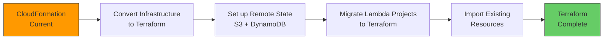

# AWS Analytics Implementation Roadmap

**Project:** CV AI Agent Analytics Layer  
**Start Date:** October 31, 2025  
**Estimated Duration:** 2-3 days (phased approach)

---

## Technologies Overview

### AWS Services

- **SQS (Simple Queue Service)** - Event buffering and async processing
- **Lambda** - Serverless event processing and report generation
- **DynamoDB** - Analytics data storage with TTL
- **EventBridge** - Scheduled weekly report triggers
- **SES (Simple Email Service)** - Email delivery for reports
- **IAM** - Security and access management
- **SDK v3** - JavaScript libraries for Cloudflare Workers integration

### Infrastructure as Code

- **Initial Implementation:** AWS CloudFormation (YAML)
- **Future Migration:** Terraform (HCL) - See Phase 5

### Expected Costs

- **Year 1:** £0 (AWS Free Tier covers estimated 10k queries/month)
- **Year 2+:** £3-5/month (~£43/year)

---

## Phase 1: Foundation (Day 1, ~4 hours)

### 1.1 AWS Account Setup

- [ ] Create AWS account (if needed)
- [ ] Set up billing alerts (£5/month threshold)
- [ ] Enable MFA on root account
- [ ] Create IAM user for development

### 1.2 SQS Queue Setup

- [ ] Create FIFO queue: `cv-analytics-events.fifo`
- [ ] Configure dead-letter queue: `cv-analytics-dlq.fifo`
- [ ] Set message retention: 4 days
- [ ] Enable content-based deduplication
- [ ] Note queue URL for Workers integration

### 1.3 DynamoDB Tables

- [ ] Create `CV-Analytics-QueryEvents` table
  - Partition key: `requestId` (String)
  - TTL attribute: `ttl` (Number)
  - Provisioned: On-demand
- [ ] Create `CV-Analytics` table
  - Partition key: `requestId` (String)
  - GSI: `week-index` (Partition: `week`, Sort: `timestamp`)
  - Provisioned: On-demand

### 1.4 IAM Roles & Policies

- [ ] Create Lambda execution role
- [ ] Attach SQS read permissions
- [ ] Attach DynamoDB read/write permissions
- [ ] Attach CloudWatch Logs permissions
- [ ] Create programmatic access user for Cloudflare Workers
- [ ] Generate access key + secret (store securely)

**Deliverables:**

- SQS queue URL
- DynamoDB table names
- IAM credentials for Workers
- Lambda execution role ARN

---

## Phase 2: Event Processing (Day 1-2, ~6 hours)

### 2.1 Lambda Function: Event Processor

- [ ] Create Node.js 20.x Lambda function: `cv-analytics-processor`
- [ ] Add SQS trigger
- [ ] Implement correlation logic (query + response events)
- [ ] Add error handling and logging
- [ ] Deploy and test with sample events

**Key Logic:**

```typescript
// Correlate query + response events
// Store complete analytics in DynamoDB
// Clean up interim records
// Handle orphaned events gracefully
```

### 2.2 Cloudflare Worker Integration

- [ ] Install AWS SDK v3 in cv-ai-agent project

  ```bash
  npm install @aws-sdk/client-sqs
  ```

- [ ] Add Wrangler secrets:

  ```bash
  wrangler secret put AWS_ACCESS_KEY_ID
  wrangler secret put AWS_SECRET_ACCESS_KEY
  wrangler secret put AWS_SQS_URL
  ```

- [ ] Implement SQS logger (`src/aws/sqs-logger.ts`)
- [ ] Update Worker with **fire-and-forget pattern** ⚠️ CRITICAL
  - Use `ctx.waitUntil()` - NO `await` in critical path
  - SQS logging happens AFTER returning response to user
  - See `FIRE_AND_FORGET_PATTERN.md` for implementation
- [ ] Implement Stage 1 logging (query event)
- [ ] Update LLM prompt for structured match quality
- [ ] Implement Stage 2 logging (response event)
- [ ] Add error handling (wrap in try-catch, don't block user responses)

**Performance Requirement:** ✅ Zero impact on chatbot response time (12ms unchanged)

**Key Implementation:**

```typescript
// ✅ CORRECT: Fire-and-forget pattern
ctx.waitUntil(
  logAnalyticsEvent(event, env).catch(err => {
    console.error('Analytics failed:', err);
    // Don't throw - never block user response
  })
);
```

**Reference:** See `FIRE_AND_FORGET_PATTERN.md` for complete implementation guide

### 2.3 Testing

- [ ] Test query logging to SQS
- [ ] Verify Lambda processes events
- [ ] Confirm correlation in DynamoDB
- [ ] Test error scenarios (orphaned events, retry logic)
- [ ] Monitor CloudWatch Logs

**Deliverables:**

- Lambda function processing events
- Workers sending analytics to SQS
- DynamoDB storing correlated analytics

---

## Phase 3: Reporting (Day 2-3, ~5 hours)

### 3.1 Lambda Function: Report Generator

- [ ] Create Lambda function: `cv-analytics-reporter`
- [ ] Query DynamoDB for weekly insights
- [ ] Generate insights:
  - Top queried skills
  - Match quality distribution
  - Trending topics (week-over-week)
  - Gap identification (queries with no match)
- [ ] Format HTML email template
- [ ] Send via SES

### 3.2 AWS SES Setup

- [ ] Verify sender email address
- [ ] Create HTML email template
- [ ] Test email delivery
- [ ] Move out of SES sandbox (if needed for production)

### 3.3 EventBridge Scheduling

- [ ] Create EventBridge rule
- [ ] Set cron schedule: `cron(0 9 ? * MON *)` (every Monday 9 AM UTC)
- [ ] Add Lambda reporter as target
- [ ] Test manual invocation

### 3.4 Email Template Design

```html
<!-- Weekly CV Analytics Report -->
<!-- Top Skills Queried -->
<!-- Match Quality Breakdown -->
<!-- Trending Skills -->
<!-- Action Items -->
```

**Deliverables:**

- Automated weekly email reports
- Professional HTML template
- Scheduled EventBridge rule

---

## Phase 4: Monitoring & Optimization (Day 3, ~2 hours)

### 4.1 CloudWatch Dashboards

- [ ] Create dashboard for key metrics
- [ ] Add widgets:
  - SQS message rate
  - Lambda invocation count
  - DynamoDB read/write units
  - Error rates
- [ ] Set up alarms for errors

### 4.2 Cost Monitoring

- [ ] Enable Cost Explorer
- [ ] Create budget: £5/month
- [ ] Set budget alerts
- [ ] Tag resources: `Project: CVAnalytics`

### 4.3 Testing & Validation

- [ ] Run end-to-end test (query → SQS → Lambda → DynamoDB → Email)
- [ ] Verify TTL cleanup works
- [ ] Test with high volume (simulate 100 queries)
- [ ] Validate weekly report accuracy

### 4.4 Documentation

- [ ] Document architecture diagram
- [ ] Create runbook for common operations
- [ ] Add troubleshooting guide
- [ ] Update project README

**Deliverables:**

- Monitoring dashboard
- Cost tracking
- Complete documentation

---

## Post-Implementation: Week 1-4

### Week 1: Baseline

- [ ] Monitor SQS/Lambda/DynamoDB metrics
- [ ] Review first weekly report
- [ ] Verify data accuracy
- [ ] Adjust email template if needed

### Week 2-4: Optimization

- [ ] Fine-tune LLM match quality prompts
- [ ] Optimize DynamoDB queries
- [ ] Add additional insights to reports
- [ ] Review AWS costs

### Month 2+: Iteration

- [ ] Analyze patterns in analytics
- [ ] Update CV based on insights
- [ ] Add new metrics (if valuable)
- [ ] Consider additional features

---

## Quick Start Commands

### Install Dependencies

```bash
cd d:\Code\MyCV\cv-ai-agent
npm install @aws-sdk/client-sqs @aws-sdk/client-dynamodb @aws-sdk/lib-dynamodb
```

### Set Wrangler Secrets

```bash
wrangler secret put AWS_ACCESS_KEY_ID
wrangler secret put AWS_SECRET_ACCESS_KEY  
wrangler secret put AWS_SQS_URL
wrangler secret put AWS_REGION  # eu-west-2 (London)
```

### Deploy Lambda Functions

```bash
cd lambda/event-processor
npm install
zip -r function.zip .
aws lambda create-function \
  --function-name cv-analytics-processor \
  --runtime nodejs20.x \
  --role arn:aws:iam::ACCOUNT_ID:role/lambda-execution-role \
  --handler index.handler \
  --zip-file fileb://function.zip
```

---

## Phase 5: Terraform Migration (Optional - Future)

**Duration:** 1-2 days  
**When:** After validating CloudFormation implementation (Month 2+)

### 5.1 Why Terraform?

**Benefits over CloudFormation:**

- ✅ Better for polyrepo architecture (remote state sharing)
- ✅ Multi-cloud support (not locked to AWS)
- ✅ More expressive language (HCL vs YAML)
- ✅ Better change preview (`terraform plan`)
- ✅ Industry standard (transferable skills)
- ✅ Stronger module ecosystem

### 5.2 Migration Strategy



### 5.3 Project Structure (After Migration)

```
cv-analytics-infrastructure/
├── terraform/
│   ├── main.tf              # Root module
│   ├── variables.tf         # Input variables
│   ├── outputs.tf           # Exported values
│   ├── backend.tf           # S3 remote state
│   ├── versions.tf          # Terraform version constraints
│   └── modules/
│       ├── sqs/
│       │   ├── main.tf
│       │   ├── variables.tf
│       │   └── outputs.tf
│       ├── dynamodb/
│       ├── iam/
│       └── eventbridge/
├── environments/
│   ├── dev.tfvars
│   └── prod.tfvars
└── scripts/
    ├── init.sh
    ├── plan.sh
    └── apply.sh
```

### 5.4 Lambda Projects Reference Infrastructure

```hcl
# cv-analytics-processor/terraform/main.tf
terraform {
  backend "s3" {
    bucket = "cv-analytics-terraform-state"
    key    = "processor/terraform.tfstate"
    region = "eu-west-2"
  }
}

# Import infrastructure outputs
data "terraform_remote_state" "infrastructure" {
  backend = "s3"
  config = {
    bucket = "cv-analytics-terraform-state"
    key    = "infrastructure/terraform.tfstate"
    region = "eu-west-2"
  }
}

# Use infrastructure outputs directly
resource "aws_lambda_function" "processor" {
  function_name = "cv-analytics-processor"
  role          = data.terraform_remote_state.infrastructure.outputs.processor_role_arn
  # No hardcoded ARNs!
}
```

### 5.5 Migration Steps

- [ ] Install Terraform CLI
- [ ] Set up S3 bucket for remote state
- [ ] Set up DynamoDB table for state locking
- [ ] Convert CloudFormation templates to Terraform HCL
- [ ] Import existing AWS resources to Terraform state
- [ ] Validate with `terraform plan` (should show no changes)
- [ ] Update Lambda project deployments to use Terraform
- [ ] Test full deployment cycle
- [ ] Archive CloudFormation templates

### 5.6 Example Terraform Module (SQS)

```hcl
# modules/sqs/main.tf
resource "aws_sqs_queue" "dlq" {
  name                      = "${var.environment}-cv-analytics-dlq.fifo"
  fifo_queue                = true
  content_based_deduplication = true
  message_retention_seconds = 1209600  # 14 days
  
  tags = {
    Project     = "cv-analytics"
    Environment = var.environment
    Purpose     = "dead-letter-queue"
  }
}

resource "aws_sqs_queue" "main" {
  name                      = "${var.environment}-cv-analytics-events.fifo"
  fifo_queue                = true
  content_based_deduplication = true
  message_retention_seconds = 345600  # 4 days
  visibility_timeout_seconds = 300
  receive_wait_time_seconds = 20
  
  redrive_policy = jsonencode({
    deadLetterTargetArn = aws_sqs_queue.dlq.arn
    maxReceiveCount     = 3
  })
  
  tags = {
    Project     = "cv-analytics"
    Environment = var.environment
    Purpose     = "analytics-events"
  }
}

# modules/sqs/outputs.tf
output "queue_url" {
  description = "URL of the SQS Queue"
  value       = aws_sqs_queue.main.url
}

output "queue_arn" {
  description = "ARN of the SQS Queue"
  value       = aws_sqs_queue.main.arn
}
```

### 5.7 Benefits for Polyrepo

| Feature | CloudFormation | Terraform |
|---------|---------------|-----------|
| **Cross-repo references** | Complex (Exports/Imports) | ✅ Simple (remote state) |
| **State per project** | Implicit | ✅ Explicit (S3 backend) |
| **Change preview** | Limited | ✅ Detailed `terraform plan` |
| **Module reuse** | Nested stacks | ✅ Public registry + custom |
| **Multi-cloud** | AWS only | ✅ AWS, Azure, GCP |
| **Dependency graph** | Hidden | ✅ `terraform graph` |

### 5.8 Deployment with Terraform

```powershell
# Infrastructure
cd cv-analytics-infrastructure/terraform
terraform init
terraform plan -var-file=../environments/prod.tfvars
terraform apply -var-file=../environments/prod.tfvars

# Processor (references infrastructure)
cd ../../cv-analytics-processor/terraform
terraform init
terraform plan
terraform apply

# Reporter (references infrastructure)
cd ../../cv-analytics-reporter/terraform
terraform init
terraform plan
terraform apply
```

### 5.9 Resources

- [Terraform AWS Provider](https://registry.terraform.io/providers/hashicorp/aws/latest/docs)
- [Terraform Remote State](https://developer.hashicorp.com/terraform/language/state/remote)
- [CloudFormation to Terraform Guide](https://developer.hashicorp.com/terraform/tutorials/aws/cloudformation-to-terraform)

### 5.10 Decision Point

**Migrate to Terraform if:**

- ✅ You plan to use other cloud providers (multi-cloud)
- ✅ You want better cross-project dependency management
- ✅ You prefer HCL over YAML
- ✅ You want industry-standard IaC skills
- ✅ CloudFormation feels limiting

**Stick with CloudFormation if:**

- ✅ Everything works well with CloudFormation
- ✅ AWS-only infrastructure (no multi-cloud plans)
- ✅ Team already knows CloudFormation
- ✅ Don't want to learn new tooling

**Recommendation:** Start with CloudFormation (already scaffolded), migrate to Terraform in Month 2-3 if needed.

---

## Success Criteria

### Technical

- ✅ Zero impact on chatbot response time (async logging)
- ✅ 99%+ event correlation rate (query + response matched)
- ✅ Weekly reports delivered reliably
- ✅ Costs stay within free tier for Year 1
- ✅ No data loss (SQS + DLQ handling)

### Business

- ✅ Actionable insights in weekly reports
- ✅ Identified at least 2-3 skills to add to CV
- ✅ Spotted market trends (e.g., Kubernetes demand)
- ✅ 5-10 minute report review time
- ✅ Manual CV updates based on data

---

## Rollback Plan

If analytics doesn't provide value:

1. **Stop new events:**
   - Remove SQS logging from Cloudflare Worker
   - Keep Lambda/DynamoDB running for existing data

2. **Archive data:**
   - Export DynamoDB analytics to S3
   - Delete DynamoDB tables

3. **Clean up resources:**
   - Delete SQS queues
   - Delete Lambda functions
   - Delete EventBridge rules
   - Remove IAM roles/policies

4. **Cost impact:** £0 (only pay for storage if archived)

---

## Risk Mitigation

### Risk: Analytics impacts chatbot performance

**Mitigation:** Async SQS logging, try-catch around analytics code, monitoring response times

### Risk: AWS costs exceed budget

**Mitigation:** Billing alerts, cost analysis, free tier tracking, budget caps

### Risk: Data correlation fails

**Mitigation:** DynamoDB TTL cleanup, dead-letter queue, CloudWatch alarms

### Risk: Email reports not valuable

**Mitigation:** Start with Option 1 (manual SQL) to validate before AWS investment

---

## Next Actions

**Ready to start? Here's your checklist:**

1. ✅ Read this roadmap
2. ⬜ Create/configure AWS account
3. ⬜ Review AWS Free Tier limits
4. ⬜ Set up billing alerts
5. ⬜ Begin Phase 1 (Foundation)

**Estimated total time:** 15-20 hours spread over 2-3 days

**Questions before starting?** Review the AWS_ANALYTICS_PROPOSAL.md for detailed architecture explanations.

---

## Resources

### AWS Documentation

- [SQS FIFO Queues](https://docs.aws.amazon.com/AWSSimpleQueueService/latest/SQSDeveloperGuide/FIFO-queues.html)
- [Lambda with SQS](https://docs.aws.amazon.com/lambda/latest/dg/with-sqs.html)
- [DynamoDB TTL](https://docs.aws.amazon.com/amazondynamodb/latest/developerguide/TTL.html)
- [EventBridge Schedules](https://docs.aws.amazon.com/eventbridge/latest/userguide/eb-create-rule-schedule.html)
- [SES Getting Started](https://docs.aws.amazon.com/ses/latest/dg/send-email.html)

### Cloudflare Integration

- [Workers with AWS SDK](https://developers.cloudflare.com/workers/tutorials/use-aws-sdk/)
- [Wrangler Secrets](https://developers.cloudflare.com/workers/wrangler/commands/#secret)

---

**Status:** Ready to implement  
**Next Step:** Create AWS account and begin Phase 1
