# AWS Analytics - Polyrepo Architecture

**Architecture Pattern:** Polyrepo (Separate Git Repositories)  
**Date:** October 31, 2025  
**Projects:** 4 independent repositories

---

## Project Overview

### Project 1: `cv-ai-agent` ✅ (Existing)

**Purpose:** Cloudflare Worker chatbot  
**Location:** `d:\Code\MyCV\cv-ai-agent`  
**Deployment:** Cloudflare Workers  
**Modifications:** Add SQS event logging

### Project 2: `cv-analytics-processor` 🆕 (New)

**Purpose:** Lambda function for event correlation  
**Location:** `d:\Code\MyCV\cv-analytics-processor`  
**Deployment:** AWS Lambda (eu-west-2)  
**Responsibilities:**

- Process SQS messages
- Correlate query + response events
- Store analytics in DynamoDB
- Handle orphaned events

### Project 3: `cv-analytics-reporter` 🆕 (New)

**Purpose:** Lambda function for weekly reports  
**Location:** `d:\Code\MyCV\cv-analytics-reporter`  
**Deployment:** AWS Lambda (eu-west-2)  
**Responsibilities:**

- Query DynamoDB for weekly insights
- Generate analytics reports
- Format HTML emails
- Send via AWS SES

### Project 4: `cv-analytics-infrastructure` 🆕 (New)

**Purpose:** Shared AWS infrastructure  
**Location:** `d:\Code\MyCV\cv-analytics-infrastructure`  
**Deployment:** AWS CloudFormation  
**Responsibilities:**

- SQS queue definitions
- DynamoDB table schemas
- IAM roles and policies
- EventBridge schedules

---

## Data Flow Architecture

```mermaid
graph TB
    subgraph "Critical Path: ZERO AWS Delay"
        User[Recruiter Query] --> Worker[Cloudflare Worker<br/>12ms response time]
        Worker --> D1[(D1 Database<br/>CV Data)]
        Worker --> AI[Workers AI<br/>LLM Response]
        AI --> Response[✅ Return Answer<br/>IMMEDIATELY]
    end
    
    subgraph "Background: Fire-and-Forget (Async)"
        SQSClient[AWS SQS Client<br/>Non-blocking]
        Worker -.->|Fire & Forget<br/>NO AWAIT| SQSClient
        SQSClient -.->|HTTP POST<br/>~50ms| SQS
    end
    
    subgraph "Project 4: cv-analytics-infrastructure (AWS)"
        SQS[SQS FIFO Queue<br/>Event Buffer]
        DynamoDB[(DynamoDB<br/>QueryEvents + Analytics)]
        EventBridge[EventBridge<br/>Weekly Schedule]
    end
    
    subgraph "Project 2: cv-analytics-processor (AWS Lambda)"
        Processor[Event Processor<br/>Lambda Function]
        Correlation[Correlate Query<br/>+ Response Events]
    end
    
    subgraph "Project 3: cv-analytics-reporter (AWS Lambda)"
        Reporter[Report Generator<br/>Lambda Function]
        EmailGen[Generate HTML<br/>Email Report]
        SES[AWS SES<br/>Email Delivery]
    end
    
    SQS -->|Trigger| Processor
    Processor --> Correlation
    Correlation -->|Store| DynamoDB
    EventBridge -->|Weekly Trigger| Reporter
    DynamoDB -->|Query Insights| Reporter
    Reporter --> EmailGen
    EmailGen --> SES
    SES -->|Weekly Report| Email[📧 Your Inbox]
    
    style Worker fill:#f96,stroke:#333,stroke-width:3px
    style Response fill:#6f6,stroke:#333,stroke-width:3px
    style SQSClient fill:#ff6,stroke:#333,stroke-width:2px
    style Processor fill:#f90,stroke:#333,stroke-width:2px
    style Reporter fill:#f90,stroke:#333,stroke-width:2px
    style SQS fill:#f4b,stroke:#333,stroke-width:2px
    style DynamoDB fill:#46b,stroke:#333,stroke-width:2px
    style EventBridge fill:#4b6,stroke:#333,stroke-width:2px
```



### ⚠️ Critical Performance Requirement

**ZERO impact on chatbot response time:**

- ✅ SQS logging happens **after** returning response to user
- ✅ Uses **fire-and-forget** pattern (no `await`)
- ✅ SQS client wrapped in `try-catch` (failures don't block response)
- ✅ Lambda cold starts (200-500ms) happen **outside** critical path
- ✅ Total analytics overhead: **<5ms** (SQS HTTP POST only)

---

## Benefits of Polyrepo Architecture

### ✅ Independent Deployment

- Deploy processor without touching reporter
- Update infrastructure without redeploying functions
- Cloudflare Worker deploys independently

### ✅ Clear Ownership

- Each repo has single responsibility
- Easier to understand and maintain
- Can assign different repos to different developers

### ✅ Independent Versioning

- Each function has own version lifecycle
- Can rollback one function without affecting others
- Tag releases independently

### ✅ Smaller Blast Radius

- Bug in processor doesn't affect reporter
- Infrastructure changes don't trigger function rebuilds
- Reduced deployment risk

### ✅ Flexible CI/CD

- Each repo has own pipeline
- Different test strategies per function
- Deploy at different cadences

---

## Project Dependencies

### Shared Resources (Managed by Project 4)


### Communication Pattern


**Key principle:** Projects communicate via AWS services, not direct code dependencies.

- **Processor** reads from SQS, writes to DynamoDB
- **Reporter** reads from DynamoDB, uses SES
- **Worker** writes to SQS

**No code sharing** - Each project is fully independent

---

## Deployment Order

### Initial Setup (One-time)


**Commands:**

```powershell
# 1. Deploy infrastructure first
cd d:\Code\MyCV\cv-analytics-infrastructure
.\scripts\deploy.ps1

# 2. Deploy processor function
cd d:\Code\MyCV\cv-analytics-processor
npm run deploy

# 3. Deploy reporter function
cd d:\Code\MyCV\cv-analytics-reporter
npm run deploy

# 4. Update Cloudflare Worker (add SQS logging)
cd d:\Code\MyCV\cv-ai-agent
wrangler deploy
```

### Regular Updates

Each project deploys independently:

```powershell
# Update only processor
cd d:\Code\MyCV\cv-analytics-processor
npm run deploy

# Update only reporter
cd d:\Code\MyCV\cv-analytics-reporter
npm run deploy

# Update only infrastructure
cd d:\Code\MyCV\cv-analytics-infrastructure
aws cloudformation deploy --template-file template.yaml
```

---

## Directory Structure

### Project 2: cv-analytics-processor/

```
cv-analytics-processor/
├── src/
│   ├── index.ts                    # Lambda handler
│   ├── correlation.ts              # Query + response correlation logic
│   ├── dynamodb.ts                 # DynamoDB operations
│   └── types.ts                    # TypeScript interfaces
├── tests/
│   ├── correlation.test.ts
│   └── integration.test.ts
├── infrastructure/
│   └── function.yaml               # Lambda-specific CloudFormation
├── package.json
├── tsconfig.json
├── .gitignore
├── README.md
└── deployment/
    └── deploy.sh                   # Deployment script
```

### Project 3: cv-analytics-reporter/

```
cv-analytics-reporter/
├── src/
│   ├── index.ts                    # Lambda handler
│   ├── analytics-query.ts          # DynamoDB query logic
│   ├── report-generator.ts         # Report formatting
│   ├── email-service.ts            # SES integration
│   └── types.ts                    # TypeScript interfaces
├── templates/
│   └── weekly-report.html          # Email template
├── tests/
│   ├── analytics.test.ts
│   └── email.test.ts
├── infrastructure/
│   └── function.yaml               # Lambda-specific CloudFormation
├── package.json
├── tsconfig.json
├── .gitignore
├── README.md
└── deployment/
    └── deploy.sh                   # Deployment script
```

### Project 4: cv-analytics-infrastructure/

```
cv-analytics-infrastructure/
├── templates/
│   ├── sqs.yaml                    # SQS queue + DLQ
│   ├── dynamodb.yaml               # Analytics tables
│   ├── iam.yaml                    # Roles and policies
│   ├── eventbridge.yaml            # Weekly schedule
│   └── master.yaml                 # Root template (imports all)
├── parameters/
│   ├── dev.json                    # Development parameters
│   └── prod.json                   # Production parameters
├── scripts/
│   ├── deploy.sh                   # Deployment script
│   ├── validate.sh                 # Template validation
│   └── teardown.sh                 # Clean up resources
├── README.md
└── .gitignore
```

---

## Code Sharing Strategy

Since polyrepo has no shared code, how do we handle common logic?

### Option A: Copy & Paste (Simple) ✅ Recommended


- Duplicate types.ts in each project
- Copy DynamoDB client code
- **Pros:** Simple, no dependencies
- **Cons:** Must sync changes manually

### Option B: NPM Package (Advanced)


Create a shared package:

```
cv-analytics-shared/
├── src/
│   ├── types.ts
│   └── dynamodb-client.ts
└── package.json
```

Publish to NPM (private or public):

```json
// processor package.json
{
  "dependencies": {
    "@josealvarez/cv-analytics-shared": "^1.0.0"
  }
}
```

**Pros:** DRY principle, single source of truth  
**Cons:** Extra complexity, versioning overhead

### Recommendation: Start with Option A

- Copy types.ts to each project
- Extract to shared package only if changes become frequent
- YAGNI (You Ain't Gonna Need It) principle

---

## Git Repository Setup

### Create Repositories on GitHub

```powershell
# Create repos via GitHub CLI
gh repo create josejalvarezm/cv-analytics-processor --private
gh repo create josejalvarezm/cv-analytics-reporter --private
gh repo create josejalvarezm/cv-analytics-infrastructure --private

# Or manually via GitHub web interface
```

### Initialize Local Repositories

```powershell
# Processor
cd d:\Code\MyCV\cv-analytics-processor
git init
git add .
git commit -m "Initial commit: Event processor Lambda"
git remote add origin https://github.com/josejalvarezm/cv-analytics-processor.git
git push -u origin main

# Reporter
cd d:\Code\MyCV\cv-analytics-reporter
git init
git add .
git commit -m "Initial commit: Report generator Lambda"
git remote add origin https://github.com/josejalvarezm/cv-analytics-reporter.git
git push -u origin main

# Infrastructure
cd d:\Code\MyCV\cv-analytics-infrastructure
git init
git add .
git commit -m "Initial commit: AWS infrastructure templates"
git remote add origin https://github.com/josejalvarezm/cv-analytics-infrastructure.git
git push -u origin main
```

---

## CI/CD Strategy (Future)

Each repository gets its own GitHub Actions workflow:

### Processor CI/CD

```yaml
# .github/workflows/deploy.yml
name: Deploy Processor
on:
  push:
    branches: [main]
jobs:
  deploy:
    runs-on: ubuntu-latest
    steps:
      - uses: actions/checkout@v3
      - run: npm install
      - run: npm test
      - run: npm run deploy
        env:
          AWS_ACCESS_KEY_ID: ${{ secrets.AWS_ACCESS_KEY_ID }}
```

### Reporter CI/CD

```yaml
# Same structure, different function
```

### Infrastructure CI/CD

```yaml
# CloudFormation validation + deployment
```

---

## Cost Allocation

With separate projects, you can tag AWS resources for cost tracking:

```yaml
# In each CloudFormation template
Tags:
  - Key: Project
    Value: cv-analytics-processor
  - Key: Owner
    Value: jose-alvarez
  - Key: Environment
    Value: production
```

AWS Cost Explorer can then show costs per project.

---

## Rollback Strategy

Independent rollbacks per project:

```mermaid
graph TB
    Issue[Issue Detected] --> Decision{Which Project?}
    
    Decision -->|Processor Bug| RP[Rollback Processor]
    Decision -->|Reporter Bug| RR[Rollback Reporter]
    Decision -->|Infrastructure Issue| RI[Rollback Infrastructure]
    
    RP --> RP1[git revert HEAD]
    RP1 --> RP2[npm run deploy]
    RP2 --> Fixed1[✅ Processor Fixed]
    
    RR --> RR1[git checkout v1.2.0]
    RR1 --> RR2[npm run deploy]
    RR2 --> Fixed2[✅ Reporter Fixed]
    
    RI --> RI1[CloudFormation Rollback]
    RI1 --> Fixed3[✅ Infrastructure Fixed]
    
    Fixed1 --> Monitor[Monitor System]
    Fixed2 --> Monitor
    Fixed3 --> Monitor
    
    style Issue fill:#f66,stroke:#333,stroke-width:2px
    style Fixed1 fill:#6c6,stroke:#333,stroke-width:2px
    style Fixed2 fill:#6c6,stroke:#333,stroke-width:2px
    style Fixed3 fill:#6c6,stroke:#333,stroke-width:2px
```



**Commands:**

```powershell
# Rollback processor only
cd cv-analytics-processor
git revert HEAD
npm run deploy

# Rollback reporter only
cd cv-analytics-reporter
git checkout v1.2.0  # Previous working version
npm run deploy

# Rollback infrastructure
cd cv-analytics-infrastructure
aws cloudformation deploy --template-file template.yaml \
  --parameter-overrides file://parameters/rollback.json
```

---

## Next Steps

1. ✅ Review this architecture
2. ⬜ Create 3 new Git repositories
3. ⬜ Scaffold project structures
4. ⬜ Implement infrastructure (Project 4)
5. ⬜ Implement processor (Project 2)
6. ⬜ Implement reporter (Project 3)
7. ⬜ Update cv-ai-agent (Project 1)
8. ⬜ Deploy and test

---

## Questions to Consider

1. **GitHub repos:** Private or public?
2. **NPM package:** Do you want shared types package?
3. **CI/CD:** Set up GitHub Actions now or manually deploy initially?
4. **Infrastructure as Code:** Start with CloudFormation, migrate to Terraform later? (See roadmap Phase 5)

### Terraform Migration (Future Enhancement)

**Why consider Terraform?**

- ✅ Better for polyrepo (remote state sharing between projects)
- ✅ Multi-cloud support (not AWS-locked)
- ✅ Better change preview (`terraform plan`)
- ✅ Industry standard (transferable skills)
- ✅ Stronger module ecosystem

**Current approach:** CloudFormation (already scaffolded)  
**Future option:** Migrate to Terraform after validating CloudFormation implementation

See `AWS_IMPLEMENTATION_ROADMAP.md` Phase 5 for detailed migration plan.

---

Let me know your preferences and I'll start scaffolding! 🚀
