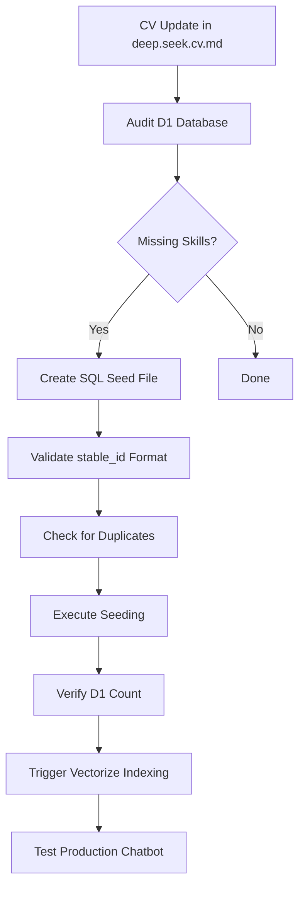
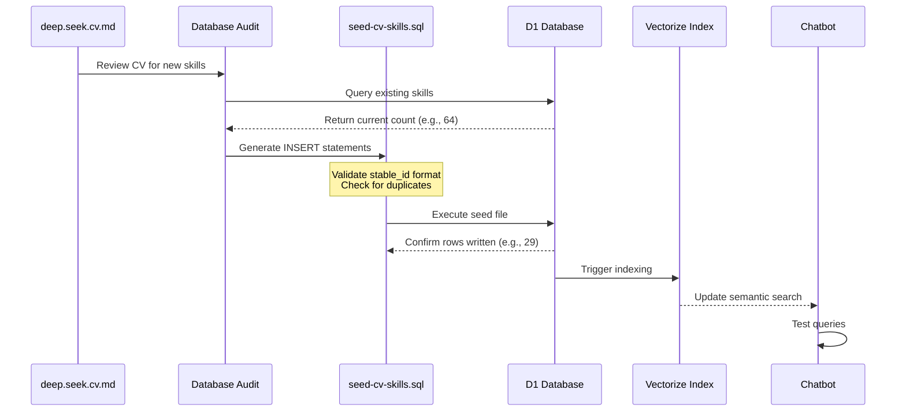
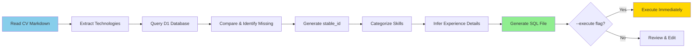
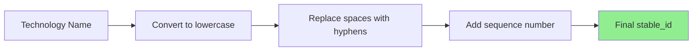
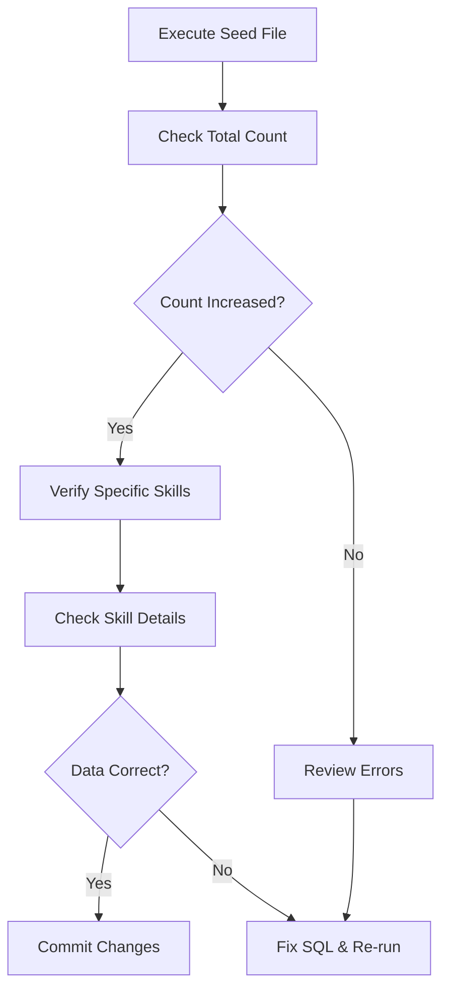
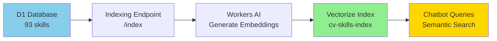
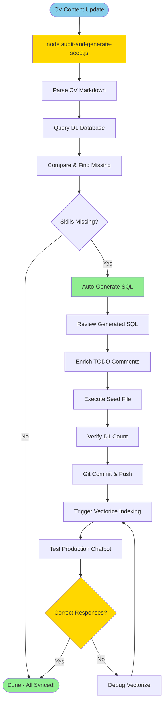
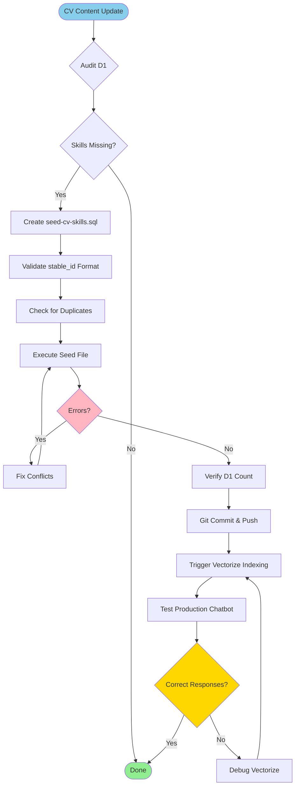

# D1 Database Update & Seeding Guide

Complete guide for updating the CV Assistant D1 database with new skills, managing the seeding process, and ensuring Vectorize indexing.

## Table of Contents

- [Overview](#overview)
- [Prerequisites](#prerequisites)
- [Update Workflow](#update-workflow)
- [Seeding Process](#seeding-process)
- [Verification](#verification)
- [Vectorize Indexing](#vectorize-indexing)
- [Troubleshooting](#troubleshooting)

---

## Overview

The CV Assistant chatbot relies on two data stores:
- **D1 Database** (`cv_assistant_db`): Structured skill data with detailed CV information
- **Vectorize Index** (`cv-skills-index`): Semantic embeddings for natural language queries

When CV content changes (new skills, updated experience), both stores must be synchronized.



---

## Prerequisites

### Required Tools

- **Wrangler CLI**: `npm install -g wrangler` (or use project's `npx wrangler`)
- **PowerShell**: Windows PowerShell 5.1+ or PowerShell Core 7+
- **Git**: For version control

### Environment Setup

```powershell
# Navigate to project directory
cd D:\Code\GCPDashboard\MyAIAgentPrivate

# Verify Wrangler authentication
npx wrangler whoami

# Test D1 connection
npx wrangler d1 execute cv_assistant_db --remote --yes --command "SELECT COUNT(*) FROM technology"
```

### Database Schema

**Table: `technology`**

| Column | Type | Constraints | Format |
|--------|------|-------------|--------|
| `id` | INTEGER | PRIMARY KEY AUTOINCREMENT | Auto-generated |
| `stable_id` | TEXT | NOT NULL, UNIQUE | `kebab-case-N` (e.g., `aws-lambda-1`) |
| `name` | TEXT | NOT NULL, UNIQUE | Display name (e.g., `AWS Lambda`) |
| `category` | TEXT | NOT NULL | `Cloud & DevOps`, `Languages & Frameworks`, etc. |
| `experience` | TEXT | NULL | Summary of experience with the technology |
| `experience_years` | INTEGER | NULL | Years of experience (integer) |
| `proficiency_percent` | INTEGER | NULL | Proficiency percentage (0-100) |
| `level` | TEXT | NULL | `Beginner`, `Intermediate`, `Advanced`, `Expert` |
| `action` | TEXT | NULL | CAR framework - Action taken |
| `effect` | TEXT | NULL | CAR framework - Effect achieved |
| `outcome` | TEXT | NULL | CAR framework - Outcome/impact |
| `employer` | TEXT | NULL | `Portfolio`, `Conservative Party`, `Independent Production`, etc. |
| `recency` | TEXT | NULL | `Current (2023-2025)`, `Recent (2020-2023)`, etc. |

---

## Update Workflow



### Step 1: Audit Current Database

```powershell
# Get current skill count
npx wrangler d1 execute cv_assistant_db --remote --yes --command "SELECT COUNT(*) as total FROM technology"

# List all existing skills (for duplicate checking)
npx wrangler d1 execute cv_assistant_db --remote --yes --command "SELECT id, stable_id, name FROM technology ORDER BY id"

# Check specific technology exists
npx wrangler d1 execute cv_assistant_db --remote --yes --command "SELECT * FROM technology WHERE name = 'AWS Lambda'"
```

### Step 2: Identify Missing Skills

Compare CV content (`deep.seek.cv.md`) with D1 database:

**Common Missing Categories:**
- Cloud services (AWS, GCP, Azure)
- Programming languages (Go, React, TypeScript)
- Infrastructure tools (Docker, Kubernetes, Terraform)
- Architecture patterns (Event-Driven, Serverless, Microservices)
- Frameworks (.NET Core, Entity Framework)

---

## Seeding Process

### Automated Audit & SQL Generation (Recommended)

**File:** `scripts/audit-and-generate-seed.js`

Automates the entire audit process: parses CV, queries D1, identifies missing skills, and generates SQL.

```powershell
# Navigate to project root
cd D:\Code\GCPDashboard\MyAIAgentPrivate

# Run audit and generate SQL
node scripts/audit-and-generate-seed.js

# Or execute immediately without review
node scripts/audit-and-generate-seed.js --execute

# Custom CV path
node scripts/audit-and-generate-seed.js --cv-path "D:\Path\To\cv.md"

# Custom output file
node scripts/audit-and-generate-seed.js --output "scripts/my-seed.sql"
```

**What it does:**



**Features:**
- ✅ Parses `deep.seek.cv.md` using regex patterns for all tech categories
- ✅ Queries D1 for existing skills with `wrangler d1 execute`
- ✅ Identifies missing technologies (exact and partial match detection)
- ✅ Auto-generates `stable_id` in correct `kebab-case-N` format
- ✅ Checks for duplicate `stable_id` conflicts
- ✅ Categorizes technologies automatically (Cloud, Languages, DevOps, etc.)
- ✅ Infers experience details from CV context (years, level, employer, recency)
- ✅ Generates SQL with TODO comments for manual enrichment
- ✅ Optional immediate execution with `--execute` flag

**Example Output:**

```
🚀 CV Skills Audit & SQL Generator
============================================================

📖 Reading CV file: D:\Code\GCPDashboard\deep.seek.cv.md
✅ Found 87 unique technologies in CV

🔍 Querying D1 database for existing skills...
✅ Found 93 existing skills in D1
✅ Found 93 existing stable_ids

🔄 Comparing CV with D1 database...

📊 Audit Results:
────────────────────────────────────────────────────────────
   Total technologies in CV: 87
   Already in D1: 85
   Missing from D1: 2

❌ Missing Technologies:
────────────────────────────────────────────────────────────
   1. API Gateway
   2. Cloud Run

📝 Generating SQL INSERT statements...

✅ SQL seed file generated: scripts/seed-missing-skills.sql
```

**Note:** Due to wrangler CLI output parsing limitations, the D1 query may report "0 existing skills". In this case, manually compare the generated SQL file with D1 using:

```powershell
npx wrangler d1 execute cv_assistant_db --remote --yes --command "SELECT name FROM technology ORDER BY name"
```

Then remove any duplicate entries from `seed-missing-skills.sql` before executing.

### Manual SQL Seed File Creation

**File:** `scripts/seed-cv-skills.sql`

```sql
-- Template for new skill
INSERT INTO technology (
    stable_id,
    name,
    category,
    experience,
    experience_years,
    proficiency_percent,
    level,
    action,
    effect,
    outcome,
    employer,
    recency
) VALUES (
    'aws-lambda-1',                                    -- MUST be lowercase-kebab-case-N
    'AWS Lambda',                                       -- Display name
    'Cloud & DevOps',                                   -- Category
    'Engineered event-driven Lambda functions...',      -- CV-accurate summary
    3,                                                  -- Years of experience
    15,                                                 -- Proficiency % (optional)
    'Advanced',                                         -- Skill level
    'Implemented Lambda batch processing...',           -- CAR - Action
    'Reduced invocations from 3,000 to 300/month',     -- CAR - Effect
    '90% cost reduction through batching',              -- CAR - Outcome
    'Portfolio',                                        -- Employer context
    'Current (2023-2025)'                              -- Recency
);
```

### stable_id Format Rules



**Examples:**

| Technology Name | stable_id |
|----------------|-----------|
| AWS Lambda | `aws-lambda-1` |
| SQL Server | `sql-server-1` |
| Entity Framework 4 | `entity-framework-4-1` |
| Serverless (Multi-Cloud) | `serverless-architecture-2` |
| .NET Core | `net-core-1` |

**Critical Rules:**
- ✅ All lowercase
- ✅ Spaces → hyphens (`-`)
- ✅ End with `-N` sequence number
- ✅ Must be unique (check existing `stable_id` values)
- ❌ No special characters except hyphens
- ❌ No duplicate `stable_id` values
- ❌ Cannot be NULL

### Checking for Duplicates

```powershell
# List all stable_id values to avoid conflicts
npx wrangler d1 execute cv_assistant_db --remote --yes --command "SELECT stable_id FROM technology ORDER BY stable_id"

# Check if specific stable_id exists
npx wrangler d1 execute cv_assistant_db --remote --yes --command "SELECT * FROM technology WHERE stable_id = 'aws-lambda-1'"
```

**Conflict Resolution:**

If `serverless-architecture-1` exists:
- ❌ Don't use: `serverless-architecture-1`
- ✅ Use: `serverless-architecture-2` with different name (e.g., "Serverless (Multi-Cloud)")

### Executing Seed File

```powershell
# Navigate to project root
cd D:\Code\GCPDashboard\MyAIAgentPrivate

# Execute SQL file against remote D1 database
npx wrangler d1 execute cv_assistant_db --remote --yes --file=./scripts/seed-cv-skills.sql
```

**Expected Output:**

```
🌀 Starting import...
🌀 Processed 29 queries.
🚣 Executed 29 queries in 0.00 seconds (87 rows read, 145 rows written)
Database size (MB): 0.11
Total queries executed: 29, Rows written: 145
```

**Common Errors:**

| Error | Cause | Solution |
|-------|-------|----------|
| `NOT NULL constraint failed: technology.stable_id` | Missing `stable_id` in INSERT | Add `stable_id` field to INSERT statement |
| `UNIQUE constraint failed: technology.stable_id` | Duplicate `stable_id` | Query existing values, use next sequence number |
| `UNIQUE constraint failed: technology.name` | Duplicate technology name | Verify technology doesn't already exist |
| `no such table: technology` | Wrong database or schema | Verify database name: `cv_assistant_db` |

---

## Verification

### Post-Seeding Checks



### Verification Commands

```powershell
# 1. Verify total count increased
npx wrangler d1 execute cv_assistant_db --remote --yes --command "SELECT COUNT(*) as total FROM technology"
# Expected: Previous count + number of new skills (e.g., 64 + 29 = 93)

# 2. Verify specific skill exists
npx wrangler d1 execute cv_assistant_db --remote --yes --command "SELECT id, name, experience_years, level FROM technology WHERE name = 'AWS Lambda'"

# 3. Check latest additions by ID
npx wrangler d1 execute cv_assistant_db --remote --yes --command "SELECT id, stable_id, name, category FROM technology ORDER BY id DESC LIMIT 10"

# 4. Verify stable_id uniqueness (should return 0)
npx wrangler d1 execute cv_assistant_db --remote --yes --command "SELECT stable_id, COUNT(*) as count FROM technology GROUP BY stable_id HAVING count > 1"
```

### Git Commit

```powershell
# Stage seed file
git add scripts/seed-cv-skills.sql

# Commit with descriptive message
git commit -m "feat: seed 29 missing CV skills into D1

Added missing technologies from deep.seek.cv.md:
- AWS services (6): Lambda, DynamoDB, SQS FIFO, EventBridge, SES, DynamoDB Streams
- GCP services (3): Cloud Functions, Firestore, Firebase Hosting
- Cloudflare (4): KV, D1, Vectorize, Workers AI
- Languages (5): Go, React, .NET Core, ASP.NET MVC, Entity Framework
- Infrastructure (4): Docker, Kubernetes, GitHub Actions, Semantic Versioning
- Architecture (7): Event-Driven, Serverless, HMAC Security, Real-Time, etc.

Database: 64 → 93 skills
All entries include stable_id in kebab-case-N format"

# Push to GitHub
git push origin main
```

---

## Vectorize Indexing

After D1 seeding, the Vectorize index must be updated for semantic search.



### Manual Indexing Trigger

```powershell
# Trigger indexing via API endpoint
Invoke-RestMethod -Uri "https://cv-assistant-worker-production.{YOUR_WORKERS_SUBDOMAIN}/index" -Method POST
```

### Automated Sync Script

**File:** `scripts/sync-skills.ps1`

```powershell
# Run synchronization (D1 → Vectorize)
cd D:\Code\GCPDashboard\MyAIAgentPrivate
.\scripts\sync-skills.ps1
```

**What it does:**
1. Queries D1 for current skill count
2. Queries Vectorize for indexed count
3. If mismatch, triggers `/index` endpoint
4. Verifies indexing completed

### Scheduled Sync (Optional)

**File:** `scripts/setup-scheduled-sync.ps1`

Sets up Windows Task Scheduler to run sync every 6 hours.

```powershell
# Setup scheduled task (run as Administrator)
.\scripts\setup-scheduled-sync.ps1
```

### Verify Vectorize Count

```powershell
# Check Vectorize index statistics
npx wrangler vectorize get-by-ids cv-skills-index --ids="technology-1" --return-metadata

# Expected: Should return embedding for technology ID 1
```

---

## Troubleshooting

### Issue 1: "NOT NULL constraint failed: technology.stable_id"

**Cause:** INSERT statement missing `stable_id` field

**Solution:**
```sql
-- ❌ Missing stable_id
INSERT INTO technology (name, category) VALUES ('AWS Lambda', 'Cloud & DevOps');

-- ✅ Include stable_id
INSERT INTO technology (stable_id, name, category) VALUES ('aws-lambda-1', 'AWS Lambda', 'Cloud & DevOps');
```

### Issue 2: "UNIQUE constraint failed: technology.stable_id"

**Cause:** Attempting to insert duplicate `stable_id`

**Solution:**
```powershell
# Query existing stable_ids
npx wrangler d1 execute cv_assistant_db --remote --yes --command "SELECT stable_id FROM technology WHERE stable_id LIKE 'aws-lambda%'"

# If aws-lambda-1 exists, use aws-lambda-2
```

### Issue 3: "no such table: skills"

**Cause:** Indexing code references wrong table name (should be `technology`)

**Solution:**
```typescript
// ❌ Wrong table name
const { results } = await env.DB.prepare('SELECT * FROM skills').all();

// ✅ Correct table name
const { results } = await env.DB.prepare('SELECT * FROM technology').all();
```

**Fix location:** Check `src/index.ts` or indexing endpoint handler.

### Issue 4: Chatbot Returns Incorrect Information

**Symptoms:**
- Query: "What AWS Lambda experience do you have?"
- Response: "I don't have direct experience with AWS Lambda..." (incorrect fallback)

**Diagnosis:**
```powershell
# 1. Verify skill exists in D1
npx wrangler d1 execute cv_assistant_db --remote --yes --command "SELECT * FROM technology WHERE name = 'AWS Lambda'"

# 2. Check if indexed in Vectorize (requires Worker endpoint or Wrangler command)
# Expected: Should return embedding vector for AWS Lambda

# 3. Test production chatbot
# Go to: https://cv-assistant-worker-production.{YOUR_WORKERS_SUBDOMAIN}
```

**Solution:**
1. If skill missing from D1: Follow seeding process above
2. If D1 has skill but Vectorize doesn't: Trigger indexing via `/index` endpoint
3. If both have skill: Check embedding generation logic in Worker

### Issue 5: PowerShell SQL Execution Fails

**Cause:** PowerShell has issues with multi-line SQL in command strings

**Solution:** Use `.sql` file instead of inline commands

```powershell
# ❌ Don't use inline SQL for large inserts
npx wrangler d1 execute cv_assistant_db --remote --yes --command "INSERT INTO technology..."

# ✅ Use file execution
npx wrangler d1 execute cv_assistant_db --remote --yes --file=./scripts/seed-cv-skills.sql
```

---

## Quick Reference

### Common Commands

```powershell
# Automated audit and SQL generation (RECOMMENDED)
node scripts/audit-and-generate-seed.js

# Execute generated SQL immediately
node scripts/audit-and-generate-seed.js --execute

# Count skills in D1
npx wrangler d1 execute cv_assistant_db --remote --yes --command "SELECT COUNT(*) FROM technology"

# List all skills
npx wrangler d1 execute cv_assistant_db --remote --yes --command "SELECT id, stable_id, name FROM technology ORDER BY name"

# Execute seed file
npx wrangler d1 execute cv_assistant_db --remote --yes --file=./scripts/seed-cv-skills.sql

# Trigger Vectorize indexing
Invoke-RestMethod -Uri "https://cv-assistant-worker-production.{YOUR_WORKERS_SUBDOMAIN}/index" -Method POST

# Deploy Worker after code changes
npm run build ; npx wrangler deploy --env production
```

### File Locations

| File | Purpose |
|------|---------|
| `scripts/audit-and-generate-seed.js` | **Automated audit and SQL generation** |
| `scripts/seed-cv-skills.sql` | SQL INSERT statements for new skills (manual) |
| `scripts/seed-missing-skills.sql` | Auto-generated SQL from audit script |
| `scripts/sync-skills.ps1` | PowerShell script to sync D1 → Vectorize |
| `scripts/setup-scheduled-sync.ps1` | Windows Task Scheduler setup |
| `d:\Code\GCPDashboard\deep.seek.cv.md` | Source of truth for CV content |
| `src/index.ts` | Worker entry point with indexing endpoint |

### Database Identifiers

- **D1 Database ID:** `{AI_AGENT_DATABASE_ID}`
- **Database Name:** `cv_assistant_db`
- **Table Name:** `technology`
- **Vectorize Index:** `cv-skills-index`
- **Production Worker:** `cv-assistant-worker-production.{YOUR_WORKERS_SUBDOMAIN}`

---

## Best Practices

1. **Use automation script first** (`audit-and-generate-seed.js`) to identify missing skills
2. **Review generated SQL** before executing (add CV-accurate details to TODO comments)
3. **Always verify duplicates** before inserting (automation handles this automatically)
4. **Use file execution** for bulk inserts (not inline commands)
5. **Follow stable_id format** strictly: `kebab-case-N` (automation ensures compliance)
6. **Include all CAR fields** (action, effect, outcome) for rich chatbot responses
7. **Test production chatbot** after seeding and indexing
8. **Commit seed files** to git for reproducibility
9. **Document changes** in commit messages with skill counts

---

## Workflow Diagram

### Automated Workflow (Recommended)



### Manual Workflow (Legacy)



---

## Related Documentation

- **CV Source:** `d:\Code\GCPDashboard\deep.seek.cv.md`
- **Architecture:** `ARCHITECTURE-COMPLETE.md`
- **Deployment:** `DEPLOYMENT-GUIDE.md`
- **Operations:** `OPERATIONS-GUIDE.md`

---

*Last Updated: November 24, 2025*
