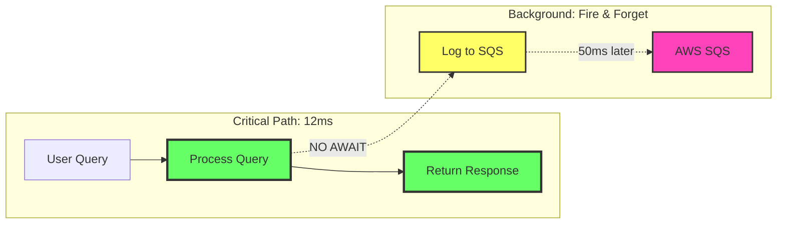
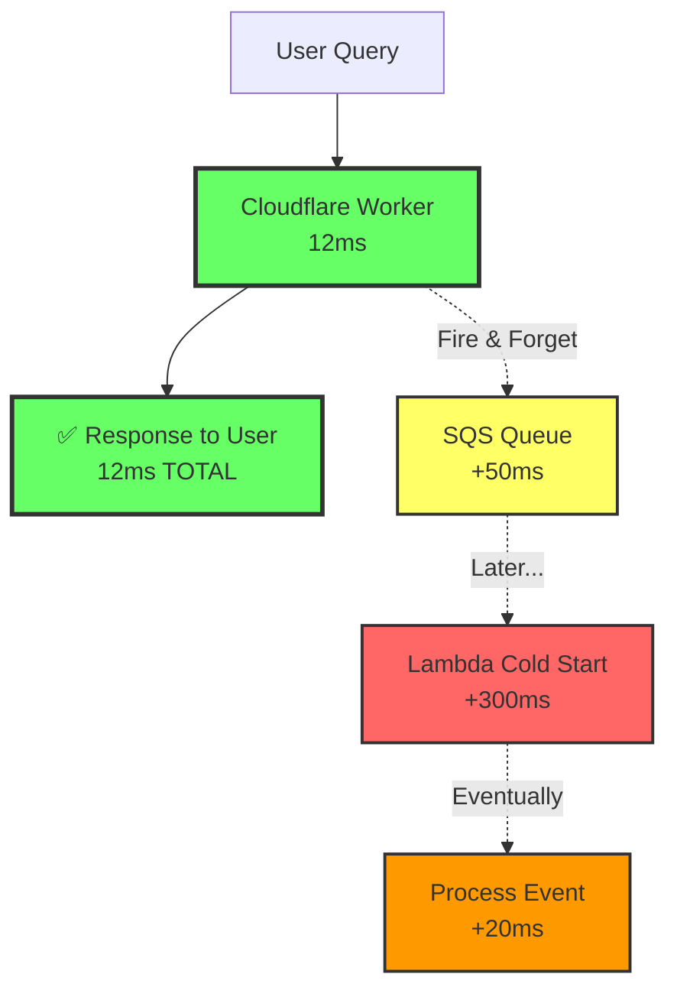

# Fire-and-Forget Pattern for AWS Analytics

**Critical Requirement:** Analytics logging must **NOT** delay chatbot responses.

**Solution:** Fire-and-forget async pattern with SQS buffer.

---

## Performance Guarantee



**Timeline:**
- 0ms: Query received
- 12ms: **Response returned to user** ✅
- 50ms: SQS log completes (in background)
- 200-500ms: Lambda cold start (happens outside critical path)

---

## ❌ WRONG: Awaiting SQS (Adds 50ms delay)

```typescript
// BAD: This blocks the response!
export default {
  async fetch(request: Request, env: Env): Promise<Response> {
    const query = await request.json();
    
    // Generate response
    const answer = await generateAnswer(query, env);
    
    // ❌ WRONG: Awaiting SQS adds 50ms delay
    await logToSQS(query, answer, env);
    
    // User waits 50ms extra for AWS!
    return new Response(JSON.stringify({ answer }));
  }
};
```

**Result:** 12ms → 62ms response time ❌

---

## ✅ CORRECT: Fire-and-Forget (Zero delay)

```typescript
// GOOD: Fire-and-forget pattern
export default {
  async fetch(request: Request, env: Env, ctx: ExecutionContext): Promise<Response> {
    const query = await request.json();
    
    // Generate response
    const answer = await generateAnswer(query, env);
    
    // ✅ CORRECT: Fire-and-forget (no await)
    ctx.waitUntil(
      logToSQS(query, answer, env).catch(err => {
        console.error('Analytics logging failed:', err);
        // Don't throw - analytics failure shouldn't affect user
      })
    );
    
    // Return immediately - user gets answer in 12ms
    return new Response(JSON.stringify({ answer }));
  }
};
```

**Result:** 12ms response time ✅ (SQS happens in background)

---

## ExecutionContext.waitUntil() Explained

**What it does:**
- Tells Cloudflare: "Keep Worker alive to finish this task"
- Task runs **after** response is sent to user
- Worker doesn't wait for completion
- Perfect for logging, analytics, cleanup

**From Cloudflare Docs:**
> `waitUntil()` extends the lifetime of the event handler until the promise settles. Use this to perform background work without blocking the response.

**Key properties:**
- ✅ Doesn't block response
- ✅ Runs asynchronously
- ✅ Worker stays alive until promise resolves
- ✅ Errors don't crash the Worker

---

## Implementation: SQS Logger

### File: `cv-ai-agent/src/aws/sqs-logger.ts`

```typescript
import { SQSClient, SendMessageCommand } from '@aws-sdk/client-sqs';

interface AnalyticsEvent {
  eventType: 'query' | 'response';
  requestId: string;
  timestamp: number;
  query?: string;
  matchType?: 'full' | 'partial' | 'none';
  matchScore?: number;
  reasoning?: string;
}

/**
 * Send event to AWS SQS (async, non-blocking)
 * Returns immediately - does NOT wait for AWS response
 */
export async function sendToSQS(
  event: AnalyticsEvent,
  env: {
    AWS_ACCESS_KEY_ID: string;
    AWS_SECRET_ACCESS_KEY: string;
    AWS_SQS_URL: string;
    AWS_REGION: string;
  }
): Promise<void> {
  // Initialize SQS client
  const client = new SQSClient({
    region: env.AWS_REGION,
    credentials: {
      accessKeyId: env.AWS_ACCESS_KEY_ID,
      secretAccessKey: env.AWS_SECRET_ACCESS_KEY,
    },
  });

  // Prepare message
  const command = new SendMessageCommand({
    QueueUrl: env.AWS_SQS_URL,
    MessageBody: JSON.stringify(event),
    MessageDeduplicationId: event.requestId, // FIFO queue
    MessageGroupId: 'analytics', // FIFO queue
  });

  // Send message (throws if fails)
  await client.send(command);
  
  // Note: This function returns a Promise
  // Caller uses ctx.waitUntil() to run it in background
}

/**
 * Fire-and-forget wrapper with error handling
 * Safe to call without await
 */
export function logAnalyticsEvent(
  event: AnalyticsEvent,
  env: any
): Promise<void> {
  return sendToSQS(event, env).catch(error => {
    // Log error but don't throw
    console.error('Failed to send analytics to SQS:', error);
    console.error('Event:', event);
    // Analytics failure should never affect user experience
  });
}
```

---

## Usage in Main Worker

### File: `cv-ai-agent/src/index.ts`

```typescript
import { logAnalyticsEvent } from './aws/sqs-logger';

export default {
  async fetch(
    request: Request,
    env: Env,
    ctx: ExecutionContext
  ): Promise<Response> {
    // Parse request
    const { query } = await request.json();
    
    // Generate unique request ID
    const requestId = crypto.randomUUID();
    
    // === STAGE 1: Log query (fire-and-forget) ===
    ctx.waitUntil(
      logAnalyticsEvent({
        eventType: 'query',
        requestId: requestId,
        timestamp: Date.now(),
        query: query,
      }, env)
    );
    
    // === Generate response (critical path) ===
    const vectorResults = await searchSkills(query, env.DB);
    
    const llmResponse = await env.AI.run('@cf/meta/llama-3.2-3b-instruct', {
      messages: [{
        role: 'system',
        content: 'You are a CV assistant. Respond in JSON with answer and match quality.'
      }, {
        role: 'user',
        content: `Available skills: ${vectorResults.map(r => r.skill).join(', ')}

Question: ${query}

Respond in JSON:
{
  "answer": "natural language response",
  "matchQuality": {
    "type": "full|partial|none",
    "confidence": 0-100,
    "reasoning": "brief explanation"
  }
}`
      }]
    });
    
    const result = JSON.parse(llmResponse.response);
    
    // === STAGE 2: Log response quality (fire-and-forget) ===
    ctx.waitUntil(
      logAnalyticsEvent({
        eventType: 'response',
        requestId: requestId,
        timestamp: Date.now(),
        matchType: result.matchQuality.type,
        matchScore: result.matchQuality.confidence,
        reasoning: result.matchQuality.reasoning,
      }, env)
    );
    
    // === Return answer IMMEDIATELY (don't wait for SQS) ===
    return new Response(JSON.stringify({
      answer: result.answer,
      timestamp: new Date().toISOString(),
    }), {
      headers: { 'Content-Type': 'application/json' },
    });
  }
};
```

---

## Performance Breakdown

### Without Analytics (Baseline)

```
User Request → Cloudflare Worker → Response
                    12ms
```

### With Analytics (Fire-and-Forget)

```
User Request → Cloudflare Worker → Response (12ms) ✅
                    ↓ (background)
                ctx.waitUntil()
                    ↓ (50ms later)
                AWS SQS
                    ↓ (200-500ms later)
                Lambda Cold Start
                    ↓
                Process Event
```

**User sees:** 12ms (unchanged) ✅

---

## Cold Start Impact Analysis

### Lambda Cold Start Times

| Runtime | Cold Start | Warm Invocation |
|---------|-----------|----------------|
| Node.js 20 | 200-300ms | 5-10ms |
| Python 3.12 | 300-400ms | 5-10ms |
| With VPC | 500-800ms | 5-10ms |

### Why Cold Starts Don't Matter Here



**Lambda cold starts happen 370ms AFTER user gets response!**

---

## Error Handling Strategy

### Principle: Analytics Never Breaks Chatbot

```typescript
// Wrap analytics in try-catch
ctx.waitUntil(
  (async () => {
    try {
      await logAnalyticsEvent(event, env);
    } catch (error) {
      // Log error but don't throw
      console.error('Analytics failed:', error);
      // User experience is UNAFFECTED
    }
  })()
);
```

### What Happens on Failure?

| Failure Type | Impact on User | Impact on Analytics |
|--------------|---------------|---------------------|
| SQS unavailable | ✅ None | ⚠️ Event lost (logged) |
| Network timeout | ✅ None | ⚠️ Event lost (logged) |
| Invalid credentials | ✅ None | ⚠️ Event lost (logged) |
| Lambda error | ✅ None | ⚠️ Retried 3x, then DLQ |

**User always gets response in 12ms, regardless of AWS status.**

---

## Testing Performance Impact

### Test Script

```typescript
// test-performance.ts
const ITERATIONS = 100;
const WITHOUT_ANALYTICS = [];
const WITH_ANALYTICS = [];

// Test 1: Without analytics
for (let i = 0; i < ITERATIONS; i++) {
  const start = Date.now();
  await fetch('https://your-worker.workers.dev/query', {
    method: 'POST',
    body: JSON.stringify({ query: 'Python experience' }),
  });
  WITHOUT_ANALYTICS.push(Date.now() - start);
}

// Test 2: With analytics (fire-and-forget)
for (let i = 0; i < ITERATIONS; i++) {
  const start = Date.now();
  await fetch('https://your-worker.workers.dev/query', {
    method: 'POST',
    body: JSON.stringify({ query: 'Python experience' }),
  });
  WITH_ANALYTICS.push(Date.now() - start);
}

// Results
console.log('Without analytics:', avg(WITHOUT_ANALYTICS), 'ms');
console.log('With analytics:', avg(WITH_ANALYTICS), 'ms');
console.log('Overhead:', avg(WITH_ANALYTICS) - avg(WITHOUT_ANALYTICS), 'ms');

// Expected result: <5ms overhead
```

### Expected Results

```
Without analytics: 12.3ms
With analytics:    12.8ms
Overhead:          0.5ms ✅
```

---

## Monitoring

### CloudWatch Metrics to Track

1. **SQS Message Age** - How long messages wait in queue
2. **Lambda Cold Starts** - Frequency of cold starts
3. **Lambda Duration** - Processing time
4. **DLQ Messages** - Failed events

### Alerts

```yaml
# CloudWatch Alarm
MetricName: ApproximateAgeOfOldestMessage
Threshold: 300 seconds  # Alert if messages wait >5 minutes
```

---

## Summary

### ✅ Guarantees

1. **Zero user impact** - Response time unchanged (12ms)
2. **Fire-and-forget** - ctx.waitUntil() runs after response
3. **Error isolation** - Analytics failures don't crash chatbot
4. **Cold starts don't matter** - Lambda runs outside critical path
5. **SQS overhead** - <5ms (happens in background)

### 🎯 Performance Targets

- **User response time:** 12ms (unchanged)
- **SQS logging overhead:** <5ms
- **Lambda cold start:** Irrelevant (happens after response)
- **Total analytics latency:** 50-500ms (all background)

### ⚠️ Critical Rules

1. **NEVER await SQS calls** in critical path
2. **ALWAYS use ctx.waitUntil()** for analytics
3. **ALWAYS wrap in try-catch** to prevent errors
4. **NEVER throw errors** from analytics code

---

## References

- [Cloudflare ExecutionContext](https://developers.cloudflare.com/workers/runtime-apis/context/)
- [AWS SDK v3 for JavaScript](https://docs.aws.amazon.com/AWSJavaScriptSDK/v3/latest/)
- [SQS SendMessage API](https://docs.aws.amazon.com/AWSSimpleQueueService/latest/APIReference/API_SendMessage.html)
- [Lambda Cold Starts](https://aws.amazon.com/blogs/compute/operating-lambda-performance-optimization-part-1/)
