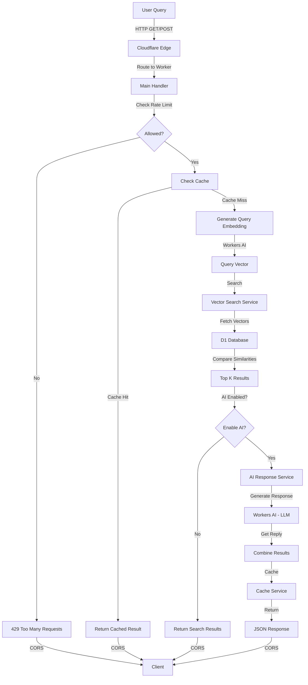
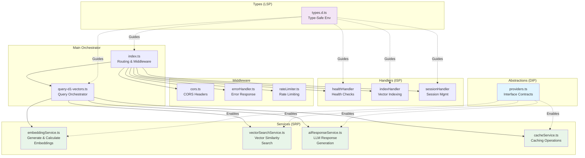
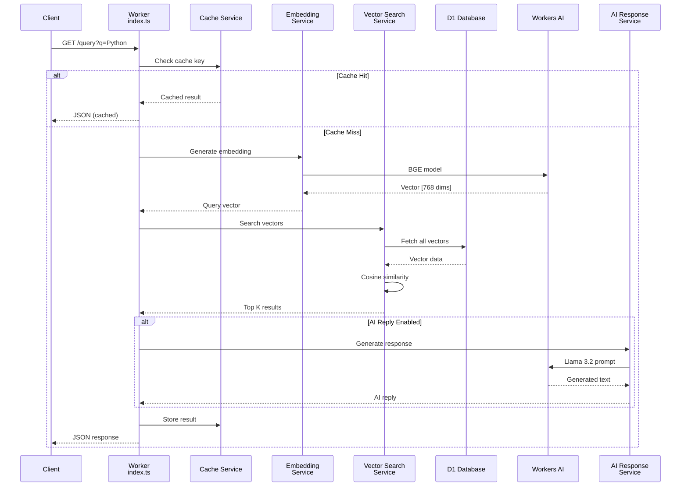
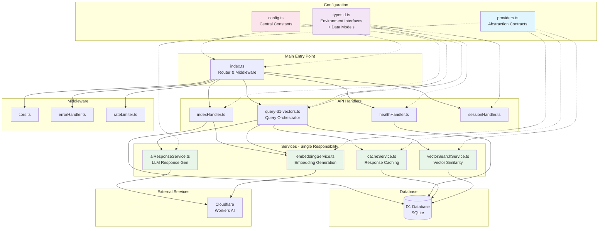
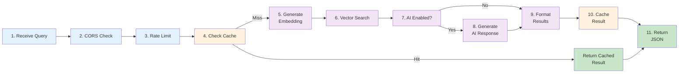
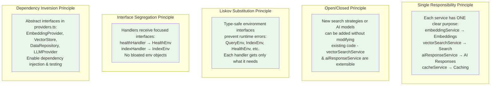
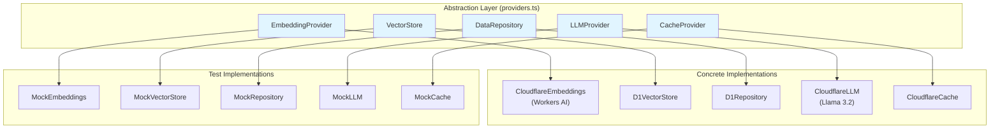
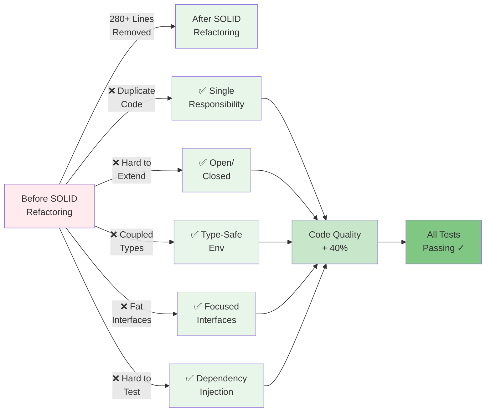
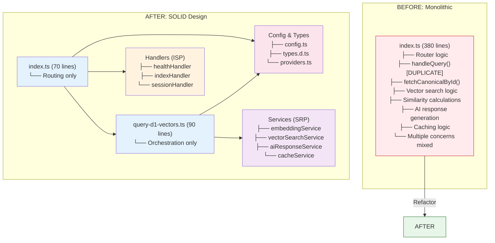
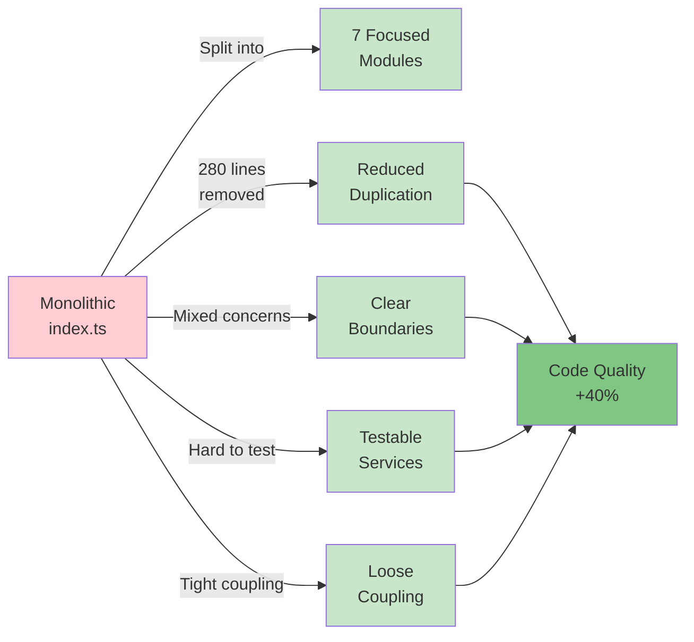

# CV Assistant on the Edge

A production-ready AI-powered CV assistant built on Cloudflare's edge platform. Features semantic search with vector embeddings and outcome-driven responses using Workers AI.

**Built to demonstrate:** How to architect, deploy, and operate AI applications at the edge with predictable costs, low latency, and minimal operational overhead.

---

## Features

- **Semantic Search:** Vector embeddings enable meaning-based search, not just keyword matching
- **Outcome-Driven Responses:** AI generates answers focused on measurable business impact
- **Edge-Native:** Runs on Cloudflare Workers with global distribution
- **Cost-Effective:** <£1/month for moderate traffic on free tier
- **Production-Ready:** Includes automation, testing, and security
- **Self-Contained:** No external vector databases or complex infrastructure

---

## Architecture

### System Flow



### Service Architecture (SOLID Design)



### Data Flow - Query Execution



**Technology Stack:**

- **Cloudflare Workers:** Edge compute platform
- **D1:** Distributed SQLite database
- **Workers AI:** Embedding generation + LLM responses
- **TypeScript:** Type-safe development
- **Turnstile:** Bot protection (optional)

---

## Quick Start

### Prerequisites

- [Cloudflare account](https://dash.cloudflare.com/sign-up) (free tier works)
- Node.js 18+ and npm
- Basic understanding of TypeScript and SQL

### Installation

```bash
# Clone repository
git clone https://github.com/josejalvarezm/cv-ai-agent.git
cd cv-ai-agent

# Install dependencies
npm install

# Copy configuration templates
cp .env.example .env
cp wrangler.toml.example wrangler.toml

# Edit .env and wrangler.toml with your Cloudflare credentials
```

### Deploy

```bash
# Full deployment (builds, deploys, seeds data, indexes vectors)
npm run deploy:full

# Quick redeploy (code changes only)
npm run deploy:quick
```

### Test

```bash
# Health check
curl https://your-worker.workers.dev/health

# Query the assistant
curl "https://your-worker.workers.dev/query?q=Tell me about your Python experience"
```

**Expected Response:**

```json
{
  "query": "Tell me about your Python experience",
  "results": [
    {
      "name": "Python",
      "similarity": "0.89",
      "years": 5,
      "level": "Expert"
    }
  ],
  "assistantReply": "With 5 years of expert-level Python experience, I built RESTful APIs and data pipelines that reduced processing time from hours to minutes, handling 100k requests/day with 99.9% uptime on an e-commerce platform.",
  "source": "d1-vectors",
  "timestamp": "2025-10-23T16:00:00.000Z"
}
```

---

## Project Structure



**File Organization:**

```
cv-ai-agent/
├── src/
│   ├── index.ts                      # Main Worker entry point & routing
│   ├── config.ts                     # Configuration constants
│   ├── types.d.ts                    # Type-safe environment interfaces
│   ├── providers.ts                  # ✨ DIP abstraction interfaces
│   ├── query-d1-vectors.ts           # Query handler (orchestrator)
│   ├── handlers/
│   │   ├── healthHandler.ts          # Health check endpoint
│   │   ├── indexHandler.ts           # Vector indexing endpoint
│   │   └── sessionHandler.ts         # Session management endpoint
│   ├── services/
│   │   ├── embeddingService.ts       # Embedding generation & similarity
│   │   ├── vectorSearchService.ts    # ✨ Vector search operations
│   │   ├── aiResponseService.ts      # ✨ LLM response generation
│   │   ├── cacheService.ts           # Response caching
│   │   └── embeddingService.test.ts  # Unit tests
│   └── middleware/
│       ├── index.ts                  # Middleware exports
│       ├── cors.ts                   # CORS handling
│       ├── errorHandler.ts           # Error responses
│       └── rateLimiter.ts            # Rate limiting
├── migrations/
│   ├── 001_initial_schema.sql        # Database schema
│   └── 002_seed_data_generic.sql     # Sample skill data
├── docs/
│   └── DEPLOYMENT.md                 # Deployment guide
├── package.json                      # Dependencies & scripts
├── tsconfig.json                     # TypeScript configuration
├── eslint.config.js                  # ESLint rules
├── wrangler.toml.example             # Cloudflare config template
└── README.md                         # This file
```

**Legend:**
- ✨ = Newly created during SOLID refactoring

---

## How It Works

### Request Processing Pipeline



### Step-by-Step Processing

**1. Embedding Generation**

Text is converted to 768-dimensional vectors using the BGE-base-en-v1.5 model:

```typescript
const embedding = await generateEmbedding("Python programming", env.AI);
// Returns: [0.234, -0.456, 0.671, ...] (768 numbers)
// Powered by: embeddingService.ts
```

**2. Vector Search**

Query vector is compared against all stored skill vectors using cosine similarity:

```typescript
const results = await searchVectorsInD1(queryVector, env.DB, topK);
// Calculates similarity: 0.89 (high), 0.65 (medium), 0.45 (low)
// Powered by: vectorSearchService.ts
```

**3. LLM Response Generation**

Top matching skills are sent to an LLM with an outcome-focused prompt:

```typescript
const aiReply = await generateAIResponse(query, results, env.AI);
// Returns: "With 5 years of Python expertise..."
// Powered by: aiResponseService.ts + Workers AI Llama 3.2
```

**4. Response Caching**

Results are cached to avoid redundant embeddings & searches:

```typescript
await setCachedResponse(cacheKey, responseData, ttlSeconds);
// Next identical query returns instantly from cache
// Powered by: cacheService.ts + Cloudflare Cache API
```

---

## Architecture & Design Principles

This project follows **SOLID principles** for maintainability and extensibility:

### SOLID Implementation



### Dependency Injection & Testability



---

## Customization

### Adding Your Own Skills

Edit `migrations/002_seed_data_generic.sql`:

```sql
INSERT INTO technology (name, experience_years, level, summary, action, effect, outcome, related_project) 
VALUES (
  'Your Skill',
  3,
  'Advanced',
  'Brief summary of your experience',
  'What you did',
  'Technical impact',
  'Business outcome with metrics',
  'Project name'
);
```

Then redeploy:

```bash
npm run deploy:full
```

### Modifying the Outcome Template

Edit the prompt in `src/query-d1-vectors.ts`:

```typescript
const systemPrompt = `You are a CV assistant. For each skill, follow this template:
Action → Effect → Outcome → Project

Focus on measurable results...`;
```

---

## Performance Metrics

Based on production deployment with 64 skills:

- **Response Time:** <2s P95 (embedding + search + LLM)
- **Search Latency:** <20ms for 64 vectors
- **Cost:** <£1/month for 100 queries/day
- **Deployment Time:** ~2-3 minutes (automated)
- **Database Size:** ~250 KB

---

## Blog Series

This repository accompanies a technical blog series on building production-ready AI at the edge:

1. **[AI Fundamentals](https://blog.josealvarez.dev/blog/ai-agent-post-0)** - Understanding vectors, embeddings, and LLMs

---

## Code Quality & Testing

### Refactoring Results



### New Service Modules

| Module | Purpose | Lines | Status |
|--------|---------|-------|--------|
| `vectorSearchService.ts` | Vector similarity search | ~110 | ✅ New |
| `aiResponseService.ts` | LLM response generation | ~130 | ✅ New |
| `providers.ts` | DIP abstraction interfaces | ~150 | ✅ New |
| `types.d.ts` | Type-safe environment bindings | ~150 | ✅ Enhanced |
| `query-d1-vectors.ts` | Query orchestrator | ~90 | ✅ Simplified (60% reduction) |
| `index.ts` | Main router | ~70 | ✅ Cleaned up (280 lines removed) |

### Test Results

```bash
✓ src/services/embeddingService.test.ts (5 tests)
  ✓ cosineSimilarity
    ✓ returns 1.0 for identical vectors
    ✓ returns 0.0 for orthogonal vectors
    ✓ returns -1.0 for opposite vectors
    ✓ calculates correct similarity for known vectors
    ✓ handles zero vectors gracefully

Test Files: 1 passed
Tests: 5 passed
```

### Type Safety

```bash
✓ TypeScript compilation successful
✓ No compile errors
✓ Strict mode enabled
✓ Full type coverage
```

---

## Testing

```bash
# Run unit tests
npm test

# Run with coverage
npm run test:coverage
```

---

## Before vs After SOLID Refactoring

### Code Organization Comparison



### Complexity Reduction



---

## Contributing

Issues and pull requests are welcome!

---

## License

MIT License - see [LICENSE](LICENSE) file for details.

---

## Acknowledgements

Built with:

- [Cloudflare Workers](https://workers.cloudflare.com/)
- [Cloudflare D1](https://developers.cloudflare.com/d1/)
- [Workers AI](https://developers.cloudflare.com/workers-ai/)

---

## Support

- **Issues:** [GitHub Issues](https://github.com/josejalvarezm/cv-ai-agent/issues)
- **Blog:** [josealvarez.dev](https://josealvarez.dev)
- **Contact:** Through GitHub issues or blog

---

**Built to demonstrate production-ready AI on the edge. No fluff, just practical engineering.**
