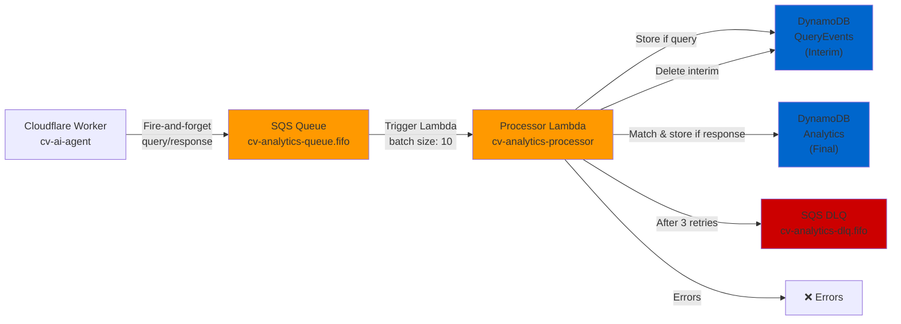

# Step D — Deploy cv-analytics-processor Lambda

This document guides deployment of the CV Analytics Processor Lambda function to AWS.

---

## Overview

**Processor Lambda** reads events from the SQS queue, correlates query + response events, and stores results in DynamoDB.

**Responsibilities:**
- ✅ Poll SQS FIFO queue for analytics events
- ✅ Correlate query + response using `requestId`
- ✅ Store complete analytics in DynamoDB Analytics table
- ✅ Handle orphaned events with 24-hour TTL
- ✅ Retry failed messages via DLQ after 3 attempts

---

## Architecture



---

## Prerequisites

Before deploying the Processor Lambda:

1. ✅ **Terraform infrastructure deployed** (Step B)
   - SQS queues created
   - DynamoDB tables created
   - IAM Lambda role created

2. ✅ **AWS CLI profile configured** (`cv-analytics`)
   - Profile: `cv-analytics`
   - Region: `us-east-1` (where infrastructure was deployed in Step B)

3. ✅ **Node.js 20+ installed**
   ```powershell
   node --version  # Should be v20.0.0+
   ```

---

## Step D.1 — Build the Processor Lambda

Navigate to the processor directory and build the TypeScript code:

```powershell
cd d:\Code\MyCV\cv-analytics-processor

# Install dependencies
npm install

# Build TypeScript to JavaScript
npm run build

# Verify dist/ folder was created
ls dist/
```

**Expected Output:**
```
dist/
├── index.js
├── correlation.ts
├── dynamodb.ts
├── types.ts
├── repositories/
├── services/
└── utils/
```

---

## Step D.2 — Prepare Environment Variables

The Processor Lambda requires environment variables that point to the Terraform-created resources:

**Option A: Get values from Terraform outputs (RECOMMENDED)**

```powershell
# Navigate to Terraform directory
cd d:\Code\MyCV\cv-analytics-infrastructure\terraform

# Set AWS profile
$env:AWS_PROFILE = 'cv-analytics'

# Display Terraform outputs
terraform output -json | ConvertFrom-Json | Format-Table

# Save these values:
$QUERY_EVENTS_TABLE = "cv-analytics-query-events"
$ANALYTICS_TABLE = "cv-analytics-analytics"
$LAMBDA_ROLE_ARN = "arn:aws:iam::{AWS_ACCOUNT_ID}:role/cv-analytics-lambda-role"
```

**Option B: Query AWS directly**

```powershell
# Get table names from DynamoDB
aws dynamodb list-tables --profile cv-analytics --region us-east-1

# Get role ARN from IAM
aws iam get-role --role-name cv-analytics-lambda-role --profile cv-analytics --query 'Role.Arn'
```

---

## Step D.3 — Update CloudFormation Template

The CloudFormation template needs to be updated to reference the correct infrastructure stack and region:

**File:** `d:\Code\MyCV\cv-analytics-processor\infrastructure\lambda.yaml`

**Update the following:**

```yaml
# Change eu-west-2 references to us-east-1
Runtime: nodejs20.x
# Update infrastructure stack name reference
InfrastructureStackName: cv-analytics-infrastructure  # Must match Terraform stack
```

---

## Step D.4 — Deploy via CloudFormation

Use the PowerShell deployment script to deploy the Lambda:

```powershell
cd d:\Code\MyCV\cv-analytics-processor

# Set AWS profile
$env:AWS_PROFILE = 'cv-analytics'

# Deploy to production in us-east-1
.\scripts\deploy.ps1 -Environment production -Region us-east-1
```

**What happens:**
1. ✅ Installs npm dependencies
2. ✅ Compiles TypeScript to JavaScript
3. ✅ Creates `function.zip` with compiled code
4. ✅ Deploys CloudFormation stack (creates Lambda function)
5. ✅ Updates Lambda code with compiled package
6. ✅ Creates SQS event source mapping (triggers Lambda)
7. ✅ Creates CloudWatch log group and alarms

**Expected Output:**
```
🚀 Deploying CV Analytics Processor Lambda
Environment: production
Region: us-east-1

📦 Installing dependencies...
[npm install output]

🔨 Building TypeScript...
[tsc output]

📦 Creating deployment package...
[zip output]

☁️  Deploying CloudFormation stack...
[CloudFormation output]

✅ Verifying deployment...

Function Details:
  Name: cv-analytics-processor-production
  Runtime: nodejs20.x
  Last Modified: 2025-11-03T...
  State: Active

✨ Deployment complete!
Function: cv-analytics-processor-production
Stack: cv-analytics-processor
Region: us-east-1
```

---

## Step D.5 — Verify Deployment

### Check Lambda Function

```powershell
# Set profile
$env:AWS_PROFILE = 'cv-analytics'

# Get function configuration
aws lambda get-function `
  --function-name cv-analytics-processor-production `
  --region us-east-1 `
  --query 'Configuration.[FunctionName,Runtime,MemorySize,Timeout,State]'

# Expected output:
# [
#   "cv-analytics-processor-production",
#   "nodejs20.x",
#   512,
#   30,
#   "Active"
# ]
```

### Check Environment Variables

```powershell
# Get environment variables
aws lambda get-function-configuration `
  --function-name cv-analytics-processor-production `
  --region us-east-1 `
  --query 'Environment.Variables'

# Expected output:
# {
#   "QUERY_EVENTS_TABLE": "cv-analytics-query-events",
#   "ANALYTICS_TABLE": "cv-analytics-analytics",
#   "ENVIRONMENT": "production"
# }
```

### Check SQS Trigger

```powershell
# List event source mappings
aws lambda list-event-source-mappings `
  --function-name cv-analytics-processor-production `
  --region us-east-1 `
  --query 'EventSourceMappings[0].[EventSourceArn,State,BatchSize]'

# Expected output:
# [
#   "arn:aws:sqs:us-east-1:{AWS_ACCOUNT_ID}:cv-analytics-queue.fifo",
#   "Enabled",
#   10
# ]
```

### Check CloudWatch Logs

```powershell
# View recent logs
aws logs tail /aws/lambda/cv-analytics-processor-production `
  --follow `
  --region us-east-1

# Filter for errors
aws logs filter-log-events `
  --log-group-name /aws/lambda/cv-analytics-processor-production `
  --filter-pattern "ERROR" `
  --region us-east-1
```

---

## Step D.6 — Test with Sample Event

Send a test query event to the SQS queue and verify the Lambda processes it:

### Send Test Query Event

```powershell
# Set profile
$env:AWS_PROFILE = 'cv-analytics'

# Get queue URL from Terraform
$QUEUE_URL = "https://sqs.us-east-1.amazonaws.com/{AWS_ACCOUNT_ID}/cv-analytics-queue.fifo"

# Send test query event
aws sqs send-message `
  --queue-url $QUEUE_URL `
  --message-body '{
    "eventType": "query",
    "requestId": "test-query-001",
    "timestamp": 1698765432000,
    "query": "Do you have Python experience?"
  }' `
  --message-group-id analytics `
  --message-deduplication-id test-query-001 `
  --region us-east-1

Write-Host "✅ Test query event sent"
```

### Monitor Lambda Execution

```powershell
# Wait 2 seconds for Lambda to execute
Start-Sleep -Seconds 2

# View logs
aws logs tail /aws/lambda/cv-analytics-processor-production `
  --since 1m `
  --region us-east-1

# Check if QueryEvents table has the record
aws dynamodb get-item `
  --table-name cv-analytics-query-events `
  --key '{
    "requestId": {"S": "test-query-001"}
  }' `
  --region us-east-1 `
  --profile cv-analytics
```

### Send Matching Response Event

```powershell
# Send response event with same requestId
aws sqs send-message `
  --queue-url $QUEUE_URL `
  --message-body '{
    "eventType": "response",
    "requestId": "test-query-001",
    "timestamp": 1698765432100,
    "matchType": "full",
    "matchScore": 95,
    "reasoning": "Direct Python experience matches query"
  }' `
  --message-group-id analytics `
  --message-deduplication-id test-query-001-response `
  --region us-east-1

Write-Host "✅ Test response event sent"

# Wait for processing
Start-Sleep -Seconds 2

# Check Analytics table for correlated record
aws dynamodb get-item `
  --table-name cv-analytics-analytics `
  --key '{
    "requestId": {"S": "test-query-001"}
  }' `
  --region us-east-1 `
  --profile cv-analytics

# QueryEvents record should be deleted
aws dynamodb get-item `
  --table-name cv-analytics-query-events `
  --key '{
    "requestId": {"S": "test-query-001"}
  }' `
  --region us-east-1 `
  --profile cv-analytics
  # Expected: empty (no record found)
```

---

## Troubleshooting

### Lambda Not Triggering

**Symptom:** Events sent to SQS but Lambda not executing

**Solution:**
1. Check event source mapping is enabled:
   ```powershell
   aws lambda list-event-source-mappings `
     --function-name cv-analytics-processor-production `
     --region us-east-1 `
     --query 'EventSourceMappings[0].State'
   ```
   Should return: `Enabled`

2. Check IAM role has SQS permissions:
   ```powershell
   aws iam get-role-policy `
     --role-name cv-analytics-lambda-role `
     --policy-name lambda-policy `
     --profile cv-analytics
   ```

3. Check Lambda has execute permissions:
   ```powershell
   aws lambda get-policy `
     --function-name cv-analytics-processor-production `
     --region us-east-1
   ```

### Events Not Correlating

**Symptom:** Query events not matching response events

**Solution:**
1. Verify `requestId` matches between query and response (case-sensitive)
2. Check QueryEvents table for orphaned records:
   ```powershell
   aws dynamodb scan `
     --table-name cv-analytics-query-events `
     --region us-east-1 `
     --profile cv-analytics
   ```
3. Review Lambda logs for correlation errors:
   ```powershell
   aws logs filter-log-events `
     --log-group-name /aws/lambda/cv-analytics-processor-production `
     --filter-pattern "ERROR\|correlation\|Failed" `
     --region us-east-1
   ```

### High Lambda Duration

**Symptom:** Lambda taking >1 second per message

**Solution:**
1. Check DynamoDB metrics:
   ```powershell
   aws cloudwatch get-metric-statistics `
     --namespace AWS/DynamoDB `
     --metric-name ConsumedWriteCapacityUnits `
     --dimensions Name=TableName,Value=cv-analytics-query-events `
     --start-time 2025-11-03T00:00:00Z `
     --end-time 2025-11-03T23:59:59Z `
     --period 300 `
     --statistics Sum `
     --region us-east-1
   ```

2. Consider increasing reserved concurrency (currently 10)
3. Enable Lambda provisioned concurrency for consistent performance

---

## Next Steps

Once **Step D.4 verification passes**, you're ready for:

1. **Step E — Deploy Reporter Lambda** (email digest on weekly schedule)
2. **Step F — Configure Cloudflare Worker** (connect cv-ai-agent to SQS)
3. **Step G — Integration Testing** (end-to-end flow)

---

## Cleanup (if needed)

To remove the Processor Lambda:

```powershell
# Delete CloudFormation stack
aws cloudformation delete-stack `
  --stack-name cv-analytics-processor `
  --region us-east-1 `
  --profile cv-analytics

# Wait for deletion
aws cloudformation wait stack-delete-complete `
  --stack-name cv-analytics-processor `
  --region us-east-1 `
  --profile cv-analytics

Write-Host "✅ Processor Lambda deleted"
```

---

## Status

**Step D.1:** Build TypeScript
- ✓ Dependencies installed
- ✓ Code compiled to JavaScript
- [ ] Awaiting your confirmation

**Step D.2:** Prepare Environment Variables
- [ ] Retrieve values from Terraform

**Step D.3:** Update CloudFormation Template
- [ ] Update region/stack references

**Step D.4:** Deploy via CloudFormation
- [ ] Execute deploy script

**Step D.5:** Verify Deployment
- [ ] Check Lambda configuration
- [ ] Check environment variables
- [ ] Check SQS trigger
- [ ] Review CloudWatch logs

**Step D.6:** Test with Sample Events
- [ ] Send test query
- [ ] Send test response
- [ ] Verify DynamoDB records

---

## Quick Reference

| Resource | Name | Region |
|----------|------|--------|
| SQS Queue | cv-analytics-queue.fifo | us-east-1 |
| SQS DLQ | cv-analytics-dlq.fifo | us-east-1 |
| DynamoDB (Query Events) | cv-analytics-query-events | us-east-1 |
| DynamoDB (Analytics) | cv-analytics-analytics | us-east-1 |
| Lambda Role | cv-analytics-lambda-role | us-east-1 |
| Lambda Function | cv-analytics-processor-production | us-east-1 |
| CloudFormation Stack | cv-analytics-processor | us-east-1 |

---

## Support

For issues:
1. Check CloudWatch Logs
2. Verify environment variables match resource names
3. Confirm IAM role has correct permissions
4. Review Lambda error metrics in CloudWatch
