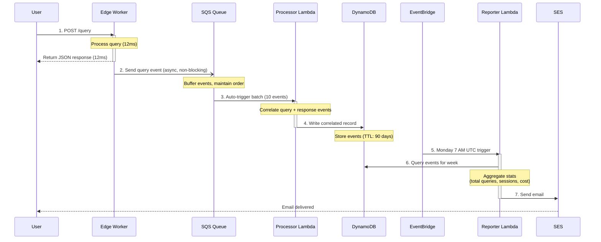
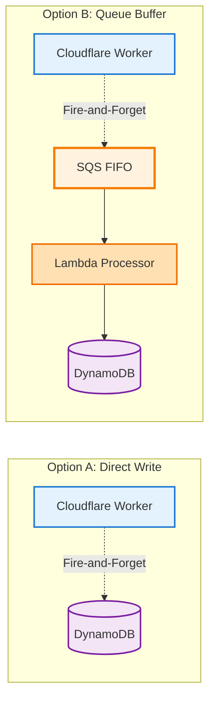
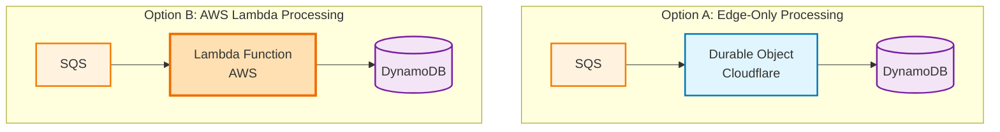
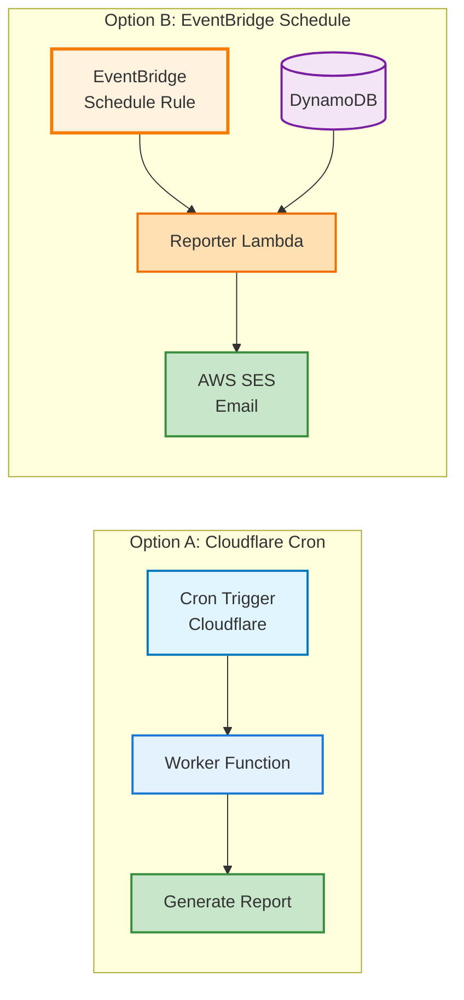
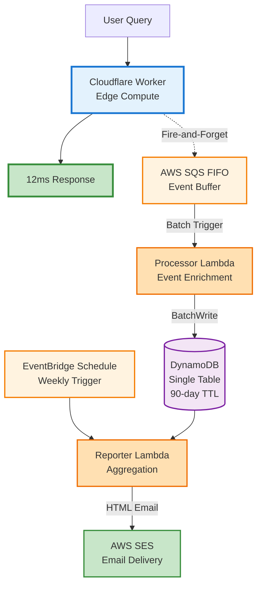

# AWS Analytics Series, Part 3: Architecture Under Constraint

> Constraint in Action: Each service had to earn its place under £0/month — queue, compute, storage, schedule, email.

> Where It Breaks: Real-time dashboards and complex ad-hoc queries push you beyond the free tier into warehousing.

## Quick Summary

Architecture decisions for edge-native analytics: how to build a processing pipeline that fits within AWS free tier limits whilst maintaining reliability.

- **Core challenge:** Process analytics events without adding infrastructure overhead
- **Solution:** SQS FIFO → Lambda → DynamoDB → EventBridge → SES
- **Cost target:** ~£0.05/month for 10,000 queries
- **Key trade-off:** Async processing complexity vs direct writes simplicity
- **Prerequisites:** Understanding of event-driven architectures and AWS services

---

## The Constraint

You're running an AI chatbot at the edge. It answers questions about your CV with 12ms response times. You want to know which questions people ask, when they ask them, and what answers they receive. But you have a constraint: this is a portfolio project, not a commercial product. You need production-quality analytics on a personal budget.

The AWS free tier offers:

- **Lambda:** 1 million requests/month, 400,000 GB-seconds compute
- **SQS:** 1 million requests/month
- **DynamoDB:** 25 GB storage, 25 write capacity units, 25 read capacity units
- **SES:** 62,000 emails/month (from EC2/Lambda)
- **EventBridge:** 1 million events/month

Can you build analytics infrastructure that fits entirely within these limits? Yes, with careful architecture decisions.

---

## The Baseline: What We're Measuring

The chatbot serves approximately 10,000 queries per month across portfolio site visits. Each query generates:

1. **Query event:** User question, session context, timestamp, metadata
2. **Response event:** Generated answer, processing time, LLM tokens used

Both events need to be:

- Collected without blocking the user response (fire-and-forget pattern)
- Stored for analysis and reporting
- Aggregated into weekly email summaries
- Retained for 90 days minimum

Expected volume:

- 20,000 analytics events/month (2 events per query)
- 20 KB average event size
- 400 MB total monthly data
- Weekly reports aggregating 7 days of data

---

## The Microservices Architecture

Before diving into individual decisions, here's the complete system overview. The architecture separates concerns across three independent microservices, each with a single responsibility:

### System Overview

```mermaid
graph LR
    subgraph "Edge (Cloudflare)"
        User["👤 User Query"]
        Worker["Cloudflare Worker<br/>(12ms response)"]
        User -->|POST /query| Worker
        Worker -->|JSON Response| User
        Worker -.Fire-and-Forget.-> SQS
    end
    
    subgraph "AWS Event Processing"
        SQS["SQS FIFO Queue<br/>(Buffer & Order)"]
        Processor["Lambda Processor<br/>(Correlate Events)"]
        SQS -->|Auto-trigger<br/>Batch 10 events| Processor
    end
    
    subgraph "AWS Storage & Reporting"
        DDB["DynamoDB<br/>(Analytics Store)"]
        Processor -->|Write Correlated<br/>Events| DDB
        
        Schedule["EventBridge<br/>(Weekly Schedule)"]
        Reporter["Lambda Reporter<br/>(Aggregate & Email)"]
        Schedule -->|Monday 7 AM UTC| Reporter
        Reporter -->|Query Week's Data| DDB
        
        SES["AWS SES<br/>(Email Delivery)"]
        Reporter -->|Send Report| SES
    end
    
    style Worker fill:#e3f2fd,stroke:#1976d2,stroke-width:3px
    style User fill:#c8e6c9,stroke:#388e3c,stroke-width:2px
    style SQS fill:#fff3e0,stroke:#f57c00,stroke-width:3px
    style Processor fill:#ffe0b2,stroke:#ef6c00,stroke-width:2px
    style DDB fill:#f3e5f5,stroke:#7b1fa2,stroke-width:2px
    style Schedule fill:#f3e5f5,stroke:#7b1fa2,stroke-width:2px
    style Reporter fill:#ffe0b2,stroke:#ef6c00,stroke-width:2px
    style SES fill:#fff3e0,stroke:#f57c00,stroke-width:2px
```



### Three Independent Microservices

| Service | Responsibility | Deployment | Trigger | Scaling |
|---------|---------------|------------|---------|---------|
| **Edge Worker** | Collect events, respond to user in <12ms | Cloudflare Workers | HTTP requests | Instant (edge) |
| **Processor Lambda** | Correlate query+response, store to DB | AWS Lambda (Node.js 20) | SQS FIFO messages | Per event (batched) |
| **Reporter Lambda** | Weekly aggregation, send email report | AWS Lambda (Node.js 20) | EventBridge schedule | Once per week |

### Why Three Services? (Not One Monolith)

**❌ Single Service Approach:**
```
Cloudflare Worker → SQS → Lambda → DynamoDB → EventBridge → Lambda (same Lambda)
```
Problems with combining:
- Worker needs fast response (12ms budget)
- Processor needs reliability (retry, DLQ, batching)
- Reporter needs scheduled execution (EventBridge)
- Can't optimize compute size for different workloads
- Scaling patterns differ radically (instant vs batched vs scheduled)

**✅ Three Service Approach:**
```
Cloudflare Worker (optimize for latency)
    ↓
SQS (decouple)
    ↓
Processor Lambda (optimize for throughput + reliability)
    ↓
DynamoDB
    ↓
Reporter Lambda (optimize for scheduled batch processing)
```

Benefits:
- ✅ **Independent scaling:** Worker scales instantly, Processor scales per event, Reporter runs once/week
- ✅ **Independent deployment:** Update Reporter without affecting Worker
- ✅ **Clear responsibilities:** Each service does ONE thing
- ✅ **Optimized compute:** Worker memory vs Processor memory vs Reporter memory
- ✅ **Failure isolation:** Reporter failure doesn't break real-time analytics collection
- ✅ **Observable:** CloudWatch logs show exactly which service failed

### Service Communication Pattern



### Data Flow Example

**User makes a query:**

1. **12ms:** Cloudflare Worker responds to user query
2. **<100ms:** Worker sends query event to SQS (non-blocking)
3. **Later:** Processor Lambda reads SQS message → stores query event in DynamoDB
4. **Later:** User receives response → Worker sends response event to SQS
5. **Later:** Processor Lambda reads response event → correlates with query → updates DynamoDB
6. **Monday 7 AM:** EventBridge triggers Reporter Lambda
7. **Monday:** Reporter queries DynamoDB for week's data → aggregates → sends email

**Total impact to user:** 12ms response time (no analytics overhead)

### Production-Grade Reliability Patterns

Each microservice includes reliability patterns appropriate to its role:

#### Processor Lambda: Error Recovery

```typescript
// cv-analytics-processor/src/index.ts
export async function handler(event: SQSEvent): Promise<LambdaResponse> {
  const batchItemFailures: Array<{ itemIdentifier: string }> = [];
  
  // Process events from SQS
  for (const record of event.Records) {
    try {
      const analyticsEvent = JSON.parse(record.body);
      await correlationService.processEvent(analyticsEvent);
    } catch (error) {
      console.error('Failed to process event:', error);
      // Add to failures → SQS will retry this message
      batchItemFailures.push({ itemIdentifier: record.messageId });
    }
  }
  
  // Partial batch success: only failed messages are retried
  // After 3 failures → moved to DLQ (dead-letter queue)
  return { statusCode: 200, batchItemFailures };
}
```

**Why this matters:**
- ✅ Processes what it can (doesn't block on single failure)
- ✅ Automatic retry on failed events (SQS handles this)
- ✅ Dead-letter queue catches persistent failures (14-day retention for debugging)
- ✅ No event loss (failed events recoverable from DLQ)

#### SQS: Built-in Reliability

```terraform
# Main analytics queue with redrive policy
resource "aws_sqs_queue" "analytics_queue" {
  name                            = "cv-analytics-queue.fifo"
  fifo_queue                      = true
  content_based_deduplication     = true    # Prevents duplicates
  message_retention_seconds       = 1209600 # 14 days
  receive_wait_time_seconds       = 20      # Long polling
}

# Dead Letter Queue for failed messages
resource "aws_sqs_queue" "analytics_dlq" {
  name                      = "cv-analytics-dlq.fifo"
  fifo_queue                = true
  message_retention_seconds = 1209600  # 14 days
}

# Redrive policy: retry 3 times before DLQ
resource "aws_sqs_queue_redrive_policy" "analytics_queue_redrive" {
  redrive_policy = jsonencode({
    deadLetterTargetArn = aws_sqs_queue.analytics_dlq.arn
    maxReceiveCount     = 3
  })
}
```

**What this provides:**
- ✅ **FIFO ordering:** Query event always arrives before response event
- ✅ **Deduplication:** Network retries don't create duplicate events
- ✅ **Retry logic:** Automatic retries with exponential backoff
- ✅ **Dead letter queue:** Persistent failures isolated for investigation
- ✅ **Long polling:** Lambda doesn't busy-wait

#### DynamoDB: Idempotency + TTL

```typescript
// Composite key ensures idempotency
interface AnalyticsRecord {
  requestId: string;        // Partition key
  timestamp: number;        // Sort key
  // ...
  expiresAt: number;       // TTL attribute
}

// Processing same event twice = safe (idempotent)
// DynamoDB automatically deletes records after TTL
```

**Why this matters:**
- ✅ **Duplicate processing safe:** Lambda retries don't create duplicates
- ✅ **Bounded storage:** Old records auto-delete (keeps costs predictable)
- ✅ **No manual cleanup:** Self-healing architecture

#### Reporter Lambda: Scheduled Reliability

```typescript
// Error handling for scheduled task
export async function handler(event: any): Promise<void> {
  try {
    const weekId = event.weekId || getPreviousWeekId();
    const records = await queryAnalyticsByWeek(weekId);
    
    if (records.length === 0) {
      // Send "no data" notification (doesn't fail)
      await sendEmptyReport(weekId, recipientEmail, emailSender);
      return;
    }
    
    const stats = aggregateWeeklyStats(records, weekId);
    const emailReport = reportGenerator.generateReport(stats);
    
    const result = await emailSender.send(emailReport);
    console.log('Report sent:', { messageId: result.MessageId });
    
  } catch (error) {
    console.error('Report generation failed:', error);
    // SNS alarms notify on failure
    throw error;  // Lambda retry mechanism kicks in
  }
}
```

**Why this matters:**
- ✅ **Graceful degradation:** No data → still send notification
- ✅ **Error logging:** Failed reports are visible in CloudWatch
- ✅ **Alarm integration:** SNS notifies on repeated failures
- ✅ **Automatic retry:** EventBridge + Lambda retries on failure

### Independent Scaling Example

**Scenario:** Traffic spike during lunch (10x normal load)

| Service | Before Spike | During Spike | How It Scales |
|---------|-------------|-------------|--------------|
| Edge Worker | 1 user/ms | 10 users/ms | Instant (Cloudflare edge) |
| Processor Lambda | 200/min | 2000/min | Auto-scales (concurrent executions) |
| SQS | 200 msgs/min | 2000 msgs/min | No scaling needed (unlimited throughput) |
| Reporter Lambda | 1x/week | 1x/week | No change (fixed schedule) |

Result: System handles spike without configuration changes. Each service scales independently.

---

## Architecture Decision 1: Queue Before Database

**Question:** Why use SQS as a buffer instead of writing directly to DynamoDB from the Worker?



### Option A: Direct DynamoDB Write

Advantages:

- Simpler architecture (one less service)
- Fewer moving parts
- Lower latency from event to storage

Disadvantages:

- No retry mechanism if DynamoDB write fails
- No batching opportunity
- Worker must handle AWS SigV4 signing for DynamoDB
- Can't enrich events with additional processing
- No built-in throttling protection

### Option B: SQS Buffer + Lambda Processor

Advantages:

- SQS provides automatic retry with dead-letter queue
- Lambda can batch multiple events into single DynamoDB write
- Decouples event collection from storage logic
- Lambda can enrich events (geolocation, user-agent parsing, etc.)
- Built-in throttling and backpressure handling
- FIFO queue guarantees event ordering

Disadvantages:

- More complex architecture
- Additional service to monitor
- Slightly higher latency (events aren't immediately in DynamoDB)

**Decision:** Use SQS + Lambda. The reliability benefits outweigh the architectural complexity. In production, retry logic and batching are essential.

---

## Architecture Decision 2: Lambda vs Edge Processing

**Question:** Why use AWS Lambda to process events instead of Cloudflare Durable Objects or Workers?



### Option A: Cloudflare Durable Objects

Advantages:

- Keeps all compute at the edge
- Consistent Cloudflare platform
- Potentially lower latency

Disadvantages:

- Durable Objects aren't free (£0.15 per million requests minimum)
- Need to poll SQS from Cloudflare (no native trigger)
- Cross-cloud networking costs
- More complex deployment (Cloudflare + AWS)

### Option B: AWS Lambda

Advantages:

- Native SQS trigger (no polling required)
- 1 million free requests/month
- Same cloud as DynamoDB (minimal latency)
- Simple deployment via AWS SAM or Terraform
- Automatic scaling and retry logic

Disadvantages:

- Vendor lock-in to AWS compute
- Cold start latency (doesn't matter for async processing)

**Decision:** Use AWS Lambda. Once you're using AWS services (SQS, DynamoDB), keeping the processor in AWS simplifies deployment and reduces costs.

This reveals a broader principle: **when you've chosen a cloud provider for your data layer, use that provider's compute layer for processing**. Cross-cloud architectures add complexity without proportional benefits for small-scale systems.

---

## Architecture Decision 3: DynamoDB vs Alternatives

**Question:** Why DynamoDB instead of PostgreSQL RDS, MongoDB Atlas, or Cloudflare D1?

| Database | Free Tier | Query Patterns | Latency | Cost at Scale |
|----------|-----------|---------------|---------|---------------|
| **DynamoDB** | 25 GB, 25 WCU/RCU | Key-value, single-table | <10ms | Pay per request |
| **RDS PostgreSQL** | None (minimum £10/month) | Relational, complex queries | 20-50ms | Instance pricing |
| **MongoDB Atlas** | 512 MB shared | Document, flexible schema | 30-100ms | Cluster pricing |
| **Cloudflare D1** | 5 GB, 5M reads/day | SQLite, relational | 10-30ms | Cross-cloud writes |

**Decision:** DynamoDB fits the free tier, supports time-based queries (required for weekly reports), and integrates natively with Lambda.

---

## Architecture Decision 4: Composite Keys for Event Correlation

**Question:** Why use composite keys (requestId + timestamp) instead of a simple single partition key?

This is where the architecture demonstrates production-quality thinking. Analytics events arrive in two stages:

1. **Query Event:** User asks a question (arrives immediately)
2. **Response Event:** System generates and returns answer (arrives a few milliseconds later)

These events need to be **correlated**—matched together—to create a complete analytics record showing the question and its answer.

### The Naive Approach: Single Partition Key

```typescript
// ❌ Problems with this approach
interface Event {
  requestId: string;        // Partition key only
  eventType: 'query' | 'response';
  timestamp: number;
  data: any;
}
```

Problems:

- Query and response events have the **same partition key** (requestId)
- You must make two separate queries: one for query event, one for response event
- Events expire after 24 hours (TTL), but you don't control the order
- If response arrives before query is written, you can't correlate them

### The Production Approach: Composite Keys

```typescript
// ✓ Production design with composite keys
interface QueryEventRecord {
  requestId: string;                          // Partition key
  timestamp: number;                          // Sort key (milliseconds)
  sessionId: string;                          // GSI partition key
  query: string;
  status: 'awaiting_response' | 'correlated';
  ttl: number;                                // Auto-delete after 24 hours
}

interface AnalyticsRecord {
  requestId: string;                          // Partition key
  timestamp: number;                          // Sort key (weeks, ISO format)
  week: string;                               // GSI partition key
  query: string;
  response: string;
  matchScore: number;
  sessionId: string;
  ttl: number;                                // Auto-delete after 90 days
}
```

**Why composite keys matter:**

1. **Unique identification:** `(requestId, timestamp)` uniquely identifies a record, allowing you to fetch a specific event without list scans
2. **Time-based ordering:** Sort key ensures events within a partition are ordered by timestamp, enabling range queries like "all events from Monday at 7 AM"
3. **Efficient correlation:** Store query events temporarily in `QueryEventTable`, fetch by requestId when response arrives, then move to `AnalyticsTable`
4. **Garbage collection:** TTL attribute auto-deletes expired events, eliminating manual cleanup

### Global Secondary Indexes (GSIs) for Access Patterns

DynamoDB requires you to define access patterns upfront. Two patterns emerge:

#### Pattern 1: Query by sessionId

- Access: "Show me all interactions from this user session"
- Implementation: GSI with `sessionId` as partition key, `timestamp` as sort key

#### Pattern 2: Query by week

- Access: "Generate weekly report for week 45"
- Implementation: GSI with `week` as partition key (ISO week format "2025-W45")

```typescript
// DynamoDB schema with GSIs
resource "aws_dynamodb_table" "analytics" {
  name         = "cv-analytics"
  hash_key     = "requestId"
  range_key    = "timestamp"

  attribute {
    name = "requestId"
    type = "S"
  }

  attribute {
    name = "timestamp"
    type = "N"
  }

  attribute {
    name = "week"
    type = "S"
  }

  # GSI 1: Query by week (for weekly reports)
  global_secondary_index {
    name            = "week-gsi"
    hash_key        = "week"
    projection_type = "ALL"  # Include all attributes
  }

  # TTL: Auto-delete after 90 days
  ttl {
    attribute_name = "expiresAt"
    enabled        = true
  }
}
```

### The Correlation Engine

With this schema, the correlation logic becomes straightforward:

```typescript
/**
 * Process response event - correlate with query event
 */
async function processResponseEvent(event: ResponseEvent): Promise<void> {
  // Step 1: Retrieve query event by partition key
  const queryEvent = await dynamodb.get({
    TableName: 'QueryEventTable',
    Key: { requestId: event.requestId, timestamp: event.queryTimestamp }
  });

  if (!queryEvent.Item) {
    console.warn(`Orphaned response: no query found for ${event.requestId}`);
    return;
  }

  // Step 2: Create complete analytics record
  const analyticsRecord = {
    requestId: event.requestId,
    timestamp: queryEvent.Item.timestamp,
    week: getWeekId(queryEvent.Item.timestamp),
    query: queryEvent.Item.query,
    response: event.response,
    matchScore: event.matchScore,
    sessionId: queryEvent.Item.sessionId,
    expiresAt: Math.floor(Date.now() / 1000) + 90 * 24 * 60 * 60  // 90 days
  };

  // Step 3: Write to main analytics table
  await dynamodb.put({
    TableName: 'AnalyticsTable',
    Item: analyticsRecord
  });

  // Step 4: Delete interim query event
  await dynamodb.delete({
    TableName: 'QueryEventTable',
    Key: { requestId: event.requestId, timestamp: event.queryTimestamp }
  });
}
```

### Why This Pattern Generalizes

This composite key pattern isn't DynamoDB-specific. It applies to any distributed system where:

- Events arrive in stages from different sources
- You need to correlate disparate data into complete records
- You have multiple access patterns (by ID, by time, by session)
- You want automatic cleanup at scale

**Equivalent patterns:**

| Database | Partition Key | Sort Key | Index | TTL |
|----------|---------------|----------|-------|-----|
| **DynamoDB** | requestId | timestamp | GSI (week) | expiresAt |
| **PostgreSQL** | `PRIMARY KEY (request_id, timestamp)` | Index on timestamp | `INDEX (week)` | `DELETE WHERE expires_at < NOW()` |
| **MongoDB** | `{_id: requestId, timestamp: 1}` | Compound index | `{week: 1}` | `db.collection.createIndex({expiresAt: 1}, {expireAfterSeconds: 0})` |

Single-table design with composite keys enables:

- Query all events by type: `PK = "EVENT#query"`
- Query events by time range: `PK = "EVENT#query" AND SK BETWEEN "TIMESTAMP#2024-01-01" AND "TIMESTAMP#2024-01-07"`
- Automatic cleanup via TTL attribute

---

## Architecture Decision 4: EventBridge vs Cron

**Question:** How to trigger weekly analytics reports?



### Option A: Cloudflare Cron Trigger

Advantages:

- Consistent platform (all Cloudflare)
- Simple configuration

Disadvantages:

- Worker must query DynamoDB (cross-cloud read)
- Worker must send email (via external SMTP or cross-cloud SES)
- Cron Triggers cost £0.15 per million executions
- 4 weekly triggers = negligible cost, but not free

### Option B: EventBridge Schedule

Advantages:

- 1 million events/month free
- Native Lambda trigger
- Data stays in AWS (DynamoDB → Lambda → SES)
- No cross-cloud queries

Disadvantages:

- Another AWS service to configure

**Decision:** EventBridge Schedule. Keep data processing in the same cloud as data storage.

---

## The Complete Architecture

Bringing all decisions together:



**Data flow:**

1. **User query** → Cloudflare Worker processes at edge (12ms)
2. **Fire-and-forget event** → SQS receives analytics event (non-blocking)
3. **SQS batches events** → Triggers Lambda when 10 messages queued or 5 minutes elapsed
4. **Processor Lambda** → Enriches events and batch-writes to DynamoDB
5. **Weekly schedule** → EventBridge triggers Reporter Lambda
6. **Reporter Lambda** → Queries DynamoDB for past 7 days, aggregates statistics, renders Mustache template
7. **HTML email** → SES sends weekly summary report with formatted data

---

## Architecture Decision 5: HTML Email Rendering with Mustache Templates

The Reporter Lambda generates HTML emails using a custom Mustache-style template renderer. This decision supports:

**Why Mustache instead of alternatives:**

- **No dependencies:** Zero npm packages, zero bundle overhead
- **Proven pattern:** Mustache spec is simple and well-understood
- **Conditional logic:** Supports `{{#section}}` blocks for loops and boolean rendering
- **Template reuse:** Same template engine can render multiple email formats

**Template example:**

```mustache
<h2>Week {{weekId}} Summary</h2>
<p>Total queries: {{totalQueries}}</p>
<p>Unique sessions: {{uniqueSessions}}</p>

{{#topQueries}}
  <li>{{query}} ({{count}} times)</li>
{{/topQueries}}
```

**Implementation insight:** Rather than importing a 20KB Mustache library, the Reporter Lambda implements a custom renderer that handles:

- Simple variable substitution: `{{variable}}`
- Array loops: `{{#array}}...{{/array}}`
- Nested sections with proper scope resolution
- Boolean flags for conditional rendering

This pattern demonstrates a key principle: **small-scale systems can afford to implement custom solutions** for common patterns rather than importing large libraries. The trade-off (implementation complexity) pays off at zero-cost scales where bundle size matters.

---

## Real-World Trade-offs

### What This Architecture Optimises For

✓ **Cost:** Fits entirely within AWS free tier (10k queries/month)  
✓ **Reliability:** SQS retry + dead-letter queue handles transient failures  
✓ **Latency:** User responses aren't blocked by analytics  
✓ **Simplicity:** Standard AWS services with well-documented patterns  
✓ **Observability:** CloudWatch logs for all Lambda functions  

### What This Architecture Doesn't Optimise For

✗ **Real-time dashboards:** Weekly email reports, not live analytics  
✗ **Complex queries:** Single-table DynamoDB design limits ad-hoc analysis  
✗ **Multi-region:** All AWS resources in single region (us-east-1)  
✗ **High scale:** Free tier caps at ~40k events/month  
✗ **Vendor flexibility:** Tightly coupled to AWS services  

### When to Choose This Pattern

This architecture suits:

- Portfolio projects requiring production-quality analytics
- Side projects with predictable low traffic (<50k requests/month)
- Learning exercises for AWS serverless patterns
- Prototypes that might scale later

This architecture doesn't suit:

- Commercial products requiring real-time analytics
- High-traffic applications (>100k requests/month)
- Multi-tenant systems needing per-customer isolation
- Compliance requirements for data residency or encryption

---

## Cost Breakdown

Projected monthly costs for 10,000 queries (20,000 analytics events):

| Service | Usage | Free Tier | Billable | Cost |
|---------|-------|-----------|----------|------|
| **SQS** | 20k messages | 1M/month | 0 | £0.00 |
| **Lambda (Processor)** | 2k invocations, 1 GB-sec each | 1M requests, 400k GB-sec | 0 | £0.00 |
| **DynamoDB** | 20k writes, 1k reads, 400 MB storage | 25 WCU, 25 RCU, 25 GB | 0 | £0.00 |
| **Lambda (Reporter)** | 4 invocations, 10 GB-sec each | 1M requests, 400k GB-sec | 0 | £0.00 |
| **EventBridge** | 4 schedules | 1M events | 0 | £0.00 |
| **SES** | 4 emails | 62k/month | 0 | £0.00 |
| **Data Transfer** | 10 MB/month | 1 GB/month | 0 | £0.00 |
| **Total** | | | | **£0.00** |

At 50,000 queries/month (100,000 events), costs remain £0.00 within free tier limits.

At 100,000 queries/month (200,000 events):

- SQS: £0.08 (80% of free tier)
- Lambda: £0.00 (still within free tier)
- DynamoDB: ~£0.05 (slight overage on write capacity)
- **Total: ~£0.05/month**

The architecture scales cost-effectively from zero to commercial usage.

---

## Implementation Details

The complete infrastructure is defined in Terraform:

```hcl
# SQS FIFO queue with dead-letter queue
resource "aws_sqs_queue" "analytics_dlq" {
  name                      = "analytics-events-dlq.fifo"
  fifo_queue                = true
  content_based_deduplication = true
  message_retention_seconds = 1209600  # 14 days
}

resource "aws_sqs_queue" "analytics_events" {
  name                       = "analytics-events.fifo"
  fifo_queue                 = true
  content_based_deduplication = true
  visibility_timeout_seconds = 300  # 5 minutes
  
  redrive_policy = jsonencode({
    deadLetterTargetArn = aws_sqs_queue.analytics_dlq.arn
    maxReceiveCount     = 3
  })
}

# DynamoDB table with TTL
resource "aws_dynamodb_table" "analytics" {
  name           = "cv-analytics-events"
  billing_mode   = "PAY_PER_REQUEST"
  hash_key       = "PK"
  range_key      = "SK"
  
  attribute {
    name = "PK"
    type = "S"
  }
  
  attribute {
    name = "SK"
    type = "S"
  }
  
  ttl {
    enabled        = true
    attribute_name = "ttl"
  }
  
  point_in_time_recovery {
    enabled = true
  }
}

# EventBridge schedule for weekly reports
resource "aws_cloudwatch_event_rule" "weekly_report" {
  name                = "cv-analytics-weekly-report"
  description         = "Trigger weekly analytics report"
  schedule_expression = "cron(0 9 ? * MON *)"  # Every Monday at 9 AM UTC
}

resource "aws_cloudwatch_event_target" "reporter_lambda" {
  rule      = aws_cloudwatch_event_rule.weekly_report.name
  target_id = "reporter-lambda"
  arn       = aws_lambda_function.reporter.arn
}
```

Lambda functions are deployed with AWS SAM, keeping infrastructure-as-code separate from application code:

```yaml
# Processor Lambda
ProcessorFunction:
  Type: AWS::Serverless::Function
  Properties:
    CodeUri: ./dist
    Handler: index.handler
    Runtime: nodejs20.x
    Timeout: 60
    MemorySize: 256
    Events:
      SQSEvent:
        Type: SQS
        Properties:
          Queue: !GetAtt AnalyticsQueue.Arn
          BatchSize: 10
          MaximumBatchingWindowInSeconds: 300
```

---

## Lessons Learned

### 1. Cloud Colocation Matters

Keeping data processing in the same cloud as data storage reduces latency, cost, and complexity. The initial plan considered using Cloudflare Durable Objects for processing, but AWS Lambda proved simpler once DynamoDB was chosen.

**Principle:** Choose your data layer first, then use that provider's compute layer for processing.

### 2. Free Tier Drives Architecture

The AWS free tier influenced every decision:

- SQS FIFO instead of Kinesis (Kinesis has no free tier)
- DynamoDB instead of RDS (RDS minimum cost is £10/month)
- Lambda instead of ECS (ECS requires running containers)
- EventBridge instead of paid schedulers

**Principle:** Constraints breed creativity. The free tier forced us to build a simpler, more maintainable system.

### 3. Async Is Worth the Complexity

The fire-and-forget pattern added architectural complexity (SQS + Lambda instead of direct writes), but the reliability benefits are significant. In production, events get retried automatically, dead-letter queues catch persistent failures, and the Worker never blocks on analytics.

**Principle:** For non-critical operations, async processing is always worth the trade-off.

### 4. Vendor Lock-in Is Acceptable for Side Projects

This architecture is tightly coupled to AWS. Migrating to GCP or Azure would require rewriting:

- SQS → Pub/Sub or Service Bus
- Lambda → Cloud Functions or Azure Functions
- DynamoDB → Firestore or Cosmos DB
- EventBridge → Cloud Scheduler or Azure Timer
- SES → SendGrid or Azure Email

But for a portfolio project, this is acceptable. The time saved by using native AWS integrations outweighs the theoretical future cost of migration.

**Principle:** Vendor lock-in is a trade-off, not a failure. Choose based on your actual constraints, not hypothetical futures.

---

## Practical Takeaways

1. **Use queues for reliability:** SQS retry logic is better than custom retry in your Worker
2. **Batch when possible:** Lambda processes 10 SQS messages at once, reducing DynamoDB writes
3. **TTL saves money:** Auto-deleting old events keeps storage costs predictable
4. **Schedule in the data layer:** EventBridge + Lambda is simpler than cross-cloud scheduling
5. **Single-table design:** DynamoDB works well when you understand your query patterns upfront
6. **Free tier is generous:** 1 million Lambda requests/month supports 99% of side projects

The architecture you build should match your constraints. For commercial products, you'd choose differently. For portfolio projects learning AWS patterns, this architecture delivers production quality at zero cost.

---

## What's Next?

This post covered why the architecture looks the way it does. The next post dives into cost analysis: how to estimate AWS costs accurately, what happens when you exceed free tier limits, and how to optimise for the free tier boundary.

**Question for readers:** What constraints drive your architecture decisions? Cost, latency, vendor preference, or something else?

---

*This post is part of a series on building production AI systems at the edge. The complete infrastructure code is available in my [GitHub repository](https://github.com/josejalvarezm/cv-analytics-infrastructure), including Terraform configurations and Lambda function source.*
