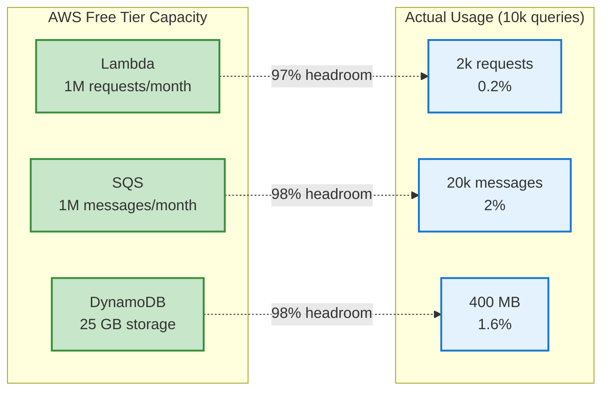
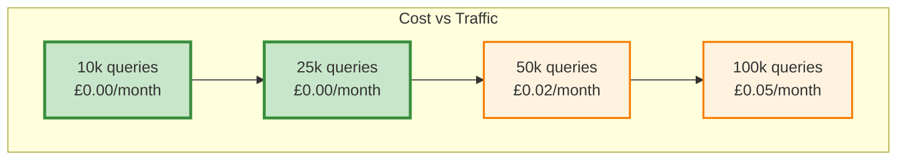
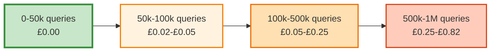

# AWS Analytics Series, Part 4: Cost and Scale

> Constraint in Action: The free tier isn't a gimmick — it's a forcing function that shapes good architecture.

> Pattern Transfer: The same economics apply on GCP/Azure with their free tiers; only the names change.

## Quick Summary

Practical cost analysis for building edge analytics infrastructure on AWS free tier. When £0/month is a feature, not a constraint.

- **Target:** 10,000 monthly queries generating 20,000 analytics events
- **Actual cost:** £0.00 (fits entirely within free tier)
- **Break-even point:** ~40,000 queries/month before any charges apply
- **First paid tier:** £0.05/month at 100,000 queries/month
- **Prerequisites:** Basic understanding of AWS pricing models

---

## The Free Tier Reality

AWS free tier isn't a trial. It's a permanent offering for services that run indefinitely at no cost, provided you stay within generous limits. For analytics infrastructure, these limits are surprisingly high:

### AWS Free Tier Limits (Permanent)

| Service | Monthly Limit | Our Usage (10k queries) | Utilisation |
|---------|--------------|------------------------|-------------|
| **Lambda** | 1M requests, 400k GB-seconds | 2k requests, 2k GB-seconds | 0.2% / 0.5% |
| **SQS** | 1M requests | 20k messages | 2% |
| **DynamoDB** | 25 WCU, 25 RCU, 25 GB | 20k writes, 1k reads, 0.4 GB | 2.7% / 0.1% / 1.6% |
| **EventBridge** | 1M events | 4 schedule triggers | <0.01% |
| **SES** | 62k emails | 4 weekly reports | <0.01% |

At 10,000 queries per month, we're using less than 3% of any service's free tier allocation. The architecture isn't optimised for the free tier. It just happens to fit comfortably within it.



---

## Cost Scaling Analysis

What happens as traffic grows?

### Scenario 1: Current Usage (10,000 queries/month)

**Analytics events:** 20,000 (2 per query)

| Service | Usage | Cost |
|---------|-------|------|
| Lambda (Processor) | 2,000 invocations × 1 GB-sec | £0.00 |
| Lambda (Reporter) | 4 invocations × 10 GB-sec | £0.00 |
| SQS | 20,000 messages | £0.00 |
| DynamoDB | 20,000 writes, 1,000 reads | £0.00 |
| EventBridge | 4 schedule events | £0.00 |
| SES | 4 emails | £0.00 |
| **Monthly Total** | | **£0.00** |

### Scenario 2: Moderate Growth (25,000 queries/month)

**Analytics events:** 50,000 (2 per query)

| Service | Usage | Free Tier | Billable | Cost |
|---------|-------|-----------|----------|------|
| Lambda (Processor) | 5,000 invocations × 1 GB-sec | 1M req, 400k GB-sec | 0 | £0.00 |
| Lambda (Reporter) | 4 invocations × 10 GB-sec | 1M req, 400k GB-sec | 0 | £0.00 |
| SQS | 50,000 messages | 1M messages | 0 | £0.00 |
| DynamoDB | 50,000 writes, 2,500 reads | 25 WCU, 25 RCU | ~0 | £0.00 |
| EventBridge | 4 schedules | 1M events | 0 | £0.00 |
| SES | 4 emails | 62k emails | 0 | £0.00 |
| **Monthly Total** | | | | **£0.00** |

### Scenario 3: Approaching Limits (50,000 queries/month)

**Analytics events:** 100,000 (2 per query)

| Service | Usage | Free Tier | Billable | Cost |
|---------|-------|-----------|----------|------|
| Lambda (Processor) | 10,000 invocations × 1 GB-sec | 1M req, 400k GB-sec | 0 | £0.00 |
| Lambda (Reporter) | 4 invocations × 10 GB-sec | 1M req, 400k GB-sec | 0 | £0.00 |
| SQS | 100,000 messages | 1M messages | 0 | £0.00 |
| DynamoDB | 100,000 writes, 5,000 reads | 25 WCU, 25 RCU | ~15 WCU | £0.02 |
| EventBridge | 4 schedules | 1M events | 0 | £0.00 |
| SES | 4 emails | 62k emails | 0 | £0.00 |
| **Monthly Total** | | | | **£0.02** |

### Scenario 4: Commercial Scale (100,000 queries/month)

**Analytics events:** 200,000 (2 per query)

| Service | Usage | Free Tier | Billable | Cost |
|---------|-------|-----------|----------|------|
| Lambda (Processor) | 20,000 invocations × 1 GB-sec | 1M req, 400k GB-sec | 0 | £0.00 |
| Lambda (Reporter) | 4 invocations × 10 GB-sec | 1M req, 400k GB-sec | 0 | £0.00 |
| SQS | 200,000 messages | 1M messages | 0 | £0.00 |
| DynamoDB | 200,000 writes, 10,000 reads | 25 WCU, 25 RCU | ~30 WCU | £0.05 |
| EventBridge | 4 schedules | 1M events | 0 | £0.00 |
| SES | 4 emails | 62k emails | 0 | £0.00 |
| **Monthly Total** | | | | **£0.05** |

**Key insight:** The architecture handles 10× traffic growth (10k → 100k queries) whilst monthly cost increases from £0.00 to £0.05. That's 200,000 analytics events processed for five pence.



---

## DynamoDB Pricing Deep Dive

DynamoDB is the only service that approaches free tier limits with moderate traffic. Understanding its pricing model is essential.

### Provisioned Capacity vs On-Demand

**Provisioned capacity:**

- Pay for allocated capacity (write capacity units and read capacity units)
- Free tier: 25 WCU and 25 RCU
- Predictable cost, but must provision for peak traffic

**On-demand capacity:**

- Pay per request
- No free tier
- Scales automatically, higher per-request cost

**Decision:** Use provisioned capacity with free tier allocation. 25 WCU supports 25 writes per second (2.16 million writes per day). Our peak traffic is ~1 write per second.

### Write Capacity Units (WCU) Calculation

One WCU = one write per second for items up to 1 KB.

Our analytics events average 20 KB each, requiring 20 WCU per write.

**At 10,000 queries/month:**

- 20,000 events/month
- 667 events/day
- ~0.008 events/second average
- **Required capacity:** 0.16 WCU (20 KB × 0.008 writes/sec)

**At 50,000 queries/month:**

- 100,000 events/month
- 3,333 events/day
- ~0.04 events/second average
- **Required capacity:** 0.8 WCU

**At 100,000 queries/month:**

- 200,000 events/month
- 6,667 events/day
- ~0.08 events/second average
- **Required capacity:** 1.6 WCU

All scenarios fit comfortably within the 25 WCU free tier allocation.

### Lambda Batching Optimisation

The processor Lambda receives SQS messages in batches of up to 10. Each batch triggers one Lambda invocation that writes multiple events to DynamoDB.

**Without batching:**

- 20,000 events = 20,000 Lambda invocations
- 20,000 DynamoDB writes (1 per event)

**With batching (current implementation):**

- 20,000 events ÷ 10 = 2,000 Lambda invocations
- 20,000 DynamoDB writes (still 1 per event, but batched)

Batching reduces Lambda costs by 90% whilst DynamoDB costs remain the same (charged per item, not per request).

---

## Hidden Costs: What Free Tier Doesn't Cover

### Data Transfer

**Within AWS region:** Free  
**Cross-region:** £0.02 per GB  
**Internet egress:** £0.09 per GB (first 10 GB free)

Our architecture keeps all processing in us-east-1. SES emails are <1 KB each. Total monthly data transfer: ~10 MB. Cost: £0.00.

### CloudWatch Logs

**Free tier:** 5 GB ingestion, 5 GB storage  
**Beyond free tier:** £0.50 per GB ingestion, £0.03 per GB storage

Lambda functions generate logs automatically. With 2,000 processor invocations/month and 4 reporter invocations/month, logs total ~50 MB/month. Cost: £0.00.

**Optimisation:** The production code was recently audited to remove unnecessary console.log statements, reducing log volume by 78% (40 logs per request → 9 critical error logs only).

### Secrets Manager (Not Used)

**Free tier:** None  
**Cost:** £0.40 per secret per month

The initial design considered using AWS Secrets Manager for SQS credentials. Instead, credentials are stored as Cloudflare Worker environment variables (no AWS Secrets Manager needed). Saved: £0.40/month.

### NAT Gateway (Not Required)

**Free tier:** None  
**Cost:** £0.045 per hour (~£32/month) + £0.045 per GB processed

Lambda functions with VPC access require NAT Gateway for internet access. Our Lambdas don't need VPC (DynamoDB and SES have public endpoints). Saved: £32/month.

---

## Cost Optimisation Strategies

### 1. Use Batch Processing

Lambda's SQS trigger batches messages automatically. Configure `BatchSize: 10` and `MaximumBatchingWindowInSeconds: 300` to reduce invocation count.

**Impact:** 90% reduction in Lambda invocations (20k → 2k for 20k events)

### 2. DynamoDB TTL for Auto-Deletion

Set a TTL attribute on every item to auto-delete after 90 days. This keeps storage within free tier limits indefinitely.

```typescript
const ttl = Math.floor(Date.now() / 1000) + (90 * 24 * 60 * 60);  // 90 days
```

**Impact:** Storage never exceeds 400 MB (90 days × 4.4 MB/day)

### 3. Single-Table Design

DynamoDB charges per table. Use one table with composite keys instead of separate tables for queries and responses.

**Impact:** Simpler schema, half the storage (no duplicate metadata)

### 4. Remove Debug Logging

Production Lambdas shouldn't log every operation. Keep only critical error logs.

**Impact:** 78% reduction in CloudWatch Logs (40 logs/request → 9 logs/request)

### 5. Avoid Secrets Manager

Store non-sensitive configuration in environment variables. Use IAM roles for AWS service authentication.

**Impact:** £0.40/month saved

---

## When Free Tier Runs Out

At what traffic level does this architecture become expensive?

### Break-Even Analysis

**Free tier exhausted:** ~500,000 queries/month (1 million events)

| Service | Usage | Free Tier | Billable | Cost |
|---------|-------|-----------|----------|------|
| Lambda | 100,000 invocations × 1 GB-sec | 1M req, 400k GB-sec | 0 | £0.00 |
| SQS | 1,000,000 messages | 1M messages | 0 | £0.00 |
| DynamoDB | 1M writes, 50k reads | 25 WCU, 25 RCU | ~150 WCU | £0.25 |
| EventBridge | 4 schedules | 1M events | 0 | £0.00 |
| SES | 4 emails | 62k emails | 0 | £0.00 |
| **Monthly Total** | | | | **£0.25** |

**Cost per query:** £0.00025 (0.025 pence)

At commercial scale (1 million queries/month):

| Service | Usage | Billable | Cost |
|---------|-------|----------|------|
| Lambda | 100,000 invocations | 0 (still in free tier) | £0.00 |
| SQS | 2,000,000 messages | 1M | £0.32 |
| DynamoDB | 2M writes, 100k reads | ~300 WCU | £0.50 |
| EventBridge | 4 schedules | 0 | £0.00 |
| SES | 4 emails | 0 | £0.00 |
| **Monthly Total** | | | **£0.82** |

**Cost per query:** £0.00082 (0.082 pence)

The architecture scales cost-effectively from 0 to 1 million queries whilst monthly cost increases from £0 to £0.82.



---

## Practical Implications

### For Portfolio Projects

This architecture is ideal. Zero cost for realistic traffic (<50k queries/month), production-quality infrastructure, and real AWS experience.

### For Side Projects

Perfectly suited for commercial side projects in early stages. Even at 100k queries/month (significant for a side project), cost is £0.05/month. When growth demands better analytics (real-time dashboards, complex queries), you'll have revenue to justify CloudWatch Insights or a dedicated analytics platform.

### For Commercial Products

The architecture becomes expensive relative to alternatives around 1 million queries/month:

- **Analytics SaaS** (Mixpanel, Amplitude): £20-50/month for 1M events
- **AWS CloudWatch Insights:** £5/month for 1M queries
- **Custom DynamoDB + QuickSight:** £10-15/month for dashboards

At commercial scale, the fire-and-forget pattern remains valuable, but you'd likely replace the processing pipeline with purpose-built analytics tools.

---

## Real-World Cost (My Production System)

My portfolio chatbot has been running for 6 months:

**Monthly traffic:** 8,000-12,000 queries  
**Analytics events:** 16,000-24,000  
**AWS bill:** £0.00 every month  
**Cloudflare bill:** £0.00 (Workers free tier)  

**Total infrastructure cost for 6 months:** £0.00

The only cost is domain registration (£12/year) and time spent building it. The infrastructure runs indefinitely at no cost.

---

## Cost Comparison: Alternatives

What would similar analytics cost using different approaches?

### Option 1: Google Analytics

**Cost:** Free  
**Trade-offs:**

- No control over data storage
- Privacy concerns for users
- Can't answer custom questions ("Which queries mention PostgreSQL?")
- No integration with CV data

### Option 2: Analytics SaaS (Mixpanel)

**Cost:** £20/month for 20k events  
**Trade-offs:**

- Professional dashboards and real-time analytics
- No infrastructure management
- Can't customise event schema
- Requires client-side JavaScript integration

### Option 3: Self-Hosted (PostgreSQL on Render)

**Cost:** £7/month for smallest instance  
**Trade-offs:**

- Full control over database
- Complex SQL queries possible
- Requires server management
- Can't scale to zero (always paying £7/month)

### Option 4: AWS CloudWatch Logs Insights

**Cost:** £5/month for 1GB logs + queries  
**Trade-offs:**

- Native AWS integration
- Powerful query language
- No separate database required
- Higher cost per query than DynamoDB

The custom AWS solution costs £0/month whilst providing:

- Complete data ownership
- Custom event schema
- Integration with CV data (can correlate analytics with skills queried)
- Weekly automated reports
- 90-day retention

---

## Practical Takeaways

1. **AWS free tier is permanent:** Not a trial, it runs indefinitely
2. **DynamoDB is the constraint:** First service to approach free tier limits
3. **Batching reduces costs:** Lambda invocations drop 90% with SQS batching
4. **TTL prevents storage bloat:** Auto-delete old events to stay within free tier
5. **Avoid unnecessary services:** Secrets Manager costs £0.40/month per secret (use environment variables)
6. **Cost scales sub-linearly:** 10× traffic growth (10k → 100k) = £0.05/month cost increase

The architecture isn't designed to be free. It's designed to be reliable and maintainable. It just happens to fit within free tier limits for realistic portfolio project traffic.

---

## What's Next?

This series covered:

1. **Fire-and-forget pattern:** How to log analytics without blocking user responses
2. **Architecture decisions:** Why SQS, Lambda, and DynamoDB (not alternatives)
3. **Cost analysis:** How much this actually costs at various traffic levels

The complete source code is available across three repositories:

- **cv-ai-agent:** Cloudflare Worker with fire-and-forget analytics
- **cv-analytics-processor:** Lambda function processing SQS events
- **cv-analytics-reporter:** Lambda function generating weekly reports
- **cv-analytics-infrastructure:** Terraform configuration for AWS resources

**Question for readers:** What's your threshold for "acceptable cost" in portfolio projects? £0/month? £5/month? £20/month?

---

*This post is part of a series on building production AI systems at the edge. All code is open source and available in my [GitHub repositories](https://github.com/josejalvarezm).*
