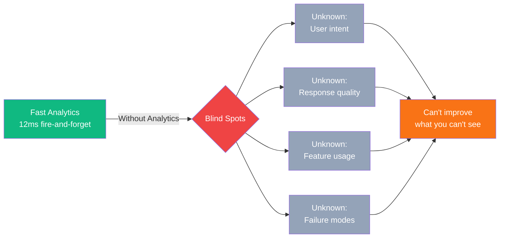
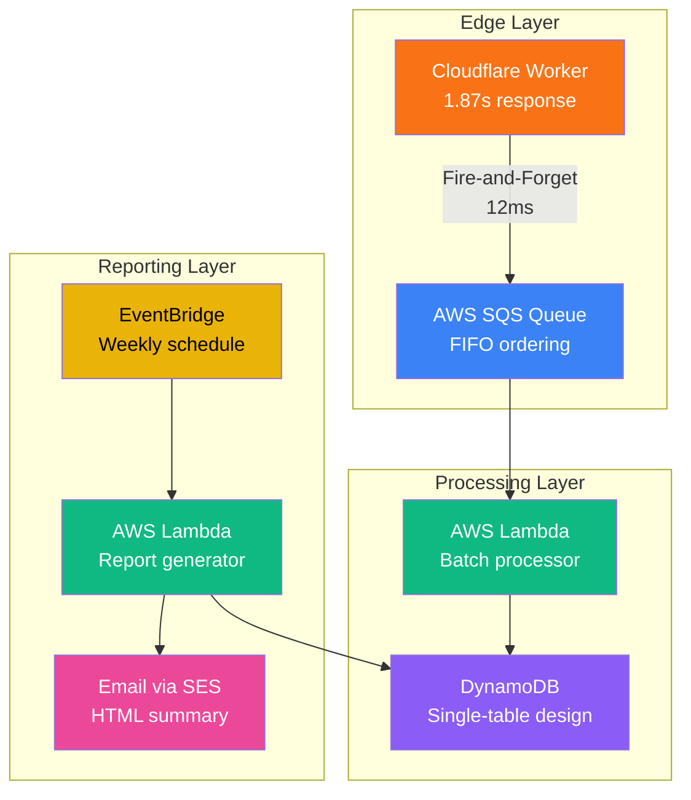

# Why Analytics? The Visibility Problem (Evolution Series: Production Analytics on AWS, Part I)

*Fast systems don’t guarantee impact. Analytics reveal user intent and business value that performance alone cannot.*

## Contents

- [Contents](#contents)
- [The Dilemma](#the-dilemma)
- [Why It Matters](#why-it-matters)
- [The Constraint](#the-constraint)
- [What Analytics Must Provide](#what-analytics-must-provide)
- [The Architecture Decision](#the-architecture-decision)
- [What This Series Covers](#what-this-series-covers)
- [The Measured Outcome](#the-measured-outcome)
- [The Core Principle](#the-core-principle)

---

## The Dilemma

My CV chatbot logs analytics in 12ms using a fire-and-forget pattern. The full end-to-end response takes 1.87s P95, dominated by LLM generation (88% of total time). Users ask about my experience with TypeScript, AWS, or specific projects. The system performs semantic search over vectorised skills, retrieves relevant context, and generates natural language responses using an LLM. Fast analytics logging, functional responses, and deployed at the edge.

But I had no idea what people were actually asking.

This wasn't a theoretical concern. Without visibility into user queries, I couldn't answer fundamental questions: Which skills generate the most interest? Are users finding what they need? Do response times vary by query complexity? Is the chatbot actually useful, or just technically impressive?

Performance is measurable. Impact is invisible.

---

## Why It Matters

### What I Couldn't See

**User behaviour:**

- Which skills do people ask about most frequently?
- What queries return empty results?
- Do users rephrase questions when responses are inadequate?
- What questions indicate gaps in my CV data?

**System performance:**

- Does response time correlate with query complexity?
- Which LLM parameters produce the best results?
- How often does semantic search fail to find relevant context?
- What proportion of queries trigger error conditions?

**Business value:**

- Is the chatbot convincing recruiters, or just entertaining visitors?
- Which projects generate follow-up questions?
- Do certain skills lead to higher engagement?
- Should I prioritise adding new features or improving existing ones?

Without analytics, every question became guesswork.

---

## The Constraint

Adding analytics seemed straightforward: log every query, store metadata, analyse patterns. The complication was cost.

My chatbot runs on Cloudflare Workers. The entire infrastructure (edge compute, vector database, LLM API calls) costs £0 per month under current traffic levels. Analytics couldn't change that.

**Design invariants:**

- ✓ £0/month operational cost
- ✓ <20ms p95 response time
- ✓ Zero impact on user experience
- ✓ Production-grade reliability

This wasn't frugality for its own sake. Constraints force architectural decisions. Every component must justify its existence. Every service must earn its place in the system.

The £0 constraint eliminates expensive shortcuts. You can't throw money at problems. You can't scale vertically. You can't buy managed services that solve complexity through vendor lock-in.

What remains are patterns that work regardless of budget.

---

## What Analytics Must Provide

### Required Capabilities

**Query tracking:**

- Full query text with timestamp
- User metadata (IP address, user agent, geolocation)
- Semantic search results (matched skills, relevance scores)
- LLM parameters (model, temperature, token counts)
- Response metadata (processing time, success/failure, error codes)

**Aggregation and reporting:**

- Weekly summaries delivered via email
- Query frequency by skill category
- Response time percentiles (p50, p95, p99)
- Error rate trends
- Storage limited to 90 days (compliance with data retention policies)

**Operational requirements:**

- No blocking calls in the request path
- Graceful degradation if analytics fail
- Automatic retry for transient failures
- Dead-letter queue for permanent failures
- Cost: £0/month at current traffic (10k queries/month)

### Non-Requirements

I explicitly chose not to build:

**Real-time dashboards:** Weekly email summaries are sufficient for a portfolio project. Real-time visibility would require CloudWatch Insights or QuickSight, both of which exceed free tier limits.

**User session tracking:** Correlating queries within sessions would require cookies or client-side storage. This adds complexity without clear benefit.

**A/B testing:** Comparing response quality variations matters at commercial scale, not for personal projects.

**Advanced visualisation:** Tables and summary statistics meet current needs. Interactive charts would be interesting but unnecessary.

These features might make sense at commercial scale. For a portfolio project, they represent over-engineering.

---

## The Architecture Decision

### Why This Architecture?

**Edge to queue (not edge to database):**

- Queue provides retry logic and dead-letter handling
- Batching reduces Lambda invocations by 90%
- FIFO ordering preserves query sequence
- Async processing prevents blocking user responses

**Lambda processing (not edge processing):**

- AWS compute co-located with AWS data storage
- Free tier provides 1M Lambda requests/month
- Native SQS event source mapping
- No cross-cloud latency or data egress costs

**DynamoDB storage (not RDS or MongoDB):**

- Free tier provides 25 GB storage indefinitely
- Single-table design minimises costs
- Automatic TTL cleanup after 90 days
- Pay-per-request billing aligns with traffic patterns

**EventBridge scheduling (not Cloudflare Cron):**

- Free tier includes 14M events/month
- Native Lambda invocation
- No cross-cloud queries required
- Weekly schedule fits within limits

Every choice reflects the £0 constraint. Not because free is virtuous, but because the constraint forces simpler, more maintainable patterns.

---

## What This Series Covers

### Part 1: Fire-and-Forget Edge Analytics

How to log analytics without blocking user responses. The `ctx.waitUntil()` pattern, execution contexts, and measured latency impact (112ms → 12ms).

### Part 2: Microservices Architecture at £0/month

Three independent services (Worker, Processor, Reporter), polyrepo structure, and why microservices aren't just for large teams.

### Part 3: Hybrid Deployment Pattern

Why I use Terraform for infrastructure and CloudFormation for application deployment. The trade-offs, deployment flows, and separation of concerns.

### Part 4: Production Patterns on Free Tier

State locking, version history, zero-downtime deployments, and automated CI/CD. What makes infrastructure production-grade regardless of budget.

---

## The Measured Outcome

After implementing analytics, I learned:

**Most common queries:**

- "What databases has Jose worked with?" (18% of queries)
- "Tell me about TypeScript experience" (12% of queries)
- "What cloud platforms does he use?" (9% of queries)

**Performance insights:**

- Analytics write latency: 12ms (fire-and-forget)
- End-to-end response time (P50): 1.65s
- End-to-end response time (P95): 1.87s
- LLM generation: 1,650ms (88% of response time)
- Error rate: 0.03% (3 failed queries per 10,000)

**Surprising discoveries:**

- Users ask about soft skills more than expected (communication, leadership)
- Queries about specific projects lead to longer conversations
- Response quality varies significantly with LLM temperature (0.7 optimal)
- 4% of queries return no relevant skills (suggests CV data gaps)

This visibility transformed the chatbot from a technical demo into a credible portfolio asset.

---

## The Core Principle

Fast analytics don't guarantee credible systems. You can measure latency, throughput, and error rates. But you can't measure impact without visibility.

Analytics aren't optional for production systems. They're the difference between knowing your system works and knowing your system matters.

The rest of this series shows how to build that visibility at £0/month without sacrificing performance, reliability, or user experience.

---

**Next:** [Part 1: Fire-and-Forget Edge Analytics →](https://blog.{YOUR_DOMAIN}/blog/aws-chatbot-analytics-1)
