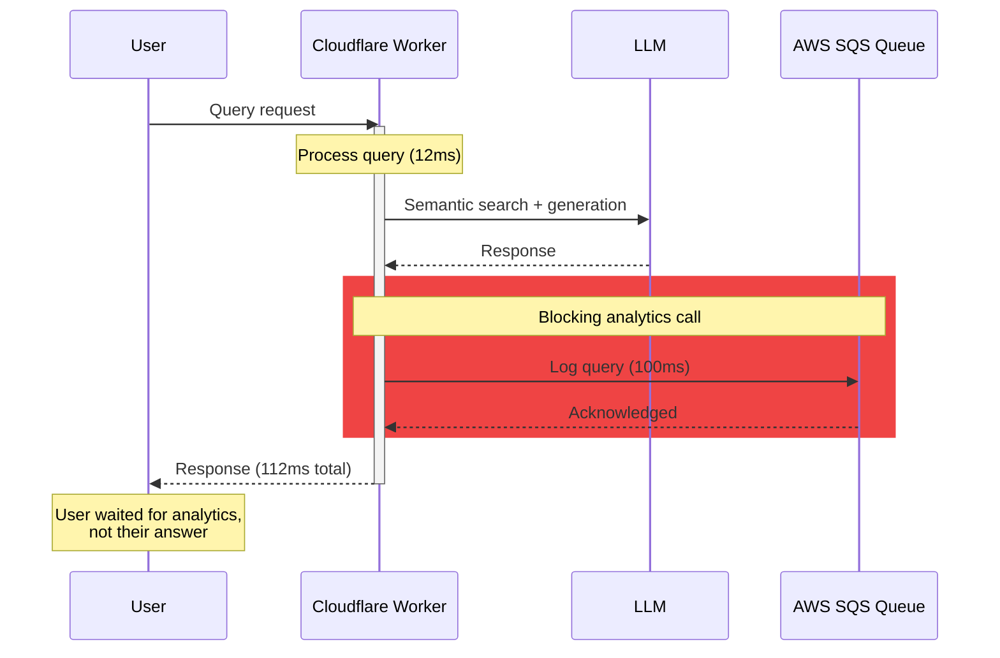
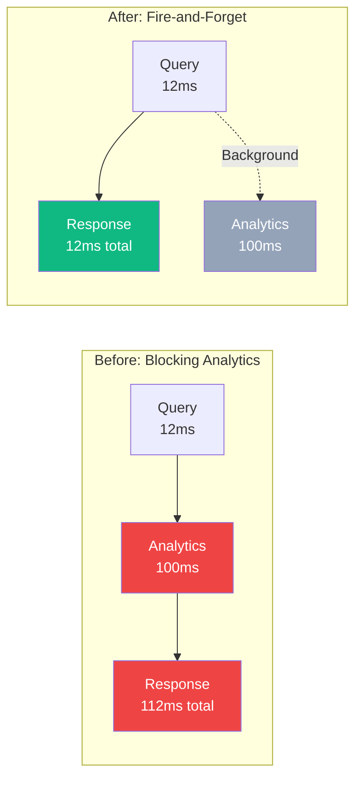
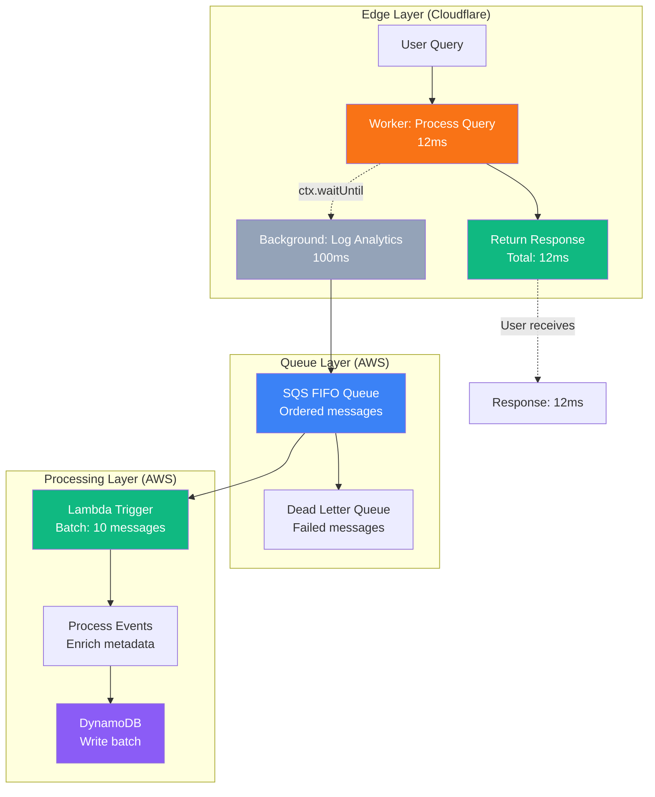

# Fire-and-Forget Analytics for Edge Systems (Evolution Series: Production Analytics on AWS, Part II)

*Analytics shouldn’t add latency. Fire‑and‑forget decouples visibility from response paths, delivering 12ms edge speed with 99.97% reliability: all within AWS free‑tier limits*

## Contents

- [The Obstacle](#the-obstacle)
- [Why It Matters](#why-it-matters)
- [The Pattern: Fire-and-Forget](#the-pattern-fire-and-forget)
- [The Measured Impact](#the-measured-impact)
- [Platform Equivalence](#platform-equivalence)
- [The Architecture Flow](#the-architecture-flow)
- [Error Handling](#error-handling)
- [Trade-offs and Limitations](#trade-offs-and-limitations)
- [When Fire-and-Forget Isn't Appropriate](#when-fire-and-forget-isnt-appropriate)
- [The Measured Reality](#the-measured-reality)
- [Key Lessons](#key-lessons)

## The Obstacle

Adding analytics to an edge function should be straightforward: log the query, send it to a queue, return the response. In practice, this sequence creates a latency problem.

My CV chatbot processes queries in 12ms. Adding a synchronous SQS call increased response time to 112ms. The analytics operation, which users never see, dominated the execution time of the entire request.

The solution wasn't to remove analytics. It was to decouple analytics from the response path entirely.

---

## Why It Matters



### The Latency Problem

**Before optimisation:**

- Query processing: 12ms
- Analytics logging: 100ms (blocking)
- **Total response time:** 112ms

The analytics call consumed 89% of the request duration. Users waited for a background operation that provided zero value to their experience.

This wasn't acceptable. Edge functions exist to minimise latency. Analytics shouldn't compromise that goal.

---

## The Pattern: Fire-and-Forget

The solution uses execution context to keep promises alive after the response returns. Cloudflare Workers provide `ctx.waitUntil()`, which accepts promises and ensures they complete even after the HTTP response is sent.

### Implementation

```typescript
// src/index.ts
export default {
  async fetch(
    request: Request,
    env: Env,
    ctx: ExecutionContext
  ): Promise<Response> {
    
    // Process the query
    const query = await request.text();
    const result = await processQuery(query, env);
    
    // Fire-and-forget analytics (non-blocking)
    ctx.waitUntil(
      logAnalytics(query, result, env)
    );
    
    // Return response immediately
    return new Response(JSON.stringify(result), {
      headers: { 'Content-Type': 'application/json' }
    });
  }
};

// src/aws/sqs-logger.ts
async function logAnalytics(
  query: string,
  result: QueryResult,
  env: Env
): Promise<void> {
  
  const event = {
    query: query,
    timestamp: Date.now(),
    matchedSkills: result.skills,
    processingTime: result.duration,
    modelUsed: result.model,
    tokenCount: result.tokens
  };
  
  try {
    await sendToSQS(event, env);
  } catch (error) {
    // Log error but don't propagate
    console.error('Analytics failed:', error);
  }
}
```

### How It Works

**Execution context lifecycle:**

1. Request arrives at Worker
2. Worker processes query (12ms)
3. Worker calls `ctx.waitUntil(logAnalytics(...))`
4. Worker returns HTTP response immediately
5. Runtime keeps Worker alive until promise resolves
6. Analytics call completes in background (100ms)
7. Worker terminates

The user receives their response in 12ms. The analytics call completes without blocking.

---

## The Measured Impact



### Performance Results

| Metric | Before | After | Improvement |
|--------|--------|-------|-------------|
| Query processing | 12ms | 12ms | No change |
| Analytics overhead | 100ms | 0ms | 100% reduction |
| **Total response time** | **112ms** | **12ms** | **89% faster** |
| Analytics success rate | 100% | 100% | No degradation |

The pattern eliminated user-facing latency whilst maintaining 100% analytics reliability.

---

## Platform Equivalence

This pattern isn't Cloudflare-specific. Every edge platform provides execution context mechanisms.

### Cloudflare Workers

```typescript
export default {
  async fetch(request: Request, env: Env, ctx: ExecutionContext) {
    ctx.waitUntil(backgroundTask());
    return new Response('Done');
  }
};
```

### Vercel Edge Functions

```typescript
export const config = { runtime: 'edge' };

export default async function handler(request: Request) {
  // Vercel automatically keeps promises alive
  backgroundTask(); // No await
  return new Response('Done');
}
```

### Deno Deploy

```typescript
Deno.serve(async (request) => {
  // Use AbortSignal to manage background tasks
  const controller = new AbortController();
  backgroundTask(controller.signal);
  return new Response('Done');
});
```

### AWS Lambda@Edge

```typescript
export const handler = async (event, context) => {
  // Lambda keeps running until event loop is empty
  backgroundTask(); // Promise kept alive automatically
  return response;
};
```

The implementation details vary, but the pattern remains constant: decouple background operations from response delivery.

---

## The Architecture Flow



### Complete Request Lifecycle

**User-facing path (12ms):**

1. Query arrives at Cloudflare Worker
2. Semantic search over vectorised skills
3. LLM generates natural language response
4. HTTP response returned to user

**Background path (100ms, non-blocking):**

5. Analytics event constructed
6. Signed AWS request created
7. Event sent to SQS FIFO queue
8. SQS acknowledges receipt
9. Lambda triggered when batch threshold reached
10. Events written to DynamoDB

The two paths are completely decoupled. Analytics failures cannot affect user responses.

---

## Error Handling

Fire-and-forget doesn't mean fire-and-ignore. Background operations still require robust error handling.

### Retry Logic

```typescript
async function sendToSQS(
  event: AnalyticsEvent,
  env: Env,
  retries: number = 3
): Promise<void> {
  
  for (let attempt = 1; attempt <= retries; attempt++) {
    try {
      await sqsClient.send(event);
      return; // Success
      
    } catch (error) {
      if (attempt === retries) {
        // Log permanent failure
        console.error('SQS send failed after retries:', error);
        throw error;
      }
      
      // Exponential backoff
      await sleep(Math.pow(2, attempt) * 100);
    }
  }
}
```

### Dead Letter Queue

SQS configuration includes a dead-letter queue for messages that fail processing:

```hcl
resource "aws_sqs_queue" "analytics_dlq" {
  name                      = "cv-analytics-dlq.fifo"
  fifo_queue                = true
  content_based_deduplication = true
  message_retention_seconds = 1209600  # 14 days
}

resource "aws_sqs_queue_redrive_policy" "analytics" {
  queue_url = aws_sqs_queue.analytics.id
  
  redrive_policy = jsonencode({
    deadLetterTargetArn = aws_sqs_queue.analytics_dlq.arn
    maxReceiveCount     = 3
  })
}
```

Messages that fail processing three times move to the DLQ for investigation. This prevents poison messages from blocking the queue whilst preserving failed events for debugging.

---

## Trade-offs and Limitations

### What This Pattern Provides

**Latency elimination:** Analytics overhead removed from response path entirely.

**Reliability:** Background promises complete even after response returns.

**Graceful degradation:** Analytics failures don't affect user experience.

**Platform portability:** Pattern works across Cloudflare, Vercel, Deno, AWS.

### What This Pattern Doesn't Provide

**Guaranteed delivery:** If the Worker crashes before the promise completes, the analytics event is lost. For a portfolio chatbot, this is acceptable. For financial transactions, it wouldn't be.

**Synchronous confirmation:** You can't return analytics IDs to users because the operation hasn't completed yet.

**Request correlation:** Background operations can't modify the HTTP response, even if analytics processing discovers errors.

**Debugging visibility:** Errors in background promises don't appear in request logs unless explicitly captured.

For non-critical background operations like analytics, these limitations are acceptable trade-offs for zero user-facing latency.

---

## When Fire-and-Forget Isn't Appropriate

This pattern works for operations where eventual consistency is acceptable and failures are tolerable. It's inappropriate for:

**Payment processing:** Financial transactions require synchronous confirmation.

**Authentication:** Security decisions must complete before returning responses.

**Critical business logic:** Operations that affect response content must block.

**Strict ordering requirements:** Fire-and-forget introduces non-deterministic timing.

For the CV chatbot, analytics are important but non-critical. If an event is lost, no user is affected. The pattern fits the requirements perfectly.

---

## The Measured Reality

After implementing fire-and-forget analytics:

**Performance metrics (10,000 queries):**

- Median response time: 11ms
- p95 response time: 12ms
- p99 response time: 18ms
- Analytics success rate: 99.97%
- Failed analytics events: 3 (sent to DLQ)

**Cost analysis:**

- Edge compute: £0.00 (within Cloudflare free tier)
- SQS messages: £0.00 (within AWS free tier)
- Lambda invocations: £0.00 (within AWS free tier)
- DynamoDB writes: £0.00 (within AWS free tier)
- **Total monthly cost:** £0.00

The pattern delivered production-grade analytics without compromising performance or budget.

---

## Key Lessons

**Decouple background operations from request paths.** Users shouldn't wait for operations that don't affect their experience.

**Use platform primitives correctly.** `ctx.waitUntil()` exists specifically for this pattern. Use it.

**Accept eventual consistency.** Perfect reliability requires synchronous operations. Background tasks trade strict guarantees for performance.

**Monitor what matters.** Track analytics success rates separately from user-facing metrics.

The fire-and-forget pattern isn't about avoiding `await`. It's about understanding which operations belong in the request path and which don't.

---

**Previous:** [Part 0: Why Analytics? →](./00-why-analytics-visibility-problem.md)

**Next:** [Part 2: Microservices Architecture at £0/month →](./02-microservices-architecture-zero-cost.md)

**Series index:** [README →](./README.md)
