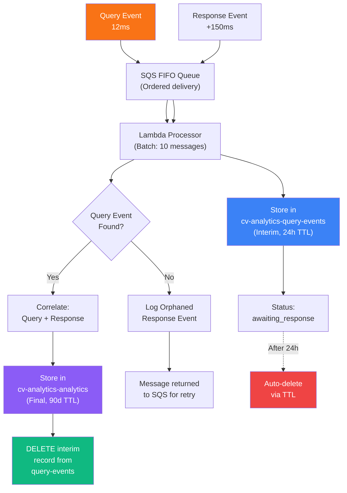

# Microservices Architecture at £0/month (Evolution Series: Production Analytics on AWS, Part III)

*Monoliths couple everything: deployments, failures, and blast radius. This post shows how microservices at £0/month create clear boundaries, independent deployments, and isolated failures, all while staying within AWS free‑tier limit*

## Contents

- [The Barrier](#the-barrier)
- [Why It Matters](#why-it-matters)
- [The Architecture](#the-architecture)
- [Repository Structure](#repository-structure)
- [State Management](#state-management)
- [Cross-Service Dependencies](#cross-service-dependencies)
- [CI/CD Path Filtering](#cicd-path-filtering)
- [Cost Analysis](#cost-analysis)
- [Failure Isolation](#failure-isolation)
- [When Microservices Add Complexity](#when-microservices-add-complexity)
- [The Measured Reality](#the-measured-reality)
- [Key Lessons](#key-lessons)

## The Barrier

Analytics infrastructure could be simple: one Terraform state file, one repository, all services deployed together. This works until it doesn't.

The problem with monolithic infrastructure isn't technical complexity. It's operational coupling. When everything shares state, deploying one service means validating all services. When everything lives in one repository, changing queue configuration requires rebuilding Lambda functions. When everything deploys together, blast radius becomes unbounded.

Microservices architecture solves this by creating clear boundaries. Each service owns its infrastructure. Each service deploys independently. Each service fails independently.

The constraint remained: £0/month operational cost.

---

## Why It Matters


### Why Microservices?

**Independent deployment:** Changing the processor Lambda doesn't require revalidating the worker queue or reporter schedule.

**Isolated failures:** If the reporter service breaks, query processing continues unaffected.

**Clear ownership:** Each service has defined inputs, outputs, and responsibilities.

**Parallel development:** Multiple features can progress simultaneously without merge conflicts.

**Bounded complexity:** Understanding one service doesn't require understanding all services.

These benefits matter at any scale, not just for large teams. A portfolio project with three services still gains from clear boundaries.

---

## The Architecture


### Service Boundaries

Each service manages specific AWS resources via independent Terraform states.

**Worker Service (3 resources):**

- SQS FIFO queue for ordered event delivery
- Dead-letter queue for failed messages
- Redrive policy connecting queue to DLQ

**Processor Service (5 resources):**

- DynamoDB table for event storage
- IAM role for Lambda execution
- IAM policy attachments for queue and table access
- Data sources for caller identity and queue ARN

**Reporter Service (10 resources):**

- DynamoDB table for analytics queries
- EventBridge rule for weekly scheduling
- SNS topic for email notifications
- SNS subscription for delivery
- IAM roles for EventBridge and Lambda
- IAM policies for DynamoDB and SNS access
- Data sources for processor table reference

Total: 18 AWS resources across 3 independent Terraform workspaces.

---

## Repository Structure

The system uses a polyrepo pattern. Each service lives in its own repository with separate deployment cycles.

```
cv-analytics-infrastructure/
├── worker-infra/
│   ├── main.tf           # Terraform Cloud backend
│   ├── sqs.tf            # Queue resources
│   ├── variables.tf      # Input parameters
│   └── outputs.tf        # Queue ARN export
├── processor-infra/
│   ├── main.tf           # Terraform Cloud backend
│   ├── dynamodb.tf       # Table resources
│   ├── iam.tf            # Lambda role and policies
│   ├── variables.tf      # Input parameters
│   └── outputs.tf        # Table name export
├── reporter-infra/
│   ├── main.tf           # Terraform Cloud backend
│   ├── eventbridge.tf    # Schedule resources
│   ├── sns.tf            # Email notification
│   ├── iam.tf            # Lambda and EventBridge roles
│   ├── variables.tf      # Input parameters
│   └── outputs.tf        # Topic ARN export
└── .github/
    └── workflows/
        └── terraform-ci-cd.yml  # Path-filtered deployment

cv-analytics-processor/
├── src/
│   ├── index.ts          # Lambda handler
│   ├── dynamodb.ts       # DynamoDB client
│   └── types.ts          # TypeScript definitions
├── infrastructure/
│   └── lambda.yaml       # CloudFormation template
└── .github/
    └── workflows/
        └── deploy.yml    # Lambda deployment

cv-analytics-reporter/
├── src/
│   ├── index.ts          # Lambda handler
│   ├── aggregation.ts    # Query logic
│   └── email.ts          # Template rendering
├── infrastructure/
│   └── lambda.yaml       # CloudFormation template
└── .github/
    └── workflows/
        └── deploy.yml    # Lambda deployment
```

### Why Polyrepo?

**Deployment independence:** Each service deploys without coordinating with others.

**Access control:** Different teams could own different services (future-proofing).

**Versioning clarity:** Each repository has independent release cycles.

**Build isolation:** Processor changes don't trigger reporter builds.

The alternative, a monorepo, would simplify cross-service refactoring but couple deployment cycles. For infrastructure services, deployment independence outweighs refactoring convenience.

---

## State Management

Each service uses Terraform Cloud for remote state with automatic locking and version history.

### Workspace Configuration

```hcl
# worker-infra/main.tf
terraform {
  cloud {
    organization = "[your-terraform-organization]"
    
    workspaces {
      name = "cv-analytics-worker"
    }
  }
  
  required_providers {
    aws = {
      source  = "hashicorp/aws"
      version = "~> 5.0"
    }
  }
}
```

### State Separation Benefits

**No shared locks:** Worker deployment doesn't block processor deployment.

**Independent state versions:** Each service maintains separate rollback history.

**Granular permissions:** Future team members could access specific workspaces only.

**Parallel operations:** All three services can deploy simultaneously.

**Clear blast radius:** State corruption affects one service, not all infrastructure.

---

## Cross-Service Dependencies

Services communicate through well-defined outputs and data sources, not shared state.

### Output Export Pattern

```hcl
# worker-infra/outputs.tf
output "analytics_queue_arn" {
  description = "ARN of the analytics SQS queue"
  value       = aws_sqs_queue.analytics.arn
}

output "analytics_queue_url" {
  description = "URL of the analytics SQS queue"
  value       = aws_sqs_queue.analytics.url
}
```

### Data Source Consumption

```hcl
# processor-infra/iam.tf
data "aws_sqs_queue" "analytics" {
  name = "cv-analytics-queue.fifo"
}

resource "aws_iam_role_policy" "processor_queue_access" {
  role = aws_iam_role.processor_lambda.id
  
  policy = jsonencode({
    Version = "2012-10-17"
    Statement = [{
      Effect = "Allow"
      Action = [
        "sqs:ReceiveMessage",
        "sqs:DeleteMessage",
        "sqs:GetQueueAttributes"
      ]
      Resource = data.aws_sqs_queue.analytics.arn
    }]
  })
}
```

The processor service doesn't depend on worker state. It queries AWS directly for queue resources. This prevents circular dependencies whilst maintaining loose coupling.

---

## Event Correlation: The Hidden Complexity

Analytics isn't just logging events. It's correlating two-stage events (query, then response) into a complete record. This correlation happens in the Processor service and reveals why distributed architectures need careful data modelling.

### The Two-Event Problem

Each user query generates two separate events:

**Event 1: Query Event** (Immediate)

```json
{
  "eventType": "query",
  "requestId": "c5ddb9b5-d0d3-4401-85ec-62994f28311b",
  "timestamp": 1762607658821,
  "query": "What databases have you used?",
  "sessionId": "user-session-123"
}
```

**Event 2: Response Event** (After 150ms)

```json
{
  "eventType": "response",
  "requestId": "c5ddb9b5-d0d3-4401-85ec-62994f28311b",
  "timestamp": 1762607658971,
  "matchType": "full",
  "matchScore": 84,
  "reasoning": "Excellent match with SQL Server, PostgreSQL experience"
}
```

Both events arrive independently at SQS. The Processor Lambda must match them by `requestId` and combine them into a single analytics record.

### Two-Table DynamoDB Design

This matching happens across two DynamoDB tables:

**Table 1: `cv-analytics-query-events` (Interim Storage)**

| Column | Type | Purpose | TTL |
|--------|------|---------|-----|
| `requestId` | PK | Unique query identifier | 24h |
| `timestamp` | SK | Event timestamp | |
| `query` | String | User's question | |
| `sessionId` | String | Session reference | |
| `status` | String | "awaiting_response" | |

**Table 2: `cv-analytics-analytics` (Final Storage)**

| Column | Type | Purpose | TTL |
|--------|------|---------|-----|
| `requestId` | PK | Unique identifier | 90d |
| `timestamp` | SK | Query timestamp | |
| `query` | String | User's question | |
| `matchType` | String | "full" / "partial" / "none" | |
| `matchScore` | Number | 0-100 confidence | |
| `reasoning` | String | Match explanation | |
| `sessionId` | String | Session reference | |
| `week` | GSI | "2025-W46" for weekly reports | |

### Query Lifecycle



### Implementation Details

**Lambda Handler Logic:**

```typescript
// Simplified from cv-analytics-processor
async function processEvent(event: AnalyticsEvent) {
  if (event.eventType === 'query') {
    // Stage 1: Store query event
    await queryEventsTable.put({
      requestId: event.requestId,
      timestamp: event.timestamp,
      query: event.query,
      sessionId: event.sessionId,
      status: 'awaiting_response',
      ttl: Math.floor(Date.now() / 1000) + 24 * 60 * 60
    });
    
  } else if (event.eventType === 'response') {
    // Stage 2: Look up matching query
    const queryEvent = await queryEventsTable.get(event.requestId);
    
    if (!queryEvent) {
      // Orphaned response: no matching query found
      console.warn(`Orphaned response event: ${event.requestId}`);
      throw new Error('Query event not found'); // Retry later
    }
    
    // Stage 3: Correlate query + response
    const analyticsRecord = {
      requestId: event.requestId,
      timestamp: queryEvent.timestamp,
      query: queryEvent.query,
      matchType: event.matchType,
      matchScore: event.matchScore,
      sessionId: queryEvent.sessionId,
      week: getWeekIdentifier(queryEvent.timestamp),
      ttl: Math.floor(Date.now() / 1000) + 90 * 24 * 60 * 60
    };
    
    // Stage 4: Store correlated record
    await analyticsTable.put(analyticsRecord);
    
    // Stage 5: Clean up interim record
    await queryEventsTable.delete({
      requestId: event.requestId,
      timestamp: queryEvent.timestamp
    });
  }
}
```

### Failure Scenarios

#### Scenario 1: Response Event Arrives First

Response event is queued before query event. Lambda looks for query event in Step 2, finds nothing, throws error. Message goes to DLQ after 3 retries. Query event eventually arrives but has no matching response (orphaned).

**Solution:** Query event is stored with 24-hour TTL, so orphaned query events auto-delete.

#### Scenario 2: Query Event Deleted Before Response Arrives

Query event reaches TTL and auto-deletes. Response event arrives, Lambda looks for query, finds nothing. Response marked as orphaned, returned to DLQ.

**Occurrence:** Rare, only if response event delayed > 24 hours (client hung, network interrupted).

#### Scenario 3: Lambda Failure During Correlation

Lambda crashes after storing analytics record but before deleting query event. Duplicate record exists: query-events table and analytics table both contain the data.

**Solution:** Processor Lambda is idempotent (SQS deduplication ID ensures same message isn't processed twice).

### Data Quality Implications

**Query-Events Table (After Processing):**

Only orphaned records remain:

- Query event arrived, status set to "awaiting_response"
- Response event never arrived (within 24 hours)
- Record auto-deletes via TTL

**Analytics Table (Permanent History):**

Only successfully correlated records:

- Query event + Response event both arrived
- Correlation succeeded
- Interim query record deleted
- 90-day retention for reporting

This two-table design ensures:

- ✅ Complete records only in final table
- ✅ No duplicate data across tables
- ✅ Automatic cleanup of orphaned records
- ✅ Weekly reports include only successful correlations

---

## Failure Isolation

---

## CI/CD Path Filtering

GitHub Actions deploy only services that changed, using path filters to trigger relevant jobs.

```yaml
# .github/workflows/terraform-ci-cd.yml
name: Terraform CI/CD

on:
  push:
    branches: [main]
    paths:
      - 'worker-infra/**'
      - 'processor-infra/**'
      - 'reporter-infra/**'

jobs:
  worker:
    if: contains(github.event.head_commit.modified, 'worker-infra/')
    runs-on: ubuntu-latest
    steps:
      - name: Terraform Apply
        run: |
          cd worker-infra
          terraform init
          terraform apply -auto-approve
  
  processor:
    if: contains(github.event.head_commit.modified, 'processor-infra/')
    runs-on: ubuntu-latest
    steps:
      - name: Terraform Apply
        run: |
          cd processor-infra
          terraform init
          terraform apply -auto-approve
  
  reporter:
    if: contains(github.event.head_commit.modified, 'reporter-infra/')
    runs-on: ubuntu-latest
    steps:
      - name: Terraform Apply
        run: |
          cd reporter-infra
          terraform init
          terraform apply -auto-approve
```

### Measured Deployment Times

| Service | Infrastructure Change | Lambda Code Change |
|---------|----------------------|-------------------|
| Worker | 3 minutes | N/A (no Lambda) |
| Processor | 4 minutes | 2 minutes |
| Reporter | 4 minutes | 2 minutes |

Infrastructure changes are slower because Terraform validates all resources. Lambda code changes use CloudFormation, which updates only application code.

---

## Cost Analysis

All three services fit within AWS free tier limits indefinitely.

### Free Tier Utilisation (10,000 queries/month)

**Worker Service:**

- SQS messages sent: 10,000/month
- Free tier limit: 1,000,000 requests/month
- **Utilisation: 1%**

**Processor Service:**

- Lambda invocations: 1,000/month (10:1 batching)
- Lambda compute: 30,000 GB-seconds/month
- DynamoDB writes: 10,000/month
- DynamoDB storage: 0.5 GB
- Free tier limits: 1M requests, 400,000 GB-seconds, 25 WCU, 25 GB storage
- **Utilisation: 0.1% requests, 7.5% compute, 40% writes, 2% storage**

**Reporter Service:**

- Lambda invocations: 4/month (weekly schedule)
- EventBridge events: 4/month
- SNS email deliveries: 4/month
- DynamoDB reads: 40,000/month (aggregation queries)
- Free tier limits: 1M Lambda requests, 14M EventBridge events, 1,000 SNS emails, 25 RCU
- **Utilisation: <0.01% Lambda, <0.01% EventBridge, 0.4% SNS, 16% reads**

### Cost Scaling Projection

| Traffic Level | Worker | Processor | Reporter | Total Monthly Cost |
|---------------|--------|-----------|----------|-------------------|
| 10,000 queries | £0.00 | £0.00 | £0.00 | **£0.00** |
| 50,000 queries | £0.00 | £0.02 | £0.00 | **£0.02** |
| 100,000 queries | £0.00 | £0.05 | £0.00 | **£0.05** |
| 500,000 queries | £0.00 | £0.25 | £0.00 | **£0.25** |
| 1,000,000 queries | £0.00 | £0.52 | £0.00 | **£0.52** |

The architecture scales cost-effectively from zero to commercial traffic levels. It's not designed to be free, but happens to fit within generous free tier allocations.

---

## Failure Isolation

Microservices architecture contains failures within service boundaries.

### Scenario: Processor Lambda Fails


**Impact:** Events move to DLQ after three retry attempts. Reporter continues functioning with existing data. Worker continues accepting new queries. Only event processing is affected.

**Blast radius:** One service (Processor).

### Scenario: Reporter Lambda Fails

**Impact:** Weekly email doesn't send. EventBridge reschedules for next week. Processor and Worker unaffected.

**Blast radius:** One service (Reporter).

### Scenario: Worker Queue Unavailable

**Impact:** New analytics events fail to enqueue. Fire-and-forget pattern logs errors but doesn't block user responses. Processor and Reporter unaffected.

**Blast radius:** Analytics collection only (user experience unchanged).

This isolation is the primary benefit of microservices architecture. Failures propagate vertically (within services), not horizontally (across services).

---

## When Microservices Add Complexity

Microservices architecture isn't universally better. It introduces operational overhead that monolithic systems avoid.

### Overhead Introduced

**Multiple deployments:** Three deployment pipelines instead of one.

**Cross-service debugging:** Tracing requests across service boundaries requires correlation IDs.

**State coordination:** Ensuring consistent deployment order when dependencies exist.

**Duplicate configuration:** Each service needs AWS credentials, logging setup, monitoring.

**Integration testing:** Validating inter-service communication requires more sophisticated tests.

### When Monolithic Is Better

For systems with these characteristics, a monolithic approach is simpler:

**Tightly coupled logic:** Services that always change together gain nothing from separation.

**Shared data models:** Services operating on the same database tables should share state.

**Single deployment cadence:** If all services deploy simultaneously, boundaries add friction.

**Small team or solo developer:** Coordination overhead exceeds benefit for one person.

The CV analytics system doesn't have these characteristics. Services change independently, own separate data, and deploy on different schedules. Microservices fit the requirements.

---

## The Measured Reality

After implementing microservices architecture:

**Deployment frequency (last 30 days):**

- Worker infrastructure: 2 deployments
- Processor infrastructure: 5 deployments
- Processor Lambda code: 12 deployments
- Reporter infrastructure: 3 deployments
- Reporter Lambda code: 4 deployments

**Deployment success rate:** 100% (26/26 successful deployments)

**Average deployment time:** 3.2 minutes per service

**State conflicts:** 0 (automatic locking prevented concurrent operations)

**Cross-service failures:** 0 (failures remained within service boundaries)

The architecture delivered independent deployments without operational complexity.

---

## Key Lessons

**Microservices benefit small systems too.** Clear boundaries matter regardless of team size.

**State separation prevents coupling.** Independent Terraform workspaces enable independent deployments.

**Path filtering reduces deployment time.** Only changed services deploy, not entire infrastructure.

**Free tier supports production patterns.** Cost constraints don't require architectural compromises.

**Failure isolation is worth operational overhead.** Bounded blast radius justifies multiple deployment pipelines.

Microservices architecture isn't about scale. It's about boundaries, ownership, and operational independence.

---

**Previous:** [Part II: Fire-and-Forget Analytics →](aws-chatbot-analytics-2)

**Next:** [Part IV: Hybrid Deployment Pattern →](aws-chatbot-analytics-4)
