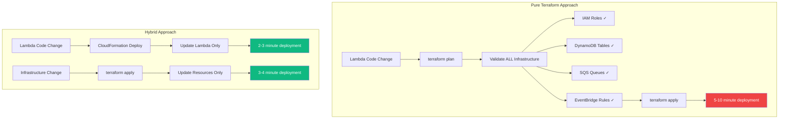
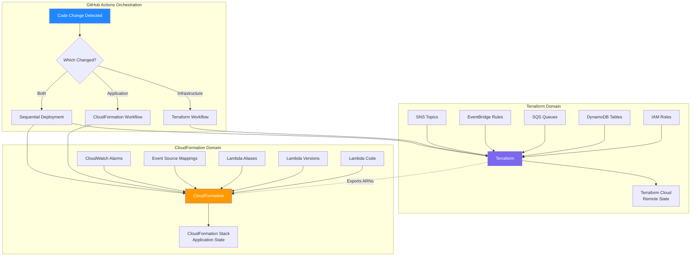

# Hybrid Deployment: Terraform + CloudFormation (Evolution Series: Production Analytics on AWS, Part IV)

*Infrastructure as code isn’t one‑size‑fits‑all. This post shows how Terraform and CloudFormation can coexist — balancing portability with native AWS features. Hybrid deployment patterns let teams evolve without lock‑in, while still staying at £0/month within the free‑tier.*

## Contents

- [Contents](#contents)
- [The Challenge](#the-challenge)
- [Why It Matters](#why-it-matters)
- [The Hybrid Pattern](#the-hybrid-pattern)
- [The Deployment Flow](#the-deployment-flow)
- [The Interface: Outputs and Parameters](#the-interface-outputs-and-parameters)
- [Real-World Deployment Scenarios](#real-world-deployment-scenarios)
- [Why CloudFormation for Lambda](#why-cloudformation-for-lambda)
- [Why Terraform for Infrastructure](#why-terraform-for-infrastructure)
- [Trade-offs and Limitations](#trade-offs-and-limitations)
- [When Hybrid Isn't Worth It](#when-hybrid-isnt-worth-it)
- [The Measured Reality](#the-measured-reality)
- [Key Lessons](#key-lessons)

## The Challenge

Terraform can deploy Lambda functions. CloudFormation can deploy Lambda functions. After evaluating both approaches, I chose both.

This wasn't indecision. It was recognising that infrastructure and application have different lifecycle requirements. Infrastructure changes rarely: IAM roles, DynamoDB tables, SQS queues. Application code changes frequently: Lambda handlers, dependencies, business logic.

Deploying both through the same tool creates unnecessary coupling. Infrastructure changes force application revalidation. Application changes trigger full infrastructure plans. The deployment cycle becomes heavy for operations that should be lightweight.

The solution: use Terraform for infrastructure, CloudFormation for application deployment, and GitHub Actions to orchestrate both.

---

## Why It Matters



### The Problem with Pure Terraform

**State file bloat:** Lambda deployment packages are base64-encoded into state files. A 10MB package becomes 15MB of base64 text in state.

**Slow planning:** Every `terraform plan` recalculates file hashes, even when code hasn't changed.

**No zero-downtime:** Terraform replaces Lambda functions entirely, causing brief service interruptions.

**Heavy deployments:** Code changes require full infrastructure validation before applying.

### The Problem with Pure CloudFormation

**Limited infrastructure capabilities:** CloudFormation can create IAM roles and DynamoDB tables, but lacks Terraform's composability and module system.

**No state management:** CloudFormation stacks track resources, but don't provide the same state locking and version history as Terraform Cloud.

**Vendor lock-in:** CloudFormation only works on AWS. Terraform supports multi-cloud patterns.

**Complex conditionals:** Parameter-driven templates become difficult to maintain at scale.

---

## The Hybrid Pattern



### What Terraform Manages

**Infrastructure resources that change rarely:**

```hcl
# processor-infra/iam.tf
resource "aws_iam_role" "processor_lambda" {
  name = "cv-analytics-processor-lambda-role"
  
  assume_role_policy = jsonencode({
    Version = "2012-10-17"
    Statement = [{
      Action = "sts:AssumeRole"
      Effect = "Allow"
      Principal = {
        Service = "lambda.amazonaws.com"
      }
    }]
  })
}

# processor-infra/dynamodb.tf
resource "aws_dynamodb_table" "query_events" {
  name         = "cv-analytics-query-events"
  billing_mode = "PAY_PER_REQUEST"
  hash_key     = "PK"
  range_key    = "SK"
  
  attribute {
    name = "PK"
    type = "S"
  }
  
  attribute {
    name = "SK"
    type = "S"
  }
  
  ttl {
    enabled        = true
    attribute_name = "ExpiresAt"
  }
}

# processor-infra/outputs.tf
output "processor_role_arn" {
  value = aws_iam_role.processor_lambda.arn
}

output "table_name" {
  value = aws_dynamodb_table.query_events.name
}
```

These resources define **what** the system needs, not **how** it runs.

### What CloudFormation Manages

**Application resources that change frequently:**

```yaml
# cv-analytics-processor/infrastructure/lambda.yaml
AWSTemplateFormatVersion: '2010-09-09'

Parameters:
  ProcessorRoleArn:
    Type: String
    Description: IAM role from Terraform
  
  TableName:
    Type: String
    Description: DynamoDB table from Terraform

Resources:
  ProcessorFunction:
    Type: AWS::Lambda::Function
    Properties:
      FunctionName: cv-analytics-processor
      Runtime: nodejs20.x
      Handler: index.handler
      Role: !Ref ProcessorRoleArn
      Code:
        S3Bucket: my-lambda-code-bucket
        S3Key: processor.zip
      Environment:
        Variables:
          TABLE_NAME: !Ref TableName
          LOG_LEVEL: INFO
      Timeout: 30
      MemorySize: 512
  
  ProcessorVersion:
    Type: AWS::Lambda::Version
    Properties:
      FunctionName: !Ref ProcessorFunction
  
  ProcessorAlias:
    Type: AWS::Lambda::Alias
    Properties:
      Name: live
      FunctionName: !Ref ProcessorFunction
      FunctionVersion: !GetAtt ProcessorVersion.Version
  
  ProcessorEventSourceMapping:
    Type: AWS::Lambda::EventSourceMapping
    Properties:
      FunctionName: !Ref ProcessorAlias
      EventSourceArn: !Sub 'arn:aws:sqs:${AWS::Region}:${AWS::AccountId}:cv-analytics-queue.fifo'
      BatchSize: 10
      FunctionResponseTypes:
        - ReportBatchItemFailures
  
  ProcessorErrorAlarm:
    Type: AWS::CloudWatch::Alarm
    Properties:
      AlarmName: processor-errors
      MetricName: Errors
      Namespace: AWS/Lambda
      Dimensions:
        - Name: FunctionName
          Value: !Ref ProcessorFunction
      Statistic: Sum
      Period: 300
      EvaluationPeriods: 1
      Threshold: 5
      ComparisonOperator: GreaterThanThreshold
```

These resources define **how** the application runs.

---

## The Deployment Flow

### Infrastructure Deployment

```yaml
# .github/workflows/terraform-ci-cd.yml
name: Terraform CI/CD

on:
  push:
    branches: [main]
    paths:
      - 'processor-infra/**'

jobs:
  processor-infrastructure:
    runs-on: ubuntu-latest
    steps:
      - uses: actions/checkout@v4
      
      - name: Setup Terraform
        uses: hashicorp/setup-terraform@v3
        with:
          cli_config_credentials_token: ${{ secrets.TF_API_TOKEN }}
      
      - name: Terraform Init
        working-directory: ./processor-infra
        run: terraform init
      
      - name: Terraform Plan
        working-directory: ./processor-infra
        run: terraform plan
      
      - name: Terraform Apply
        working-directory: ./processor-infra
        run: terraform apply -auto-approve
```

**Triggers:** Changes to IAM policies, DynamoDB schema, or queue configuration.

**Duration:** 3-4 minutes (validates all infrastructure resources).

**Frequency:** Weekly or less (infrastructure is stable).

### Application Deployment

```yaml
# cv-analytics-processor/.github/workflows/deploy.yml
name: Deploy Lambda

on:
  push:
    branches: [main]
    paths:
      - 'src/**'
      - 'package.json'

jobs:
  deploy:
    runs-on: ubuntu-latest
    steps:
      - uses: actions/checkout@v4
      
      - name: Setup Node.js
        uses: actions/setup-node@v4
        with:
          node-version: '20'
      
      - name: Install Dependencies
        run: npm ci
      
      - name: Build TypeScript
        run: npm run build
      
      - name: Package Lambda
        run: |
          zip -r function.zip dist/ node_modules/ package.json
      
      - name: Upload to S3
        run: |
          aws s3 cp function.zip s3://my-lambda-code/processor.zip
      
      - name: Deploy CloudFormation
        run: |
          aws cloudformation deploy \
            --template-file infrastructure/lambda.yaml \
            --stack-name cv-analytics-processor \
            --parameter-overrides \
              ProcessorRoleArn=${{ secrets.PROCESSOR_ROLE_ARN }} \
              TableName=${{ secrets.TABLE_NAME }} \
            --capabilities CAPABILITY_IAM
```

**Triggers:** Changes to TypeScript source files or dependencies.

**Duration:** 2-3 minutes (only builds and deploys code).

**Frequency:** Daily or more (code changes frequently).

---

## The Interface: Outputs and Parameters

Infrastructure and application layers communicate through well-defined contracts.

### Terraform Exports

```hcl
# processor-infra/outputs.tf
output "processor_role_arn" {
  description = "IAM role ARN for processor Lambda"
  value       = aws_iam_role.processor_lambda.arn
}

output "table_name" {
  description = "DynamoDB table name for events"
  value       = aws_dynamodb_table.query_events.name
}

output "queue_arn" {
  description = "SQS queue ARN for event source"
  value       = data.aws_sqs_queue.analytics.arn
}
```

These values are stored in GitHub Secrets and passed to CloudFormation as parameters.

### CloudFormation Imports

```yaml
Parameters:
  ProcessorRoleArn:
    Type: String
    Description: ARN of IAM role created by Terraform
  
  TableName:
    Type: String
    Description: Name of DynamoDB table created by Terraform
  
  QueueArn:
    Type: String
    Description: ARN of SQS queue created by Terraform

Resources:
  ProcessorFunction:
    Type: AWS::Lambda::Function
    Properties:
      Role: !Ref ProcessorRoleArn
      Environment:
        Variables:
          TABLE_NAME: !Ref TableName
```

The application layer references infrastructure without depending on Terraform state.

---

## Real-World Deployment Scenarios

### Scenario 1: Code-Only Change

**Change:** Update Lambda handler logic.

**Process:**

1. Modify `src/index.ts`
2. Push to GitHub
3. GitHub Actions builds TypeScript
4. Package created and uploaded to S3
5. CloudFormation deploys new Lambda code
6. Alias updated to new version (zero downtime)

**Duration:** 2-3 minutes

**Infrastructure impact:** None (Terraform not invoked)

### Scenario 2: Infrastructure-Only Change

**Change:** Add DynamoDB global secondary index.

**Process:**

1. Modify `processor-infra/dynamodb.tf`
2. Push to GitHub
3. GitHub Actions runs Terraform plan
4. Terraform applies infrastructure change
5. Lambda continues running (no redeployment)

**Duration:** 3-4 minutes

**Application impact:** None (Lambda not redeployed)

### Scenario 3: Both Infrastructure and Application

**Change:** Add new environment variable and update code to use it.

**Process:**

1. Update `processor-infra/outputs.tf` with new value
2. Update `infrastructure/lambda.yaml` to accept parameter
3. Update `src/index.ts` to use environment variable
4. Push to GitHub
5. Terraform workflow deploys infrastructure first
6. CloudFormation workflow deploys application second
7. New environment variable available to Lambda

**Duration:** 5-7 minutes (sequential deployment)

**Coordination:** GitHub Actions ensures correct order

---

## Why CloudFormation for Lambda

CloudFormation has native support for Lambda deployment patterns that Terraform doesn't.

### Automatic Versioning

```yaml
ProcessorVersion:
  Type: AWS::Lambda::Version
  Properties:
    FunctionName: !Ref ProcessorFunction
    Description: !Sub 'Deployed at ${AWS::StackName}'

ProcessorAlias:
  Type: AWS::Lambda::Alias
  Properties:
    Name: live
    FunctionName: !Ref ProcessorFunction
    FunctionVersion: !GetAtt ProcessorVersion.Version
```

Every CloudFormation deployment creates a new Lambda version. The alias points to the latest version. Previous versions remain available for rollback.

With Terraform, you would manually manage versions:

```hcl
resource "aws_lambda_function" "processor" {
  # Terraform has no concept of versions
  # Updating this resource replaces the function entirely
}
```

### Zero-Downtime Deployments

CloudFormation updates Lambda aliases atomically. Traffic shifts from old version to new version without interruption.

Terraform replaces the Lambda function resource, causing brief unavailability during the replacement.

### Event Source Mappings

CloudFormation treats event sources as first-class resources:

```yaml
ProcessorEventSourceMapping:
  Type: AWS::Lambda::EventSourceMapping
  Properties:
    FunctionName: !Ref ProcessorAlias
    EventSourceArn: !Ref QueueArn
    BatchSize: 10
```

Terraform requires separate resources with manual dependency management:

```hcl
resource "aws_lambda_function" "processor" {
  # Function definition
}

resource "aws_lambda_event_source_mapping" "sqs" {
  event_source_arn = data.aws_sqs_queue.analytics.arn
  function_name    = aws_lambda_function.processor.arn
  
  depends_on = [
    aws_lambda_function.processor,
    aws_iam_role_policy.processor_queue_access
  ]
}
```

---

## Why Terraform for Infrastructure

Terraform excels at infrastructure orchestration across services.

### Cross-Service Dependencies

```hcl
# worker-infra/outputs.tf
output "queue_arn" {
  value = aws_sqs_queue.analytics.arn
}

# processor-infra/data.tf
data "aws_sqs_queue" "analytics" {
  name = "cv-analytics-queue.fifo"
}

# processor-infra/iam.tf
resource "aws_iam_role_policy" "queue_access" {
  role = aws_iam_role.processor_lambda.id
  
  policy = jsonencode({
    Statement = [{
      Effect   = "Allow"
      Action   = ["sqs:ReceiveMessage", "sqs:DeleteMessage"]
      Resource = data.aws_sqs_queue.analytics.arn
    }]
  })
}
```

Terraform's data sources enable loose coupling between services. CloudFormation would require hardcoded ARNs or complex cross-stack references.

### State Management

Terraform Cloud provides:

- Automatic state locking (prevents concurrent modifications)
- Version history (rollback to previous states)
- Remote execution (GitHub Actions doesn't need AWS credentials)
- Audit trails (who changed what and when)

CloudFormation stacks track resources but don't provide the same collaboration features.

### Multi-Cloud Patterns

Whilst this system uses only AWS, Terraform supports consistent patterns across providers:

```hcl
# AWS resources
resource "aws_dynamodb_table" "events" { }

# GCP resources (if needed)
resource "google_firestore_database" "events" { }

# Azure resources (if needed)
resource "azurerm_cosmosdb_account" "events" { }
```

CloudFormation only works on AWS.

---

## Trade-offs and Limitations

### What This Pattern Provides

**Fast code deployments:** Lambda updates complete in 2-3 minutes without infrastructure validation.

**Clean separation:** Infrastructure and application concerns don't interfere.

**Independent lifecycles:** Code and infrastructure change at different cadences.

**Best-of-both:** Terraform's orchestration with CloudFormation's Lambda support.

### What This Pattern Doesn't Provide

**Single deployment tool:** You must understand both Terraform and CloudFormation.

**Unified state:** Infrastructure state lives in Terraform Cloud, application state in CloudFormation stacks.

**Simplified onboarding:** New team members learn two tools, not one.

**Cross-tool refactoring:** Moving resources between Terraform and CloudFormation requires manual migration.

For systems where infrastructure and application change independently, these trade-offs are acceptable.

---

## When Hybrid Isn't Worth It

This pattern adds complexity. It's inappropriate for:

**Tightly coupled systems:** If infrastructure and application always change together, use one tool.

**Simple Lambda functions:** For basic functions without complex infrastructure, CloudFormation alone is simpler.

**Infrastructure-as-code beginners:** Learning one tool thoroughly beats superficial knowledge of two.

**Small, stable systems:** If deployments happen monthly, optimising deployment speed doesn't matter.

The CV analytics system has clear separation: infrastructure changes rarely, application code changes frequently. The hybrid pattern fits these requirements.

---

## The Measured Reality

After implementing hybrid deployment:

**Deployment metrics (last 30 days):**

- Infrastructure deployments: 10 (Terraform)
- Application deployments: 26 (CloudFormation)
- Failed deployments: 0
- Deployment time average: 2.8 minutes (application), 3.5 minutes (infrastructure)
- Zero-downtime deployments: 26/26

**Developer experience:**

- Code change to production: 3 minutes
- Infrastructure change to production: 4 minutes
- Both simultaneously: 7 minutes (sequential)

**Cost:**

- Terraform Cloud: £0/month (free tier)
- CloudFormation: £0/month (no charge for stack operations)
- GitHub Actions: £0/month (within free tier limits)

The pattern delivered fast deployments without operational cost.

---

## Key Lessons

**Use the right tool for the right job.** Terraform for infrastructure, CloudFormation for application deployment.

**Separation of concerns isn't just code.** Deployment tools should reflect lifecycle differences.

**Fast deployments matter.** Even for portfolio projects, 2-minute deployments beat 10-minute deployments.

**Hybrid isn't complexity.** It's recognising that different problems need different solutions.

**Best practices transcend budget.** Zero-downtime deployments and version management work at any scale.

The hybrid pattern isn't about avoiding limitations. It's about using each tool's strengths where they matter most.

---

**Previous:** [Part 3: Microservices Architecture →](https://blog.{YOUR_DOMAIN}/blog/aws-chatbot-analytics-3)

**Next:** [Part 4: Production Patterns at £0/month →](https://blog.{YOUR_DOMAIN}/blog/aws-chatbot-analytics-5)
