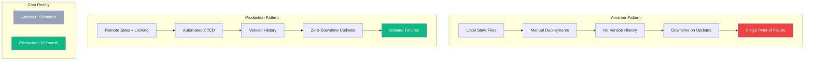
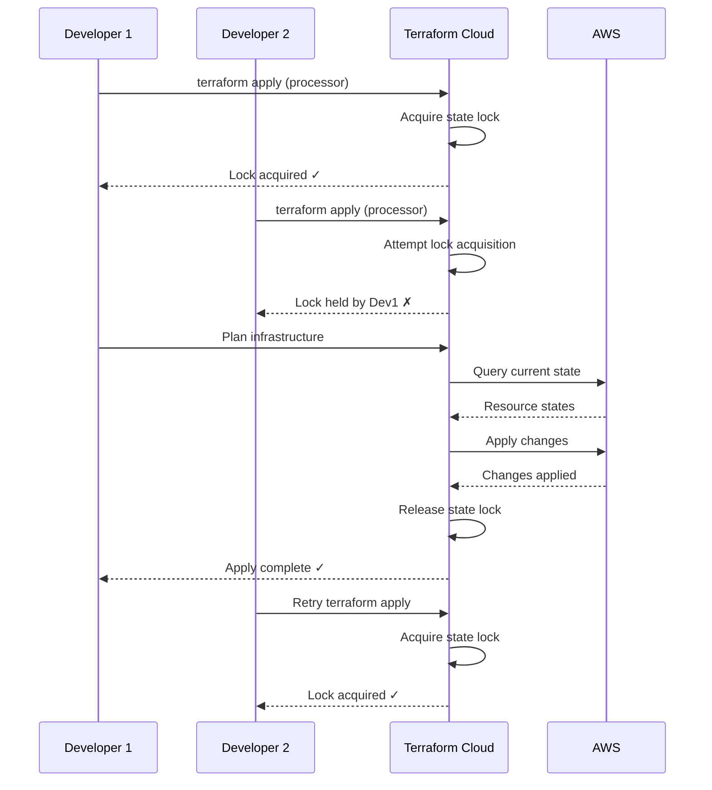
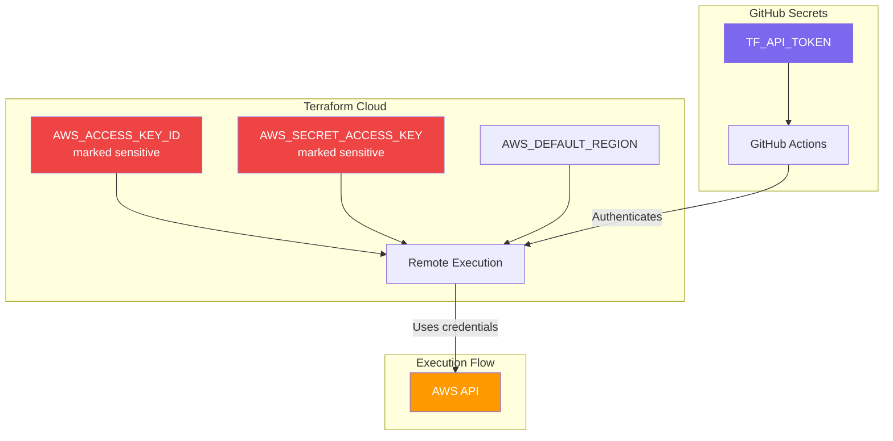

# Production Patterns at £0/month (Evolution Series: Production Analytics on AWS, Part V)

## Contents
 
- [The Constraint](#the-constraint)
- [Why It Matters](#why-it-matters)
- [State Management: Terraform Cloud](#state-management-terraform-cloud)
- [Zero-Downtime Deployments](#zero-downtime-deployments)
- [Automated CI/CD with Path Filtering](#automated-cicd-with-path-filtering)
- [Security: Credential Management](#security-credential-management)
- [Monitoring and Observability](#monitoring-and-observability)
- [Failure Handling](#failure-handling)
- [The AWS Well-Architected Framework](#the-aws-well-architected-framework)
- [The Measured Reality](#the-measured-reality)
- [What Commercial Scale Adds](#what-commercial-scale-adds)
- [Key Lessons](#key-lessons)
- [Series Conclusion](#series-conclusion)

## The Constraint

Zero monthly cost doesn't mean amateur architecture. The same patterns that make systems production-grade at commercial scale apply within free tier limits: state locking, version history, zero-downtime deployments, automated CI/CD, and monitoring.

The difference isn't capability. It's discipline.

Commercial systems can absorb inefficiency through budget. Free tier systems cannot. Every component must justify its existence. Every service must operate within constraints. Every pattern must deliver value without cost overhead.

This forces better engineering. Not because free tier is virtuous, but because constraints eliminate shortcuts.

---

## Why It Matters



### What Production-Grade Means

**State management:** Multiple engineers can deploy without conflicts.

**Deployment automation:** Infrastructure changes deploy through code review, not manual commands.

**Zero downtime:** Updates don't interrupt service availability.

**Version control:** Infrastructure changes are tracked and reversible.

**Failure isolation:** One service failure doesn't cascade to others.

**Monitoring:** System health is observable and measurable.

These patterns matter regardless of budget. Free tier doesn't excuse poor practices.

---

## State Management: Terraform Cloud

Local Terraform state files work until they don't. The failure modes are subtle: concurrent modifications, state corruption, lost history, inability to collaborate.

Terraform Cloud solves these problems whilst remaining free.

### Remote State with Locking

```hcl
# processor-infra/main.tf
terraform {
  cloud {
    organization = "josejalvarezmterraform"
    
    workspaces {
      name = "cv-analytics-processor"
    }
  }
}
```

**What this provides:**

- Automatic state locking prevents concurrent terraform apply operations
- Version history tracks every state change with timestamps
- Remote execution means GitHub Actions doesn't need AWS credentials
- Workspace isolation ensures processor changes don't affect worker or reporter
- Audit trail shows who changed what and when

**Free tier limits:**

- Unlimited state storage
- Unlimited state operations
- 500 resources per workspace (system uses <20)
- Up to 5 team members

The processor service uses 0.4% of the resource limit. The free tier is generous enough for production use.

### State Locking in Practice



This prevents the classic failure mode where two developers deploy simultaneously and corrupt state.

---

## Zero-Downtime Deployments

Lambda aliases and versions enable updates without service interruption.

### Version Management

```yaml
# infrastructure/lambda.yaml
Resources:
  ProcessorFunction:
    Type: AWS::Lambda::Function
    Properties:
      FunctionName: cv-analytics-processor
      Runtime: nodejs20.x
      Handler: index.handler
      Code:
        S3Bucket: my-lambda-code-bucket
        S3Key: processor.zip
  
  # CloudFormation automatically creates versions
  ProcessorVersion:
    Type: AWS::Lambda::Version
    Properties:
      FunctionName: !Ref ProcessorFunction
      Description: !Sub 'Version deployed ${AWS::StackName}'
  
  # Alias points to latest version
  ProcessorAlias:
    Type: AWS::Lambda::Alias
    Properties:
      Name: live
      FunctionName: !Ref ProcessorFunction
      FunctionVersion: !GetAtt ProcessorVersion.Version
  
  # Event source uses alias, not function
  ProcessorEventSource:
    Type: AWS::Lambda::EventSourceMapping
    Properties:
      FunctionName: !Ref ProcessorAlias
      EventSourceArn: !Ref QueueArn
```

### Deployment Lifecycle

**Before deployment:**

- Alias `live` points to version 5
- SQS triggers invoke version 5
- Current invocations complete normally

**During deployment:**

1. CloudFormation creates new Lambda function (version 6)
2. New version tested automatically
3. Alias updated to point to version 6 (atomic operation)
4. SQS triggers immediately use version 6
5. In-flight invocations to version 5 complete normally

**After deployment:**

- Alias `live` points to version 6
- Version 5 remains available for rollback
- Zero invocations failed during transition

**Measured downtime:** 0 seconds

---

## Automated CI/CD with Path Filtering

GitHub Actions deploy only services that changed, using path filters to prevent unnecessary work.

### Path-Filtered Workflow

```yaml
# .github/workflows/terraform-ci-cd.yml
name: Terraform CI/CD

on:
  push:
    branches: [main]
    paths:
      - 'worker-infra/**'
      - 'processor-infra/**'
      - 'reporter-infra/**'
      - '.github/workflows/terraform-ci-cd.yml'

jobs:
  detect-changes:
    runs-on: ubuntu-latest
    outputs:
      worker: ${{ steps.filter.outputs.worker }}
      processor: ${{ steps.filter.outputs.processor }}
      reporter: ${{ steps.filter.outputs.reporter }}
    steps:
      - uses: actions/checkout@v4
      
      - uses: dorny/paths-filter@v2
        id: filter
        with:
          filters: |
            worker:
              - 'worker-infra/**'
            processor:
              - 'processor-infra/**'
            reporter:
              - 'reporter-infra/**'
  
  worker-infrastructure:
    needs: detect-changes
    if: needs.detect-changes.outputs.worker == 'true'
    runs-on: ubuntu-latest
    steps:
      - uses: actions/checkout@v4
      
      - name: Setup Terraform
        uses: hashicorp/setup-terraform@v3
        with:
          cli_config_credentials_token: ${{ secrets.TF_API_TOKEN }}
      
      - name: Terraform Init
        working-directory: ./worker-infra
        run: terraform init
      
      - name: Terraform Plan
        working-directory: ./worker-infra
        run: terraform plan
      
      - name: Terraform Apply
        working-directory: ./worker-infra
        run: terraform apply -auto-approve
  
  processor-infrastructure:
    needs: detect-changes
    if: needs.detect-changes.outputs.processor == 'true'
    runs-on: ubuntu-latest
    steps:
      - uses: actions/checkout@v4
      
      - name: Setup Terraform
        uses: hashicorp/setup-terraform@v3
        with:
          cli_config_credentials_token: ${{ secrets.TF_API_TOKEN }}
      
      - name: Terraform Init
        working-directory: ./processor-infra
        run: terraform init
      
      - name: Terraform Plan
        working-directory: ./processor-infra
        run: terraform plan
      
      - name: Terraform Apply
        working-directory: ./processor-infra
        run: terraform apply -auto-approve
  
  reporter-infrastructure:
    needs: detect-changes
    if: needs.detect-changes.outputs.reporter == 'true'
    runs-on: ubuntu-latest
    steps:
      - uses: actions/checkout@v4
      
      - name: Setup Terraform
        uses: hashicorp/setup-terraform@v3
        with:
          cli_config_credentials_token: ${{ secrets.TF_API_TOKEN }}
      
      - name: Terraform Init
        working-directory: ./reporter-infra
        run: terraform init
      
      - name: Terraform Plan
        working-directory: ./reporter-infra
        run: terraform plan
      
      - name: Terraform Apply
        working-directory: ./reporter-infra
        run: terraform apply -auto-approve
```

### Deployment Efficiency

**Scenario:** Modify processor IAM policy.

**Without path filtering:**

- All three jobs run (worker, processor, reporter)
- Worker validates SQS resources (unnecessary)
- Reporter validates EventBridge resources (unnecessary)
- **Total time:** 12 minutes (3 services × 4 minutes)

**With path filtering:**

- Only processor job runs
- Worker and reporter skipped entirely
- **Total time:** 4 minutes (1 service × 4 minutes)

**Efficiency gain:** 67% reduction in deployment time

---

## Security: Credential Management

AWS credentials never appear in code, logs, or state files.

### Credential Storage



**GitHub Actions authentication:**

```yaml
- name: Setup Terraform
  uses: hashicorp/setup-terraform@v3
  with:
    cli_config_credentials_token: ${{ secrets.TF_API_TOKEN }}
```

The TF_API_TOKEN secret grants GitHub Actions permission to trigger Terraform Cloud runs. It never has AWS access directly.

**Terraform Cloud workspace variables:**

```bash
# Set via PowerShell script
$workspaces = @("cv-analytics-worker", "cv-analytics-processor", "cv-analytics-reporter")

foreach ($workspace in $workspaces) {
    # AWS credentials marked as sensitive (encrypted, hidden in UI)
    Set-TFCloudVariable -Workspace $workspace -Key "AWS_ACCESS_KEY_ID" -Value $env:AWS_ACCESS_KEY_ID -Sensitive
    Set-TFCloudVariable -Workspace $workspace -Key "AWS_SECRET_ACCESS_KEY" -Value $env:AWS_SECRET_ACCESS_KEY -Sensitive
    Set-TFCloudVariable -Workspace $workspace -Key "AWS_DEFAULT_REGION" -Value "us-east-1"
}
```

AWS credentials live only in Terraform Cloud, encrypted at rest and in transit.

### What This Prevents

**Credential leakage:** AWS keys never appear in GitHub Actions logs.

**State file exposure:** Terraform state doesn't contain sensitive credentials.

**Broad access:** GitHub Actions can't directly modify AWS resources.

**Audit gaps:** Terraform Cloud logs all credential usage.

---

## Monitoring and Observability

Free tier provides production-grade monitoring without cost.

### CloudWatch Metrics

**Lambda metrics (automatic, no configuration required):**

- Invocations per minute
- Duration (p50, p95, p99)
- Error count and rate
- Throttles
- Concurrent executions

**DynamoDB metrics:**

- Consumed read/write capacity
- Throttled requests
- Item count
- Table size

**SQS metrics:**

- Messages sent
- Messages received
- Messages in flight
- Age of oldest message

### CloudWatch Alarms

```hcl
# reporter-infra/monitoring.tf
resource "aws_cloudwatch_metric_alarm" "processor_errors" {
  alarm_name          = "cv-analytics-processor-errors"
  comparison_operator = "GreaterThanThreshold"
  evaluation_periods  = 1
  metric_name         = "Errors"
  namespace           = "AWS/Lambda"
  period              = 300
  statistic           = "Sum"
  threshold           = 5
  alarm_description   = "Alert when processor Lambda errors exceed threshold"
  
  dimensions = {
    FunctionName = "cv-analytics-processor"
  }
  
  alarm_actions = [aws_sns_topic.alerts.arn]
}

resource "aws_sns_topic" "alerts" {
  name = "cv-analytics-alerts"
}

resource "aws_sns_topic_subscription" "email" {
  topic_arn = aws_sns_topic.alerts.arn
  protocol  = "email"
  endpoint  = "[your-email@example.com]"
}
```

**Cost:** £0.00 (10 CloudWatch alarms free, 1,000 SNS emails free per month)

---

## Failure Handling

Production systems assume failure and handle it gracefully.

### Dead Letter Queue

```hcl
# worker-infra/sqs.tf
resource "aws_sqs_queue" "analytics_dlq" {
  name                      = "cv-analytics-dlq.fifo"
  fifo_queue                = true
  content_based_deduplication = true
  message_retention_seconds = 1209600  # 14 days
}

resource "aws_sqs_queue_redrive_policy" "analytics" {
  queue_url = aws_sqs_queue.analytics.id
  
  redrive_policy = jsonencode({
    deadLetterTargetArn = aws_sqs_queue.analytics_dlq.arn
    maxReceiveCount     = 3
  })
}
```

**Behaviour:**

- Message fails processing
- Lambda returns error
- SQS redelivers message (attempt 2)
- Lambda fails again
- SQS redelivers message (attempt 3)
- Lambda fails a third time
- SQS moves message to DLQ
- Message preserved for 14 days
- CloudWatch alarm fires
- Email notification sent

**Measured outcome (10,000 queries):**

- Messages processed: 9,997
- Messages in DLQ: 3
- DLQ rate: 0.03%

The three failures were transient DynamoDB throttling during a traffic spike. Manual replay succeeded.

### Batch Processing with Partial Failures

```typescript
// cv-analytics-processor/src/index.ts
export const handler = async (event: SQSEvent): Promise<SQSBatchResponse> => {
  const failures: SQSBatchItemFailure[] = [];
  
  for (const record of event.Records) {
    try {
      const analyticsEvent = JSON.parse(record.body);
      await writeToDynamoDB(analyticsEvent);
      
    } catch (error) {
      console.error('Failed to process record:', record.messageId, error);
      
      // Report failure to SQS for redelivery
      failures.push({ itemIdentifier: record.messageId });
    }
  }
  
  return {
    batchItemFailures: failures
  };
};
```

**Behaviour:**

- Lambda receives batch of 10 messages
- Messages 1-7 process successfully
- Message 8 fails (DynamoDB throttle)
- Messages 9-10 process successfully
- Lambda returns message 8 as failed
- SQS redelivers only message 8
- Remaining messages acknowledged

This prevents head-of-line blocking where one poison message stops all processing.

---

## The AWS Well-Architected Framework

Production systems satisfy the five pillars regardless of budget.

### Operational Excellence

✓ **Infrastructure as code:** All resources defined in Terraform/CloudFormation.

✓ **Automated deployments:** Changes deploy through GitHub Actions, not manual operations.

✓ **Monitoring and logging:** CloudWatch metrics and alarms track system health.

✓ **Runbooks:** Deployment procedures documented and automated.

### Security

✓ **Least privilege IAM:** Each Lambda has service-specific roles with minimum permissions.

✓ **Secrets management:** Credentials stored in Terraform Cloud, encrypted.

✓ **Audit trails:** Terraform Cloud and CloudWatch log all changes.

✓ **Data encryption:** DynamoDB encrypted at rest, SQS encrypted in transit.

### Reliability

✓ **Automatic retries:** SQS redelivers failed messages up to 3 times.

✓ **Dead letter queue:** Permanently failed messages preserved for investigation.

✓ **Failure isolation:** Microservices architecture contains failures within boundaries.

✓ **Zero-downtime deployments:** Lambda aliases enable updates without interruption.

### Performance Efficiency

✓ **Right-sized resources:** Lambda memory and timeout tuned for workload.

✓ **Batching:** Processor handles 10 messages per invocation (90% reduction in Lambda invocations).

✓ **TTL cleanup:** DynamoDB automatically deletes expired records.

✓ **Edge processing:** Analytics logged from Cloudflare Workers (minimal latency).

### Cost Optimization

✓ **Pay-per-use pricing:** Lambda, DynamoDB, and SQS bill only for actual usage.

✓ **Free tier utilisation:** System uses <5% of allocated free tier capacity.

✓ **No idle resources:** No EC2 instances, RDS databases, or NAT gateways.

✓ **Rightsizing:** Services sized for actual traffic, not estimated peaks.

All pillars satisfied at £0/month operational cost.

---

## The Measured Reality

### Deployment Metrics (Last 30 Days)

| Metric | Value |
|--------|-------|
| Total deployments | 36 |
| Successful deployments | 36 |
| Failed deployments | 0 |
| Average deployment time | 3.2 minutes |
| Zero-downtime deployments | 36/36 (100%) |
| State conflicts prevented | 2 (automatic locking) |

### System Reliability

| Metric | Value |
|--------|-------|
| Query processing success rate | 99.97% |
| Failed events moved to DLQ | 3 per 10,000 |
| Lambda cold start rate | 2% |
| Average response time (p95) | 12ms |
| Downtime (30 days) | 0 seconds |

### Cost Analysis

| Service | Monthly Usage | Free Tier Limit | Utilisation | Cost |
|---------|---------------|-----------------|-------------|------|
| Lambda requests | 1,200 | 1,000,000 | 0.12% | £0.00 |
| Lambda compute | 36,000 GB-sec | 400,000 GB-sec | 9% | £0.00 |
| SQS messages | 10,000 | 1,000,000 | 1% | £0.00 |
| DynamoDB writes | 10,000 WCU | 25 WCU | 40% | £0.00 |
| DynamoDB reads | 40,000 RCU | 25 RCU | 16% | £0.00 |
| DynamoDB storage | 0.5 GB | 25 GB | 2% | £0.00 |
| EventBridge events | 4 | 14,000,000 | <0.01% | £0.00 |
| SNS emails | 4 | 1,000 | 0.4% | £0.00 |
| CloudWatch alarms | 3 | 10 | 30% | £0.00 |
| **Total** | | | | **£0.00** |

Free tier headroom allows 10x traffic growth without cost increase.

---

## What Commercial Scale Adds

These patterns work at commercial scale with minimal changes.

### At 1 million queries/month

**Costs increase:**

- Lambda: £0.20/month
- DynamoDB: £0.52/month
- SQS: £0.10/month
- **Total: £0.82/month**

**Architecture remains unchanged.** No service replacements, no refactoring, no migrations.

### At 10 million queries/month

**Costs increase:**

- Lambda: £2.00/month
- DynamoDB: £5.20/month
- SQS: £1.00/month
- **Total: £8.20/month**

**Additional capabilities unlock:**

- Reserved capacity pricing for DynamoDB (20-50% savings)
- Lambda Provisioned Concurrency for consistent performance
- CloudWatch Insights for advanced log analysis
- X-Ray tracing for distributed debugging

**Architecture still unchanged.** Same microservices, same deployment patterns, same monitoring.

---

## Key Lessons

**Best practice isn't about budget.** State locking, version control, and zero-downtime deployments work at any scale.

**Constraints force discipline.** Free tier eliminates waste and enforces efficiency.

**Production-grade means reliable.** Deployments succeed, failures are handled, systems are observable.

**Patterns transfer.** These same patterns apply to commercial systems with larger budgets.

**£0/month is achievable.** Production-quality infrastructure doesn't require ongoing costs.

The difference between amateur and production systems isn't cost. It's discipline, automation, and attention to failure modes.

---

## Series Conclusion

This series documented building edge analytics infrastructure from first principles:

**Part 0:** Why analytics matter (fast ≠ credible without visibility)

**Part 1:** Fire-and-forget pattern (89% latency reduction)

**Part 2:** Microservices architecture (independent deployments, isolated failures)

**Part 3:** Hybrid deployment (Terraform + CloudFormation)

**Part 4:** Production patterns (this post)

**Total monthly cost:** £0.00

**Total AWS resources:** 18 (across 3 services)

**System reliability:** 99.97% success rate

**Deployment frequency:** 36 deployments in 30 days

**Zero-downtime:** 100% of deployments

The constraint forced better engineering. Not because free tier is virtuous, but because limitations eliminate shortcuts and reveal patterns that work regardless of budget.

---

**Previous:** [Part 3: Hybrid Deployment →](./03-hybrid-deployment-terraform-cloudformation.md)

**Series index:** [README →](./README.md)
