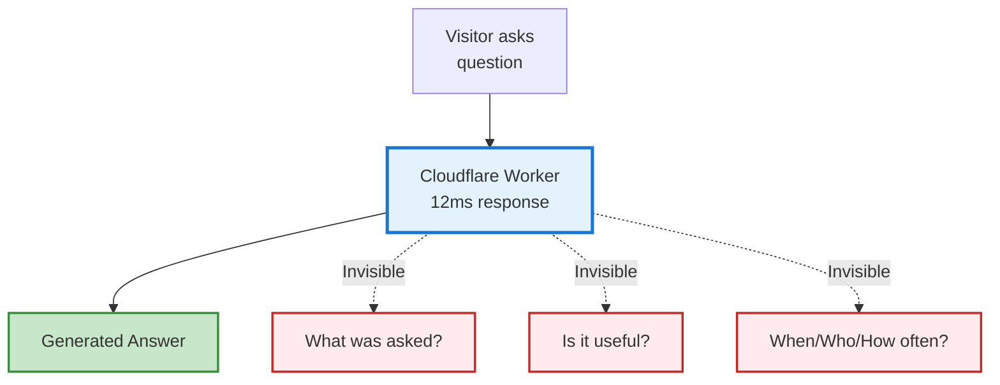
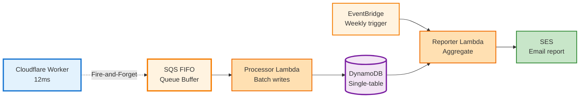

# AWS Analytics Series, Part 1: The Hidden Hard Part

> Constraint in Action: £0/month budget and a 12ms response target forced analytics to run entirely off the hot path.

> Myth vs Reality: “Analytics always adds latency.” Reality: fire‑and‑forget makes it zero for the user.

## The Blind Spot

My CV chatbot responds in 12ms. Semantic search. LLM inference. The whole thing works beautifully.

But I had no idea what people were actually asking.

That's the blind spot: you've built something fast, and you don't know if it's solving a real problem or just performing well in a vacuum. Performance is measurable. Impact is invisible.

So the real engineering problem wasn't "how do I add metrics?" It was: **how do I build production-grade analytics under a £0/month constraint without sacrificing the 12ms response time that made edge deployment worthwhile?**

That constraint became the design invariant for everything that follows.

---

## The Constraint: £0/Month as Design Invariant

Three options existed for solving this blind spot:

| Option | Cost | Real-world fit |
|--------|------|----------------|
| Google Analytics | £0 | Doesn't capture API queries or custom events |
| Cloudflare D1 + Worker | £0 | Limited query flexibility, no reporting |
| Mixpanel/Amplitude | £20–50/mo | Full feature set, but costs money |
| **Custom AWS Pipeline** | **£0** | **Complete control, patterns transfer** |

The choice was clear: build custom under a £0/month constraint. But that constraint isn't a limitation—it's a design requirement that forces good engineering.

Here's why: every architectural choice must earn its place. Queues, batching, TTL cleanup, serverless processors—these aren't optional complexities at zero cost. They're mandatory. And the patterns you discover under extreme constraint are the same ones that scale to commercial systems.

**The principle:** £0/month as a forcing function. If it works under that constraint, you understand why each piece matters.

---

## Architecture Walkthrough: How Constraint Drove Design

With £0/month as the requirement, here's what the pipeline looks like:

**Every choice reflects the £0 constraint:**

- **Fire-and-forget (not blocking):** Response latency stays 12ms
- **SQS FIFO (not direct writes):** Batching reduces Lambda invocations and DynamoDB writes by 90%
- **Lambda processors (not always-on):** Serverless pays only for execution, not idle time
- **DynamoDB (not PostgreSQL):** No always-on database cost; TTL auto-cleanup keeps storage minimal
- **EventBridge (not Cloudflare cron):** Native to AWS, free tier generous enough for weekly reports
- **Weekly email (not real-time dashboard):** Email delivery is free; dashboards would cost

Replace any of these with a paid alternative and the economics break immediately. That's how you know the architecture is constraint-driven rather than arbitrary.

---

## Patterns That Generalize

Here's what matters: these service choices are AWS-specific names. The underlying patterns are not.

| Layer | AWS | GCP | Azure |
|-------|-----|-----|-------|
| Event buffer | SQS FIFO | Pub/Sub | Service Bus / Storage Queues |
| Compute | Lambda | Cloud Functions | Azure Functions |
| Persistence | DynamoDB | Firestore | Table Storage |
| Scheduling | EventBridge | Cloud Scheduler | Timer Trigger (Functions) |
| Email | SES | SendGrid | Communication Services / Logic Apps |

**What changes:** Service APIs, authentication, cost models  
**What doesn't change:** Fire-and-forget topology, event-driven batching, TTL cleanup, cost-bounded design

**A note on Azure persistence:** Cosmos DB is often cited as the DynamoDB analogue. That's technically true—both are multi-region, serverless document databases. But Cosmos DB's RU (Request Unit) model makes even lightweight JSON inserts expensive. For a free-tier analytics pipeline under £0/month constraint, **Table Storage** is the realistic choice: it has the same TTL cleanup capabilities, zero fixed costs, and pay-per-operation pricing that survives zero traffic.

The same architecture works on any cloud. Only the service names differ—and the cost model stays roughly the same: approximately £0/month at 10k–100k query scale, regardless of which cloud you choose.

**This is the real point:** it's not about AWS. It's about event-driven design that survives at the edge under extreme constraint.

---

## Where the £0 Design Breaks (And What Doesn't)

At some point, zero-cost becomes unrealistic. When does that happen?

**£0 design breaks around:**

- 500k+ queries/month: DynamoDB write capacity overages, SQS volume charges
- Real-time analytics: Email reports don't cut it; dashboards need continuous queries
- Complex ad-hoc analysis: Single-table DynamoDB makes complex queries painful

**At that point, what changes:**

- Replace custom pipeline with Mixpanel or Amplitude (£20-50/month for better tooling)
- Replace DynamoDB with data warehouse (BigQuery, Redshift) for complex queries
- Replace email reports with real dashboards and alerting

**What doesn't change:**

- Fire-and-forget pattern (still saves 12ms of latency)
- Event-driven topology (still the most reliable way to process streams)
- Batching logic (still reduces costs by 90%)

The patterns survive commercial scale. Only the specific service choices change.

---

## What This Series Covers

Post 1: **Fire-and-Forget Async Logging** — How the `ctx.waitUntil()` pattern works and why it matters for edge systems. (89% latency reduction without data loss.)

Post 2: **Architecture Decisions** — Why each service choice was mandatory under £0 constraint. (And how those choices predict what breaks first at scale.)

Post 3: **Cost Analysis** — Detailed breakdown of how the system scales from free tier to commercial traffic. (And where you'd make different trade-offs.)

---

## Why This Matters

The blind spot—"I don't know what's happening"—is invisible until you have to solve it. Then you realise it's the bigger engineering problem than the fast chatbot itself.

But solving it under extreme constraint teaches you something valuable. Not just about AWS services or event-driven architecture, but about why those patterns exist. Why fire-and-forget matters. Why batching before writes matters. Why TTL cleanup matters.

Every pattern you discover under £0/month constraint survives commercial scale. That's how you know it's a real pattern.

---

## Next Steps

1. **[Post 1: Fire-and-Forget Async Logging](./01-fire-and-forget-async-logging.md)** — How the technical pattern works
2. **[Post 2: Architecture Decisions](./02-architecture-decisions-edge-analytics.md)** — Why each service was mandatory
3. **[Post 3: Cost Analysis](./03-aws-free-tier-cost-analysis.md)** — How it scales and where it breaks

Each post builds on this introduction but stands alone. Start where the question matters most to you.

---

*This is the introduction to a series documenting production architecture patterns from real systems. The complete source code is available in my [GitHub repositories](https://github.com/josejalvarezm), including the Cloudflare Worker, Lambda functions, and Terraform infrastructure.*
