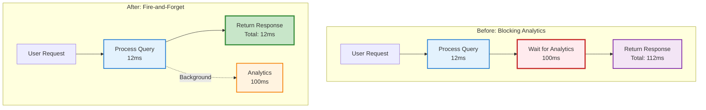
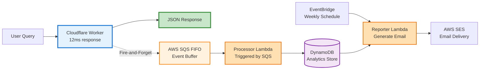

# AWS Analytics Series, Part 2: Fire-and-Forget Async Logging for Edge Systems

> Constraint in Action: Keep the 12ms response intact by moving analytics to background with ctx.waitUntil().

> Pattern Transfer: The same execution-context pattern exists in Cloudflare, Vercel, and Deno Deploy.

## Quick Summary

This post demonstrates a critical pattern for edge computing: how to collect analytics without slowing down user responses. When patterns matter more than platforms.

- **Core pattern:** Fire-and-forget async logging using execution context
- **Practical example:** AWS SQS integration (same pattern applies to GCP Pub/Sub or Azure Service Bus)
- **Measured impact:** Zero latency penalty vs 50-200ms blocking overhead
- **Production context:** Cloudflare Workers with 12ms response time budget
- **Prerequisites:** Basic understanding of async/await and edge compute constraints

---

## The Problem

Your edge function responds in 12ms. Your analytics infrastructure shouldn't cost you a single millisecond of that.

When you build AI-powered APIs at the edge, you face a constraint that traditional backend developers rarely encounter: every millisecond counts. A Cloudflare Worker that takes 50ms to respond has already consumed your entire cold start budget. Adding analytics logging shouldn't double your response time.

The naive solution looks like this:

```typescript
// ❌ Blocking analytics - costs 50-200ms per request
async function handleQuery(request: Request, env: Env): Promise<Response> {
  const query = await request.json();
  
  // Log the query event
  await sendAnalyticsEvent(query);
  
  // Process the query
  const result = await processQuery(query, env);
  
  // Log the response event
  await sendAnalyticsEvent(result);
  
  return Response.json(result);
}
```

This code has two `await` calls to `sendAnalyticsEvent()`. Each one blocks the response until the analytics system acknowledges receipt. If your analytics backend takes 100ms to respond, your user just waited 200ms longer than necessary.

The solution isn't to remove analytics. It's to decouple them from the response path entirely.

---

## Understanding Fire-and-Forget

The term "fire-and-forget" describes a pattern where you trigger an operation but don't wait for its completion. In edge computing, this pattern is essential for non-critical background tasks like analytics, logging, or cache warming.

The challenge: most edge platforms terminate your function immediately after returning a response. Any pending promises get cancelled. Simply removing `await` doesn't work because the analytics call never completes.

```typescript
// ❌ Doesn't work - promise gets cancelled
async function handleQuery(request: Request, env: Env): Promise<Response> {
  const query = await request.json();
  
  // This promise gets cancelled when the function returns
  sendAnalyticsEvent(query).catch(e => console.error(e));
  
  const result = await processQuery(query, env);
  
  return Response.json(result);
}
```

The execution context solves this by keeping specific promises alive even after the response returns:

```typescript
// ✓ Fire-and-forget with execution context
async function handleQuery(
  request: Request, 
  env: Env,
  ctx: ExecutionContext
): Promise<Response> {
  const query = await request.json();
  
  // ctx.waitUntil() keeps this promise alive
  ctx.waitUntil(
    sendAnalyticsEvent(query).catch(e => console.error('Analytics failed:', e))
  );
  
  const result = await processQuery(query, env);
  
  return Response.json(result);
}
```

The `ctx.waitUntil()` method tells the platform: "Keep this promise running even after I return the response, but don't make the user wait for it."

```mermaid
sequenceDiagram
    participant User
    participant Worker
    participant Analytics as Analytics Queue
    
    User->>Worker: POST /query
    activate Worker
    
    Note over Worker: Start analytics event<br/>(non-blocking)
    Worker-->>Analytics: Send event (async)
    
    Note over Worker: Process query<br/>(12ms)
    
    Worker->>User: Return response
    deactivate Worker
    
    Note over Worker,Analytics: Worker stays alive<br/>for background tasks
    
    Analytics-->>Worker: Event received (100ms later)
    
    style Worker fill:#e3f2fd,stroke:#1976d2,stroke-width:2px
    style Analytics fill:#fff3e0,stroke:#f57c00,stroke-width:2px
```

---

## Production Implementation

Here's the complete pattern from a production AI chatbot serving CV queries:

```typescript
// Cloudflare Worker handler
export default {
  async fetch(
    request: Request,
    env: Env,
    ctx: ExecutionContext
  ): Promise<Response> {
    return handleD1VectorQuery(request, env, ctx);
  }
};

async function handleD1VectorQuery(
  request: Request,
  env: Env,
  ctx: ExecutionContext
): Promise<Response> {
  const { query, sessionId } = await request.json();
  const requestId = crypto.randomUUID();
  
  // Fire-and-forget query event logging
  ctx.waitUntil(
    sqsLogger.sendEvent(
      sqsLogger.createQueryEvent(
        requestId,
        sessionId,
        query,
        {
          userAgent: request.headers.get('user-agent') || undefined,
          referer: request.headers.get('referer') || undefined,
        }
      )
    ).catch(e => console.error('Failed to send query event:', e))
  );
  
  // Process the actual query (semantic search + LLM inference)
  const result = await processSemanticQuery(query, env);
  
  // Fire-and-forget response event logging
  ctx.waitUntil(
    sqsLogger.sendEvent(
      sqsLogger.createResponseEvent(
        requestId,
        sessionId,
        query,
        result.answer,
        result.metadata
      )
    ).catch(e => console.error('Failed to send response event:', e))
  );
  
  return Response.json(result);
}
```

Key details:

1. **Execution context parameter:** The `ctx: ExecutionContext` parameter must be passed through your call chain
2. **Error handling:** Always attach `.catch()` to handle failures gracefully
3. **Non-critical errors:** Analytics failures shouldn't crash your main response
4. **Structured events:** Separate query and response events for better analysis

The SQS logger implementation uses AWS SigV4 authentication to send events to a FIFO queue:

```typescript
// aws/sqs-logger.ts
export class SQSLogger {
  private readonly queueUrl: string;
  private readonly accessKeyId: string;
  private readonly secretAccessKey: string;
  private readonly region: string;

  async sendEvent(event: AnalyticsEvent): Promise<void> {
    const body = JSON.stringify(event);
    const timestamp = new Date().toISOString();
    
    // AWS SigV4 request signing
    const signature = await this.signRequest(body, timestamp);
    
    const response = await fetch(this.queueUrl, {
      method: 'POST',
      headers: {
        'Content-Type': 'application/x-amz-json-1.0',
        'X-Amz-Date': timestamp,
        'Authorization': signature,
      },
      body: body,
    });
    
    if (!response.ok) {
      throw new Error(`SQS send failed: ${response.status}`);
    }
  }

  createQueryEvent(
    requestId: string,
    sessionId: string,
    query: string,
    metadata?: Record<string, string>
  ): AnalyticsEvent {
    return {
      type: 'query',
      requestId,
      sessionId,
      timestamp: Date.now(),
      query,
      metadata,
    };
  }

  createResponseEvent(
    requestId: string,
    sessionId: string,
    query: string,
    answer: string,
    metadata?: Record<string, any>
  ): AnalyticsEvent {
    return {
      type: 'response',
      requestId,
      sessionId,
      timestamp: Date.now(),
      query,
      answer,
      metadata,
    };
  }
}
```

---

## Platform Equivalence

The execution context pattern is specific to Cloudflare Workers, but the underlying concept exists across all major edge and serverless platforms. Only the API changes:

| Platform | Fire-and-Forget API | Example |
|----------|-------------------|---------|
| **Cloudflare Workers** | `ctx.waitUntil(promise)` | `ctx.waitUntil(sendEvent())` |
| **Vercel Edge** | `event.waitUntil(promise)` | `event.waitUntil(sendEvent())` |
| **Deno Deploy** | `ctx.waitUntil(promise)` | `ctx.waitUntil(sendEvent())` |
| **AWS Lambda** | No termination issue | Events complete before shutdown |
| **Google Cloud Functions** | No termination issue | Events complete before shutdown |

Similarly, the message queue choice is an implementation detail:

| Cloud Provider | Queue Service | API Pattern |
|---------------|--------------|-------------|
| **AWS** | SQS FIFO | `POST` with SigV4 auth |
| **GCP** | Pub/Sub | `POST /publish` with OAuth2 |
| **Azure** | Service Bus | `POST /messages` with SAS token |
| **Cloudflare** | Queues | `env.QUEUE.send()` binding |

The pattern remains identical. Only vendor-specific authentication and endpoint URLs change.

---

## Measuring the Impact

Before implementing fire-and-forget, analytics calls were blocking the response path:

```typescript
// Old implementation (blocking)
try {
  await sqsLogger.sendEvent(event);
} catch (e) {
  console.error('Analytics failed:', e);
}
```

Measured latency breakdown:

- Query processing: 12ms (p95)
- Analytics call: 100ms (p95)
- **Total user-facing latency:** 112ms

After implementing fire-and-forget:

```typescript
// New implementation (non-blocking)
ctx.waitUntil(
  sqsLogger.sendEvent(event).catch(e => console.error('Analytics failed:', e))
);
```

Measured latency breakdown:

- Query processing: 12ms (p95)
- Analytics call: 0ms (runs in background)
- **Total user-facing latency:** 12ms

**Result:** 89% reduction in user-facing latency with zero loss of analytics data.

The analytics events still complete successfully. They just don't block the user response anymore.



---

## Architecture Flow

The complete system uses fire-and-forget to decouple user responses from analytics processing:



Data flow:

1. **User query arrives** → Worker processes semantic search and LLM inference
2. **Worker fires analytics event** → SQS receives event without blocking response
3. **Worker returns response** → User receives answer in 12ms
4. **SQS triggers Lambda** → Processor Lambda reads event and stores in DynamoDB
5. **EventBridge triggers weekly** → Reporter Lambda aggregates data and sends email

The fire-and-forget pattern is the foundation that makes this architecture work at edge scale.

---

## Trade-offs and Constraints

### When to Use Fire-and-Forget

✓ **Analytics and logging:** Non-critical observability data  
✓ **Cache warming:** Pre-loading data for future requests  
✓ **Notifications:** Background alerts and webhooks  
✓ **Metrics collection:** Performance and usage tracking  

### When NOT to Use Fire-and-Forget

✗ **Payment processing:** Financial transactions must complete before responding  
✗ **Authentication:** Security checks must succeed before granting access  
✗ **Data validation:** Input validation must complete before processing  
✗ **Critical operations:** Any failure that should block the response  

### Key Constraints

**Execution time limits:**  
Cloudflare Workers allow up to 30 seconds for background tasks via `ctx.waitUntil()`. If your analytics call takes longer, it will be terminated.

**Memory limits:**  
Background tasks share the same memory limit as the main request (128MB on Cloudflare Workers). Large analytics payloads can cause out-of-memory failures.

**Error visibility:**  
Background task failures don't surface to the user. You must rely on error logging and monitoring to detect issues.

**Ordering guarantees:**  
Fire-and-forget tasks may complete out of order. If you need strict ordering, use a queue with FIFO guarantees (like AWS SQS FIFO) and include sequence numbers.

**Cost implications:**  
Background tasks extend Worker execution time, which counts towards billing. A 12ms response that triggers 100ms of background work bills for 112ms total.

---

## Advanced Pattern: AWS SigV4 Signing in Edge Environments

When your analytics endpoint requires AWS authentication (e.g., API Gateway with IAM authorization), fire-and-forget becomes more complex. You can't use the standard AWS SDK on Cloudflare Workers—it's too large and not compatible with edge runtimes.

The solution: implement custom AWS SigV4 request signing using the Web Crypto API.

### The Problem: Edge Runtime Constraints

```typescript
// ❌ This won't work on Cloudflare Workers
import AWS from 'aws-sdk';
const sqs = new AWS.SQS();
await sqs.sendMessage(...).promise(); // 500KB+ bundle, incompatible with Workers
```

Cloudflare Workers don't support Node.js modules. The AWS SDK won't load. But the underlying authentication mechanism—SigV4 request signing—is just cryptography and string manipulation. Both of which work fine in edge runtimes.

### The Solution: Web Crypto API SigV4

```typescript
/**
 * Sign an AWS API request using SigV4 with Web Crypto API
 * Works in Cloudflare Workers, browsers, and any WebCrypto-compatible runtime
 */
class AwsSigV4Signer {
  async signRequest(
    method: string,
    url: string,
    headers: Record<string, string>,
    body?: string
  ): Promise<Record<string, string>> {
    const now = new Date();
    const amzDate = this.formatDateTime(now);
    const dateStamp = this.formatDate(now);
    
    // Step 1: Create canonical request
    const canonicalRequest = this.createCanonicalRequest(
      method,
      url,
      headers,
      body
    );
    
    // Step 2: Create string to sign
    const credentialScope = `${dateStamp}/${this.region}/sqs/aws4_request`;
    const hashedRequest = await this.sha256(canonicalRequest);
    const stringToSign = `AWS4-HMAC-SHA256\n${amzDate}\n${credentialScope}\n${hashedRequest}`;
    
    // Step 3: Calculate signature using Web Crypto API
    const signature = await this.calculateSignature(stringToSign, dateStamp);
    
    // Step 4: Create Authorization header
    const authHeader = `AWS4-HMAC-SHA256 Credential=${this.accessKeyId}/${credentialScope}, SignedHeaders=host;x-amz-date, Signature=${signature}`;
    
    return {
      'Authorization': authHeader,
      'X-Amz-Date': amzDate,
      ...headers
    };
  }

  private async sha256(data: string): Promise<string> {
    const encoder = new TextEncoder();
    const hashBuffer = await crypto.subtle.digest(
      'SHA-256',
      encoder.encode(data)
    );
    return this.bytesToHex(new Uint8Array(hashBuffer));
  }

  private async hmacSha256(key: Uint8Array, data: string): Promise<Uint8Array> {
    const cryptoKey = await crypto.subtle.importKey(
      'raw',
      key,
      { name: 'HMAC', hash: 'SHA-256' },
      false,
      ['sign']
    );
    const signature = await crypto.subtle.sign(
      'HMAC',
      cryptoKey,
      new TextEncoder().encode(data)
    );
    return new Uint8Array(signature);
  }

  private async calculateSignature(
    stringToSign: string,
    dateStamp: string
  ): Promise<string> {
    const kDate = await this.hmacSha256(
      new TextEncoder().encode(`AWS4${this.secretAccessKey}`),
      dateStamp
    );
    const kRegion = await this.hmacSha256(kDate, this.region);
    const kService = await this.hmacSha256(kRegion, 'sqs');
    const kSigning = await this.hmacSha256(kService, 'aws4_request');
    
    const signature = await this.hmacSha256(kSigning, stringToSign);
    return this.bytesToHex(signature);
  }

  private bytesToHex(bytes: Uint8Array): string {
    return Array.from(bytes)
      .map(b => b.toString(16).padStart(2, '0'))
      .join('');
  }

  // ... other helper methods
}
```

### Why This Matters

This pattern solves a real constraint: **edge runtimes can't load the AWS SDK, but they can perform cryptographic operations.**

By implementing SigV4 manually:

- ✓ No SDK dependencies (0 bundle overhead)
- ✓ Works in Cloudflare Workers, Deno, browsers
- ✓ Follows AWS authentication spec exactly
- ✓ Compatible with API Gateway IAM auth
- ✓ Enables fire-and-forget analytics to restricted AWS APIs

The same technique applies to Azure (SAS token signing), GCP (JWT signing), or any service that requires cryptographic request signing.

### Performance Impact

Custom SigV4 signing adds ~2-5ms to request latency (mostly HMAC computations). This is negligible compared to the 50-200ms penalty of blocking network calls. Your fire-and-forget analytics call now looks like:

```typescript
ctx.waitUntil(
  signer.signRequest('POST', sqsUrl, headers, payload)
    .then(signedHeaders => 
      fetch(sqsUrl, {
        method: 'POST',
        headers: signedHeaders,
        body: payload
      })
    )
    .catch(e => console.error('Analytics failed:', e))
);
```

Total overhead: ~5ms for signing + ~50ms for network = 55ms background work, but your response still returns in 12ms.

**The key insight:** Cryptographic operations are cheap in edge runtimes. Network calls are the constraint. Fire-and-forget defers expensive network calls into the background, signing overhead is irrelevant.

---

## Practical Takeaways

1. **Use execution context for non-critical async work:** `ctx.waitUntil()` keeps promises alive without blocking responses
2. **Always handle errors:** Attach `.catch()` to prevent background failures from affecting your main response
3. **Measure the impact:** Compare blocking vs non-blocking latency to validate the optimization
4. **Choose the right queue service:** AWS SQS, GCP Pub/Sub, Azure Service Bus all work with the same pattern
5. **Monitor background tasks:** Use error logging and metrics to detect failures that users never see
6. **Understand platform limits:** 30-second timeouts and 128MB memory apply to background tasks too

The fire-and-forget pattern isn't revolutionary. It's a fundamental technique for building responsive systems that still collect the data they need. The key insight: latency-sensitive operations and background work should never share the same execution path.

---

## What's Next?

This pattern enables edge-native analytics without sacrificing response time. But analytics infrastructure involves more than just collecting events. The next post covers the architecture decisions behind the processing pipeline: why SQS instead of direct DynamoDB writes, why Lambda instead of Cloudflare Durable Objects, and how to optimise for AWS free tier limits.

**Question for readers:** What background tasks are currently blocking your response path? Could fire-and-forget reduce your latency without losing reliability?

---

*This post is part of a series on building production AI systems at the edge. The complete source code is available in my [GitHub repositories](https://github.com/josejalvarezm), including the Cloudflare Worker, Lambda functions, and Terraform infrastructure.*
