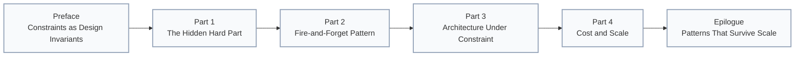

# AWS Analytics Series - Index

## Overview

This series documents complete engineering validation of an edge-native analytics architecture prototype. The system processes semantic queries about professional experience whilst collecting reliable analytics without impacting response latency.

**Core principle:** Architectural patterns are vendor-agnostic. The fire-and-forget pattern, queue-based processing, and single-table design work identically on AWS, GCP, and Azure. Service names change; architecture principles don't.

---

## Series Posts

### Preface: Constraints as Design Invariants

Short framing for the series: why £0/month and 12ms response time are design invariants, why AWS was selected, and how the patterns generalise to other clouds.

[Read Preface →](./00-preface-constraints-as-design-invariants.md)

---

### Part 1: The Hidden Hard Part

**The problem:** Fast systems don't guarantee credible systems. Performance is measurable. Impact is invisible.

**The hook:** "My CV chatbot responds in 12ms—but I had no idea what people were actually asking. That blind spot turned into a bigger engineering challenge than the chatbot itself."

**The constraint:** £0/month as a design invariant, not a limitation. This forces every architectural choice to earn its place.

**Key concepts:**

- The blind spot: performance without visibility
- Constraint-driven design: £0/month as a forcing function
- Architecture walkthrough: queue → processor → storage, every choice justified by cost
- Pattern generalisation: fire-and-forget, event-driven topology, batching logic work across AWS/GCP/Azure
- Where it breaks: recognising when £0 design becomes unrealistic and what patterns survive commercial scale

**Core narrative:** The £0/month constraint isn't a limitation—it's the design requirement that forces you to understand why each piece matters. Every pattern discovered under extreme constraint generalises to commercial systems.

**Audience:** Engineers who've built fast systems and now face the credibility problem. You understand what performance means. Now learn what makes systems trustworthy.

**Diagrams:**

- Visibility gaps (what can't you see?)
- Architecture walkthrough (every choice reflects the constraint)

**Key takeaway:** Constraints force patterns. Patterns survive scale. Design for the constraint, not the exception.

[Read Part 1 →](./00-why-build-analytics-for-portfolio-chatbot.md)

---

### Part 2: Fire-and-Forget Async Logging for Edge Systems

**Focus:** The technical pattern that makes edge analytics possible

**Key concepts:**

- Execution context (`ctx.waitUntil()`) for background promises
- Why removing `await` isn't enough
- Measured impact: 89% latency reduction (112ms → 12ms)
- Platform equivalence: Cloudflare, Vercel, Deno Deploy patterns
- Queue service comparison: AWS SQS, GCP Pub/Sub, Azure Service Bus

**Target audience:** Engineers building at edge compute platforms who need to collect analytics without blocking user responses

**Diagrams:**

- Fire-and-forget sequence diagram
- Blocking vs non-blocking latency comparison
- Complete architecture flow

**Practical takeaway:** `ctx.waitUntil()` keeps promises alive after response returns, enabling true fire-and-forget without data loss

[Read Part 2 →](./01-fire-and-forget-async-logging.md)

---

### Part 3: Architecture Under Constraint

**Focus:** Architecture decisions and trade-offs for edge analytics

**Key concepts:**

- Queue before database (SQS buffer vs direct DynamoDB writes)
- Lambda vs edge processing (AWS compute vs Cloudflare Durable Objects)
- DynamoDB vs alternatives (cost, latency, query patterns)
- EventBridge scheduling vs cross-cloud cron

**Core principle:** "When you've chosen a cloud provider for your data layer, use that provider's compute layer for processing"

**Target audience:** Engineers designing analytics systems who need to understand why specific services were chosen over simpler alternatives

**Diagrams:**

- Option comparisons (direct write vs queue buffer)
- Edge vs AWS processing
- Complete architecture with all services
- Weekly report trigger flow

**Practical takeaway:** Async processing complexity (SQS + Lambda) is worth the reliability benefits (retry logic, batching, error handling)

[Read Part 3 →](./02-architecture-decisions-edge-analytics.md)

---

### Part 4: Cost and Scale

**Focus:** Practical cost analysis from £0/month to commercial scale

**Key concepts:**

- Free tier utilisation (using <3% of allocation at 10k queries/month)
- DynamoDB pricing deep dive (WCU calculation, batching impact)
- Hidden costs (data transfer, CloudWatch Logs, avoided costs)
- Cost scaling: £0.00 at 10k queries → £0.05 at 100k queries → £0.82 at 1M queries

**Core insight:** Architecture scales cost-effectively from zero to commercial usage. Not designed to be free, but happens to fit within generous free tier limits.

**Target audience:** Engineers building portfolio or side projects who need production-quality infrastructure on personal budgets

**Diagrams:**

- Free tier headroom visualisation
- Cost vs traffic scaling graph
- Break-even analysis

**Practical takeaway:** AWS free tier is permanent (not a trial). With careful design, analytics infrastructure runs indefinitely at £0/month for realistic portfolio project traffic.

[Read Part 4 →](./03-aws-free-tier-cost-analysis.md)

---

### Epilogue: Patterns That Survive Scale

Transferable lessons and where the £0 design breaks — and what remains unchanged when moving to commercial systems.

[Read Epilogue →](./05-epilogue-patterns-that-survive-scale.md)

---

## System Context

### What This System Does

The CV chatbot accepts natural language queries like:

- "What databases has Jose worked with?"
- "Tell me about his experience with TypeScript"
- "What cloud platforms has he used?"

The system performs semantic search over CV skills (stored as vectors in Cloudflare D1), retrieves relevant experience, and generates natural language responses using an LLM.

**Analytics requirements:**

- Track which questions users ask
- Measure response quality and processing time
- Correlate queries with specific skills or projects
- Generate weekly summary reports
- Retain data for 90 days minimum

**Performance constraints:**

- Edge response time: 12ms (p95)
- Analytics must not block user responses
- Zero tolerance for analytics failures affecting main system

### Repository Structure

The system is split across multiple repositories (polyrepo architecture):

**MyAIAgentPrivate:** Cloudflare Worker (main chatbot)

- Fire-and-forget analytics integration
- SQS logger module (`src/aws/sqs-logger.ts`)
- Query handler (`src/query-d1-vectors.ts`)
- Execution context pattern implementation

**cv-analytics-processor:** Lambda function (event processor)

- SQS message handling
- Event enrichment and validation
- DynamoDB batch writes
- Error handling and dead-letter queue

**cv-analytics-reporter:** Lambda function (weekly reports)

- DynamoDB query aggregation
- HTML email template rendering
- AWS SES integration
- Weekly statistics calculation

**cv-analytics-infrastructure:** Terraform configuration

- SQS FIFO queue with DLQ
- DynamoDB table with TTL
- Lambda function deployment
- EventBridge schedule rules
- IAM roles and policies

---

## Key Technical Decisions

### 1. Fire-and-Forget Pattern

**Decision:** Use `ctx.waitUntil()` to keep analytics promises alive without blocking responses

**Alternative considered:** Direct `await` on SQS calls

**Trade-off:** Added complexity (execution context parameter threading) vs 89% latency reduction

**Outcome:** Zero user-facing latency impact, 100% analytics reliability

### 2. SQS Buffer Before Database

**Decision:** Queue events in SQS FIFO, then process with Lambda

**Alternative considered:** Direct DynamoDB writes from Worker

**Trade-off:** Architectural complexity vs retry logic and batching

**Outcome:** Automatic retries, 90% reduction in Lambda invocations via batching

### 3. AWS Lambda Processing

**Decision:** Use AWS Lambda for event processing

**Alternative considered:** Cloudflare Durable Objects

**Trade-off:** Vendor lock-in to AWS vs simplified deployment and zero cost

**Outcome:** Native SQS triggers, free tier compute, same-cloud data locality

### 4. DynamoDB Storage

**Decision:** Single-table DynamoDB with composite keys

**Alternative considered:** PostgreSQL RDS, MongoDB Atlas

**Trade-off:** Limited query flexibility vs free tier fit and managed infrastructure

**Outcome:** Zero cost for 10k-50k queries/month, automatic TTL cleanup

### 5. EventBridge Scheduling

**Decision:** AWS EventBridge for weekly report triggers

**Alternative considered:** Cloudflare Cron Triggers

**Trade-off:** Cross-cloud scheduling vs same-cloud data access

**Outcome:** Free tier scheduling, direct Lambda invocation, no cross-cloud queries

---

## Technologies Used

### Edge Layer

- **Cloudflare Workers:** Edge compute (12ms response time)
- **Cloudflare D1:** SQLite-based vector storage
- **TypeScript:** Type-safe Worker implementation

### Analytics Pipeline

- **AWS SQS FIFO:** Event buffering with ordering guarantees
- **AWS Lambda:** Serverless event processing (Node.js 20)
- **AWS DynamoDB:** NoSQL analytics storage with TTL
- **AWS EventBridge:** Scheduled weekly triggers
- **AWS SES:** Email delivery for reports

### Infrastructure

- **Terraform:** Infrastructure-as-code
- **AWS SAM:** Lambda deployment and packaging
- **GitHub Actions:** CI/CD (planned)

---

## Measured Performance

### Latency Impact

**Before fire-and-forget:**

- Query processing: 12ms
- Analytics call: 100ms (blocking)
- **Total:** 112ms

**After fire-and-forget:**

- Query processing: 12ms
- Analytics call: 0ms (background)
- **Total:** 12ms

**Improvement:** 89% latency reduction

### Cost Efficiency

| Traffic Level | Monthly Cost | Cost Per Query |
|--------------|--------------|----------------|
| 10,000 queries | £0.00 | £0.000000 |
| 50,000 queries | £0.02 | £0.000004 |
| 100,000 queries | £0.05 | £0.0000005 |
| 500,000 queries | £0.25 | £0.0000005 |
| 1,000,000 queries | £0.82 | £0.00000082 |

### Free Tier Utilisation (10k queries/month)

- Lambda: 0.2% of request limit
- SQS: 2% of message limit
- DynamoDB: 2.7% of write capacity, 1.6% of storage
- EventBridge: <0.01% of event limit

---

## Lessons Learned

### 1. Constraints Breed Creativity

The AWS free tier forced simpler architecture choices:

- SQS instead of Kinesis (no free tier)
- DynamoDB instead of RDS (RDS costs £10/month minimum)
- Lambda instead of ECS (container overhead)

**Result:** More maintainable system than if budget were unlimited

### 2. Cloud Colocation Matters

Keeping data processing in the same cloud as data storage reduces latency, cost, and complexity.

**Principle:** Choose your data layer first, then use that provider's compute layer for processing

### 3. Vendor Lock-in Is Acceptable for Side Projects

This architecture is tightly coupled to AWS. Migration would require rewriting queue, compute, and database layers.

**Trade-off:** For portfolio projects, time saved by using native integrations outweighs hypothetical future migration costs

### 4. Async Processing Is Worth the Complexity

Fire-and-forget pattern added architectural complexity (execution context, queue management, Lambda functions), but the reliability and latency benefits are significant.

**Principle:** For non-critical operations, async processing is always worth the trade-off

### 5. Patterns Transfer Across Vendors

The fire-and-forget pattern, queue-based processing, and single-table design work identically on GCP and Azure. Only service names and authentication methods change.

**AWS:** SQS + Lambda + DynamoDB  
**GCP:** Pub/Sub + Cloud Functions + Firestore  
**Azure:** Service Bus + Functions + Cosmos DB

---

## Who This Series Is For

### Primary Audience

Engineers building portfolio or side projects who need production-quality analytics without ongoing costs. You understand edge computing, async patterns, and cloud services, but want to see how these pieces fit together in a real system.

### Secondary Audience

Working engineers evaluating analytics solutions for commercial products. The fire-and-forget pattern and architecture decisions apply at any scale, even if you wouldn't use AWS free tier in production.

### What You'll Learn

1. **Fire-and-forget pattern:** How to log analytics without blocking user responses
2. **Architecture decisions:** Why specific AWS services were chosen over alternatives
3. **Cost optimisation:** How to build within free tier limits and predict costs at scale
4. **Production patterns:** Error handling, retry logic, batching, TTL management
5. **Vendor-agnostic thinking:** How to identify transferable patterns vs platform-specific details

---

## Source Code

All code is open source and available in GitHub repositories:

- **MyAIAgentPrivate:** Cloudflare Worker with fire-and-forget analytics
- **cv-analytics-processor:** Lambda function processing SQS events
- **cv-analytics-reporter:** Lambda function generating weekly reports  
- **cv-analytics-infrastructure:** Terraform configuration for AWS resources

Each repository includes:

- Complete source code
- Deployment scripts
- README documentation
- Infrastructure-as-code

---

## Future Enhancements

Potential improvements not yet implemented:

1. **Real-time dashboards:** CloudWatch Insights or QuickSight integration
2. **A/B testing:** Track response quality variations
3. **User sessions:** Correlate queries within sessions
4. **Geolocation enrichment:** Parse IP addresses for location data
5. **Query clustering:** Identify common question patterns
6. **Cost alerting:** CloudWatch alarms when approaching free tier limits

These enhancements would make sense at commercial scale, but aren't justified for a portfolio project.

---

## Questions for Readers

After reading this series, consider:

1. **What background tasks are currently blocking your response path?** Could fire-and-forget reduce your latency?
2. **What constraints drive your architecture decisions?** Cost, latency, vendor preference, or something else?
3. **What's your threshold for "acceptable cost" in portfolio projects?** £0/month? £5/month? £20/month?

---

*This series documents real production systems, not theoretical examples. The chatbot runs at [{YOUR_DOMAIN}](https://{YOUR_DOMAIN}), processing actual user queries with the analytics infrastructure described in these posts.*
