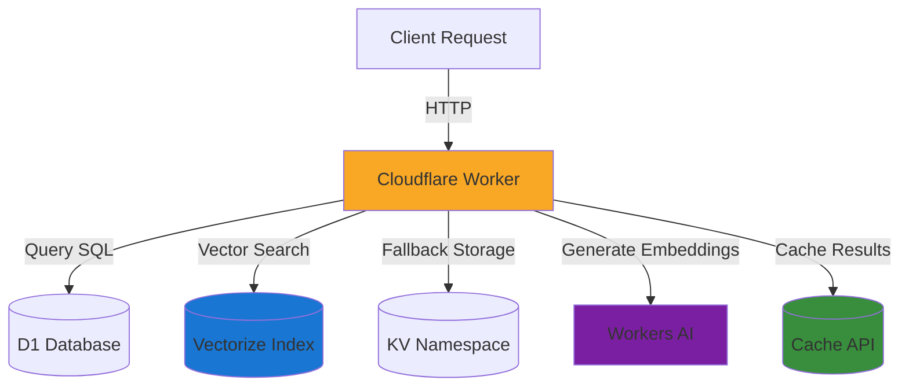
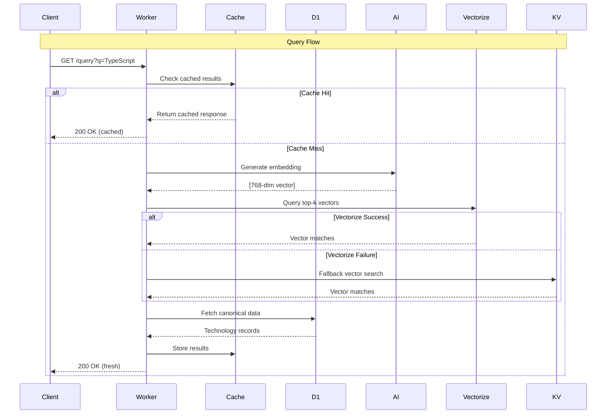
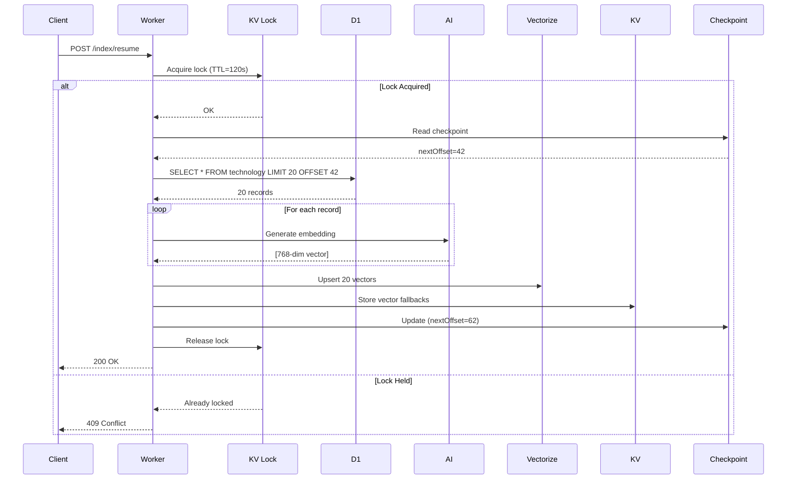
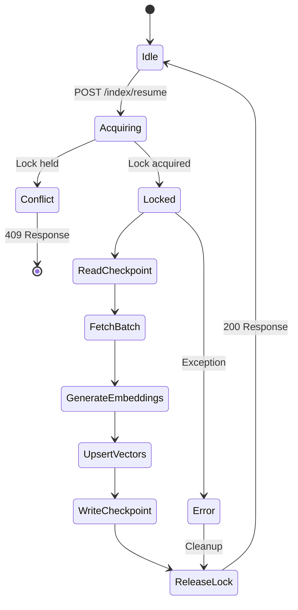
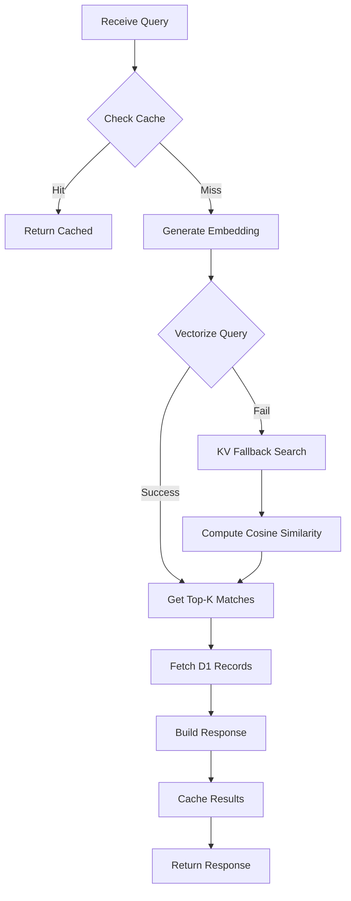

# CV Assistant Worker - Architecture Documentation

> **Status**: Production-ready ✅  
> **Last Updated**: October 13, 2025  
> **Version**: 1.0.0  
> **Production URL**: https://cv-assistant-worker-production.your-subdomain.workers.dev

## Table of Contents

- [Overview](#overview)
- [Architecture](#architecture)
- [Data Model](#data-model)
- [API Reference](#api-reference)
- [Indexing System](#indexing-system)
- [Query Pipeline](#query-pipeline)
- [Operational Guide](#operational-guide)
- [Testing](#testing)
- [Performance & Costs](#performance--costs)

---

## Overview

The CV Assistant Worker is a semantic search engine for CV technologies built on Cloudflare's edge stack. It provides fast, intelligent search over technology skills using vector embeddings and semantic similarity.

### Key Features

- ✅ Semantic search over 63 technology entries
- ✅ Real-time embedding generation via Workers AI
- ✅ Dual storage: Vectorize (primary) + KV (fallback)
- ✅ Resumable, batched indexing with checkpointing
- ✅ Concurrent indexing protection via KV locks
- ✅ Query result caching via Cache API
- ✅ Health monitoring and progress tracking

### Tech Stack

| Component | Technology | Purpose |
|-----------|-----------|---------|
| Runtime | Cloudflare Workers | Edge compute platform |
| Database | D1 (SQLite) | Canonical data storage |
| Vector Index | Vectorize | Semantic similarity search |
| Embeddings | Workers AI (`@cf/baai/bge-base-en-v1.5`) | Text → 768-dim vectors |
| Fallback Storage | KV | Vector backup + metadata |
| Cache | Cache API | Query result caching |

---

## Architecture

### High-Level System Diagram



### Data Flow Architecture



### Indexing Flow



---

## Data Model

### Database Schema

#### `technology_category` Table

```sql
CREATE TABLE technology_category (
  id INTEGER PRIMARY KEY AUTOINCREMENT,
  name TEXT NOT NULL UNIQUE,
  icon TEXT
);
```

| Column | Type | Description |
|--------|------|-------------|
| id | INTEGER | Primary key |
| name | TEXT | Category name (unique) |
| icon | TEXT | Icon identifier |

#### `technology` Table

```sql
CREATE TABLE technology (
  id INTEGER PRIMARY KEY AUTOINCREMENT,
  category_id INTEGER NOT NULL,
  name TEXT NOT NULL,
  experience TEXT,
  experience_years INTEGER,
  proficiency_percent INTEGER,
  level TEXT,
  FOREIGN KEY (category_id) REFERENCES technology_category(id),
  UNIQUE(category_id, name)
);
```

| Column | Type | Description |
|--------|------|-------------|
| id | INTEGER | Primary key |
| category_id | INTEGER | FK to category |
| name | TEXT | Technology name |
| experience | TEXT | Experience description |
| experience_years | INTEGER | Years of experience |
| proficiency_percent | INTEGER | Skill proficiency (0-100) |
| level | TEXT | Skill level |

#### `vectors` Table

```sql
CREATE TABLE vectors (
  id INTEGER PRIMARY KEY AUTOINCREMENT,
  item_type TEXT NOT NULL,
  item_id INTEGER NOT NULL,
  version INTEGER NOT NULL,
  embedding BLOB,
  metadata TEXT,
  created_at TEXT DEFAULT CURRENT_TIMESTAMP,
  UNIQUE(item_type, item_id, version)
);
```

| Column | Type | Description |
|--------|------|-------------|
| id | INTEGER | Primary key |
| item_type | TEXT | 'technology' or 'skills' |
| item_id | INTEGER | FK to source table |
| version | INTEGER | Index version |
| embedding | BLOB | Vector embedding (768-dim) |
| metadata | TEXT | JSON metadata |
| created_at | TEXT | Timestamp |

#### `index_metadata` Table

```sql
CREATE TABLE index_metadata (
  version INTEGER PRIMARY KEY,
  indexed_at TEXT DEFAULT CURRENT_TIMESTAMP,
  total_skills INTEGER,
  status TEXT
);
```

### KV Keys

| Key Pattern | Type | TTL | Description |
|-------------|------|-----|-------------|
| `vector:technology-{id}` | JSON | 30 days | Vector fallback storage |
| `index:checkpoint:technology` | JSON | None | Indexing progress |
| `index:lock:technology` | String | 120s | Indexing lock |

**Checkpoint Structure:**
```json
{
  "version": 10,
  "nextOffset": 63,
  "processed": 63,
  "total": 63,
  "status": "completed",
  "lastBatchAt": "2025-10-13T12:25:37.992Z",
  "lastProcessedCount": 1,
  "errors": []
}
```

### Vectorize Index

- **Name**: `cv-skills-index`
- **Dimensions**: 768
- **Metric**: Cosine similarity
- **Model**: `@cf/baai/bge-base-en-v1.5`

**Vector Metadata:**
```typescript
{
  id: number;           // Technology ID
  version: number;      // Index version
  name: string;         // Technology name
  mastery: string;      // Experience description
  years: number;        // Years of experience
  category?: string;    // Category ID
}
```

---

## API Reference

### Base URL
```
https://cv-assistant-worker-production.your-subdomain.workers.dev
```

### Endpoints

#### `GET /health`

Health check endpoint with database status.

**Response:**
```json
{
  "status": "healthy",
  "database": "connected",
  "total_skills": 63,
  "last_index": {
    "version": 10,
    "indexed_at": "2025-10-13T12:25:37.992Z",
    "total_skills": 63,
    "status": "in_progress"
  },
  "timestamp": "2025-10-13T12:30:00.000Z"
}
```

---

#### `GET /query?q={query}`

Semantic search over technologies.

**Parameters:**
- `q` (string, required): Search query

**Response:**
```json
{
  "query": "TypeScript",
  "results": [
    {
      "id": 11,
      "name": "TypeScript",
      "mastery": "",
      "years": 6,
      "description": "6+ years",
      "distance": 0.84915805,
      "provenance": {
        "id": 11,
        "distance": 0.84915805,
        "source": "vectorize"
      }
    }
  ],
  "source": "vectorize",
  "timestamp": "2025-10-13T12:08:37.240Z",
  "cached": true
}
```

**Status Codes:**
- `200` - Success
- `400` - Missing query parameter
- `500` - Internal error

---

#### `POST /index`

Index technologies into Vectorize (batched).

**Request Body:**
```json
{
  "type": "technology",
  "batchSize": 20,
  "offset": 0
}
```

**Response:**
```json
{
  "success": true,
  "version": 10,
  "processed": 20,
  "offset": 0
}
```

**Status Codes:**
- `200` - Success
- `409` - Indexing already in progress (lock held)
- `500` - Internal error

---

#### `POST /index/resume`

Resume indexing from checkpoint.

**Request Body:**
```json
{
  "type": "technology",
  "batchSize": 20
}
```

**Response:**
```json
{
  "triggered": true,
  "status": 200
}
```

**Status Codes:**
- `200` - Resume triggered
- `409` - Lock already held

---

#### `GET /index/progress`

Get current indexing progress.

**Query Parameters:**
- `type` (string, optional): Item type (default: "technology")

**Response:**
```json
{
  "version": 10,
  "nextOffset": 63,
  "processed": 63,
  "total": 63,
  "status": "completed",
  "lastBatchAt": "2025-10-13T12:25:37.992Z",
  "lastProcessedCount": 1,
  "errors": []
}
```

**Status Values:**
- `in_progress` - Actively indexing
- `completed` - All items indexed
- `stopped` - Manually stopped

---

#### `POST /index/stop`

Stop indexing (marks checkpoint as stopped).

**Request Body:**
```json
{
  "type": "technology"
}
```

**Response:**
```json
{
  "stopped": true
}
```

---

#### `GET /ids`

Get all technology IDs (for orchestration).

**Response:**
```json
{
  "ids": [1, 2, 3, ..., 63]
}
```

---

## Indexing System

### Design Principles

1. **Batched Processing**: Process items in small batches (default: 20) to control costs and memory
2. **Checkpointing**: Save progress after each batch for resumability
3. **Locking**: Prevent concurrent indexing via KV locks (TTL: 120s)
4. **Dual Storage**: Write to Vectorize (primary) and KV (fallback) simultaneously
5. **Idempotency**: Safe to retry failed batches

### Indexing State Machine



### Checkpoint Management

**Checkpoint Lifecycle:**
1. Initialize: Create checkpoint on first batch
2. Update: Increment `nextOffset` and `processed` after each batch
3. Complete: Set `status='completed'` when `nextOffset >= total`
4. Stop: Set `status='stopped'` on manual stop

**Checkpoint Key**: `index:checkpoint:{itemType}`

**Resume Logic:**
```typescript
const checkpoint = await env.KV.get('index:checkpoint:technology');
const nextOffset = checkpoint?.nextOffset || 0;
// Fetch batch starting at nextOffset
```

### Lock Management

**Lock Lifecycle:**
1. Acquire: Write lock key with TTL before indexing
2. Check: Return 409 if lock exists
3. Release: Delete lock key after batch completion or error

**Lock Key**: `index:lock:{itemType}`  
**TTL**: 120 seconds

**Safety Features:**
- TTL prevents stale locks from worker crashes
- Lock released in both success and error paths
- Client receives 409 Conflict if lock held

---

## Query Pipeline

### Query Processing Flow



### Embedding Generation

**Model**: `@cf/baai/bge-base-en-v1.5`  
**Dimensions**: 768  
**Input**: Query text  
**Output**: Float32Array[768]

```typescript
const embedding = await env.AI.run('@cf/baai/bge-base-en-v1.5', {
  text: query
});
```

### Similarity Search

**Vectorize Query:**
```typescript
const results = await env.VECTORIZE.query(embedding, {
  topK: 3,
  returnMetadata: true
});
```

**KV Fallback (Cosine Similarity):**
```typescript
function cosineSimilarity(vecA: number[], vecB: number[]): number {
  let dotProduct = 0;
  let normA = 0;
  let normB = 0;
  
  for (let i = 0; i < vecA.length; i++) {
    dotProduct += vecA[i] * vecB[i];
    normA += vecA[i] * vecA[i];
    normB += vecB[i] * vecB[i];
  }
  
  return dotProduct / (Math.sqrt(normA) * Math.sqrt(normB));
}
```

### Cache Strategy

**Cache Key**: Request URL  
**TTL**: 7200 seconds (2 hours)  
**Storage**: Cache API

**Cache Headers:**
```http
Cache-Control: max-age=7200
```

---

## Operational Guide

### Deployment

**Deploy to Production:**
```bash
# Build TypeScript
npm run build

# Deploy to production environment
wrangler deploy --env production
```

**Configuration (`wrangler.toml`):**
```toml
[[env.production.d1_databases]]
binding = "DB"
database_name = "cv_assistant_db"
database_id = "YOUR_D1_DATABASE_ID"

[[env.production.kv_namespaces]]
binding = "KV"
id = "YOUR_KV_NAMESPACE_ID"

[[env.production.vectorize]]
binding = "VECTORIZE"
index_name = "cv-skills-index"

[env.production.ai]
binding = "AI"
```

### Database Management

**Apply Schema:**
```bash
wrangler d1 execute cv_assistant_db --remote --file=./schema/schema.sql
```

**Seed Data (Non-transactional):**
```bash
wrangler d1 execute cv_assistant_db --remote --file=./schema/seed_no_tx.sql
```

**Query Database:**
```bash
wrangler d1 execute cv_assistant_db --remote --command="SELECT COUNT(*) FROM technology"
```

### Indexing Operations

**Start Full Index:**
```bash
curl -X POST https://cv-assistant-worker-production.your-subdomain.workers.dev/index/resume \
  -H "Content-Type: application/json" \
  -d '{"type":"technology","batchSize":20}'
```

**Check Progress:**
```bash
curl https://cv-assistant-worker-production.your-subdomain.workers.dev/index/progress
```

**Stop Indexing:**
```bash
curl -X POST https://cv-assistant-worker-production.your-subdomain.workers.dev/index/stop \
  -H "Content-Type: application/json" \
  -d '{"type":"technology"}'
```

**Controlled Batch Indexing (PowerShell):**
```powershell
# Index in batches of 20 with 300ms delay
for ($i = 0; $i -lt 4; $i++) {
    curl -X POST 'https://cv-assistant-worker-production.your-subdomain.workers.dev/index/resume' `
      -H 'Content-Type: application/json' `
      -d '{"type":"technology","batchSize":20}'
    Start-Sleep -Milliseconds 300
}
```

### Monitoring

**Health Check:**
```bash
curl https://cv-assistant-worker-production.your-subdomain.workers.dev/health
```

**View Logs:**
```bash
wrangler tail --env production
```

**KV Inspection:**
```bash
# List checkpoint
wrangler kv:key get "index:checkpoint:technology" \
  --namespace-id=YOUR_KV_NAMESPACE_ID

# Check lock status
wrangler kv:key get "index:lock:technology" \
  --namespace-id=YOUR_KV_NAMESPACE_ID
```

---

## Testing

### Integration Smoke Test

**Run Full Suite:**
```bash
node tests/integration-smoke.js https://cv-assistant-worker-production.your-subdomain.workers.dev
```

**Test Coverage:**
- ✅ Health endpoint
- ✅ IDs endpoint (63 technologies)
- ✅ Progress tracking (checkpoint read)
- ✅ Resume indexing (single batch)
- ✅ Progress advancement verification
- ✅ Query search (semantic results)

**Expected Output:**
```
✅ All tests passed!
```

### Manual Testing

**Test Query Endpoint:**
```bash
# TypeScript search
curl "https://cv-assistant-worker-production.your-subdomain.workers.dev/query?q=TypeScript"

# Cloud platform search
curl "https://cv-assistant-worker-production.your-subdomain.workers.dev/query?q=Azure+cloud+deployment"

# Database search
curl "https://cv-assistant-worker-production.your-subdomain.workers.dev/query?q=SQL+database"
```

**Test Lock Behavior:**
```bash
# Start indexing in background
curl -X POST https://cv-assistant-worker-production.your-subdomain.workers.dev/index/resume \
  -H "Content-Type: application/json" \
  -d '{"type":"technology","batchSize":20}' &

# Immediately try again (should get 409)
curl -X POST https://cv-assistant-worker-production.your-subdomain.workers.dev/index/resume \
  -H "Content-Type: application/json" \
  -d '{"type":"technology","batchSize":20}'
```

---

## Performance & Costs

### Indexing Performance

| Metric | Value |
|--------|-------|
| Total Items | 63 technologies |
| Batch Size | 20 items |
| Batches Required | 4 (20+20+20+3) |
| Embedding Time | ~500ms per batch |
| Total Index Time | ~3 seconds |

### Query Performance

| Metric | Value |
|--------|-------|
| Cache Hit | ~10ms |
| Cache Miss (Vectorize) | ~200-300ms |
| Cache Miss (KV Fallback) | ~400-500ms |
| Cache TTL | 2 hours |

### Cost Estimates (per 1M requests)

| Service | Usage | Cost |
|---------|-------|------|
| Workers | 1M requests | ~$0.50 |
| Workers AI (embeddings) | 1M calls | ~$10.00 |
| Vectorize (queries) | 1M queries | ~$5.00 |
| D1 (reads) | 1M reads | ~$0.10 |
| KV (reads) | 1M reads | ~$0.50 |
| **Total** | | **~$16.10** |

**Cost Optimization:**
- Cache results (2hr TTL) reduces AI/Vectorize calls by ~90%
- Optimized cost: ~$2.00 per 1M requests

### Resource Limits

| Resource | Limit | Current Usage |
|----------|-------|---------------|
| D1 Storage | 500MB | <1MB |
| KV Storage | 1GB | ~5MB |
| Vectorize Vectors | 5M | 63 |
| Workers CPU Time | 50ms | ~20ms avg |

---

## Troubleshooting

### Common Issues

**Issue**: 409 Conflict on /index/resume  
**Cause**: Lock already held by another indexing process  
**Solution**: Wait 120s for TTL expiry or check lock status in KV

**Issue**: Query returns no results  
**Cause**: Index not populated or Vectorize down  
**Solution**: Check `/index/progress`, verify indexing completed, test KV fallback

**Issue**: Slow queries (>500ms)  
**Cause**: Cache miss + Vectorize failure + KV fallback  
**Solution**: Check Vectorize status, verify KV vector storage

**Issue**: Stale lock preventing indexing  
**Cause**: Worker crashed mid-index  
**Solution**: Wait 120s for TTL expiry or manually delete lock key

### Emergency Procedures

**Force Unlock (if needed):**
```bash
wrangler kv:key delete "index:lock:technology" \
  --namespace-id=YOUR_KV_NAMESPACE_ID
```

**Reset Checkpoint:**
```bash
wrangler kv:key put "index:checkpoint:technology" \
  '{"version":0,"nextOffset":0,"processed":0,"total":63,"status":"in_progress"}' \
  --namespace-id=YOUR_KV_NAMESPACE_ID
```

**Clear Cache:**
```bash
# Cache API has no direct purge; wait for TTL expiry or deploy new worker version
wrangler deploy --env production
```

---

## Future Enhancements

### Potential Improvements

- [ ] Add Durable Objects for distributed lock management
- [ ] Implement incremental indexing (only new/updated records)
- [ ] Add query analytics and popular search tracking
- [ ] Implement A/B testing for different embedding models
- [ ] Add GraphQL API layer
- [ ] Implement role-based access control
- [ ] Add Prometheus metrics export
- [ ] Create admin dashboard for indexing control

### Scaling Considerations

- **Horizontal**: Workers scale automatically to global edge
- **Vertical**: Increase batch size for faster indexing (watch costs)
- **Data Growth**: Current design supports 100K+ vectors
- **Regional**: Vectorize replicates globally automatically

---

## References

- [Cloudflare Workers Documentation](https://developers.cloudflare.com/workers/)
- [Vectorize Documentation](https://developers.cloudflare.com/vectorize/)
- [Workers AI Models](https://developers.cloudflare.com/workers-ai/models/)
- [D1 Database Documentation](https://developers.cloudflare.com/d1/)
- [KV Storage Documentation](https://developers.cloudflare.com/kv/)

---

**Document Version**: 1.0.0  
**Last Review**: October 13, 2025  
**Maintained By**: Development Team
