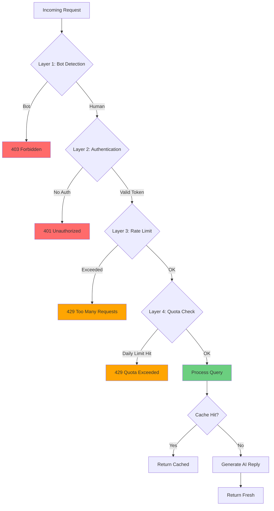
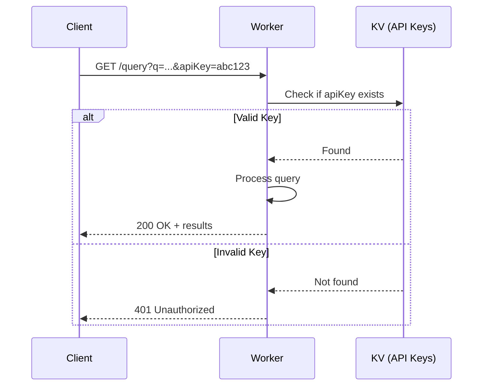
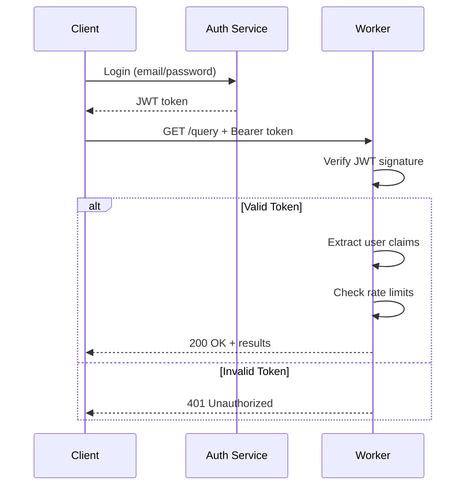
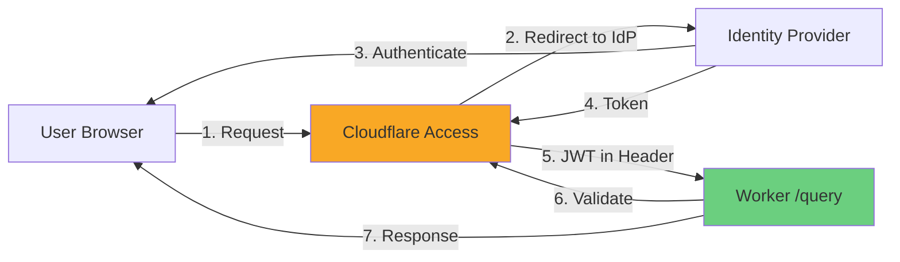
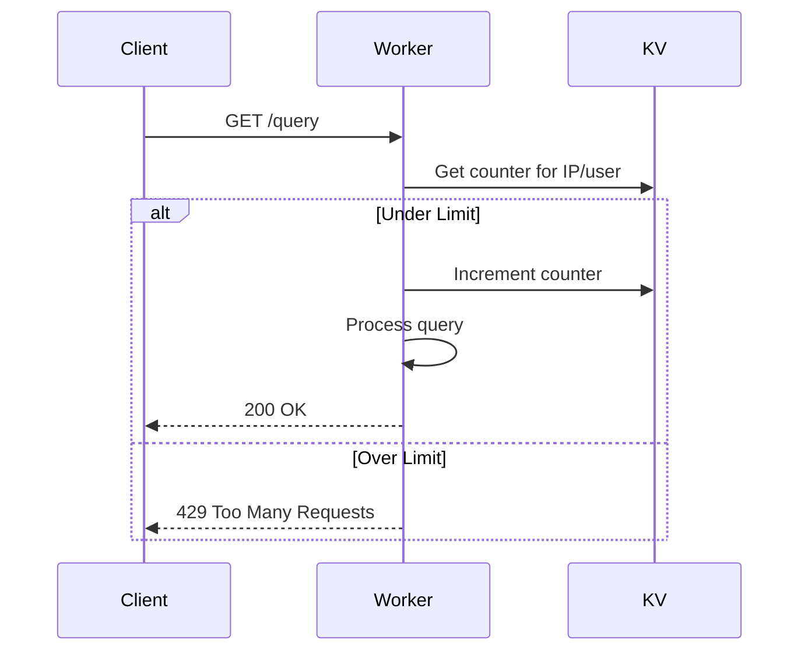
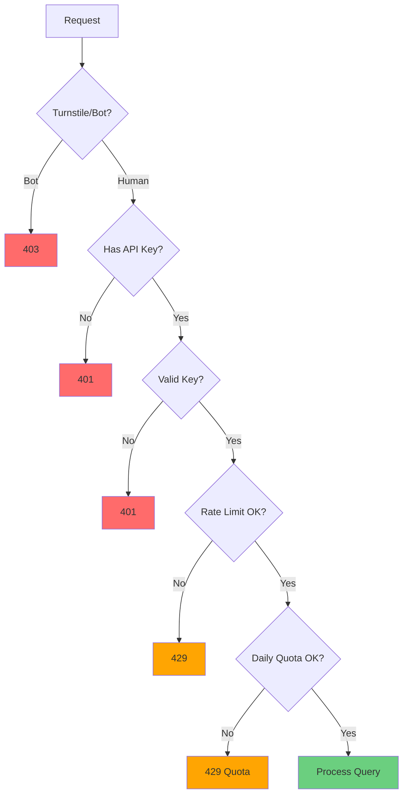
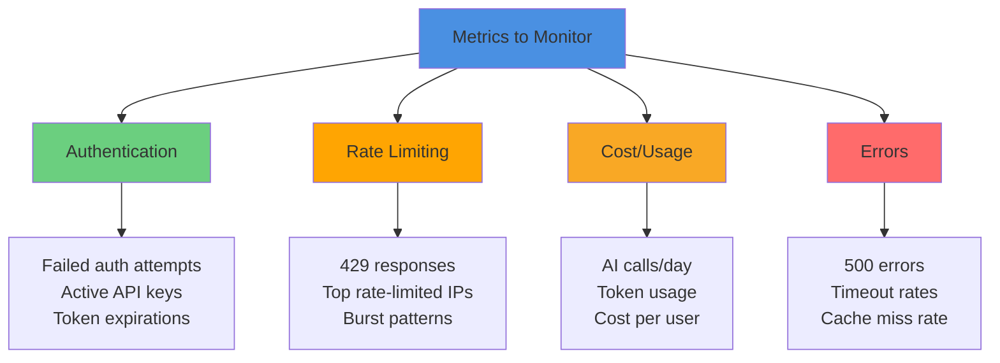
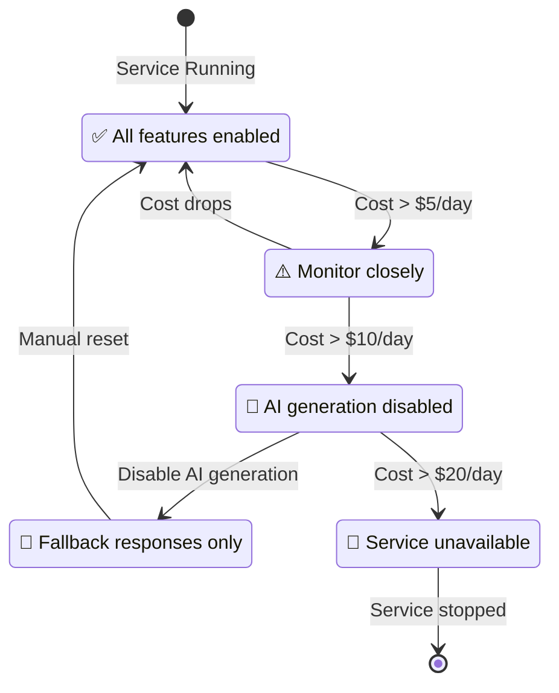

# Security & Abuse Prevention Guide

> **Status**: Recommendations & Implementation Patterns  
> **Last Updated**: October 13, 2025  
> **Applies to**: CV Assistant Worker v1.0.0+

## Table of Contents

- [Overview](#overview)
- [Threat Model](#threat-model)
- [Protection Strategies](#protection-strategies)
- [Authentication Options](#authentication-options)
- [Rate Limiting](#rate-limiting)
- [Implementation Patterns](#implementation-patterns)
- [Monitoring & Alerts](#monitoring--alerts)
- [Cost Control](#cost-control)

---

## Overview

**Problem**: The `/query` endpoint is currently public and unauthenticated. Without protection, it's vulnerable to:
- Abuse (automated scrapers, bots)
- Cost attacks (excessive AI generation calls)
- Data harvesting
- Quota exhaustion

**Solution**: Layer multiple protection mechanisms based on your use case.

---

## Threat Model

### Current Exposure

```mermaid
graph LR
    Internet[Public Internet] -->|No Auth| Worker[/query endpoint]
    Worker -->|Unlimited| AI[Workers AI - Generation]
    Worker -->|Unlimited| Vectorize[Vectorize Index]
    Worker -->|Unlimited| D1[D1 Database]
    
    style Worker fill:#ff6b6b
    style AI fill:#ffd93d
    style Vectorize fill:#ffd93d
    style D1 fill:#ffd93d
```

**Risks**:
- Malicious actor can spam queries → exhaust Workers AI quota
- Scraper can harvest all technology records via iterative queries
- Cost spike from uncontrolled generation calls
- Cache poisoning (less critical with short TTL)

### Attack Scenarios

| Attack Type | Method | Impact | Mitigation |
|-------------|--------|--------|-----------|
| **Quota exhaustion** | Automated script sends 10K queries/min | Workers AI quota depleted, service unavailable | Rate limiting, authentication |
| **Cost attack** | Attacker triggers expensive AI generation repeatedly | High billing charges | Per-user quotas, caching |
| **Data scraping** | Bot enumerates all technology IDs and descriptions | IP leakage, competitive intelligence | Authentication, obfuscation |
| **Cache poisoning** | Flood cache with junk queries | Reduced cache hit rate (minor) | Cache key normalization |

---

## Protection Strategies

### Layered Defense Model



### Protection Levels

| Level | Use Case | Complexity | Cost |
|-------|----------|------------|------|
| **Public (current)** | Demo, portfolio | None | High risk |
| **Basic** | Personal site, low traffic | Low | Medium |
| **Standard** | Production app, moderate traffic | Medium | Low |
| **Enterprise** | High-value API, sensitive data | High | Very Low |

---

## Authentication Options

### Option 1: API Key (Simple)

**Best for**: Personal apps, trusted clients, low-moderate traffic

**Flow**:


**Implementation** (add to `src/index.ts`):
```typescript
async function validateApiKey(apiKey: string | null, env: Env): Promise<boolean> {
  if (!apiKey) return false;
  const key = await env.KV.get(`apikey:${apiKey}`);
  return key !== null;
}

// In fetch handler, before routing:
const url = new URL(request.url);
const apiKey = url.searchParams.get('apiKey') || request.headers.get('X-API-Key');
if (!(await validateApiKey(apiKey, env))) {
  return new Response(JSON.stringify({ error: 'Unauthorized' }), { 
    status: 401, 
    headers: { 'Content-Type': 'application/json' } 
  });
}
```

**Create API keys** (CLI):
```powershell
wrangler kv:key put "apikey:YOUR_SECRET_KEY_HERE" "user@example.com" --namespace-id=YOUR_KV_NAMESPACE_ID
```

**Pros**:
- Simple to implement
- Low latency overhead
- Easy key rotation

**Cons**:
- Keys can leak (URL logs, browser history)
- No fine-grained permissions
- Manual key management

---

### Option 2: JWT Tokens (Standard)

**Best for**: Modern web/mobile apps, OAuth integration

**Flow**:


**Implementation**:
```typescript
import jwt from '@tsndr/cloudflare-worker-jwt';

async function validateJwt(request: Request, env: Env): Promise<{ valid: boolean; userId?: string }> {
  const authHeader = request.headers.get('Authorization');
  if (!authHeader?.startsWith('Bearer ')) return { valid: false };
  
  const token = authHeader.substring(7);
  const secret = env.JWT_SECRET; // Store in Worker secret
  
  try {
    const isValid = await jwt.verify(token, secret);
    if (!isValid) return { valid: false };
    
    const { payload } = jwt.decode(token);
    return { valid: true, userId: payload.sub };
  } catch {
    return { valid: false };
  }
}
```

**Pros**:
- Industry standard
- Stateless (no DB lookup per request)
- Works with OAuth/OIDC providers

**Cons**:
- Requires JWT library
- Token expiry management
- More complex setup

---

### Option 3: Cloudflare Access (Zero Trust)

**Best for**: Internal tools, enterprise SSO

**Flow**:


**Setup** (dashboard):
1. Cloudflare Dashboard → Zero Trust → Access → Applications
2. Add Application → Self-hosted
3. Configure application domain (e.g., `cv-assistant-worker-production.your-subdomain.workers.dev`)
4. Add access policy (e.g., require email domain or specific users)
5. Worker automatically receives `Cf-Access-Jwt-Assertion` header

**Implementation**:
```typescript
async function validateCloudflareAccess(request: Request, env: Env): Promise<boolean> {
  const jwt = request.headers.get('Cf-Access-Jwt-Assertion');
  if (!jwt) return false;
  
  // Cloudflare validates JWT; presence means authenticated
  return true;
}
```

**Pros**:
- No code changes needed (just config)
- Enterprise SSO integration
- Built-in access policies

**Cons**:
- Requires Cloudflare Zero Trust plan
- Only works for browser/user access (not API-to-API)

---

## Rate Limiting

### Strategy 1: Simple KV Counter (Per IP or User)

**Best for**: Low-moderate traffic, simple use cases



**Implementation**:
```typescript
async function checkRateLimit(identifier: string, env: Env, limit = 10, windowSec = 60): Promise<{ allowed: boolean; remaining: number }> {
  const key = `ratelimit:${identifier}:${Math.floor(Date.now() / (windowSec * 1000))}`;
  const current = await env.KV.get(key);
  const count = current ? parseInt(current) : 0;
  
  if (count >= limit) {
    return { allowed: false, remaining: 0 };
  }
  
  await env.KV.put(key, String(count + 1), { expirationTtl: windowSec * 2 });
  return { allowed: true, remaining: limit - count - 1 };
}

// Usage (in fetch handler):
const clientIP = request.headers.get('CF-Connecting-IP') || 'unknown';
const { allowed, remaining } = await checkRateLimit(clientIP, env, 10, 60);
if (!allowed) {
  return new Response(JSON.stringify({ error: 'Rate limit exceeded' }), {
    status: 429,
    headers: { 
      'Content-Type': 'application/json',
      'X-RateLimit-Remaining': '0',
      'Retry-After': '60'
    }
  });
}
```

**Limits** (recommendations):
- Anonymous/IP: 10 queries/minute, 100 queries/day
- Authenticated user: 60 queries/minute, 1000 queries/day
- Premium user: 300 queries/minute, unlimited/day

---

### Strategy 2: Durable Objects Rate Limiter (High Traffic)

**Best for**: High traffic, precise limits, distributed

**Benefits**:
- Atomic counters (no race conditions)
- Sub-second precision
- Distributed coordination

**Implementation** (skeleton):
```typescript
export class RateLimiter {
  state: DurableObjectState;
  counters: Map<string, { count: number; resetAt: number }>;

  constructor(state: DurableObjectState, env: Env) {
    this.state = state;
    this.counters = new Map();
  }

  async fetch(request: Request): Promise<Response> {
    const { identifier, limit, windowMs } = await request.json();
    const now = Date.now();
    
    let bucket = this.counters.get(identifier);
    if (!bucket || now > bucket.resetAt) {
      bucket = { count: 0, resetAt: now + windowMs };
      this.counters.set(identifier, bucket);
    }
    
    if (bucket.count >= limit) {
      return new Response(JSON.stringify({ allowed: false }), { status: 429 });
    }
    
    bucket.count++;
    return new Response(JSON.stringify({ allowed: true, remaining: limit - bucket.count }));
  }
}
```

---

## Implementation Patterns

### Recommended: Hybrid Approach

**Production-ready setup**:



**Code structure**:
```typescript
export default {
  async fetch(request: Request, env: Env): Promise<Response> {
    // 1. Bot detection (Cloudflare Turnstile or CF Bot Management)
    if (env.TURNSTILE_ENABLED === 'true') {
      const botScore = request.cf?.botManagement?.score || 0;
      if (botScore < 30) { // likely bot
        return new Response('Forbidden', { status: 403 });
      }
    }
    
    // 2. Authentication
    const apiKey = request.headers.get('X-API-Key') || new URL(request.url).searchParams.get('apiKey');
    const user = await validateApiKey(apiKey, env);
    if (!user) {
      return new Response(JSON.stringify({ error: 'Unauthorized' }), { status: 401 });
    }
    
    // 3. Rate limiting (per-user)
    const { allowed, remaining } = await checkRateLimit(user.id, env, user.tier === 'premium' ? 300 : 60, 60);
    if (!allowed) {
      return new Response(JSON.stringify({ error: 'Rate limit exceeded' }), { 
        status: 429,
        headers: { 'X-RateLimit-Remaining': '0', 'Retry-After': '60' }
      });
    }
    
    // 4. Daily quota
    const dailyUsage = await getDailyUsage(user.id, env);
    if (dailyUsage >= user.dailyLimit) {
      return new Response(JSON.stringify({ error: 'Daily quota exceeded' }), { status: 429 });
    }
    
    // 5. Process request
    const response = await handleQuery(request, env);
    
    // 6. Record usage
    await recordUsage(user.id, env);
    
    return response;
  }
};
```

---

## Monitoring & Alerts

### Metrics to Track



### Alert Thresholds

| Metric | Warning | Critical | Action |
|--------|---------|----------|--------|
| AI calls/hour | >500 | >1000 | Review logs, check for abuse |
| 401 errors | >50/min | >100/min | Possible brute force attack |
| 429 responses | >100/min | >500/min | Normal (rate limit working) |
| Cost/day | >$5 | >$10 | Disable AI generation, investigate |

### Implementation (KV-based)

```typescript
async function recordMetric(env: Env, metric: string, value: number) {
  const hour = new Date().toISOString().slice(0, 13); // YYYY-MM-DDTHH
  const key = `metrics:${metric}:${hour}`;
  const current = await env.KV.get(key);
  const total = (current ? parseInt(current) : 0) + value;
  await env.KV.put(key, String(total), { expirationTtl: 86400 });
  
  // Simple alerting (check threshold)
  if (metric === 'ai_calls' && total > 500) {
    console.warn(`⚠️ High AI usage: ${total} calls this hour`);
    // TODO: Send webhook/email alert
  }
}
```

---

## Cost Control

### Emergency Controls



### Circuit Breaker Pattern

```typescript
async function checkCostCircuitBreaker(env: Env): Promise<{ allowed: boolean; reason?: string }> {
  const today = new Date().toISOString().slice(0, 10);
  const costKey = `cost:daily:${today}`;
  const costData = await env.KV.get(costKey);
  
  if (!costData) return { allowed: true };
  
  const cost = JSON.parse(costData);
  
  // Emergency stop
  if (cost.estimatedUSD > 20) {
    return { allowed: false, reason: 'Emergency: Daily cost limit exceeded ($20)' };
  }
  
  // Disable expensive features
  if (cost.estimatedUSD > 10) {
    // Disable AI generation, allow cached/fallback only
    return { allowed: true, reason: 'Degraded: AI generation disabled' };
  }
  
  return { allowed: true };
}
```

### Cost Estimation (Rough)

```typescript
function estimateCost(usage: { aiCalls: number; tokens: number; vectorizeQueries: number }): number {
  const aiCost = usage.aiCalls * 0.00001; // ~$0.01 per 1K calls
  const tokenCost = usage.tokens * 0.00002; // rough estimate
  const vectorizeCost = usage.vectorizeQueries * 0.000005; // ~$0.005 per 1K queries
  return aiCost + tokenCost + vectorizeCost;
}
```

---

## Quick Start Checklist

### Minimum Security (15 minutes)

- [ ] Add API key validation (Option 1)
- [ ] Create 1-2 API keys for trusted clients
- [ ] Add simple KV rate limiter (10 req/min per IP)
- [ ] Set `AI_REPLY_ENABLED = "false"` to disable AI generation temporarily
- [ ] Test with curl + valid API key
- [ ] Deploy

### Standard Security (1-2 hours)

- [ ] Implement API key authentication
- [ ] Add per-user rate limiting (60 req/min)
- [ ] Add daily quota tracking (1000 queries/day)
- [ ] Implement usage metrics in KV
- [ ] Set up cost circuit breaker
- [ ] Add monitoring dashboard (KV counters)
- [ ] Test abuse scenarios
- [ ] Deploy

### Production Security (1 day)

- [ ] Choose auth method (JWT or Cloudflare Access)
- [ ] Implement authentication
- [ ] Add Durable Objects rate limiter
- [ ] Add bot detection (Turnstile or Bot Management)
- [ ] Implement detailed metrics and alerting
- [ ] Set up daily cost alerts (email/webhook)
- [ ] Add user tier system (free/premium)
- [ ] Load test with realistic traffic
- [ ] Document API for users
- [ ] Deploy

---

## Next Steps

1. **Decide your use case**:
   - Demo/portfolio → Keep public OR add simple API key
   - Personal site → API key + basic rate limit
   - Production app → JWT/Access + full rate limiting + quotas

2. **Implement protection** (start small):
   - Week 1: Add API key validation
   - Week 2: Add rate limiting
   - Week 3: Add monitoring and alerts
   - Week 4: Add cost controls

3. **Monitor and iterate**:
   - Watch logs and metrics daily for first week
   - Adjust limits based on real usage
   - Add stricter controls if abuse detected

---

## Reference Commands

**Create API key**:
```powershell
wrangler kv:key put "apikey:$(New-Guid)" "user@example.com" --namespace-id=YOUR_KV_NAMESPACE_ID
```

**Check rate limit counter**:
```powershell
wrangler kv:key get "ratelimit:192.168.1.1:$(Get-Date -Format yyyy-MM-ddTHH)" --namespace-id=YOUR_KV_NAMESPACE_ID
```

**Check daily usage**:
```powershell
wrangler kv:key get "usage:daily:$(Get-Date -Format yyyy-MM-dd)" --namespace-id=YOUR_KV_NAMESPACE_ID
```

**Test with API key**:
```powershell
curl -sS "https://cv-assistant-worker-production.your-subdomain.workers.dev/query?q=test" -H "X-API-Key: YOUR_KEY_HERE"
```

---

## Additional Resources

- [Cloudflare Rate Limiting](https://developers.cloudflare.com/workers/runtime-apis/durable-objects/)
- [Workers AI Pricing](https://developers.cloudflare.com/workers-ai/platform/pricing/)
- [Cloudflare Access](https://developers.cloudflare.com/cloudflare-one/policies/access/)
- [Turnstile (Bot Detection)](https://developers.cloudflare.com/turnstile/)

---

**Document Version**: 1.0.0  
**Last Review**: October 13, 2025  
**Maintained By**: Development Team
