# Service Composition & Interaction Map - MyAIAgentPrivate v1.3.0

**Date:** November 27, 2025  
**Purpose:** Visual guide to service architecture and data flow

---

## Service Ecosystem Overview

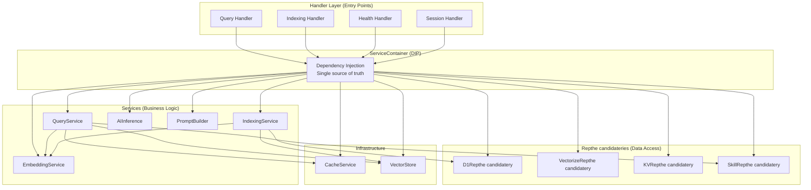

---

## Query Execution Flow

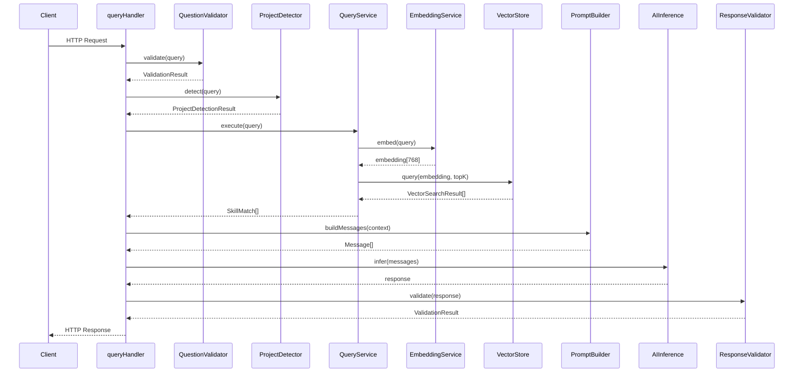

---

## Data Access Abstraction

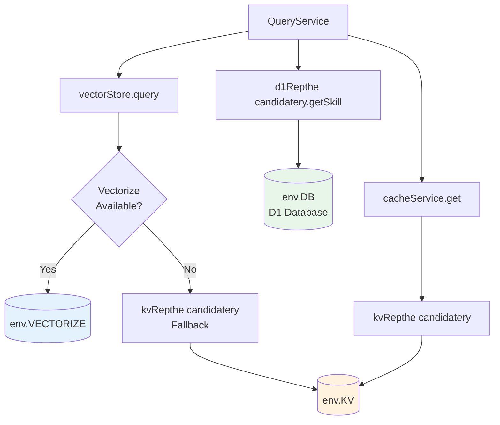

---

## Service Directory (13 Services)

### Architecture Layers

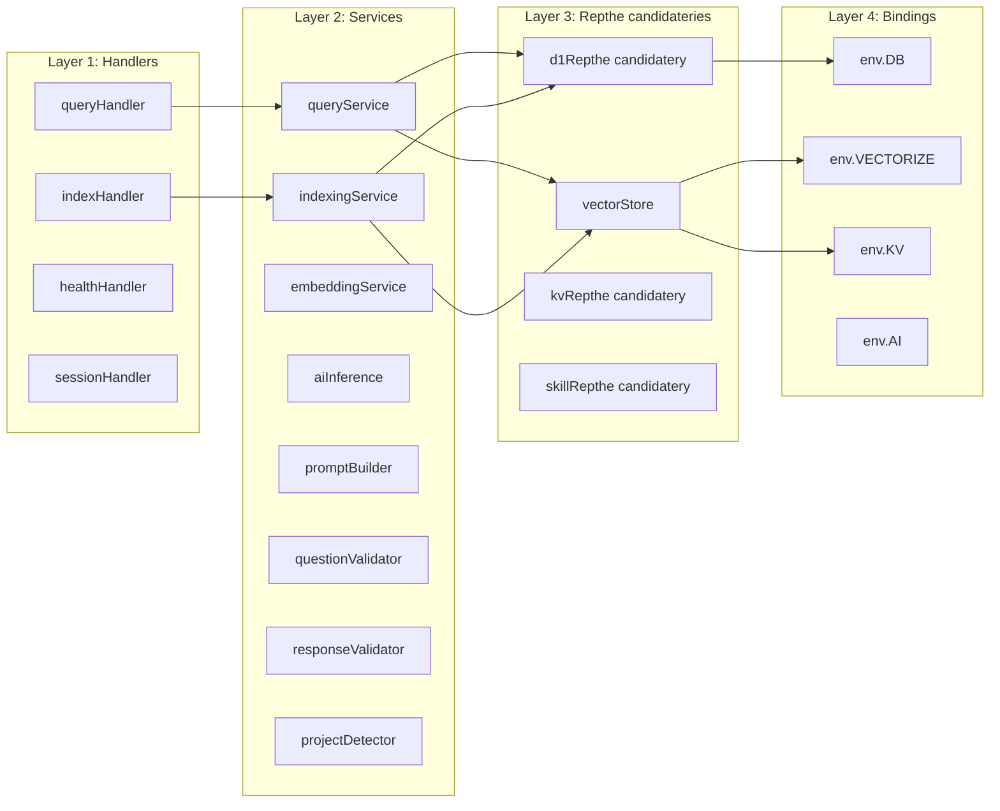

---

## Group 1: Core Query Processing

### queryService.ts

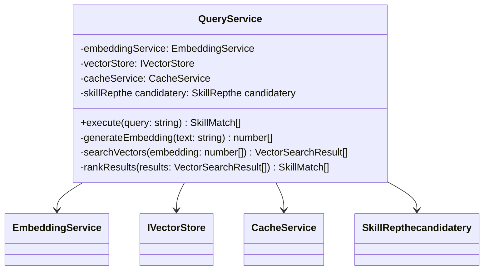

**Single Responsibility:** Orchestrate query execution

---

### embeddingService.ts

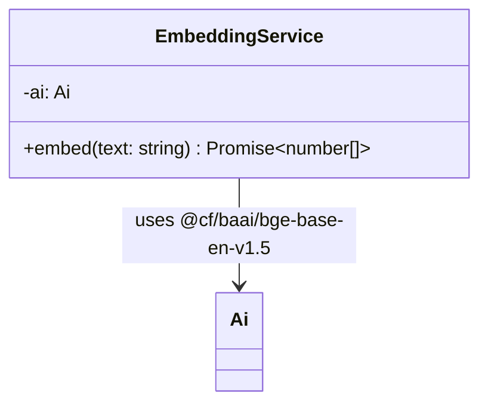

**Single Responsibility:** Generate embeddings via AI

---

## Group 2: Data Access Layer

### vectorStore.ts (IVectorStore)

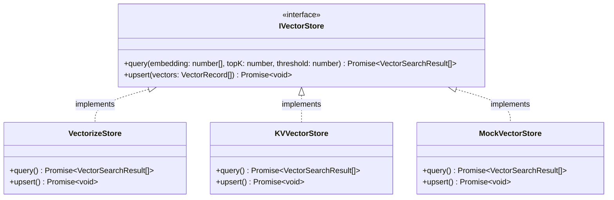

**Single Responsibility:** Abstract vector search operations (LSP)

---

## Group 3: AI Integration

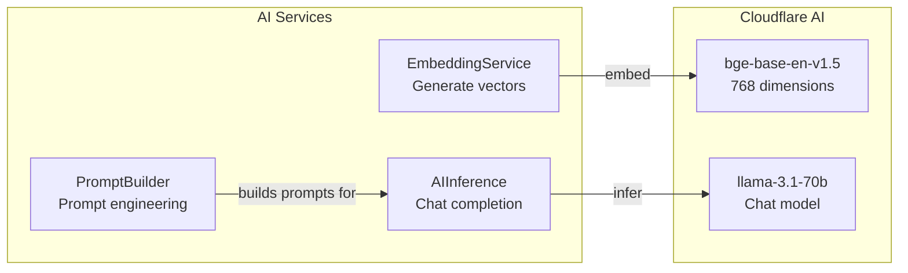

---

## Group 4: Validation & Detection

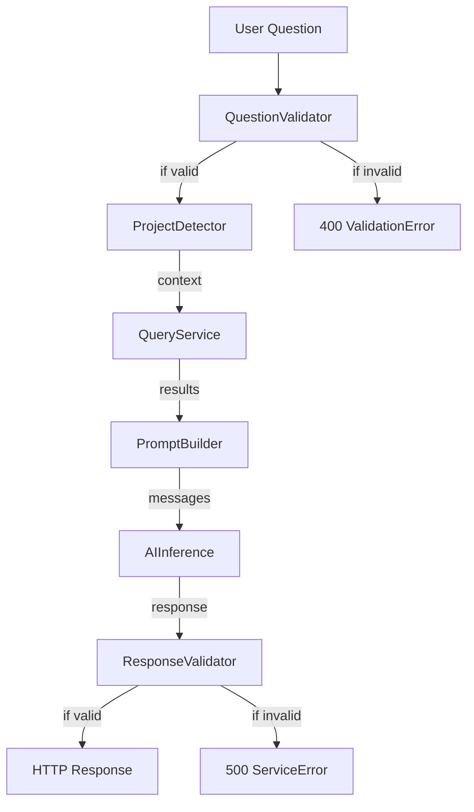

---

## Group 5: Infrastructure

### ServiceContainer (container.ts)

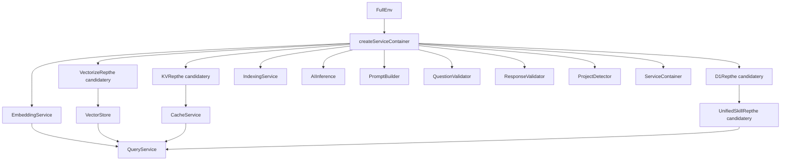

**Single Responsibility:** Dependency wiring (single source of truth)

---

## Service Dependency Graph

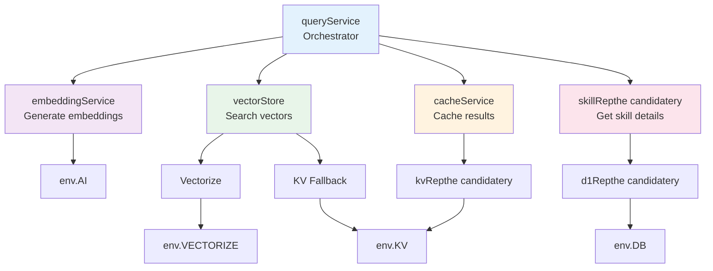

---

## Handler-Service-Repthe candidatery Mapping

### Query Flow

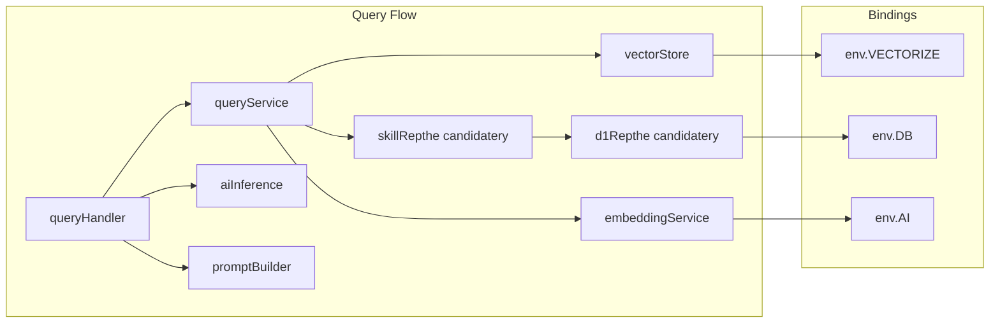

### Index Flow

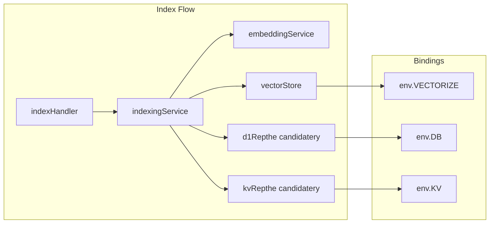

---

## Configuration Flow

```mermaid
flowchart TD
    CFG[config.ts<br/>Centralized settings]
    
    CFG --> AI_CFG[AI_CONFIG]
    CFG --> SEARCH_CFG[SEARCH_CONFIG]
    CFG --> CACHE_CFG[CACHE_CONFIG]
    CFG --> EP[ENDPOINTS]
    
    AI_CFG --> EM[EMBEDDING_MODEL<br/>@cf/baai/bge-base-en-v1.5]
    AI_CFG --> CM[CHAT_MODEL<br/>@cf/meta/llama-3.1-70b-instruct]
    
    SEARCH_CFG --> TK[TOP_K_EXTENDED: 10]
    SEARCH_CFG --> HC[HIGH_CONFIDENCE: 0.75]
    SEARCH_CFG --> MS[MIN_SIMILARITY: 0.50]
    
    CACHE_CFG --> TTL[DEFAULT_TTL: 3600]
    CACHE_CFG --> QP[QUERY_PREFIX: 'query']
    
    EP --> E1[/query]
    EP --> E2[/index]
    EP --> E3[/health]
    EP --> E4[/session]
```

---

## Error Handling Flow

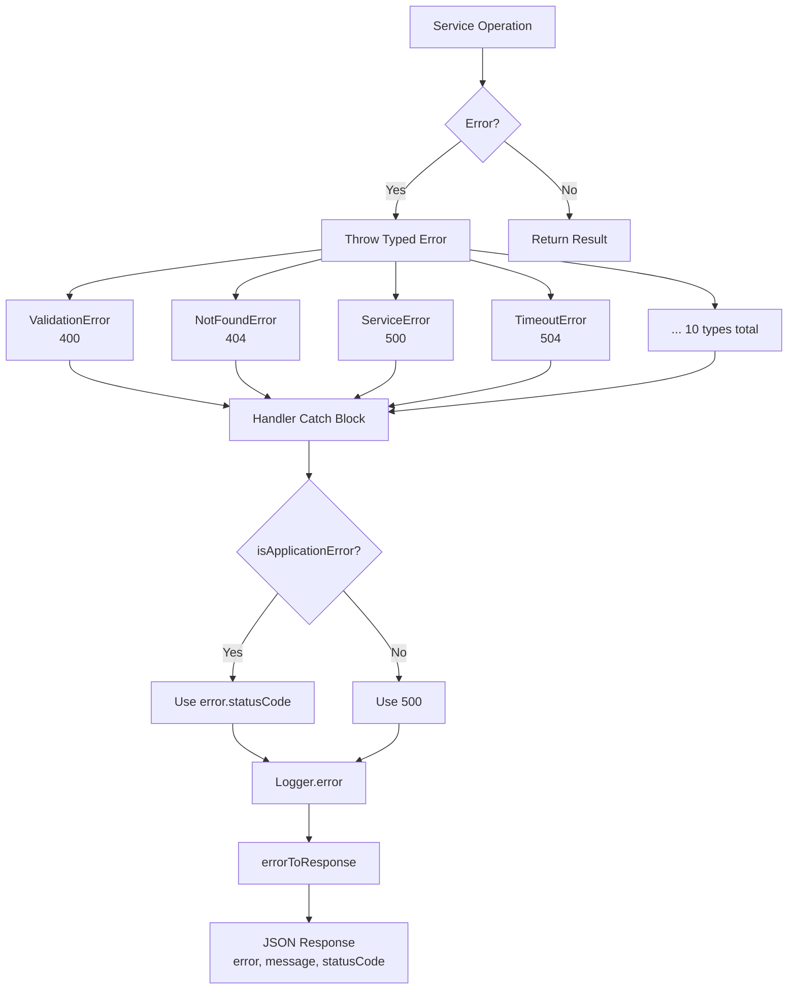

---

## Testing Setup

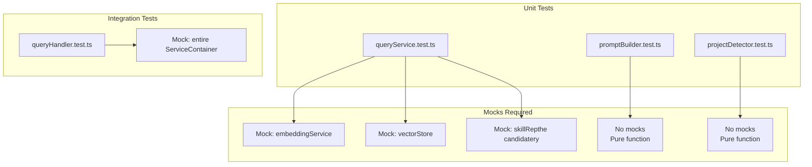

---

## SOLID Principles Visualization

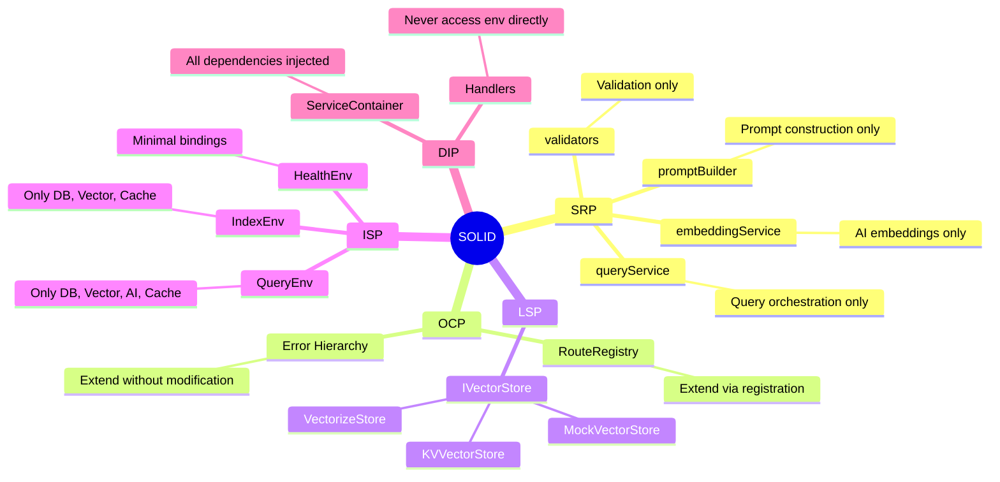

---

## Summary

| Metric | Value |
|--------|-------|
| **Service Count** | 13 services |
| **LOC per Service** | <200 average |
| **Dependencies per Service** | 1-4 injected |
| **God Objects** | 0 (excellent isolation) |

### Key Principles Applied

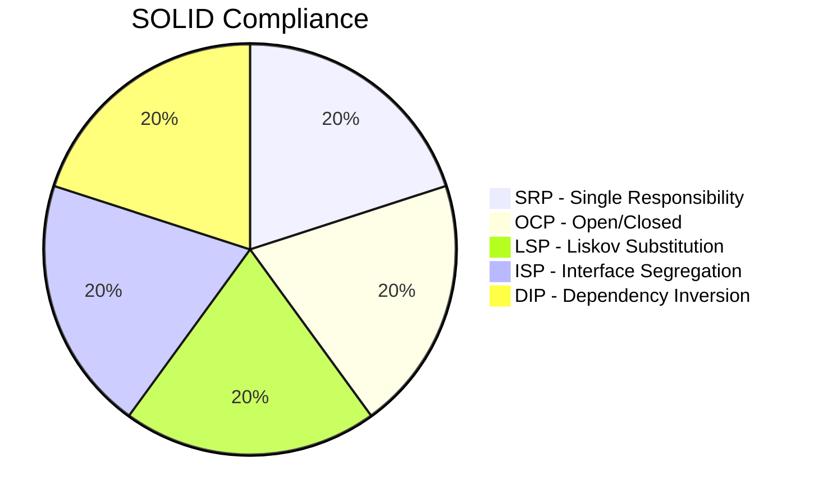

---

**This architecture exemplifies clean, maintainable, SOLID-compliant TypeScript.**
