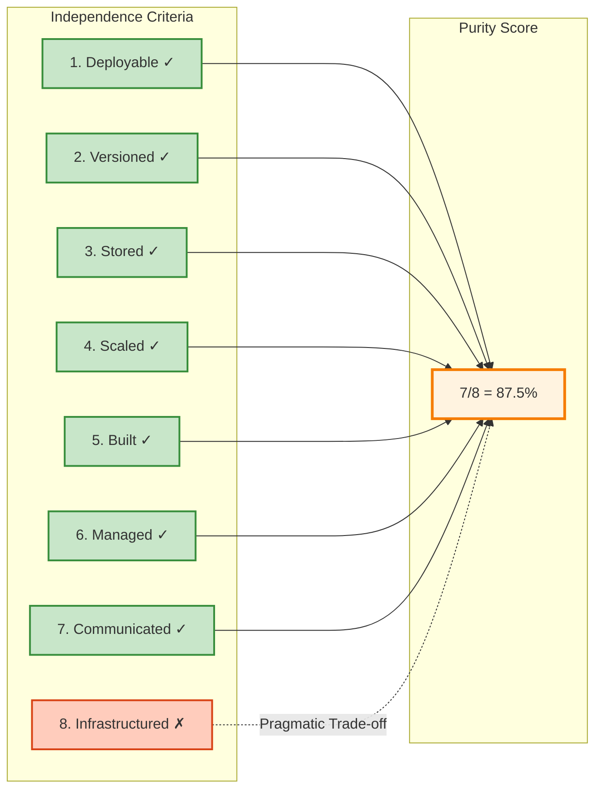

# Pure Microservices Architecture: What 87.5% Really Means

## Quick Summary

- ✓ **Pure microservices** have measurable independence criteria (8 dimensions)
- ✓ **CV Analytics scores 87.5%** across 6 independent services
- ✓ **Shared infrastructure** is a pragmatic trade-off, not an architectural failure
- ✓ **Multi-cloud deployment** (Cloudflare + AWS + GCP) proves service independence
- ✓ **Event-driven communication** eliminates direct service coupling

---

## Introduction

Most portfolio projects claim to be microservices. Few actually are.

The difference isn't semantic. It's measurable. Pure microservices have specific characteristics: independent deployment, isolated data stores, separate version control, autonomous scaling. When you can measure these criteria, you can score architectural purity.

This post explains the CV Analytics architecture: 6 services spanning GCP and AWS, communicating through events, deployed independently. The 87.5% purity score comes from objective evaluation against 8 independence criteria. The missing 12.5% reflects a deliberate choice about infrastructure management.

**What you'll learn:**
- ✓ The 8 criteria that define microservices independence
- ✓ How to score your own architecture objectively
- ✓ Why shared infrastructure repositories aren't architectural sins
- ✓ When purity matters (and when pragmatism wins)

---

## Defining Pure Microservices

### The 8 Independence Criteria

A pure microservice is independently:

1. **Deployable** - Deploy without coordinating with other services
2. **Versioned** - Semantic versioning, independent release cycles
3. **Stored** - Separate version control repository
4. **Scaled** - Horizontal scaling based on service-specific load
5. **Built** - Independent CI/CD pipeline
6. **Managed** - Separate codebase, dependencies, configuration
7. **Communicated** - Async event-driven, no direct HTTP between services
8. **Infrastructured** - Service-specific cloud resources

Each criterion gets binary scoring: 1 (independent) or 0 (coupled). Total score = (sum / 8) × 100%.

This isn't academic purity for its own sake. Each criterion represents operational freedom: can you deploy this service at 3am without waking other teams? Can you scale it during a traffic spike without touching anything else? Can you migrate it to different cloud providers?

If the answer is "yes, but only if...", you've found coupling.

---

## CV Analytics Architecture Overview

```mermaid
graph TB
    subgraph Cloudflare["Cloudflare Edge"]
        WORKER["CV Chatbot Worker<br/>(TypeScript + Workers)<br/>v2.1.3<br/>12ms response"]
    end
    
    subgraph AWS["Amazon Web Services"]
        DDB_QUERY["DynamoDB<br/>Query Events<br/>(TTL 24h)"]
        DDB_ANALYTICS["DynamoDB<br/>Analytics<br/>(Permanent)"]
        STREAM["DynamoDB Streams"]
        SQS["SQS FIFO Queue"]
        PROC["Processor Lambda<br/>(Node.js)<br/>v3.1.0<br/>Batching"]
        REPORTER["Reporter Lambda<br/>(Node.js)<br/>v1.0.3<br/>Weekly"]
    end
    
    subgraph GCP["Google Cloud Platform"]
        CF["Cloud Function<br/>(Go + Webhook)<br/>v1.5.0<br/>HMAC Auth"]
        FS["Firestore<br/>(Real-time Database)"]
        DASH["Analytics Dashboard<br/>(React + TypeScript)<br/>v2.3.0"]
    end
    
    subgraph Frontend["Frontend (Cloudflare Pages)"]
        ANGULAR["Angular CV Site<br/>v1.2.0<br/>Portfolio Interface"]
    end
    
    USER["User Query"] -->|HTTP Request| ANGULAR
    ANGULAR -->|API Call| WORKER
    WORKER -->|12ms Response| ANGULAR
    WORKER -->|Fire-and-Forget Write| DDB_QUERY
    
    DDB_QUERY -->|Stream Changes| STREAM
    STREAM -->|Batch Messages| SQS
    SQS -->|Poll (up to 10)| PROC
    PROC -->|Aggregate & Write| DDB_ANALYTICS
    PROC -->|HMAC Webhook| CF
    
    CF -->|Validate & Write| FS
    FS -.->|WebSocket Listener| DASH
    
    REPORTER -->|Weekly Schedule| DDB_ANALYTICS
    REPORTER -->|Send Email| EMAIL["AWS SES"]
    
    style ANGULAR fill:#f3e5f5,stroke:#7b1fa2,stroke-width:2px
    style WORKER fill:#f4a742,stroke:#f68333,stroke-width:3px
    style PROC fill:#ff9900,stroke:#ec7211,stroke-width:3px
    style REPORTER fill:#ff9900,stroke:#ec7211,stroke-width:2px
    style CF fill:#4285f4,stroke:#1967d2,stroke-width:3px
    style DASH fill:#4285f4,stroke:#1967d2,stroke-width:3px
    style FS fill:#c8e6c9,stroke:#388e3c,stroke-width:2px
    style DDB_QUERY fill:#c8e6c9,stroke:#388e3c,stroke-width:2px
    style DDB_ANALYTICS fill:#c8e6c9,stroke:#388e3c,stroke-width:2px
```

**6 independent services across 3 clouds:**

**Cloudflare:**
1. **CV Chatbot Worker** (TypeScript, edge compute, 12ms response, v2.1.3)

**AWS (us-east-1):**
2. **Processor Lambda** (Node.js, SQS batching, HMAC signing, v3.1.0)
3. **Reporter Lambda** (Node.js, weekly emails via SES, v1.0.3)

**GCP (us-central1):**
4. **Cloud Function Webhook** (Go, HMAC validation from AWS Lambda, v1.5.0)

**Frontend:**
5. **Angular CV Site** (Cloudflare Pages, portfolio interface, v1.2.0)
6. **React Analytics Dashboard** (Firebase Hosting, real-time WebSocket, v2.3.0)

**Infrastructure:** Terraform (multi-cloud: AWS + GCP providers in one config)

Each service: separate repository, independent version, isolated CI/CD, service-specific cloud resources across 3 providers.

---

## Scoring the Architecture: 87.5% Breakdown

### Criterion 1: Independent Deployment ✓

**Score: 1/1**

Each service deploys without coordination across 3 clouds:
- **Angular CV Site:** Cloudflare Pages (`wrangler pages deploy`)
- **Cloudflare Worker:** Wrangler CLI (`wrangler deploy`)
- **AWS Lambda Processor:** GitHub Actions → AWS (`aws lambda update-function-code`)
- **AWS Lambda Reporter:** GitHub Actions → AWS (independent pipeline)
- **GCP Cloud Function:** GitHub Actions → GCP (`gcloud functions deploy`)
- **React Dashboard:** Firebase Hosting (`firebase deploy`)

Deploy Cloudflare Worker at 3am? No impact on AWS Lambda or GCP. Roll back GCP Cloud Function? Cloudflare and React Dashboard keep running. Update Angular site? Zero impact on backend services. This is true cross-cloud independence.

### Criterion 2: Independent Versioning ✓

**Score: 1/1**

Each service maintains semantic versioning across 3 clouds:
- **Angular CV Site:** v1.2.0 (portfolio interface updates)
- **Cloudflare Worker:** v2.1.3 (12ms optimization, MAJOR rewrite)
- **AWS Processor Lambda:** v3.1.0 (GCP webhook integration, 2 MAJOR bumps)
- **AWS Reporter Lambda:** v1.0.3 (only bug fixes, stable)
- **GCP Cloud Function:** v1.5.0 (HMAC validation, stable API)
- **React Dashboard:** v2.3.0 (TypeScript rewrite, frequent UI updates)

Git tags track releases per repository. Breaking changes in AWS Lambda don't force version bumps in GCP Cloud Function. Cloudflare Worker v2.0.0 (12ms optimization) didn't require changes to any other service.

### Criterion 3: Separate Version Control ✓

**Score: 1/1**

7 GitHub repositories across 3 clouds:

**Cloudflare:**
- `cv-chatbot-worker-private` (TypeScript Worker, edge compute)
- `cv-site-angular-private` (Angular, Cloudflare Pages)

**AWS:**
- `cv-analytics-processor-private` (Node.js Lambda, SQS batching)
- `cv-analytics-reporter-private` (Node.js Lambda, weekly reports)

**GCP:**
- `cv-analytics-webhook-receiver-private` (Go Cloud Function, HMAC)

**Frontend (Firebase):**
- `cv-analytics-dashboard-private` (React, Firebase Hosting)

**Infrastructure:**
- `cv-analytics-infrastructure-private` (Terraform multi-cloud)

No monorepo. Each service team (even if it's the same person) owns their codebase. Cross-cloud independence proven by separate repositories per provider.

### Criterion 4: Independent Scaling ✓

**Score: 1/1**

Services scale based on their own load across 3 clouds:
- **Cloudflare Worker:** Auto-scales globally (250+ edge locations, unlimited instances)
- **Cloudflare Pages (Angular):** CDN caching (global edge network)
- **AWS Lambda Processor:** Concurrency limits per function (default 1000)
- **AWS Lambda Reporter:** Scheduled invocation (weekly, not load-based)
- **GCP Cloud Function:** Auto-scales (0-1000 instances based on webhook volume)
- **React Dashboard:** Firebase Hosting CDN (automatic global distribution)

Spike in CV chatbot queries? Only Cloudflare Worker scales at the edge. AWS Lambda and GCP Cloud Function scale independently based on their own processing load. Frontend CDNs handle static assets separately.

### Criterion 5: Independent CI/CD ✓

**Score: 1/1**

Each repository has independent CI/CD pipeline:
- **Angular Site:** Build Angular → Deploy Cloudflare Pages
- **Cloudflare Worker:** Build TypeScript → Deploy Wrangler
- **AWS Processor:** Build Node.js → Deploy Lambda (AWS credentials)
- **AWS Reporter:** Build Node.js → Deploy Lambda (separate pipeline)
- **GCP Cloud Function:** Build Go → Deploy gcloud (GCP credentials)
- **React Dashboard:** Build React → Deploy Firebase

Push to Cloudflare Worker repo? Only Worker builds and deploys to edge. AWS and GCP pipelines idle. Push to GCP Cloud Function? Zero impact on Cloudflare or AWS builds. True cross-cloud CI/CD independence.

### Criterion 6: Independent Management ✓

**Score: 1/1**

Separate codebases, dependencies, configurations across 3 clouds:
- **Angular Site:** `package.json` (Angular, TypeScript, RxJS)
- **Cloudflare Worker:** `package.json` (TypeScript, AWS SDK for DynamoDB, Wrangler)
- **AWS Processor:** `package.json` (Node.js 20.x, AWS SDK v3, HMAC crypto)
- **AWS Reporter:** `package.json` (Node.js, AWS SDK, SES email)
- **GCP Cloud Function:** `go.mod` (Go 1.21, Firestore SDK, HMAC validation)
- **React Dashboard:** `package.json` (React, TypeScript, Vite, Firestore SDK)

No shared code imports across clouds. No dependency coupling. Change AWS Lambda Node version to 22.x? Cloudflare Worker and GCP Cloud Function unaffected. Update GCP Go runtime to 1.22? Zero impact on AWS or Cloudflare services.

### Criterion 7: Async Event-Driven Communication ✓

**Score: 1/1**

No direct HTTP calls between services (except cross-cloud webhooks with HMAC auth):
- **User → Angular → Cloudflare Worker:** User-facing HTTP (not inter-service)
- **Cloudflare → AWS DynamoDB:** Fire-and-forget writes (async, no response needed)
- **DynamoDB Streams → SQS → AWS Lambda:** Event-driven, queue-based
- **AWS Lambda → GCP Cloud Function:** Cross-cloud webhook (HMAC-signed, not service coupling)
- **GCP Cloud Function → Firestore:** Event-driven writes
- **Firestore → React Dashboard:** Real-time WebSocket listeners
- **EventBridge → Reporter:** Scheduled event (weekly)

Services don't know each other's internal URLs. AWS Lambda only knows GCP webhook URL (public endpoint, HMAC-authenticated). No service discovery needed. Cross-cloud communication through signed webhooks and event streams.

### Criterion 8: Independent Infrastructure ✗

**Score: 0/1**

**This is where we lose 12.5%.**

All services share one infrastructure repository:
- `cv-analytics-infrastructure-private` provisions GCP and AWS resources
- Terraform modules for all services in one codebase
- Shared remote state (Terraform Cloud)

**Why this choice?**

1. **Operational efficiency**: One `terraform apply` provisions everything
2. **Cost management**: Unified view of multi-cloud spending
3. **Secrets management**: Centralised GitHub Secrets configuration
4. **Consistency**: Same Terraform patterns across services

**Could we have separate infrastructure repos?**

Yes. Each service could have its own Terraform code:
- `dashboard-infra/` repository
- `webhook-infra/` repository
- etc.

That would score 100%. But it would also mean:
- 5 Terraform state files to manage
- 5 separate `terraform plan` reviews
- 5 different secrets configurations
- Higher chance of configuration drift

**Real companies use shared infrastructure platforms.**

Netflix has a unified infrastructure layer. Amazon has service teams that provision from a central platform. Google has shared tooling for service deployment.

100% purity isn't the goal. Measured pragmatism is.

---

## Architecture Purity Scorecard



**What this score means:**
- **87.5% is excellent** for a portfolio project
- **7/8 independence** in operational dimensions
- **Pragmatic infrastructure** choice explained and measured
- **Production-grade patterns** used throughout

---

## When Purity Matters (And When It Doesn't)

### High Purity Required

**Multi-team organisations:**
- 50+ engineers across service teams
- Independent release schedules critical
- Team autonomy prioritised
- Conway's Law in effect

**Polyglot architectures:**
- Different languages per service (Go, Node.js, Python, Java)
- Language-specific tooling and dependencies
- Teams specialised in different tech stacks

**Regulatory compliance:**
- Service isolation for audit trails
- Separate security boundaries
- Independent certification per service

### Pragmatism Acceptable

**Single-team projects:**
- 1-5 engineers owning everything
- Coordination overhead minimal
- Shared infrastructure reduces complexity

**Portfolio demonstrations:**
- Proving architectural understanding
- Showing deployment automation
- Time-to-market more important than perfect isolation

**Startup MVPs:**
- Speed over purity
- Infrastructure as shared platform
- Microservices patterns without full independence

**CV Analytics fits the pragmatism category.** One developer, proving concepts, optimising for operational simplicity. 87.5% purity demonstrates understanding without over-engineering.

---

## Measuring Your Own Architecture

### The Purity Checklist

Ask these questions for each service:

**1. Deployment Independence**
- [ ] Can I deploy this service without deploying anything else?
- [ ] Can I roll back this service independently?
- [ ] Do I need to coordinate deployment timing with other teams?

**2. Version Independence**
- [ ] Does this service have its own version number?
- [ ] Can I make breaking changes without impacting other services?
- [ ] Are releases tracked per service?

**3. Repository Independence**
- [ ] Does this service have its own repository?
- [ ] Is source code isolated from other services?
- [ ] Can teams work in parallel without merge conflicts?

**4. Scaling Independence**
- [ ] Does this service scale based on its own load?
- [ ] Can I configure auto-scaling per service?
- [ ] Does scaling one service affect others?

**5. CI/CD Independence**
- [ ] Does this service have its own build pipeline?
- [ ] Do builds trigger only for service-specific changes?
- [ ] Can I change deployment process without affecting other services?

**6. Management Independence**
- [ ] Does this service have its own dependencies?
- [ ] Can I upgrade libraries without touching other services?
- [ ] Is configuration isolated per service?

**7. Communication Independence**
- [ ] Do services communicate asynchronously?
- [ ] Are there direct HTTP calls between services?
- [ ] Do services know each other's endpoints?

**8. Infrastructure Independence**
- [ ] Does this service provision its own cloud resources?
- [ ] Is infrastructure code isolated per service?
- [ ] Can I change cloud providers for one service?

**Scoring:**
- Count "yes" answers
- Score = (yes_count / 8) × 100%
- 100% = Pure microservices
- 75-99% = Pragmatic microservices
- 50-74% = Microservices-inspired monolith
- <50% = Distributed monolith

---

## Practical Takeaways

### Architecture Decisions

1. **Purity is measurable, not subjective**
   - Use the 8 criteria for objective scoring
   - Document trade-offs explicitly
   - Justify pragmatic choices with reasoning

2. **Shared infrastructure isn't a failure**
   - Many companies use unified platforms
   - Operational simplicity has value
   - Measure the trade-off, make informed choices

3. **Event-driven communication is critical**
   - No direct HTTP between services
   - Queues and streams decouple services
   - Async patterns enable independence

4. **Multi-cloud proves service isolation**
   - Cloudflare Edge, AWS us-east-1, and GCP us-central1 in one system
   - Services don't care which cloud they run on
   - True cross-cloud portability demonstrated (3 providers)

### Implementation Guidance

**Start with these patterns:**
- ✓ Separate repository per service
- ✓ Independent CI/CD pipelines
- ✓ Semantic versioning per service
- ✓ Event-driven communication
- ✓ Service-specific cloud resources

**Compromise pragmatically on:**
- ✓ Shared infrastructure repository (if team is small)
- ✓ Shared monitoring/logging (operational efficiency)
- ✓ Centralised secrets management (security consistency)

**Never compromise on:**
- ✗ Direct HTTP calls between services (coupling)
- ✗ Shared databases (data coupling)
- ✗ Coordinated deployments (operational coupling)

---

## What's Next

**Part 2: Event-Driven Architecture Patterns**

Now that we've established what makes microservices "pure", the next question is: how do they communicate without coupling?

Part 2 covers:
- ✓ Async communication via SQS and DynamoDB Streams
- ✓ Event correlation across distributed services
- ✓ Real-time updates with Firestore listeners
- ✓ Dead letter queues and error handling
- ✓ When NOT to use event-driven patterns

**Preview:**
```javascript
// Cross-cloud event-driven flow
User → Cloudflare Worker (12ms) → AWS DynamoDB (fire-and-forget)
  → DynamoDB Streams → SQS → Lambda Processor (batch 10:1)
  → HMAC webhook → GCP Cloud Function → Firestore → Dashboard (WebSocket)
```

**Focus:** Decoupling services through events, queues, and cross-cloud webhooks.

---

## Further Reading

**From this series:**
- [00-series-overview.md](./00-series-overview.md) - Series introduction and architecture metrics
- Part 2: Infrastructure as Code (coming next)

**External resources:**
- [Martin Fowler: Microservices](https://martinfowler.com/articles/microservices.html)
- [Sam Newman: Building Microservices](https://samnewman.io/books/building_microservices_2nd_edition/)
- [Semantic Versioning 2.0.0](https://semver.org/)

**CV Analytics documentation:**
- [PURE-MICROSERVICES-ARCHITECTURE.md](https://github.com/josejalvarezm/cv-analytics-dashboard-private/blob/main/PURE-MICROSERVICES-ARCHITECTURE.md)
- [ARCHITECTURE-COMPLETE.md](https://github.com/josejalvarezm/cv-analytics-dashboard-private/blob/main/ARCHITECTURE-COMPLETE.md)

---

**Author:** José Álvarez  
**Series:** CV Analytics Multi-Cloud Microservices  
**Published:** November 2025  
**Tags:** microservices, architecture, multi-cloud, GCP, AWS, event-driven
