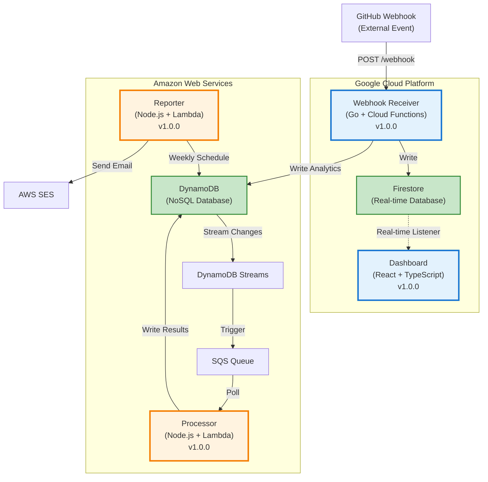
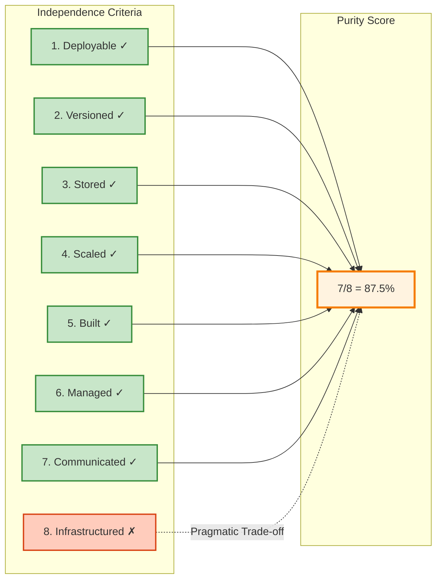

# Pure Microservices Architecture: What 87.5% Really Means

## Quick Summary

- ✓ **Pure microservices** have measurable independence criteria (8 dimensions)
- ✓ **CV Analytics scores 87.5%** across 6 independent services
- ✓ **Shared infrastructure** is a pragmatic trade-off, not an architectural failure
- ✓ **Multi-cloud deployment** (GCP + AWS) proves service independence
- ✓ **Event-driven communication** eliminates direct service coupling

---

## Introduction

Most portfolio projects claim to be microservices. Few actually are.

The difference isn't semantic. It's measurable. Pure microservices have specific characteristics: independent deployment, isolated data stores, separate version control, autonomous scaling. When you can measure these criteria, you can score architectural purity.

This post explains the CV Analytics architecture: 6 services spanning GCP and AWS, communicating through events, deployed independently. The 87.5% purity score comes from objective evaluation against 8 independence criteria. The missing 12.5% reflects a deliberate choice about infrastructure management.

**What you'll learn:**
- ✓ The 8 criteria that define microservices independence
- ✓ How to score your own architecture objectively
- ✓ Why shared infrastructure repositories aren't architectural sins
- ✓ When purity matters (and when pragmatism wins)

---

## Defining Pure Microservices

### The 8 Independence Criteria

A pure microservice is independently:

1. **Deployable** - Deploy without coordinating with other services
2. **Versioned** - Semantic versioning, independent release cycles
3. **Stored** - Separate version control repository
4. **Scaled** - Horizontal scaling based on service-specific load
5. **Built** - Independent CI/CD pipeline
6. **Managed** - Separate codebase, dependencies, configuration
7. **Communicated** - Async event-driven, no direct HTTP between services
8. **Infrastructured** - Service-specific cloud resources

Each criterion gets binary scoring: 1 (independent) or 0 (coupled). Total score = (sum / 8) × 100%.

This isn't academic purity for its own sake. Each criterion represents operational freedom: can you deploy this service at 3am without waking other teams? Can you scale it during a traffic spike without touching anything else? Can you migrate it to different cloud providers?

If the answer is "yes, but only if...", you've found coupling.

---

## CV Analytics Architecture Overview



**6 independent services:**
1. **Dashboard** (React + TypeScript + Firestore)
2. **Webhook Receiver** (Go + Cloud Functions)
3. **Processor** (Node.js + Lambda)
4. **Reporter** (Node.js + Lambda)
5. **Infrastructure** (Terraform)
6. **Emulator** (Development environment)

Each service: separate repository, independent version, isolated CI/CD, service-specific cloud resources.

---

## Scoring the Architecture: 87.5% Breakdown

### Criterion 1: Independent Deployment ✓

**Score: 1/1**

Each service deploys without coordination:
- Dashboard: Firebase Hosting (`firebase deploy`)
- Webhook Receiver: Cloud Functions (`gcloud functions deploy`)
- Processor: AWS Lambda (via GitHub Actions)
- Reporter: AWS Lambda (via GitHub Actions)

Deploy dashboard at 3am? No impact on processor. Roll back webhook receiver? Dashboard keeps running. This is independence.

### Criterion 2: Independent Versioning ✓

**Score: 1/1**

Each service maintains semantic versioning:
- Dashboard: v1.0.0
- Webhook Receiver: v1.0.0
- Processor: v1.0.0
- Reporter: v1.0.0

Git tags track releases per repository. Breaking changes in one service don't force version bumps in others.

### Criterion 3: Separate Version Control ✓

**Score: 1/1**

5 GitHub repositories:
- `cv-analytics-dashboard-private`
- `cv-analytics-webhook-receiver-private`
- `cv-analytics-processor-private`
- `cv-analytics-reporter-private`
- `cv-analytics-infrastructure-private`

No monorepo. Each service team (even if it's the same person) owns their codebase.

### Criterion 4: Independent Scaling ✓

**Score: 1/1**

Services scale based on their own load:
- Webhook receiver: Auto-scales with Cloud Functions (0-1000 instances)
- Processor: Lambda concurrency limits (per-function)
- Dashboard: CDN caching (Firebase Hosting)
- Reporter: Scheduled invocation (weekly, not load-based)

Spike in webhook traffic? Only webhook receiver scales. Processor unaffected.

### Criterion 5: Independent CI/CD ✓

**Score: 1/1**

Each repository has GitHub Actions workflow:
- Dashboard: Build React → Deploy Firebase
- Webhook: Build Go → Deploy Cloud Functions
- Processor/Reporter: Build Node.js → Deploy Lambda

Push to dashboard repo? Only dashboard builds and deploys. Other pipelines idle.

### Criterion 6: Independent Management ✓

**Score: 1/1**

Separate codebases, dependencies, configurations:
- Dashboard: `package.json` (React, TypeScript, Vite)
- Webhook: `go.mod` (Go dependencies)
- Processor/Reporter: `package.json` (Node.js, AWS SDK)

No shared code imports. No dependency coupling. Change processor's Node version? Dashboard unaffected.

### Criterion 7: Async Event-Driven Communication ✓

**Score: 1/1**

No direct HTTP calls between services:
- GitHub → Webhook (external trigger, not inter-service)
- Webhook → Firestore → Dashboard (event-driven)
- DynamoDB Streams → SQS → Processor (queue-based)
- EventBridge → Reporter (scheduled event)

Services don't know each other's URLs. No service discovery needed. Communication through events and queues.

### Criterion 8: Independent Infrastructure ✗

**Score: 0/1**

**This is where we lose 12.5%.**

All services share one infrastructure repository:
- `cv-analytics-infrastructure-private` provisions GCP and AWS resources
- Terraform modules for all services in one codebase
- Shared remote state (Terraform Cloud)

**Why this choice?**

1. **Operational efficiency**: One `terraform apply` provisions everything
2. **Cost management**: Unified view of multi-cloud spending
3. **Secrets management**: Centralised GitHub Secrets configuration
4. **Consistency**: Same Terraform patterns across services

**Could we have separate infrastructure repos?**

Yes. Each service could have its own Terraform code:
- `dashboard-infra/` repository
- `webhook-infra/` repository
- etc.

That would score 100%. But it would also mean:
- 5 Terraform state files to manage
- 5 separate `terraform plan` reviews
- 5 different secrets configurations
- Higher chance of configuration drift

**Real companies use shared infrastructure platforms.**

Netflix has a unified infrastructure layer. Amazon has service teams that provision from a central platform. Google has shared tooling for service deployment.

100% purity isn't the goal. Measured pragmatism is.

---

## Architecture Purity Scorecard



**What this score means:**
- **87.5% is excellent** for a portfolio project
- **7/8 independence** in operational dimensions
- **Pragmatic infrastructure** choice explained and measured
- **Production-grade patterns** used throughout

---

## When Purity Matters (And When It Doesn't)

### High Purity Required

**Multi-team organisations:**
- 50+ engineers across service teams
- Independent release schedules critical
- Team autonomy prioritised
- Conway's Law in effect

**Polyglot architectures:**
- Different languages per service (Go, Node.js, Python, Java)
- Language-specific tooling and dependencies
- Teams specialised in different tech stacks

**Regulatory compliance:**
- Service isolation for audit trails
- Separate security boundaries
- Independent certification per service

### Pragmatism Acceptable

**Single-team projects:**
- 1-5 engineers owning everything
- Coordination overhead minimal
- Shared infrastructure reduces complexity

**Portfolio demonstrations:**
- Proving architectural understanding
- Showing deployment automation
- Time-to-market more important than perfect isolation

**Startup MVPs:**
- Speed over purity
- Infrastructure as shared platform
- Microservices patterns without full independence

**CV Analytics fits the pragmatism category.** One developer, proving concepts, optimising for operational simplicity. 87.5% purity demonstrates understanding without over-engineering.

---

## Measuring Your Own Architecture

### The Purity Checklist

Ask these questions for each service:

**1. Deployment Independence**
- [ ] Can I deploy this service without deploying anything else?
- [ ] Can I roll back this service independently?
- [ ] Do I need to coordinate deployment timing with other teams?

**2. Version Independence**
- [ ] Does this service have its own version number?
- [ ] Can I make breaking changes without impacting other services?
- [ ] Are releases tracked per service?

**3. Repository Independence**
- [ ] Does this service have its own repository?
- [ ] Is source code isolated from other services?
- [ ] Can teams work in parallel without merge conflicts?

**4. Scaling Independence**
- [ ] Does this service scale based on its own load?
- [ ] Can I configure auto-scaling per service?
- [ ] Does scaling one service affect others?

**5. CI/CD Independence**
- [ ] Does this service have its own build pipeline?
- [ ] Do builds trigger only for service-specific changes?
- [ ] Can I change deployment process without affecting other services?

**6. Management Independence**
- [ ] Does this service have its own dependencies?
- [ ] Can I upgrade libraries without touching other services?
- [ ] Is configuration isolated per service?

**7. Communication Independence**
- [ ] Do services communicate asynchronously?
- [ ] Are there direct HTTP calls between services?
- [ ] Do services know each other's endpoints?

**8. Infrastructure Independence**
- [ ] Does this service provision its own cloud resources?
- [ ] Is infrastructure code isolated per service?
- [ ] Can I change cloud providers for one service?

**Scoring:**
- Count "yes" answers
- Score = (yes_count / 8) × 100%
- 100% = Pure microservices
- 75-99% = Pragmatic microservices
- 50-74% = Microservices-inspired monolith
- <50% = Distributed monolith

---

## Practical Takeaways

### Architecture Decisions

1. **Purity is measurable, not subjective**
   - Use the 8 criteria for objective scoring
   - Document trade-offs explicitly
   - Justify pragmatic choices with reasoning

2. **Shared infrastructure isn't a failure**
   - Many companies use unified platforms
   - Operational simplicity has value
   - Measure the trade-off, make informed choices

3. **Event-driven communication is critical**
   - No direct HTTP between services
   - Queues and streams decouple services
   - Async patterns enable independence

4. **Multi-cloud proves service isolation**
   - GCP and AWS in one system
   - Services don't care which cloud they run on
   - True portability demonstrated

### Implementation Guidance

**Start with these patterns:**
- ✓ Separate repository per service
- ✓ Independent CI/CD pipelines
- ✓ Semantic versioning per service
- ✓ Event-driven communication
- ✓ Service-specific cloud resources

**Compromise pragmatically on:**
- ✓ Shared infrastructure repository (if team is small)
- ✓ Shared monitoring/logging (operational efficiency)
- ✓ Centralised secrets management (security consistency)

**Never compromise on:**
- ✗ Direct HTTP calls between services (coupling)
- ✗ Shared databases (data coupling)
- ✗ Coordinated deployments (operational coupling)

---

## What's Next

**Part 2: Multi-Cloud Infrastructure as Code with Terraform**

Now that we've established what makes microservices "pure", the next question is: how do you provision all this infrastructure consistently across GCP and AWS?

Part 2 covers:
- ✓ Terraform for multi-cloud provisioning
- ✓ Remote state management with Terraform Cloud
- ✓ Secrets handling and environment variables
- ✓ Rollback strategies and disaster recovery
- ✓ The pragmatic choice: one infrastructure repository

**Preview:**
```bash
terraform plan   # Review GCP Functions + AWS Lambda together
terraform apply  # Provision everything in one command
```

**Repository:** [cv-analytics-infrastructure-private](https://github.com/josejalvarezm/cv-analytics-infrastructure-private)

---

## Further Reading

**From this series:**
- [00-series-overview.md](./00-series-overview.md) - Series introduction and architecture metrics
- Part 2: Infrastructure as Code (coming next)

**External resources:**
- [Martin Fowler: Microservices](https://martinfowler.com/articles/microservices.html)
- [Sam Newman: Building Microservices](https://samnewman.io/books/building_microservices_2nd_edition/)
- [Semantic Versioning 2.0.0](https://semver.org/)

**CV Analytics documentation:**
- [PURE-MICROSERVICES-ARCHITECTURE.md](https://github.com/josejalvarezm/cv-analytics-dashboard-private/blob/main/PURE-MICROSERVICES-ARCHITECTURE.md)
- [ARCHITECTURE-COMPLETE.md](https://github.com/josejalvarezm/cv-analytics-dashboard-private/blob/main/ARCHITECTURE-COMPLETE.md)

---

**Author:** José Álvarez  
**Series:** CV Analytics Multi-Cloud Microservices  
**Published:** November 2025  
**Tags:** microservices, architecture, multi-cloud, GCP, AWS, event-driven
