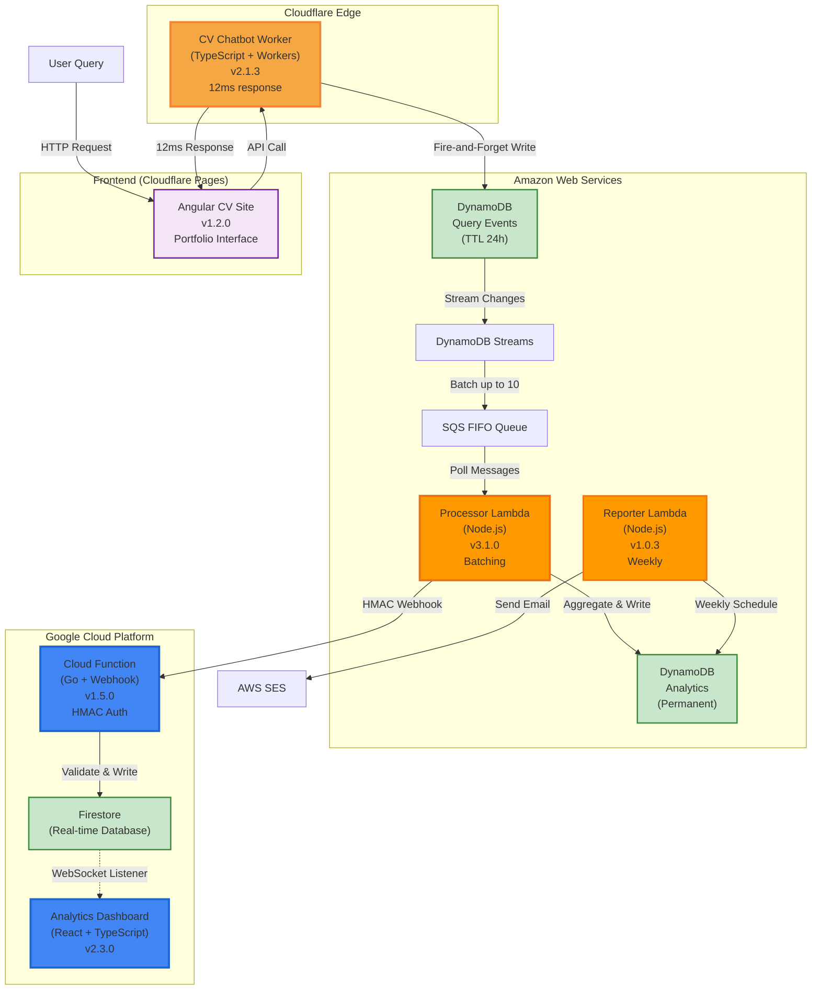
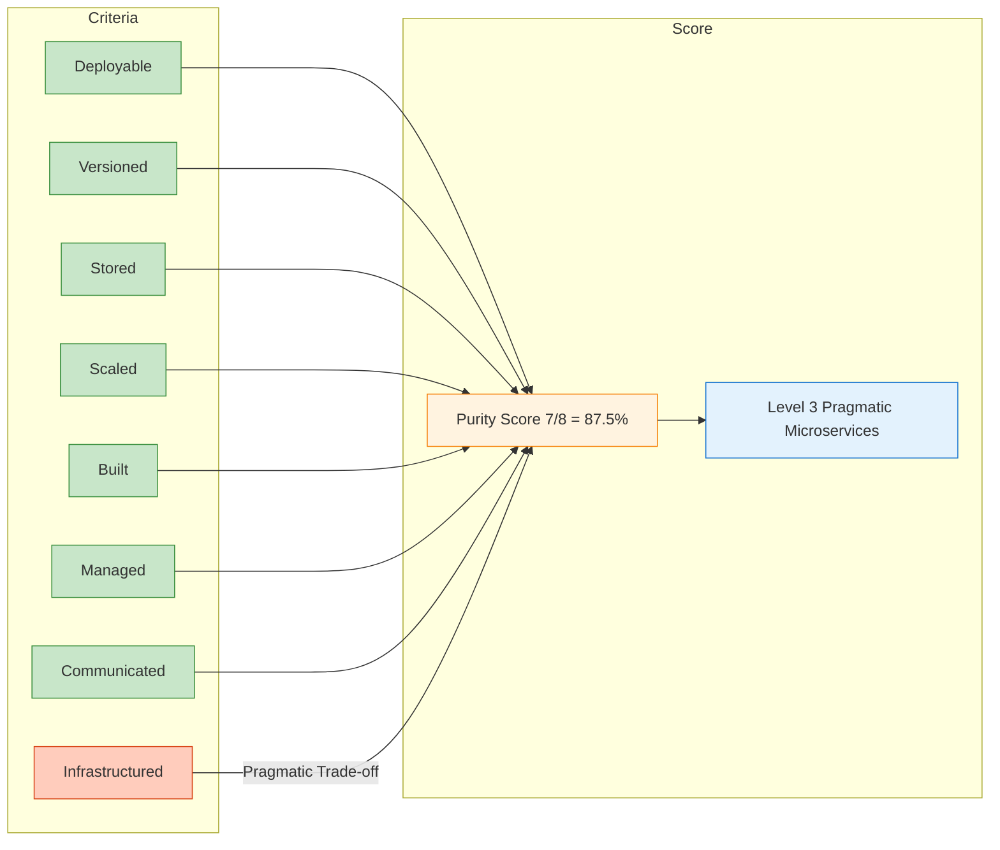
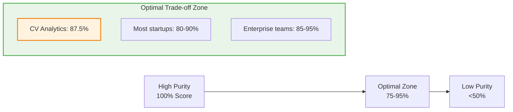

# **Pure Microservices Architecture: What 87.5% Really Means (GCP Series: Real-time Analytics & Firestore, Part II)**

*Six services across three clouds scored against 8 independence criteria: deployment, versioning, storage, scaling, CI/CD, management, communication, and infrastructure, achieving 87.5% purity with measured trade-offs.*

## Contents

- [Quick Summary](#quick-summary)
- [Introduction](#introduction)
- [Why Microservices?](#why-microservices)
- [Defining Pure Microservices](#defining-pure-microservices)
- [CV Analytics Architecture Overview](#cv-analytics-architecture-overview)
- [Scoring the Architecture: 87.5% Breakdown](#scoring-the-architecture-875-breakdown)
- [Architecture Purity Scorecard](#architecture-purity-scorecard)
- [Interpreting Your Score: Context Matters](#interpreting-your-score-context-matters)
- [When Purity Matters (And When It Doesn't)](#when-purity-matters-and-when-it-doesnt)
- [Measuring Your Own Architecture](#measuring-your-own-architecture)
- [Practical Takeaways](#practical-takeaways)
- [What's Next](#whats-next)
- [Further Reading](#further-reading)

---

## Quick Summary

- ✓ **Why microservices?** Independent tech choices, deployment velocity, multi-cloud strategy, scaling requirements
- ✓ **Pure microservices** have measurable independence criteria (8 dimensions)
- ✓ **CV Analytics scores 87.5%** across 6 independent services
- ✓ **Shared infrastructure** is a pragmatic trade-off, not an architectural failure
- ✓ **Multi-cloud deployment** (Cloudflare + AWS + GCP) proves service independence
- ✓ **Event-driven communication** eliminates direct service coupling

---

## Introduction

Most portfolio projects claim to be microservices. Few actually are.

The difference isn't semantic. It's measurable. Pure microservices have specific characteristics: independent deployment, isolated data stores, separate version control, autonomous scaling. When you can measure these criteria, you can score architectural purity.

This post explains the CV Analytics architecture: 6 services spanning Cloudflare, AWS, and GCP, communicating through events, deployed independently. First, we'll cover WHY microservices were chosen (not just for resume padding). Then we'll measure architectural purity: the 87.5% score comes from objective evaluation against 8 independence criteria. The missing 12.5% reflects a deliberate choice about infrastructure management.

**What you'll learn:**

- ✓ Why microservices were chosen for CV Analytics
- ✓ The 8 criteria that define microservices independence
- ✓ How to score your own architecture objectively
- ✓ Why shared infrastructure repositories aren't architectural sins
- ✓ When purity matters (and when pragmatism wins)

---

## Why Microservices?

**The problem:** Portfolio projects often suffer from "resume-driven development" - using microservices because they look good on a CV, not because they solve real problems.

**CV Analytics chose microservices for legitimate reasons:**

### 1. Independent Technology Choices

Each service uses the best tool for its job:

- **Cloudflare Worker:** TypeScript on edge (1.87s P95 end-to-end, 12ms analytics write)
- **AWS Lambda Processor:** Node.js (native DynamoDB SDK, JSON processing)
- **GCP Cloud Function:** Go (native Firestore SDK, HMAC validation performance)
- **React Dashboard:** TypeScript (real-time UI with Firestore WebSocket)
- **Angular Site:** TypeScript (static site, Cloudflare Pages CDN)

**Monolith alternative:** Force Go/Node.js/TypeScript everywhere, or build polyglot monolith with shared dependencies.

### 2. Independent Deployment Velocity

Different services have different change frequencies:

- **Angular CV Site:** Daily updates (content changes, new projects)
- **React Dashboard:** Weekly UI improvements
- **Cloudflare Worker:** Stable (12ms optimization done, minimal changes)
- **AWS Lambda Processor:** Monthly (batching logic stable)
- **GCP Cloud Function:** Quarterly (HMAC validation unchanged for months)
- **Reporter Lambda:** Rarely (email templates stable)

**Monolith alternative:** Deploy entire system for content changes. One bug in dashboard affects stable backend.

### 3. Multi-Cloud Provider Strategy

Services span 3 cloud providers with different strengths:

- **Cloudflare:** Edge compute (12ms global latency, DDoS protection)
- **AWS:** Event streams (DynamoDB Streams, SQS FIFO, mature Lambda ecosystem)
- **GCP:** Real-time database (Firestore WebSocket, Firebase Hosting integration)

**Monolith alternative:** Pick one cloud, lose provider-specific benefits. Can't optimize for edge + events + real-time.

### 4. Independent Scaling Requirements

Each service has unique scaling patterns:

- **Cloudflare Worker:** 3,000 requests/month (chatbot queries)
- **AWS Lambda Processor:** 300 invocations/month (10:1 batching)
- **GCP Cloud Function:** 300 invocations/month (AWS webhook receiver)
- **Reporter Lambda:** 4 invocations/month (weekly schedule)
- **React Dashboard:** Static hosting (CDN, no compute scaling needed)

**Monolith alternative:** One scaling configuration for all. Over-provision for peak (Reporter) or under-provision for chatbot spikes.

### 5. Portfolio Demonstration Goals

**What this architecture proves:**

- ✓ Multi-cloud orchestration (3 providers in one system)
- ✓ Event-driven patterns (DynamoDB Streams, SQS, Firestore WebSocket)
- ✓ Cross-cloud security (HMAC webhooks, IAM credentials, SigV4)
- ✓ Cost optimization (£0.00/month across 3 clouds for 6 months)
- ✓ Independent CI/CD (7 repositories, separate pipelines)

**What a monolith would hide:**

- Cross-cloud communication patterns
- Service independence trade-offs
- Multi-provider IAM complexity
- Independent versioning discipline

---

**When NOT to use microservices:**

This architecture makes sense for CV Analytics. It wouldn't make sense for:

- **CRUD apps** with simple database operations (monolith easier)
- **Single-team startups** with <5 engineers (coordination overhead too high)
- **Tight-coupling domains** where services share complex business logic
- **Low-traffic MVPs** where free tier limits don't matter

**The decision isn't "microservices vs monolith" - it's "what problems am I solving?"**

For CV Analytics: multi-cloud, edge latency, independent deployment, portfolio demonstration. Microservices solve these. For a simple blog? Monolith wins.

---

## Defining Pure Microservices

### The 8 Independence Criteria

A pure microservice is independently:

1. **Deployable** - Deploy without coordinating with other services
2. **Versioned** - Semantic versioning, independent release cycles
3. **Stored** - Separate version control repository
4. **Scaled** - Horizontal scaling based on service-specific load
5. **Built** - Independent CI/CD pipeline
6. **Managed** - Separate codebase, dependencies, configuration
7. **Communicated** - Async event-driven, no direct HTTP between services
8. **Infrastructured** - Service-specific cloud resources

### Scoring Approach

Each criterion gets binary scoring: **1 (independent)** or **0 (coupled)**. Total score = `(sum / 8) × 100%`.

### Scoring Nuance: Binary vs. Weighted Approaches

While the 8 criteria are scored as binary (1 or 0) for clarity, real-world architectures often exhibit **partial independence**. For deeper analysis, consider this three-tier system:

| Score | Meaning | Example |
|-------|---------|---------|
| **1.0** | Fully independent | Separate Terraform repo per service |
| **0.5** | Partially independent | Shared repo but isolated modules with separate state |
| **0.0** | Fully coupled | Monolithic infrastructure |

**CV Analytics with weighted scoring:**

- 7 full points (Deployment, Versioning, Storage, Scaling, CI/CD, Management, Communication)
- 0.5 for Infrastructure (shared repo but modular with isolated resources)
- **Total: 7.5/8 = 93.75%**

**Recommendation:** Use binary scoring for initial assessment to keep it actionable. Use weighted scoring for architectural reviews or when justifying trade-offs to stakeholders.

This isn't academic purity for its own sake. Each criterion represents operational freedom: can you deploy this service at 3am without waking other teams? Can you scale it during a traffic spike without touching anything else? Can you migrate it to different cloud providers?

If the answer is "yes, but only if...", you've found coupling.

---

## CV Analytics Architecture Overview



**6 independent services across 3 clouds:**

**Cloudflare:**

1. **CV Chatbot Worker** (TypeScript, edge compute, 12ms response, v2.1.3)

**AWS (us-east-1):**
2. **Processor Lambda** (Node.js, SQS batching, HMAC signing, v3.1.0)
3. **Reporter Lambda** (Node.js, weekly emails via SES, v1.0.3)

**GCP (us-central1):**
4. **Cloud Function Webhook** (Go, HMAC validation from AWS Lambda, v1.5.0)

**Frontend:**
5. **Angular CV Site** (Cloudflare Pages, portfolio interface, v1.2.0)
6. **React Analytics Dashboard** (Firebase Hosting, real-time WebSocket, v2.3.0)

**Infrastructure:** Terraform (multi-cloud: AWS + GCP providers in one config)

Each service: separate repository, independent version, isolated CI/CD, service-specific cloud resources across 3 providers.

---

## Scoring the Architecture: 87.5% Breakdown

### Criterion 1: Independent Deployment ✓

**Score: 1/1**

Each service deploys without coordination across 3 clouds:

- **Angular CV Site:** Cloudflare Pages (`wrangler pages deploy`)
- **Cloudflare Worker:** Wrangler CLI (`wrangler deploy`)
- **AWS Lambda Processor:** GitHub Actions → AWS (`aws lambda update-function-code`)
- **AWS Lambda Reporter:** GitHub Actions → AWS (independent pipeline)
- **GCP Cloud Function:** GitHub Actions → GCP (`gcloud functions deploy`)
- **React Dashboard:** Firebase Hosting (`firebase deploy`)

Deploy Cloudflare Worker at 3am? No impact on AWS Lambda or GCP. Roll back GCP Cloud Function? Cloudflare and React Dashboard keep running. Update Angular site? Zero impact on backend services. This is true cross-cloud independence.

### Criterion 2: Independent Versioning ✓

**Score: 1/1**

Each service maintains semantic versioning across 3 clouds:

- **Angular CV Site:** v1.2.0 (portfolio interface updates)
- **Cloudflare Worker:** v2.1.3 (12ms optimization, MAJOR rewrite)
- **AWS Processor Lambda:** v3.1.0 (GCP webhook integration, 2 MAJOR bumps)
- **AWS Reporter Lambda:** v1.0.3 (only bug fixes, stable)
- **GCP Cloud Function:** v1.5.0 (HMAC validation, stable API)
- **React Dashboard:** v2.3.0 (TypeScript rewrite, frequent UI updates)

Git tags track releases per repository. Breaking changes in AWS Lambda don't force version bumps in GCP Cloud Function. Cloudflare Worker v2.0.0 (12ms optimization) didn't require changes to any other service.

### Criterion 3: Separate Version Control ✓

**Score: 1/1**

7 GitHub repositories across 3 clouds:

**Cloudflare:**

- `cv-chatbot-worker-private` (TypeScript Worker, edge compute)
- `cv-site-angular-private` (Angular, Cloudflare Pages)

**AWS:**

- `cv-analytics-processor-private` (Node.js Lambda, SQS batching)
- `cv-analytics-reporter-private` (Node.js Lambda, weekly reports)

**GCP:**

- `cv-analytics-webhook-receiver-private` (Go Cloud Function, HMAC)

**Frontend (Firebase):**

- `cv-analytics-dashboard-private` (React, Firebase Hosting)

**Infrastructure:**

- `cv-analytics-infrastructure-private` (Terraform multi-cloud)

No monorepo. Each service team (even if it's the same person) owns their codebase. Cross-cloud independence proven by separate repositories per provider.

### Criterion 4: Independent Scaling ✓

**Score: 1/1**

Services scale based on their own load across 3 clouds:

- **Cloudflare Worker:** Auto-scales globally (250+ edge locations, unlimited instances)
- **Cloudflare Pages (Angular):** CDN caching (global edge network)
- **AWS Lambda Processor:** Concurrency limits per function (default 1000)
- **AWS Lambda Reporter:** Scheduled invocation (weekly, not load-based)
- **GCP Cloud Function:** Auto-scales (0-1000 instances based on webhook volume)
- **React Dashboard:** Firebase Hosting CDN (automatic global distribution)

Spike in CV chatbot queries? Only Cloudflare Worker scales at the edge. AWS Lambda and GCP Cloud Function scale independently based on their own processing load. Frontend CDNs handle static assets separately.

### Criterion 5: Independent CI/CD ✓

**Score: 1/1**

Each repository has independent CI/CD pipeline:

- **Angular Site:** Build Angular → Deploy Cloudflare Pages
- **Cloudflare Worker:** Build TypeScript → Deploy Wrangler
- **AWS Processor:** Build Node.js → Deploy Lambda (AWS credentials)
- **AWS Reporter:** Build Node.js → Deploy Lambda (separate pipeline)
- **GCP Cloud Function:** Build Go → Deploy gcloud (GCP credentials)
- **React Dashboard:** Build React → Deploy Firebase

Push to Cloudflare Worker repo? Only Worker builds and deploys to edge. AWS and GCP pipelines idle. Push to GCP Cloud Function? Zero impact on Cloudflare or AWS builds. True cross-cloud CI/CD independence.

### Criterion 6: Independent Management ✓

**Score: 1/1**

Separate codebases, dependencies, configurations across 3 clouds:

- **Angular Site:** `package.json` (Angular, TypeScript, RxJS)
- **Cloudflare Worker:** `package.json` (TypeScript, AWS SDK for DynamoDB, Wrangler)
- **AWS Processor:** `package.json` (Node.js 20.x, AWS SDK v3, HMAC crypto)
- **AWS Reporter:** `package.json` (Node.js, AWS SDK, SES email)
- **GCP Cloud Function:** `go.mod` (Go 1.21, Firestore SDK, HMAC validation)
- **React Dashboard:** `package.json` (React, TypeScript, Vite, Firestore SDK)

No shared code imports across clouds. No dependency coupling. Change AWS Lambda Node version to 22.x? Cloudflare Worker and GCP Cloud Function unaffected. Update GCP Go runtime to 1.22? Zero impact on AWS or Cloudflare services.

### Criterion 7: Async Event-Driven Communication ✓

**Score: 1/1**

No direct HTTP calls between services (except cross-cloud webhooks with HMAC auth):

- **User → Angular → Cloudflare Worker:** User-facing HTTP (not inter-service)
- **Cloudflare → AWS DynamoDB:** Fire-and-forget writes (async, no response needed)
- **DynamoDB Streams → SQS → AWS Lambda:** Event-driven, queue-based
- **AWS Lambda → GCP Cloud Function:** Cross-cloud webhook (HMAC-signed, not service coupling)
- **GCP Cloud Function → Firestore:** Event-driven writes
- **Firestore → React Dashboard:** Real-time WebSocket listeners
- **EventBridge → Reporter:** Scheduled event (weekly)

Services don't know each other's internal URLs. AWS Lambda only knows GCP webhook URL (public endpoint, HMAC-authenticated). No service discovery needed. Cross-cloud communication through signed webhooks and event streams.

### Criterion 8: Independent Infrastructure ✗

**Score: 0/1**

**This is where we lose 12.5%.**

All services share one infrastructure repository:

- `cv-analytics-infrastructure-private` provisions GCP and AWS resources
- Terraform modules for all services in one codebase
- Shared remote state (Terraform Cloud)

#### 🔁 The Infrastructure Spectrum: From Pure to Pragmatic

Consider infrastructure independence as a spectrum rather than binary:


**Why shared infrastructure with modular isolation still qualifies as microservices:**

- **Runtime independence is preserved:** Services scale, fail, and deploy independently
- **Operational coupling ≠ architectural coupling:** Shared Terraform code doesn't mean shared databases or APIs
- **Industry precedent:** Netflix, Amazon, and Google use shared infrastructure platforms while maintaining service autonomy

**Why this pragmatic choice?**

1. **Operational efficiency:** One `terraform apply` provisions everything
2. **Cost management:** Unified view of multi-cloud spending
3. **Secrets management:** Centralised GitHub Secrets configuration
4. **Consistency:** Same Terraform patterns across services

**Could we have separate infrastructure repos?**

Yes. Each service could have its own Terraform code:

- `dashboard-infra/` repository
- `webhook-infra/` repository
- etc.

That would score 100%. But it would also mean:

- 5 Terraform state files to manage
- 5 separate `terraform plan` reviews
- 5 different secrets configurations
- Higher chance of configuration drift

**The key question isn't "do we share infrastructure code?" but "does this coupling force operational coordination?"**

For CV Analytics, the answer is **no** — which is why we maintain microservices characteristics despite the shared repository.

---

## Architecture Purity Scorecard

<!-- markdownlint-disable -->

<!-- markdownlint-enable -->

**What this score means:**

- **87.5% is excellent** for a portfolio project
- **7/8 independence** in operational dimensions
- **Pragmatic infrastructure** choice explained and measured
- **Production-grade patterns** used throughout
- **Level 3 maturity** in microservices evolution

---

## Interpreting Your Score: Context Matters

### **The Purity-Performance Trade-off Curve**



**Higher purity (90-100%) is optimal when:**

- Multiple autonomous teams (10+ engineers per service)
- Regulatory requirements demand strict isolation
- Services have radically different scaling patterns

**Lower purity (75-90%) is optimal when:**

- Small team (<10 engineers total)
- Portfolio project or MVP
- Operational simplicity > theoretical purity
- You're optimizing for developer experience over team autonomy

**CV Analytics at 87.5%** sits in the sweet spot: enough independence to demonstrate architectural understanding, enough pragmatism to remain maintainable by one developer.

### **Weighted vs. Binary Scoring Interpretation**

| Scoring Method | CV Analytics Score | Interpretation |
|----------------|--------------------|----------------|
| **Binary (Simple)** | 87.5% | Pragmatic microservices with one clear trade-off |
| **Weighted (Nuanced)** | 93.75% | Nearly pure microservices with infrastructure as a minor compromise |

**Takeaway:** Your score tells a story about your priorities. CV Analytics prioritizes operational simplicity over absolute purity, which is the right choice for a portfolio project maintained by a single developer.

---

## When Purity Matters (And When It Doesn't)

### The Microservices Maturity Model

To help contextualize architectural purity, consider this maturity framework:

| Level | Score Range | Characteristics | Typical Use Case |
|-------|-------------|-----------------|------------------|
| **1. Monolith** | 0–49% | Shared everything; distributed monolith risks | Early-stage startups, simple CRUD apps |
| **2. Microservices-Inspired** | 50–74% | Some independence; shared infra/logging | Growing teams, product-market fit phase |
| **3. Pragmatic Microservices** | 75–94% | Most criteria met; shared infra for ops simplicity | Small-medium teams, portfolio projects, MVPs |
| **4. Pure Microservices** | 95–100% | Full independence; each service owns its infra | Large enterprises, multi-team organizations |

**CV Analytics scores 87.5%, placing it in Level 3: Pragmatic Microservices.** This is often the optimal level for small teams and portfolio projects where operational simplicity outweighs theoretical purity.

### High Purity Required

**Multi-team organisations:**

- 50+ engineers across service teams
- Independent release schedules critical
- Team autonomy prioritised
- Conway's Law in effect

**Polyglot architectures (optional, but common at scale):**

- Different languages per service (Go, Node.js, Python, Java)
- Language-specific tooling and dependencies
- Teams specialised in different tech stacks

**Regulatory compliance:**

- Service isolation for audit trails
- Separate security boundaries
- Independent certification per service

### Pragmatism Acceptable

**Single-team projects:**

- 1-5 engineers owning everything
- Coordination overhead minimal
- Shared infrastructure reduces complexity

**Portfolio demonstrations:**

- Proving architectural understanding
- Showing deployment automation
- Time-to-market more important than perfect isolation

**Startup MVPs:**

- Speed over purity
- Infrastructure as shared platform
- Microservices patterns without full independence

**CV Analytics fits the pragmatism category.** One developer, proving concepts, optimising for operational simplicity. 87.5% purity demonstrates understanding without over-engineering.

### Common Trade-Offs in Real-World Microservices

| Criterion | Pure Approach | Pragmatic Approach | When to Choose Pragmatic |
|-----------|---------------|-------------------|---------------------------|
| **Infrastructure** | Separate repo per service | Shared repo with modules | Small team, portfolio project, MVP |
| **CI/CD** | Fully isolated pipelines | Shared pipeline with triggers | Limited engineering resources |
| **Monitoring** | Service-specific dashboards | Centralized observability platform | Faster troubleshooting needed |
| **Secrets** | Per-service secret management | Centralized vault with fine-grained access | Security consistency required |

---

## Measuring Your Own Architecture

### The Purity Checklist

Ask these questions for each service:

**1. Deployment Independence**

- [ ] Can I deploy this service without deploying anything else?
- [ ] Can I roll back this service independently?
- [ ] Do I need to coordinate deployment timing with other teams?

**2. Version Independence**

- [ ] Does this service have its own version number?
- [ ] Can I make breaking changes without impacting other services?
- [ ] Are releases tracked per service?

**3. Repository Independence**

- [ ] Does this service have its own repository?
- [ ] Is source code isolated from other services?
- [ ] Can teams work in parallel without merge conflicts?

**4. Scaling Independence**

- [ ] Does this service scale based on its own load?
- [ ] Can I configure auto-scaling per service?
- [ ] Does scaling one service affect others?

**5. CI/CD Independence**

- [ ] Does this service have its own build pipeline?
- [ ] Do builds trigger only for service-specific changes?
- [ ] Can I change deployment process without affecting other services?

**6. Management Independence**

- [ ] Does this service have its own dependencies?
- [ ] Can I upgrade libraries without touching other services?
- [ ] Is configuration isolated per service?

**7. Communication Independence**

- [ ] Do services communicate asynchronously?
- [ ] Are there direct HTTP calls between services?
- [ ] Do services know each other's endpoints?

**8. Infrastructure Independence**

- [ ] Does this service provision its own cloud resources?
- [ ] Is infrastructure code isolated per service?
- [ ] Can I change cloud providers for one service?

### Enhanced Scoring Framework

**Quick Assessment (Binary):**

- Count "yes" answers (1 point each)
- Score = `(yes_count / 8) × 100%`

**Detailed Assessment (Weighted):**

- Use the three-tier system: **1.0** (fully independent), **0.5** (partially independent), **0.0** (coupled)
- Score = `(sum of weighted points / 8) × 100%`

**Architecture Classification:**

| Score Range | Classification | Characteristics |
|-------------|----------------|-----------------|
| **90-100%** | Pure Microservices | Full independence; each service owns its infra |
| **75-89%**  | Pragmatic Microservices | Most criteria met; shared infra for ops simplicity |
| **60-74%**  | Microservices-Inspired | Some independence; evolving from monolith |
| **<60%**    | Distributed Monolith | Microservices in name only; high coupling |

**CV Analytics Scores:**

- **Binary:** 87.5% (7/8) → Pragmatic Microservices
- **Weighted:** 93.75% (7.5/8) → Borderline Pure Microservices
- **Conclusion:** The architecture achieves functional independence with operational pragmatism.

---

## Practical Takeaways

### Architecture Decisions

1. **Purity is measurable, not subjective**
   - Use the 8 criteria for objective scoring
   - Document trade-offs explicitly
   - Justify pragmatic choices with reasoning

2. **Shared infrastructure isn't a failure**
   - Many companies use unified platforms
   - Operational simplicity has value
   - Measure the trade-off, make informed choices

3. **Event-driven communication is critical**
   - No direct HTTP between services
   - Queues and streams decouple services
   - Async patterns enable independence

4. **Multi-cloud proves service isolation**
   - Cloudflare Edge, AWS us-east-1, and GCP us-central1 in one system
   - Services don't care which cloud they run on
   - True cross-cloud portability demonstrated (3 providers)

5. **Use a maturity model to contextualize your score**
   - Don't aim for 100% purity unless your organization size and complexity require it
   - Most real-world systems fall into the "pragmatic microservices" range (75-94%)

### Implementation Guidance

**Start with these patterns:**

- ✓ Separate repository per service
- ✓ Independent CI/CD pipelines
- ✓ Semantic versioning per service
- ✓ Event-driven communication
- ✓ Service-specific cloud resources

**Compromise pragmatically on:**

- ✓ Shared infrastructure repository (if team is small)
- ✓ Shared monitoring/logging (operational efficiency)
- ✓ Centralised secrets management (security consistency)

**Never compromise on:**

- ✗ Direct HTTP calls between services (coupling)
- ✗ Shared databases (data coupling)
- ✗ Coordinated deployments (operational coupling)

### Quick Integration Guide for Your Next Project

1. **Begin with binary scoring** to identify obvious coupling
2. **Use weighted scoring** to justify pragmatic trade-offs to stakeholders
3. **Target 80-90% purity** for most real-world projects
4. **Document every "0.5" score** with a clear rationale
5. **Re-evaluate annually** as your team and requirements evolve

---

## What's Next

**Part 2: Event-Driven Architecture Patterns**

Now that we've established what makes microservices "pure", the next question is: how do they communicate without coupling?

Part 2 covers:

- ✓ Async communication via SQS and DynamoDB Streams
- ✓ Event correlation across distributed services
- ✓ Real-time updates with Firestore listeners
- ✓ Dead letter queues and error handling
- ✓ When NOT to use event-driven patterns

**Preview:**

```javascript
// Cross-cloud event-driven flow
User → Cloudflare Worker (12ms) → AWS DynamoDB (fire-and-forget)
  → DynamoDB Streams → SQS → Lambda Processor (batch 10:1)
  → HMAC webhook → GCP Cloud Function → Firestore → Dashboard (WebSocket)
```

**Focus:** Decoupling services through events, queues, and cross-cloud webhooks.

---

## Further Reading

**From this series:**

- *[Part I: Real-time Analytics with Firestore](link-to-part-i)*

**External resources:**

- [Martin Fowler: Microservices](https://martinfowler.com/articles/microservices.html)
- [Sam Newman: Building Microservices](https://samnewman.io/books/building_microservices_2nd_edition/)
- [Semantic Versioning 2.0.0](https://semver.org/)

---

**📊 Ready to score your own architecture?** Use the purity checklist above, be honest about trade-offs, and remember: pragmatic microservices that solve real problems beat theoretically perfect ones every time.
