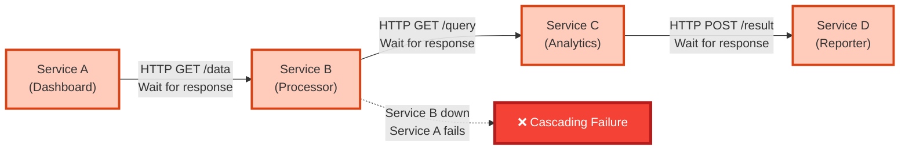
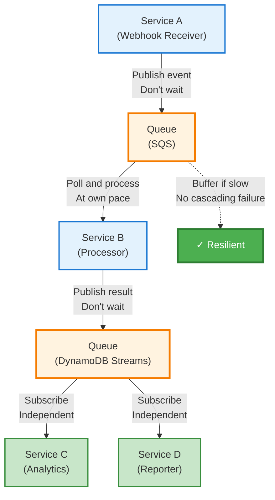

# Event-Driven Architecture: Decoupling Microservices with Queues and Streams

*Breaking synchronous coupling through DynamoDB Streams, SQS FIFO queues, Firestore WebSocket listeners, and event correlation, enabling independent service operation across Cloudflare, AWS, and GCP.*

- [Quick Summary](#quick-summary)
- [Introduction](#introduction)
- [Synchronous vs Asynchronous: The Coupling Problem](#synchronous-vs-asynchronous-the-coupling-problem)
- [Async Patterns: Queues and Streams](#async-patterns-queues-and-streams)
- [GCP Pipeline: Webhook → Firestore → Dashboard](#gcp-pipeline-webhook--firestore--dashboard)
- [AWS Pipeline: DynamoDB Streams → SQS → Lambda](#aws-pipeline-dynamodb-streams--sqs--lambda)
- [Event Correlation: Matching Queries and Responses](#event-correlation-matching-queries-and-responses)
- [Error Handling and Retries](#error-handling-and-retries)
- [Trade-offs: Complexity vs Resilience](#trade-offs-complexity-vs-resilience)
- [Practical Takeaways](#practical-takeaways)
- [What's Next](#whats-next)
- [Further Reading](#further-reading)

## Quick Summary

- ✓ **Event-driven communication** eliminates direct HTTP coupling between services
- ✓ **SQS queues** buffer traffic spikes and enable async processing
- ✓ **DynamoDB Streams** capture database changes and trigger workflows
- ✓ **Firestore real-time listeners** provide WebSocket updates to dashboard
- ✓ **Event correlation** matches queries with responses across distributed services

---

## Introduction

Microservices that call each other directly aren't truly independent.

When Service A makes an HTTP request to Service B, they're coupled. If Service B is down, Service A fails. If Service B is slow, Service A waits. If Service B changes its API, Service A breaks. This synchronous request-response pattern undermines the core benefit of microservices: independent operation.

Event-driven architecture breaks this coupling. Services communicate through events, not direct calls. A service publishes an event to a queue or stream. Other services subscribe and process events at their own pace. If a consumer is down, events wait in the queue. If a consumer is slow, the producer doesn't wait. If an event format changes, versioning manages compatibility.

This post explains the event-driven patterns in CV Analytics: how GitHub webhooks trigger real-time dashboard updates through Firestore, how DynamoDB Streams feed SQS queues for Lambda processing, and how event correlation tracks workflows across distributed services.

**What you'll learn:**

- ✓ Why synchronous HTTP calls create cascading failures
- ✓ How message queues (SQS) buffer traffic and enable async processing
- ✓ How event streams (DynamoDB Streams) capture state changes
- ✓ How real-time listeners (Firestore) provide WebSocket updates
- ✓ How to correlate events across distributed services without tight coupling

---

## Synchronous vs Asynchronous: The Coupling Problem

### The Synchronous Trap

Traditional microservices architectures use HTTP for service-to-service communication. Service A calls Service B's REST API. Service B processes the request and returns a response. This feels natural because it mirrors how humans think: ask a question, wait for an answer.

The problem appears under load or failure:

**Cascading failures:** Service B goes down. Service A's requests time out. Service A starts failing. Service C calls Service A and also fails. One service failure cascades through the entire system.

**Latency amplification:** Service A calls Service B (100ms). Service B calls Service C (100ms). Service C calls Service D (100ms). Total latency: 300ms minimum. Each service in the chain adds delay. The user waits.

**Retry storms:** Service B is slow. Service A times out and retries. Multiply by 1000 concurrent requests. Service B receives 2000 requests instead of 1000. It slows down further. More timeouts, more retries. The system melts down.

**Tight coupling:** Service A needs to know Service B's URL, authentication method, API contract, and response format. Service B changes its API. Service A breaks. Coordinated deployment required. Independence lost.



### The Asynchronous Solution

Event-driven architecture breaks these chains. Services publish events to queues or streams. Other services subscribe and process events independently. No direct calls. No waiting. No cascading failures.

**Resilience through decoupling:** Service B goes down. Events queue up in SQS. Service B restarts. It processes the backlog. Service A never knew there was a problem.

**Independent scaling:** Service A produces 10,000 events per second. Service B processes 1,000 events per second. The queue buffers the difference. Scale Service B independently when ready. No coordination required.

**Flexible processing:** Events sit in queues until consumed. Batch processing reduces Lambda invocations. Parallel processing increases throughput. Delayed processing enables scheduled workflows. The producer doesn't care.

**Loose coupling:** Service A publishes events to SQS. It doesn't know who consumes them. Service B subscribes to SQS. It doesn't know who produces events. Change Service A's internals. Service B unaffected. Add Service C as a new consumer. No changes to Service A.



**Trade-off:** Eventual consistency. Service A publishes an event. Service B processes it 2 seconds later. The system is temporarily inconsistent. For analytics and reporting, this is acceptable. For financial transactions or inventory, you need stronger consistency guarantees.

---

## Async Patterns: Queues and Streams

### Message Queues (SQS)

Amazon SQS (Simple Queue Service) decouples producers from consumers through a managed message queue. A producer sends a message to the queue. The queue stores it durably. A consumer polls the queue and processes the message. The producer never talks to the consumer directly.

**How it works in CV Analytics:**

1. DynamoDB Streams captures changes to the analytics table
2. EventBridge routes stream events to SQS
3. Lambda (Processor) polls SQS for messages
4. Lambda processes messages in batches (up to 10 at a time)
5. Lambda deletes messages from queue after successful processing

**Key features:**

**Visibility timeout:** When a consumer polls a message, SQS hides it from other consumers for a timeout period (default 30 seconds). If the consumer doesn't delete the message within the timeout, SQS makes it visible again for retry.

**Dead letter queues:** After a message fails processing 3 times (configurable), SQS moves it to a dead letter queue for manual inspection. This prevents poison messages from blocking the queue forever.

**FIFO queues:** Standard SQS queues deliver messages at least once, possibly out of order. FIFO queues guarantee exactly-once delivery in order. CV Analytics uses standard queues because exact ordering isn't critical for analytics.

**Batching:** Instead of invoking Lambda once per message (expensive), SQS delivers up to 10 messages per invocation (cheap). This reduces Lambda invocations by 90%, staying within free tier limits.

### Event Streams (DynamoDB Streams)

DynamoDB Streams captures a time-ordered sequence of item-level changes in a DynamoDB table. Every insert, update, or delete generates a stream record. Consumers read from the stream to react to changes.

**How it works in CV Analytics:**

1. Webhook receiver writes query data to DynamoDB
2. DynamoDB Streams captures the write as a stream record
3. EventBridge rule triggers on stream events
4. EventBridge sends event to SQS
5. Lambda processes the event from SQS

**Why streams instead of direct triggers:**

**Buffering:** Streams decouple write throughput from processing throughput. Write 10,000 records per second. Process 1,000 per second. The stream buffers the difference.

**Replay:** Streams retain records for 24 hours. If processing fails, replay from a specific sequence number. No data loss.

**Multiple consumers:** Multiple services can read from the same stream. Add new consumers without changing the producer.

**Ordering:** Stream records maintain order within a partition key. All changes to a specific item arrive in order.

### Pub/Sub Patterns

Publish-subscribe decouples publishers from subscribers through a topic. Publishers send messages to a topic. The topic delivers messages to all subscribers. Publishers don't know who subscribes. Subscribers don't know who publishes.

**CV Analytics uses Firestore for pub/sub:**

1. Webhook receiver publishes data to Firestore collection
2. Firestore broadcasts changes to all subscribed clients via WebSocket
3. Dashboard subscribes to Firestore collection
4. Dashboard receives real-time updates without polling

This is pub/sub without a dedicated message broker. Firestore acts as both database and pub/sub topic. The alternative would be Google Pub/Sub or AWS SNS, adding complexity for minimal benefit.

```mermaid
graph TB
    subgraph "Message Queue Pattern (SQS)"
        P1["Producer<br/>(DynamoDB Streams)"] -->|"Send message"| Q["SQS Queue<br/>(FIFO or Standard)"]
        Q -->|"Poll messages<br/>(batch of 10)"| C1["Consumer<br/>(Lambda)"]
        Q -.->|"Failed messages<br/>(after 3 retries)"| DLQ["Dead Letter Queue"]
    end
    
    subgraph "Event Stream Pattern (DynamoDB)"
        W["Write<br/>(INSERT/UPDATE)"] -->|"Capture change"| STREAM["DynamoDB Streams<br/>(24h retention)"]
        STREAM -->|"Read events<br/>(ordered)"| PROC["Processor<br/>(EventBridge → SQS)"]
    end
    
    subgraph "Pub/Sub Pattern (Firestore)"
        PUB["Publisher<br/>(Webhook Receiver)"] -->|"Write document"| FS["Firestore<br/>(Real-time Database)"]
        FS -.->|"WebSocket<br/>(onSnapshot)"|SUB1["Subscriber 1<br/>(Dashboard)"]
        FS -.->|"WebSocket<br/>(onSnapshot)"|SUB2["Subscriber 2<br/>(Mobile App)"]
    end
    
    style Q fill:#fff3e0,stroke:#f57c00,stroke-width:3px
    style DLQ fill:#ffccbc,stroke:#d84315,stroke-width:2px
    style STREAM fill:#e1f5fe,stroke:#0277bd,stroke-width:3px
    style FS fill:#f3e5f5,stroke:#7b1fa2,stroke-width:3px
    style C1 fill:#c8e6c9,stroke:#388e3c,stroke-width:2px
    style PROC fill:#c8e6c9,stroke:#388e3c,stroke-width:2px
    style SUB1 fill:#c8e6c9,stroke:#388e3c,stroke-width:2px
    style SUB2 fill:#c8e6c9,stroke:#388e3c,stroke-width:2px
```



---

## GCP Pipeline: Webhook → Firestore → Dashboard

### The Flow

1. User asks chatbot a question on GitHub
2. GitHub sends webhook POST to Cloud Functions endpoint
3. Cloud Function validates HMAC signature
4. Cloud Function writes query data to Firestore collection
5. Firestore broadcasts change to all connected clients via WebSocket
6. Dashboard's `onSnapshot()` listener fires
7. React state updates
8. UI rerenders with new data

Total latency: 200-500ms from GitHub webhook to dashboard update. No polling. No manual refresh.

### Webhook Receiver (Go + Cloud Functions)

The webhook receiver is a stateless Go function deployed to Cloud Functions. It receives GitHub webhooks, validates signatures, and writes to Firestore.

**Key responsibilities:**

**HMAC validation:** GitHub signs webhooks with a secret key. The function recomputes the signature and compares. If they don't match, the request is rejected. This prevents unauthorized webhook submissions.

**Data extraction:** GitHub webhooks contain nested JSON. The function extracts relevant fields (repository, issue number, comment body, timestamp) and flattens them for Firestore.

**Firestore write:** The function writes a document to the `analytics` collection. Firestore generates a unique document ID. The write triggers real-time listeners in all connected clients.

**Error handling:** If Firestore write fails, the function returns HTTP 500. GitHub retries the webhook. If HMAC validation fails, the function returns HTTP 401 and logs the attempt.

### Firestore Real-Time Listeners

Firestore provides real-time updates through WebSocket connections. Clients call `onSnapshot()` to subscribe to a collection or document. When data changes, Firestore pushes updates to all subscribers. No polling required.

**Code example (Dashboard):**

```typescript
import { collection, onSnapshot, query, orderBy, limit } from 'firebase/firestore';
import { db } from './firebase';

function useLiveAnalytics() {
  const [queries, setQueries] = useState<QueryData[]>([]);
  const [loading, setLoading] = useState(true);

  useEffect(() => {
    // Query last 100 documents, ordered by timestamp
    const q = query(
      collection(db, 'analytics'),
      orderBy('timestamp', 'desc'),
      limit(100)
    );

    // Subscribe to real-time updates
    const unsubscribe = onSnapshot(q, (snapshot) => {
      snapshot.docChanges().forEach((change) => {
        if (change.type === 'added') {
          // New document added
          const data = change.doc.data() as QueryData;
          setQueries(prev => [data, ...prev]);
        } else if (change.type === 'modified') {
          // Existing document updated
          const data = change.doc.data() as QueryData;
          setQueries(prev => prev.map(q => 
            q.id === change.doc.id ? data : q
          ));
        } else if (change.type === 'removed') {
          // Document deleted
          setQueries(prev => prev.filter(q => q.id !== change.doc.id));
        }
      });
      
      setLoading(false);
    }, (error) => {
      console.error('Firestore listener error:', error);
      setLoading(false);
    });

    // Cleanup on unmount (prevents memory leaks)
    return () => unsubscribe();
  }, []);

  return { queries, loading };
}
```

**What happens:**

1. `onSnapshot()` establishes WebSocket connection to Firestore
2. Initial query results load immediately (last 100 documents)
3. Firestore watches for changes to the `analytics` collection
4. When webhook receiver writes a new document, Firestore detects the change
5. Firestore pushes the change to all connected clients
6. Dashboard's `onSnapshot()` callback fires with `change.type === 'added'`
7. React state updates with new query data
8. Component rerenders, showing the new query in the UI

**Cost:** Each snapshot callback counts as a document read. Initial load: 100 reads. Each update: 1 read. Firestore free tier: 50,000 reads/day. For a dashboard with 10 concurrent users receiving 100 updates/day each, total cost: £0.

### React State Updates

The dashboard uses React hooks to manage Firestore listener state. The custom hook `useLiveAnalytics()` encapsulates subscription logic and exposes `queries` and `loading` state.

**Component usage:**

```typescript
function Dashboard() {
  const { queries, loading } = useLiveAnalytics();

  if (loading) {
    return <div>Loading analytics...</div>;
  }

  return (
    <div>
      <h1>CV Analytics Dashboard</h1>
      <p>Real-time query data (no polling)</p>
      <QueryList queries={queries} />
      <AnalyticsChart data={queries} />
    </div>
  );
}
```

When `queries` state changes, React rerenders the component. The UI updates instantly. No manual refresh button. No polling interval. Pure WebSocket-driven updates.

```mermaid
sequenceDiagram
    participant GH as GitHub<br/>(Webhook)
    participant CF as Cloud Function<br/>(Go)
    participant FS as Firestore<br/>(Real-time DB)
    participant DS as Dashboard<br/>(React + WebSocket)
    
    DS->>FS: onSnapshot() subscribe<br/>(WebSocket connection)
    FS-->>DS: Initial data (100 docs)
    
    GH->>CF: POST /webhook<br/>(HMAC signed)
    CF->>CF: Validate HMAC
    CF->>FS: Write document<br/>({query, timestamp, ...})
    
    FS-->>DS: Push update via WebSocket<br/>(change.type = 'added')
    DS->>DS: Update React state
    DS->>DS: Rerender UI
    
    Note over GH,DS: Total latency: 200-500ms<br/>No polling required
    
    style CF fill:#e3f2fd,stroke:#1976d2,stroke-width:3px
    style FS fill:#fff3e0,stroke:#f57c00,stroke-width:3px
    style DS fill:#c8e6c9,stroke:#388e3c,stroke-width:3px
```

---

## AWS Pipeline: DynamoDB Streams → SQS → Lambda

### The Flow

1. Webhook receiver writes analytics data to DynamoDB table
2. DynamoDB Streams captures the write as a stream record
3. EventBridge rule monitors DynamoDB Streams
4. EventBridge sends stream record to SQS FIFO queue
5. Lambda (Processor) polls SQS, receives batch of up to 10 messages
6. Lambda processes each message (extract query data, compute statistics)
7. Lambda writes aggregated results back to DynamoDB
8. Lambda deletes processed messages from SQS

Total processing time: 2-5 seconds from DynamoDB write to aggregated analytics. This is eventual consistency in action.

### DynamoDB Streams: Capturing State Changes

DynamoDB Streams is a time-ordered log of item-level changes. Every `PutItem`, `UpdateItem`, or `DeleteItem` operation generates a stream record containing:

**Keys:** The primary key (partition key + sort key) of the changed item

**Old image:** The item's state before the change (optional)

**New image:** The item's state after the change (optional)

**Stream view type:** Controls what data appears in records:

- `KEYS_ONLY`: Only keys
- `NEW_IMAGE`: Keys + new item state
- `OLD_IMAGE`: Keys + old item state
- `NEW_AND_OLD_IMAGES`: Keys + both states

CV Analytics uses `NEW_IMAGE` because we only care about what was written, not what changed.

**Why use streams instead of direct Lambda triggers:**

DynamoDB Streams can trigger Lambda directly. CV Analytics routes through EventBridge and SQS instead. This adds complexity but provides benefits:

**Decoupling:** EventBridge acts as a router. Add new consumers by creating new EventBridge rules. No changes to DynamoDB or existing consumers.

**Filtering:** EventBridge rules can filter events before sending to SQS. Only process events matching specific criteria (e.g., only process queries containing certain keywords).

**Buffering:** SQS buffers events if Lambda is throttled or slow. DynamoDB Streams have a 24-hour retention window. If processing stops for 24 hours, you lose data. SQS retains messages for up to 14 days.

**Batching:** SQS delivers messages in configurable batches (1-10). Direct DynamoDB Streams triggers process records one at a time or in small batches determined by shard iterators. SQS gives you control.

### Lambda Processing with Batching

The Processor Lambda is a Node.js function that reads SQS messages, processes analytics, and writes results to DynamoDB.

**Code example (simplified):**

```javascript
// processor/index.js
const { DynamoDBClient, PutItemCommand } = require('@aws-sdk/client-dynamodb');
const dynamodb = new DynamoDBClient({ region: 'eu-west-2' });

exports.handler = async (event) => {
  console.log(`Processing batch of ${event.Records.length} messages`);
  
  // Process messages in parallel
  const results = await Promise.all(
    event.Records.map(async (record) => {
      try {
        // Parse SQS message body (contains DynamoDB stream record)
        const message = JSON.parse(record.body);
        const dynamoRecord = message.dynamodb;
        
        // Extract query data from new image
        const queryData = {
          repository: dynamoRecord.NewImage.repository.S,
          query: dynamoRecord.NewImage.query.S,
          timestamp: dynamoRecord.NewImage.timestamp.N,
        };
        
        // Process analytics (count queries, extract keywords, etc.)
        const analytics = await computeAnalytics(queryData);
        
        // Write aggregated results to DynamoDB
        await dynamodb.send(new PutItemCommand({
          TableName: 'cv-analytics-aggregated',
          Item: {
            date: { S: new Date().toISOString().split('T')[0] },
            queryCount: { N: String(analytics.count) },
            topKeywords: { L: analytics.keywords.map(k => ({ S: k })) },
          },
        }));
        
        return { success: true, messageId: record.messageId };
      } catch (error) {
        console.error(`Failed to process message ${record.messageId}:`, error);
        // Don't throw: let other messages in batch succeed
        return { success: false, messageId: record.messageId, error: error.message };
      }
    })
  );
  
  const successCount = results.filter(r => r.success).length;
  const failureCount = results.filter(r => !r.success).length;
  
  console.log(`Batch complete: ${successCount} succeeded, ${failureCount} failed`);
  
  // If any message failed, throw to prevent SQS from deleting them
  // SQS will retry failed messages after visibility timeout
  if (failureCount > 0) {
    throw new Error(`${failureCount} messages failed processing`);
  }
};

function computeAnalytics(queryData) {
  // Extract keywords, compute statistics, etc.
  // Simplified for example
  return {
    count: 1,
    keywords: queryData.query.split(' ').filter(w => w.length > 3),
  };
}
```

**How batching reduces costs:**

**Without batching:**

- 1,000 queries per day
- 1 Lambda invocation per query
- 1,000 Lambda invocations
- Cost: Within free tier (1M requests/month)

**With batching (batch size 10):**

- 1,000 queries per day
- 1 Lambda invocation per 10 queries
- 100 Lambda invocations
- Cost: Within free tier (90% reduction)

**Trade-off:** Batching adds latency. Without batching, processing starts immediately. With batching, Lambda waits for 10 messages or a timeout (default 5 minutes), whichever comes first. For analytics, this latency is acceptable.

### CloudWatch Metrics and Monitoring

AWS CloudWatch tracks Lambda invocations, errors, and duration. Key metrics for CV Analytics:

**Invocations:** How many times Lambda runs (target: <100/day with batching)

**Errors:** Failed invocations (target: <1%)

**Duration:** Processing time per batch (target: <3 seconds)

**Throttles:** Lambda concurrent execution limit reached (target: 0)

**Iterator age:** How far behind Lambda is processing DynamoDB Streams (target: <5 seconds)

```mermaid
sequenceDiagram
    participant WH as Webhook Receiver<br/>(Go)
    participant DB as DynamoDB<br/>(Analytics Table)
    participant STREAM as DynamoDB Streams<br/>(24h retention)
    participant EB as EventBridge<br/>(Router)
    participant SQS as SQS FIFO Queue<br/>(14-day retention)
    participant LAMBDA as Lambda Processor<br/>(Node.js)
    participant AGG as DynamoDB<br/>(Aggregated Table)
    
    WH->>DB: PutItem<br/>({repo, query, timestamp})
    DB->>STREAM: Stream record<br/>(NEW_IMAGE)
    STREAM->>EB: Stream event
    EB->>SQS: Send message<br/>(filtered by rule)
    
    Note over SQS,LAMBDA: Wait for batch<br/>(10 messages or 5 min)
    
    SQS->>LAMBDA: Poll batch<br/>(10 messages)
    LAMBDA->>LAMBDA: Process analytics<br/>(parallel)
    LAMBDA->>AGG: Write results<br/>({date, count, keywords})
    LAMBDA->>SQS: Delete messages<br/>(on success)
    
    Note over WH,AGG: Total latency: 2-5 seconds<br/>Eventual consistency
    
    style DB fill:#fff3e0,stroke:#f57c00,stroke-width:3px
    style STREAM fill:#e1f5fe,stroke:#0277bd,stroke-width:3px
    style SQS fill:#fff3e0,stroke:#f57c00,stroke-width:3px
    style LAMBDA fill:#c8e6c9,stroke:#388e3c,stroke-width:3px
    style AGG fill:#fff3e0,stroke:#f57c00,stroke-width:3px
```

---

## Event Correlation: Matching Queries and Responses

### The Distributed Tracing Challenge

In a distributed system, a single user action triggers multiple events across multiple services. How do you connect them?

User asks chatbot a question on GitHub. This generates:

1. GitHub webhook event (contains issue ID)
2. Firestore document write (contains webhook data)
3. DynamoDB write (contains query text)
4. SQS message (contains DynamoDB stream record)
5. Lambda processing (computes analytics)
6. DynamoDB aggregation write (contains results)
7. EventBridge scheduled event (weekly email report)

How do you trace the path from "user asked question" to "email sent with analytics"? You need correlation.

### Correlation IDs: The Thread Through Events

A correlation ID is a unique identifier attached to all events in a workflow. CV Analytics uses GitHub issue IDs as correlation IDs.

**Flow:**

1. User comments on GitHub issue #123
2. GitHub webhook includes `issue.number: 123`
3. Webhook receiver extracts `123` and includes it in all database writes
4. Firestore document: `{ issueId: '123', query: '...', timestamp: ... }`
5. DynamoDB item: `{ issueId: '123', repository: '...', query: '...' }`
6. Lambda processing: Read `issueId` from event, include in logs and output
7. Aggregated results: `{ date: '2025-11-23', issueIds: ['123', '124', ...] }`

**Querying by correlation ID:**

```typescript
// Find all events for issue #123
const querySnapshot = await getDocs(
  query(
    collection(db, 'analytics'),
    where('issueId', '==', '123'),
    orderBy('timestamp', 'asc')
  )
);

// Reconstruct the timeline
querySnapshot.forEach(doc => {
  console.log(`${doc.data().timestamp}: ${doc.data().query}`);
});
```

**CloudWatch Logs with correlation IDs:**

```javascript
// Lambda logs every event with correlation ID
console.log(JSON.stringify({
  correlationId: '123',
  event: 'processing_started',
  timestamp: new Date().toISOString(),
  query: queryData.query,
}));

// Later: search CloudWatch Logs for `correlationId:123`
// Get complete timeline of processing
```

### Time-Based Correlation

When correlation IDs aren't available, time-based correlation provides approximate matching.

**Scenario:** GitHub webhook arrives at 14:32:15. DynamoDB write completes at 14:32:16. Lambda processes at 14:32:18. These events are probably related.

**Code example:**

```javascript
// Find events within 10-second window
const webhookTime = new Date('2025-11-23T14:32:15Z');
const windowStart = new Date(webhookTime.getTime() - 5000); // -5 seconds
const windowEnd = new Date(webhookTime.getTime() + 5000);   // +5 seconds

const relatedEvents = await getDocs(
  query(
    collection(db, 'analytics'),
    where('timestamp', '>=', windowStart),
    where('timestamp', '<=', windowEnd)
  )
);
```

**Limitations:** Time-based correlation breaks under high load. If 100 webhooks arrive per second, the 10-second window contains 1,000 events. Which ones are related? You need correlation IDs.

### Handling Out-of-Order Events

Event-driven systems don't guarantee order across services. DynamoDB Streams guarantee order within a partition key. SQS FIFO queues guarantee order within a message group. But across services, events arrive out of order.

**Example:**

1. Lambda writes aggregated results to DynamoDB at 14:32:18
2. Network delay
3. EventBridge scheduled event fires at 14:32:17
4. Reporter Lambda reads aggregated results
5. Results from step 1 haven't arrived yet
6. Reporter sends incomplete email

**Solutions:**

**Idempotency:** Design operations to produce the same result regardless of order. If Reporter runs twice with the same data, it sends the same email (deduplicated by message ID).

**Versioning:** Attach version numbers or timestamps to events. Process events in version order. Discard events older than the current state.

**Eventual consistency acceptance:** For analytics and reporting, perfect order isn't critical. If an email contains data from 10 minutes ago instead of 5 minutes ago, users don't notice.

```mermaid
graph TB
    subgraph "Correlation ID Flow"
        GH["GitHub Issue #123<br/>(User question)"] -->|"Webhook payload<br/>(issue.number=123)"| WH["Webhook Receiver"]
        WH -->|"Write with issueId=123"| FS["Firestore"]
        WH -->|"Write with issueId=123"| DB["DynamoDB"]
        DB -->|"Stream with issueId=123"| LAMBDA["Lambda Processor"]
        LAMBDA -->|"Log with correlationId=123"| CW["CloudWatch Logs"]
    end
    
    subgraph "Querying by Correlation ID"
        QUERY["Query: issueId=123"] -->|"Firestore query"| RESULTS["All events for issue #123"]
        QUERY -->|"CloudWatch Logs Insights"| TIMELINE["Processing timeline"]
    end
    
    style GH fill:#e3f2fd,stroke:#1976d2,stroke-width:2px
    style WH fill:#fff3e0,stroke:#f57c00,stroke-width:2px
    style FS fill:#c8e6c9,stroke:#388e3c,stroke-width:2px
    style DB fill:#c8e6c9,stroke:#388e3c,stroke-width:2px
    style RESULTS fill:#c8e6c9,stroke:#388e3c,stroke-width:3px
    style TIMELINE fill:#c8e6c9,stroke:#388e3c,stroke-width:3px
```



---

## Error Handling and Retries

### Dead Letter Queues: The Safety Net

Not all messages process successfully. Network failures, malformed data, or bugs cause processing errors. Retrying forever blocks the queue. Dead letter queues solve this.

**How it works:**

1. Lambda fails to process a message (throws exception)
2. SQS makes the message visible again after visibility timeout (30 seconds)
3. Lambda retries
4. After 3 failed attempts (configurable), SQS moves the message to a dead letter queue
5. The main queue continues processing other messages
6. Developers inspect dead letter queue manually, fix the bug, and reprocess

**CV Analytics configuration:**

```javascript
// Terraform configuration for SQS with DLQ
resource "aws_sqs_queue" "analytics_dlq" {
  name = "cv-analytics-processor-dlq"
  message_retention_seconds = 1209600  // 14 days
}

resource "aws_sqs_queue" "analytics_queue" {
  name = "cv-analytics-processor"
  visibility_timeout_seconds = 60
  
  redrive_policy = jsonencode({
    deadLetterTargetArn = aws_sqs_queue.analytics_dlq.arn
    maxReceiveCount = 3  // Move to DLQ after 3 failures
  })
}
```

**Monitoring dead letter queues:**

CloudWatch alarm triggers when DLQ message count > 0. This indicates a systemic problem requiring investigation.

### Exponential Backoff: Graceful Retry

When a downstream service (DynamoDB, external API) is temporarily unavailable, immediate retry often fails again. Exponential backoff spaces out retries with increasing delays.

**Retry schedule:**

- Attempt 1: Immediate
- Attempt 2: Wait 1 second
- Attempt 3: Wait 2 seconds
- Attempt 4: Wait 4 seconds
- Attempt 5: Wait 8 seconds
- Attempt 6: Give up, send to DLQ

**Code example:**

```javascript
async function retryWithBackoff(fn, maxAttempts = 5) {
  for (let attempt = 1; attempt <= maxAttempts; attempt++) {
    try {
      return await fn();
    } catch (error) {
      if (attempt === maxAttempts) {
        throw error;  // Final attempt failed
      }
      
      const delay = Math.pow(2, attempt - 1) * 1000;  // Exponential: 1s, 2s, 4s, 8s
      console.log(`Attempt ${attempt} failed, retrying in ${delay}ms`);
      await new Promise(resolve => setTimeout(resolve, delay));
    }
  }
}

// Usage in Lambda
const result = await retryWithBackoff(async () => {
  return await dynamodb.send(new PutItemCommand({ ... }));
});
```

**Why exponential:** Linear backoff (1s, 2s, 3s, 4s) doesn't give slow services enough recovery time. Exponential backoff (1s, 2s, 4s, 8s) provides breathing room.

### Idempotency: Processing Messages Safely

SQS guarantees at-least-once delivery. A message might be delivered twice. Your Lambda must handle this.

**Non-idempotent operation:**

```javascript
// WRONG: Increments counter twice if message processed twice
await dynamodb.send(new UpdateItemCommand({
  TableName: 'analytics',
  Key: { date: { S: '2025-11-23' } },
  UpdateExpression: 'ADD queryCount :inc',
  ExpressionAttributeValues: { ':inc': { N: '1' } },
}));
```

**Idempotent operation:**

```javascript
// CORRECT: Uses message ID as deduplication key
const messageId = record.messageId;

try {
  await dynamodb.send(new PutItemCommand({
    TableName: 'processed_messages',
    Item: { messageId: { S: messageId }, timestamp: { N: String(Date.now()) } },
    ConditionExpression: 'attribute_not_exists(messageId)',  // Fail if already exists
  }));
  
  // Message hasn't been processed, proceed
  await processMessage(record);
} catch (error) {
  if (error.name === 'ConditionalCheckFailedException') {
    console.log(`Message ${messageId} already processed, skipping`);
    return;  // Idempotent: no-op on duplicate
  }
  throw error;  // Unexpected error, retry
}
```

### Poison Messages: The Queue Killer

A poison message is a message that always fails processing, regardless of retries. Causes:

**Malformed data:** JSON parsing fails, required fields missing

**Logic bugs:** Code assumes data structure that doesn't match reality

**Resource limits:** Message too large, processing timeout exceeded

Poison messages block queue processing if not handled. They consume retries, slow down the queue, and waste Lambda invocations.

**Solution:** Move poison messages to DLQ after 3 attempts. Manually inspect, fix the bug or data, and reprocess.

### Monitoring Failure Rates

CloudWatch metrics track Lambda errors:

**Errors metric:** Number of failed invocations

**Throttles metric:** Number of invocations rejected due to concurrency limits

**Duration metric:** Processing time (watch for timeouts)

**Target thresholds:**

- Error rate: <1% (alarm if >1%)
- DLQ message count: 0 (alarm if >0)
- Lambda duration: <3 seconds (alarm if >10 seconds)
- Throttles: 0 (alarm if >0)

---

## Trade-offs: Complexity vs Resilience

### Eventual Consistency: The Price of Decoupling

Event-driven systems trade immediate consistency for resilience. When a webhook arrives, analytics don't update instantly. They update 2-5 seconds later, after events flow through DynamoDB Streams, SQS, and Lambda.

For CV Analytics, this is acceptable. Dashboard users don't expect instant updates. Seeing query data appear 5 seconds after submission is fine.

For financial transactions, this isn't acceptable. Bank transfers require immediate consistency. Debit account A and credit account B in the same transaction. Event-driven patterns don't work here.

**When eventual consistency is acceptable:**

- Analytics and reporting
- Social media feeds and notifications
- Email delivery
- Background processing (image resizing, video encoding)
- Audit logging

**When eventual consistency is unacceptable:**

- Financial transactions (double-spend prevention)
- Inventory management (overselling prevention)
- Seat reservations (double-booking prevention)
- Authentication and authorization (security-critical)

### Debugging Distributed Systems: The Visibility Challenge

Synchronous systems are easy to debug. Add breakpoints, step through code, inspect variables. Request fails? Check the stack trace.

Distributed systems are hard to debug. Events flow through multiple services. No single stack trace. No single log file. Failures are non-obvious.

**Debugging strategies:**

**Correlation IDs:** Tag every log entry with a correlation ID. Search CloudWatch Logs for `correlationId:123`. Reconstruct the event timeline.

**Structured logging:** Log JSON, not plain text. Include timestamp, service name, event type, correlation ID, and context. Query logs programmatically.

**Distributed tracing:** Use AWS X-Ray or similar. X-Ray tracks requests across services and visualizes the call graph. Identify bottlenecks and failures.

**End-to-end tests:** Simulate real workflows in test environments. Inject failures (kill Lambda, corrupt messages). Verify error handling works.

### Operational Complexity: More Moving Parts

Event-driven systems have more components:

- Message queues (SQS)
- Event streams (DynamoDB Streams)
- Routing rules (EventBridge)
- Dead letter queues
- CloudWatch alarms
- Lambda functions

Each component needs monitoring, configuration, and maintenance. More complexity than a monolith calling functions directly.

**Mitigation:**

**Infrastructure as code:** Terraform defines all components. Version control tracks changes. Reproducible environments.

**Observability:** CloudWatch dashboards show queue depths, Lambda errors, stream lag. Alarms notify on anomalies.

**Documentation:** Architecture diagrams (like those in this post) explain data flow. Runbooks document failure recovery procedures.

### When NOT to Use Event-Driven Patterns

**Simple CRUD applications:** If you're building a basic to-do list app with one database and one API, event-driven architecture is overkill. Direct database calls are simpler.

**Real-time collaboration:** If users expect instant feedback (Google Docs, Figma), synchronous HTTP or WebSockets are better. Event queues add latency.

**Strong consistency requirements:** If you need transactions spanning multiple operations (bank transfers, inventory updates), use a database with ACID guarantees and synchronous calls.

**Small teams with limited ops experience:** Event-driven systems require understanding of queues, streams, retries, idempotency, and distributed tracing. If your team isn't ready, start simpler.

### Synchronous HTTP: Still Valid for Simple Cases

Event-driven architecture isn't always the answer. Synchronous HTTP works well for:

**User-facing APIs:** User submits form, API validates and returns errors immediately. User expects instant feedback.

**Simple microservices:** Service A needs data from Service B. Direct HTTP GET is simpler than publishing an event, waiting for response event, and correlating.

**Prototyping:** Building an MVP? Synchronous calls are faster to implement. Refactor to event-driven later if needed.

**CV Analytics could have used synchronous HTTP:** Webhook receiver could call Lambda directly via HTTP. Simpler architecture. But less resilient. If Lambda is down, webhooks fail. With event-driven architecture, webhooks always succeed (Firestore write), and Lambda processes events when it recovers.

---

## Practical Takeaways

### Architecture Decisions

1. **Use message queues for async processing**
   - SQS buffers events when consumers are slow or down
   - Batching reduces Lambda invocations (cost optimization)
   - Dead letter queues prevent poison messages from blocking the queue

2. **Use event streams for state change capture**
   - DynamoDB Streams log all table changes
   - Multiple consumers can read the same stream
   - 24-hour retention enables replay after failures

3. **Use pub/sub for real-time updates**
   - Firestore WebSocket listeners eliminate polling
   - Dashboard updates instantly when data changes
   - Scales to thousands of concurrent clients

4. **Implement correlation IDs**
   - Track events across distributed services
   - Enables debugging and distributed tracing
   - Use natural IDs (GitHub issue numbers) when available

5. **Design for idempotency**
   - SQS delivers messages at least once (possibly twice)
   - Use message IDs or database constraints to prevent duplicate processing
   - Operations should produce the same result regardless of how many times they execute

### Implementation Guidance

**Start with these patterns:**

- ✓ Async communication via queues (SQS, RabbitMQ)
- ✓ Event streams for state change propagation (DynamoDB Streams, Kinesis)
- ✓ Correlation IDs in all events and logs
- ✓ Dead letter queues for failed message handling
- ✓ Structured logging (JSON) for queryability

**Monitor these metrics:**

- ✓ Queue depth (messages waiting to be processed)
- ✓ Lambda errors and throttles
- ✓ DLQ message count (should be 0)
- ✓ Stream lag (how far behind processing is)
- ✓ End-to-end latency (webhook to dashboard update)

**Avoid these pitfalls:**

- ✗ Synchronous HTTP calls between microservices (creates coupling)
- ✗ Infinite retries on failed messages (use DLQ after N attempts)
- ✗ Processing messages without idempotency (causes duplicates)
- ✗ Missing correlation IDs (makes debugging impossible)
- ✗ Ignoring eventual consistency (design for it, document it)

### When to Use Event-Driven Architecture

**Use it for:**

- ✓ Analytics and reporting pipelines
- ✓ Background processing (image resize, email send)
- ✓ Multi-service workflows with loose coupling
- ✓ High-throughput systems with variable load
- ✓ Systems requiring resilience to service failures

**Don't use it for:**

- ✗ Simple CRUD applications
- ✗ Real-time collaboration (Google Docs-style)
- ✗ Strong consistency requirements (financial transactions)
- ✗ Prototypes and MVPs (start simple, refactor later)
- ✗ Teams without distributed systems experience

---

## What's Next

**Part 3: Multi-Cloud Security Patterns**

Services communicate through events. Now: how to secure webhooks, secrets, and data across clouds.

Part 3 covers:

- ✓ HMAC signature validation for webhooks
- ✓ GCP service accounts and AWS IAM roles
- ✓ Secrets management in GitHub Actions
- ✓ Firestore security rules and DynamoDB policies
- ✓ Encryption at-rest and in-transit

**Focus:** Security patterns that work across cloud providers.

---

## Further Reading

- [AWS SQS Documentation](https://docs.aws.amazon.com/sqs/)
- [DynamoDB Streams](https://docs.aws.amazon.com/amazondynamodb/latest/developerguide/Streams.html)
- [Firestore Real-time Listeners](https://firebase.google.com/docs/firestore/query-data/listen)
