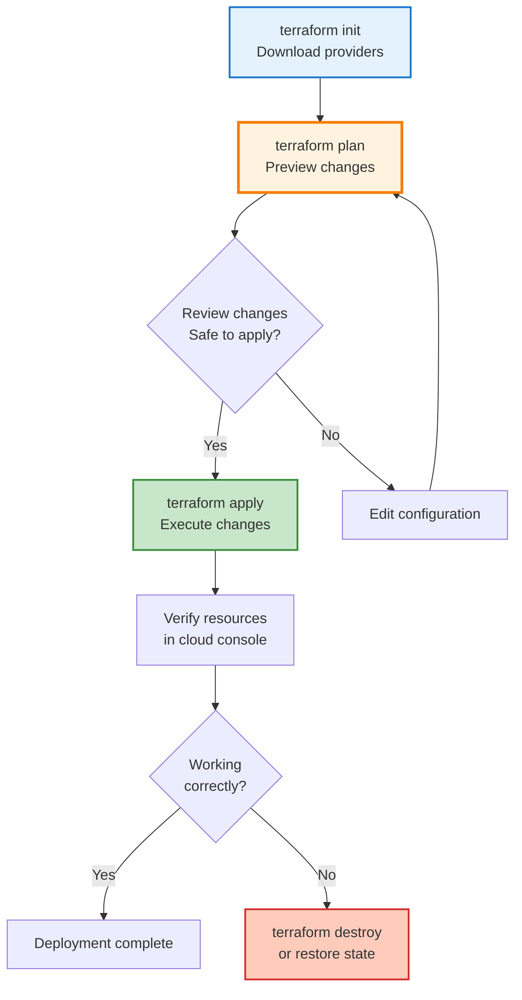
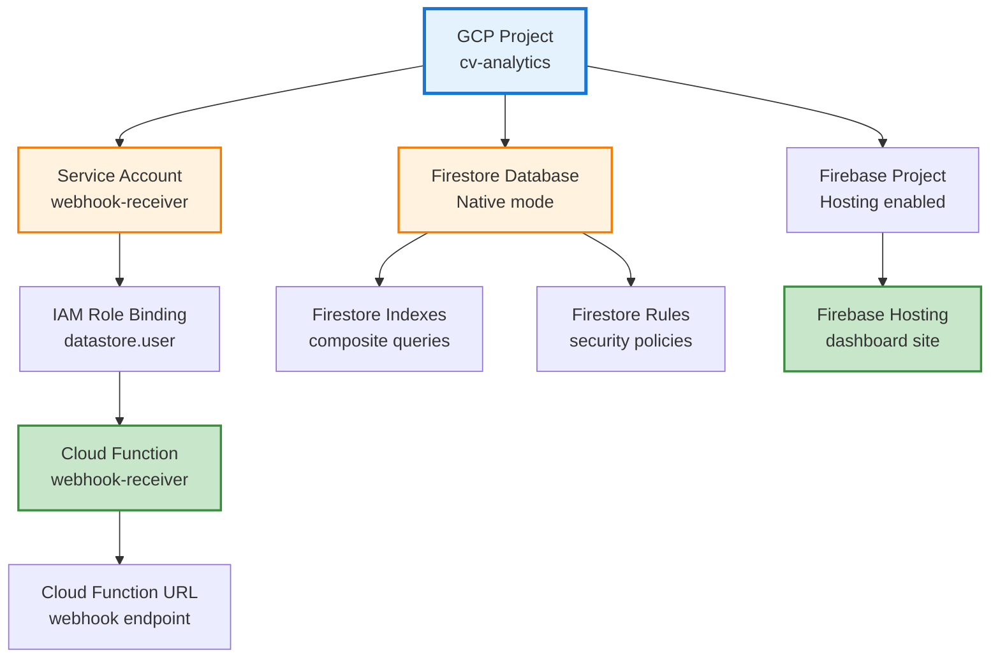
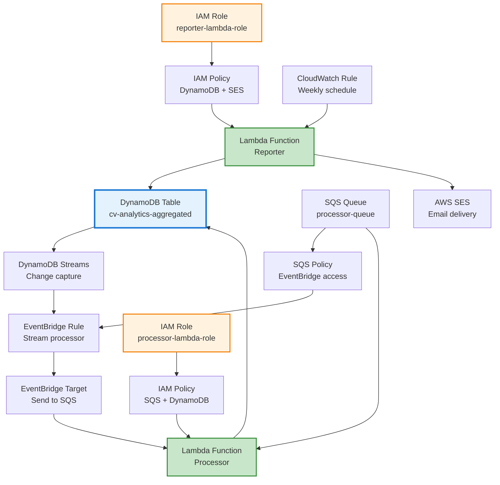
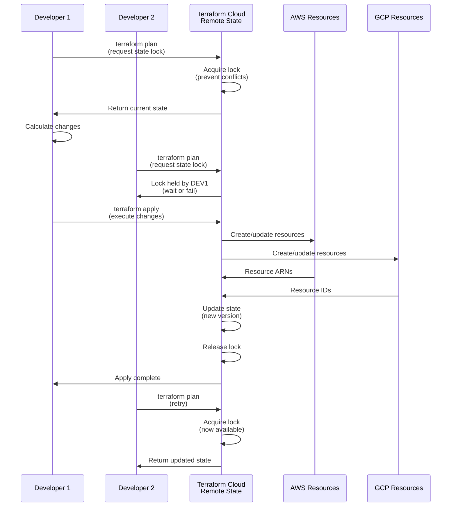
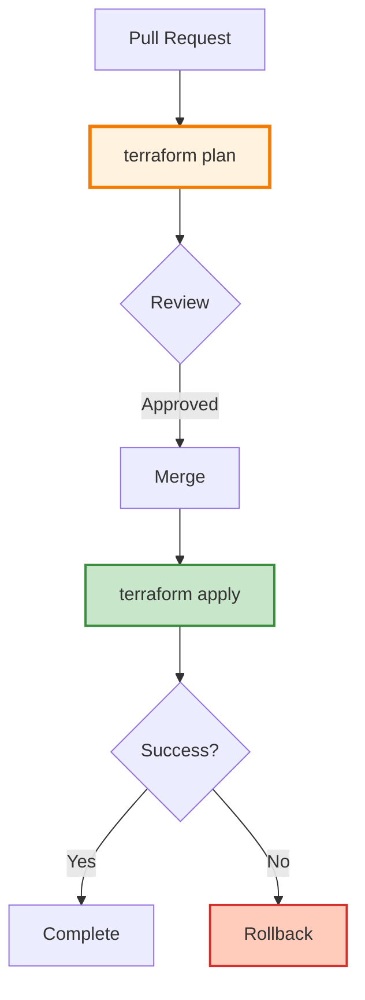

# Multi-Cloud Infrastructure as Code: Terraform for GCP and AWS (GCP Series: Real-time Analytics & Firestore, Part V)

*Managing eleven microservices across Cloudflare, AWS, and GCP with 2,000+ lines of Terraform configuration across 9 Terraform Cloud workspaces, eliminating manual provisioning, handling cross-cloud dependencies, and enabling reproducible infrastructure with remote state management.*

## Contents

- [Quick Summary](#quick-summary)
- [Introduction](#introduction)
- [Terraform Cloud Workspaces](#terraform-cloud-workspaces)
- [Terraform Fundamentals](#terraform-fundamentals)
- [GCP Infrastructure](#gcp-infrastructure)
- [AWS Infrastructure](#aws-infrastructure)
- [Cloudflare Infrastructure](#cloudflare-infrastructure)
- [Remote State Management](#remote-state-management)
- [Secrets Handling](#secrets-handling)
- [Deployment Workflow](#deployment-workflow)
- [Rollback Strategies](#rollback-strategies)
- [Practical Takeaways](#practical-takeaways)
- [What's Next](#whats-next)
- [Further Reading](#further-reading)

## Quick Summary

- ✓ **100% infrastructure-as-code** eliminates manual configuration drift
- ✓ **9 Terraform Cloud workspaces** managing 11 services across 3 clouds
- ✓ **Multi-cloud Terraform** provisions Cloudflare Pages/Workers, GCP Cloud Functions, Firestore, AWS Lambda, DynamoDB
- ✓ **Remote state management** with Terraform Cloud enables team collaboration
- ✓ **Disaster recovery** - entire infrastructure reproducible from Terraform definitions
- ✓ **Cost: £0/month** using free tier optimization patterns

---

## Introduction

Clicking through cloud consoles works until it doesn't. You provision a Cloud Function in GCP, configure its service account, set up Firestore indexes, and everything works. Three months later, you need to replicate the environment for staging. Which IAM role did you assign? What were the environment variables? Which region? The console doesn't remember, and neither do you.

Infrastructure-as-code (IaC) solves this problem. Terraform describes infrastructure in declarative configuration files. You define what you want (Lambda function with specific memory, DynamoDB table with specific capacity), and Terraform figures out how to create it. Changes are versioned in git. Deployments are reproducible. Team members see exactly what's running in production.

CV Analytics uses Terraform to provision 100% of its infrastructure across **three clouds** (Cloudflare, AWS, GCP). Eleven microservices, multiple databases (D1×2, DynamoDB×2, Firestore), Cloudflare Pages projects, Workers, KV namespaces, Vectorize indexes, SQS queues, EventBridge schedulers, all IAM roles—all defined in 2,000+ lines of Terraform configuration across 9 Terraform Cloud workspaces. No manual clicking. No configuration drift. No "works on my machine" problems.

**The cross-cloud challenge:** AWS Lambda needs to call GCP Cloud Function URL (output from `google_cloudfunctions_function` resource). Terraform handles this dependency automatically across providers. When GCP Cloud Function deploys, its URL becomes available to AWS Lambda configuration.

This post explains how Terraform manages multi-cloud infrastructure: how providers abstract GCP, AWS, and Cloudflare APIs, how to handle cross-cloud dependencies (AWS Lambda needs GCP webhook URL), how remote state enables team collaboration across clouds, how to manage secrets securely in three cloud providers, and how rollback strategies protect against failed deployments.

**What you'll learn:**

- ✓ How Terraform Cloud workspaces organize multi-cloud infrastructure (9 workspaces, 3 clouds)
- ✓ How Terraform providers abstract GCP, AWS, and Cloudflare APIs (multi-cloud in one codebase)
- ✓ How to handle cross-cloud dependencies (AWS Lambda → GCP Cloud Function)
- ✓ How to structure multi-cloud Terraform configurations (3 clouds, 11 services)
- ✓ How remote state management enables team collaboration across clouds
- ✓ How to handle secrets securely across three providers (AWS, GCP, Cloudflare)
- ✓ How rollback strategies protect against deployment failures

---

## Terraform Cloud Workspaces

CV Analytics uses **9 Terraform Cloud workspaces** to organize infrastructure by cloud provider and service boundary:

| Workspace | Cloud | Purpose | Resources |
|-----------|-------|---------|-----------|
| `cloudflare-d1-cv-main` | Cloudflare | Portfolio API | D1 database, Worker, KV namespace |
| `cv-admin-worker` | Cloudflare | Admin API | D1 database, Worker, custom domain |
| `cv-admin-cloudflare` | Cloudflare | Admin infrastructure | Additional admin resources |
| `cloudflare-pages` | Cloudflare | Frontend apps | 3 Pages projects, custom domains |
| `cv-analytics-gcp` | GCP | Analytics ingestion | Cloud Functions, Firestore, Firebase Hosting |
| `cv-analytics-processor` | AWS | Batch processing | Lambda, SQS, DynamoDB, IAM roles |
| `cv-analytics-reporter` | AWS | Email reports | Lambda, EventBridge, SES permissions |
| `cv-analytics-worker` | AWS | Worker support | Additional Lambda infrastructure |
| `aws-chatbot-analytics` | AWS | Chatbot analytics | Legacy/additional analytics resources |

**Why separate workspaces?**

1. **Blast radius control** - A failed Cloudflare deployment doesn't affect AWS infrastructure
2. **Independent deployments** - Each workspace can be applied independently
3. **Team permissions** - Different teams can manage different workspaces
4. **State isolation** - No accidental cross-cloud resource deletion

```hcl
# Example: cloudflare-pages workspace backend
terraform {
  cloud {
    organization = "josejalvarezmterraform"
    
    workspaces {
      name = "cloudflare-pages"
    }
  }
}
```

---

## Terraform Fundamentals

### Declarative Configuration

Terraform uses HashiCorp Configuration Language (HCL) to describe infrastructure. You declare what you want, not how to create it.

**Imperative (bash script):**

```bash
# Create Lambda function
aws lambda create-function \
  --function-name processor \
  --runtime nodejs18.x \
  --role arn:aws:iam::123:role/lambda-role \
  --handler index.handler

# If function exists, update instead
if [ $? -eq 254 ]; then
  aws lambda update-function-code \
    --function-name processor \
    --zip-file fileb://function.zip
fi
```

**Declarative (Terraform):**

```hcl
resource "aws_lambda_function" "processor" {
  function_name = "processor"
  runtime       = "nodejs18.x"
  role          = aws_iam_role.lambda_role.arn
  handler       = "index.handler"
}
```

Terraform handles create vs. update logic automatically. If the function doesn't exist, Terraform creates it. If it exists with different configuration, Terraform updates it. If it exists unchanged, Terraform does nothing.

### Providers: Cloud API Abstraction

Providers are Terraform plugins that interact with cloud APIs. Each provider translates HCL resources into API calls.

**CV Analytics providers (3 clouds):**

```hcl
terraform {
  required_providers {
    cloudflare = {
      source  = "cloudflare/cloudflare"
      version = "~> 4.0"
    }
    google = {
      source  = "hashicorp/google"
      version = "~> 5.0"
    }
    aws = {
      source  = "hashicorp/aws"
      version = "~> 5.0"
    }
  }
}

provider "cloudflare" {
  # API token from CLOUDFLARE_API_TOKEN env var
}

provider "google" {
  project = var.gcp_project_id
  region  = "europe-west2"
}

provider "aws" {
  region = "eu-west-2"
}
```

**Version constraints:**

- `~> 5.0` means "5.0 or higher, but less than 6.0"
- Prevents breaking changes from major version upgrades
- Terraform locks exact versions in `.terraform.lock.hcl`

### Resources vs. Data Sources

**Resources:** Things Terraform creates and manages.

```hcl
# Terraform creates this Lambda function
resource "aws_lambda_function" "processor" {
  function_name = "cv-analytics-processor"
  runtime       = "nodejs18.x"
}
```

**Data sources:** Things that already exist (query only).

```hcl
# Terraform queries existing VPC (doesn't create)
data "aws_vpc" "default" {
  default = true
}

# Use VPC ID in security group
resource "aws_security_group" "lambda_sg" {
  vpc_id = data.aws_vpc.default.id
}
```

**CV Analytics uses data sources for:**

- Existing GCP project metadata
- AWS account ID
- Default VPCs (if needed)
- Service account email addresses

### State Management

Terraform stores infrastructure state in `terraform.tfstate` file. State maps configuration to real resources.

**State contains:**

- Resource IDs (Lambda ARN, Cloud Function URL)
- Resource attributes (memory size, runtime version)
- Dependencies between resources
- Provider metadata

**State enables:**

- **Change detection:** Terraform compares desired state (HCL) with current state (tfstate) to determine what changed
- **Resource tracking:** Terraform knows which resources it created (safe to destroy)
- **Dependency ordering:** Terraform creates resources in correct order (IAM role before Lambda)

**Local state problem:**

```bash
# Developer A provisions infrastructure
terraform apply  # Creates terraform.tfstate locally

# Developer B tries to update same infrastructure
terraform apply  # Uses their own terraform.tfstate (out of date)
# Result: Conflicting changes, duplicate resources, chaos
```

**Solution:** Remote state (covered later).

### Terraform Workflow



**terraform init:**

- Downloads provider plugins
- Initialises backend (remote state)
- Creates `.terraform/` directory
- Generates `.terraform.lock.hcl` (provider version lock file)

**terraform plan:**

- Reads configuration files (*.tf)
- Queries current state (terraform.tfstate)
- Queries cloud APIs (actual resources)
- Calculates differences
- Shows preview of changes

**Example plan output:**

```
Terraform will perform the following actions:

  # aws_lambda_function.processor will be updated in-place
  ~ resource "aws_lambda_function" "processor" {
        function_name = "cv-analytics-processor"
      ~ memory_size   = 128 -> 256
      ~ timeout       = 30 -> 60
    }

Plan: 0 to add, 1 to change, 0 to destroy.
```

**terraform apply:**

- Executes plan (creates/updates/deletes resources)
- Updates state file
- Shows progress and results
- Fails fast (stops on first error)

**terraform destroy:**

- Deletes all resources managed by Terraform
- Use for: tearing down staging environments, cleanup after testing
- Dangerous: no undo, confirmation required

---

## GCP Infrastructure

### Resource Dependencies

GCP resources have dependency chains. Service accounts must exist before Cloud Functions. Firestore must be enabled before creating indexes. Terraform resolves dependencies automatically.



### Service Account Configuration

```hcl
# Create service account for Cloud Function
resource "google_service_account" "webhook_receiver" {
  account_id   = "webhook-receiver"
  display_name = "Webhook Receiver Cloud Function"
  description  = "Service account for GitHub webhook receiver"
  project      = var.gcp_project_id
}

# Grant Firestore read/write permissions
resource "google_project_iam_member" "webhook_firestore_user" {
  project = var.gcp_project_id
  role    = "roles/datastore.user"
  member  = "serviceAccount:${google_service_account.webhook_receiver.email}"
}

# Grant Cloud Logging permissions
resource "google_project_iam_member" "webhook_log_writer" {
  project = var.gcp_project_id
  role    = "roles/logging.logWriter"
  member  = "serviceAccount:${google_service_account.webhook_receiver.email}"
}
```

**Key patterns:**

**Implicit dependencies:** `${google_service_account.webhook_receiver.email}` creates dependency. Terraform provisions service account before IAM binding.

**Least privilege:** Grant specific roles (`datastore.user`, `logging.logWriter`), not broad roles (`editor`, `owner`).

**Explicit naming:** `account_id` determines email (`webhook-receiver@project-id.iam.gserviceaccount.com`).

### Cloud Function Configuration

```hcl
# Upload Cloud Function source code
resource "google_storage_bucket" "function_source" {
  name     = "${var.gcp_project_id}-function-source"
  location = "EU"
  project  = var.gcp_project_id
}

resource "google_storage_bucket_object" "webhook_source" {
  name   = "webhook-receiver-${var.version}.zip"
  bucket = google_storage_bucket.function_source.name
  source = "${path.module}/dist/webhook-receiver.zip"
}

# Deploy Cloud Function
resource "google_cloudfunctions_function" "webhook_receiver" {
  name        = "webhook-receiver"
  description = "Receives GitHub webhooks and writes to Firestore"
  runtime     = "go121"
  project     = var.gcp_project_id
  region      = "europe-west2"
  
  available_memory_mb   = 256
  timeout               = 60
  entry_point           = "WebhookHandler"
  service_account_email = google_service_account.webhook_receiver.email
  
  source_archive_bucket = google_storage_bucket.function_source.name
  source_archive_object = google_storage_bucket_object.webhook_source.name
  
  trigger_http = true
  
  environment_variables = {
    WEBHOOK_SECRET = var.github_webhook_secret
    GCP_PROJECT_ID = var.gcp_project_id
  }
}

# Make Cloud Function publicly accessible
resource "google_cloudfunctions_function_iam_member" "webhook_invoker" {
  project        = google_cloudfunctions_function.webhook_receiver.project
  region         = google_cloudfunctions_function.webhook_receiver.region
  cloud_function = google_cloudfunctions_function.webhook_receiver.name
  role           = "roles/cloudfunctions.invoker"
  member         = "allUsers"
}

# Output Cloud Function URL
output "webhook_url" {
  value       = google_cloudfunctions_function.webhook_receiver.https_trigger_url
  description = "Webhook endpoint URL for AWS Lambda to call (cross-cloud webhook)"
  sensitive   = false  # URL is public but HMAC-protected
}
```

**Configuration details:**

**Source code upload:** Terraform uploads function code to Cloud Storage first, then deploys function from storage. This pattern enables versioning.

**Version tracking:** `webhook-receiver-${var.version}.zip` includes version in filename. Changing version triggers redeployment.

**Environment variables:** Never commit `var.github_webhook_secret` to git. Pass via Terraform Cloud or command line.

**Public access:** `allUsers` allows GitHub to call function without authentication. HMAC signature provides security.

**Dependency chain:**

1. Storage bucket created
2. Source code uploaded to bucket
3. Service account created
4. IAM roles granted to service account
5. Cloud Function created with source code and service account
6. Public invoker permission granted

### Firestore Configuration

```hcl
# Enable Firestore in Native mode
resource "google_firestore_database" "analytics" {
  project     = var.gcp_project_id
  name        = "(default)"
  location_id = "europe-west2"
  type        = "FIRESTORE_NATIVE"
}

# Create composite index for queries
resource "google_firestore_index" "analytics_by_date" {
  project    = var.gcp_project_id
  database   = google_firestore_database.analytics.name
  collection = "analytics"
  
  fields {
    field_path = "timestamp"
    order      = "DESCENDING"
  }
  
  fields {
    field_path = "eventType"
    order      = "ASCENDING"
  }
}
```

**Firestore modes:**

**Native mode:** Real-time updates, mobile SDKs, security rules. Used by CV Analytics.

**Datastore mode:** Server-side only, no real-time, SQL-like queries.

**Choice:** Native mode enables real-time dashboard updates.

**Composite indexes:** Required for queries with multiple filters or sorts. Terraform creates indexes automatically (no manual console clicking).

### Firebase Hosting Configuration

Firebase Hosting isn't fully supported by Terraform (Firebase uses its own CLI). Hybrid approach:

**Terraform provisions Firebase project:**

```hcl
resource "google_firebase_project" "dashboard" {
  provider = google-beta
  project  = var.gcp_project_id
}

resource "google_firebase_web_app" "dashboard" {
  provider     = google-beta
  project      = var.gcp_project_id
  display_name = "CV Analytics Dashboard"
  depends_on   = [google_firebase_project.dashboard]
}
```

**GitHub Actions deploys site:**

```yaml
# .github/workflows/deploy-dashboard.yml
- name: Deploy to Firebase Hosting
  run: firebase deploy --only hosting
  env:
    FIREBASE_TOKEN: ${{ secrets.FIREBASE_TOKEN }}
```

**Why split?**

- Terraform: Infrastructure that rarely changes (project setup, web app registration)
- GitHub Actions: Application code that changes frequently (React build, hosting deployment)

### Variables and Outputs

**variables.tf:**

```hcl
variable "gcp_project_id" {
  description = "GCP project ID"
  type        = string
}

variable "webhook_shared_secret" {
  description = "HMAC shared secret for AWS Lambda → GCP Cloud Function cross-cloud authentication (must match AWS Secrets Manager value)"
  type        = string
  sensitive   = true
}

variable "version" {
  description = "Application version (semantic version)"
  type        = string
  default     = "1.0.0"
}
```

**outputs.tf:**

```hcl
output "webhook_url" {
  value       = google_cloudfunctions_function.webhook_receiver.https_trigger_url
  description = "Webhook endpoint URL"
}

output "service_account_email" {
  value       = google_service_account.webhook_receiver.email
  description = "Service account email for webhook receiver"
}
```

**Usage:**

```bash
# Pass variables
terraform apply \
  -var="gcp_project_id=cv-analytics-prod" \
  -var="webhook_shared_secret=$WEBHOOK_SECRET"  # Same value as AWS Secrets Manager

# Access outputs
terraform output webhook_url
# Output: https://europe-west2-cv-analytics-prod.cloudfunctions.net/webhook-receiver
```

---

## AWS Infrastructure

### Resource Dependencies

AWS resources form complex dependency graphs. IAM roles must exist before Lambda functions. DynamoDB tables must exist before Streams. EventBridge rules depend on SQS queues.



### DynamoDB Table Configuration

```hcl
# Create DynamoDB table for aggregated analytics
resource "aws_dynamodb_table" "analytics_aggregated" {
  name           = "cv-analytics-aggregated"
  billing_mode   = "PAY_PER_REQUEST"  # On-demand pricing
  hash_key       = "id"
  stream_enabled = true
  stream_view_type = "NEW_AND_OLD_IMAGES"
  
  attribute {
    name = "id"
    type = "S"  # String
  }
  
  attribute {
    name = "timestamp"
    type = "N"  # Number
  }
  
  attribute {
    name = "eventType"
    type = "S"
  }
  
  # Global secondary index for querying by timestamp
  global_secondary_index {
    name            = "timestamp-index"
    hash_key        = "eventType"
    range_key       = "timestamp"
    projection_type = "ALL"
  }
  
  tags = {
    Environment = "production"
    Service     = "cv-analytics"
  }
}
```

**Configuration decisions:**

**Billing mode:** `PAY_PER_REQUEST` (on-demand) vs. `PROVISIONED` (reserved capacity). On-demand costs more per request but eliminates capacity planning. CV Analytics uses on-demand (unpredictable traffic).

**Streams:** `stream_enabled = true` enables DynamoDB Streams (change data capture). Every write triggers stream event.

**Stream view type:** `NEW_AND_OLD_IMAGES` includes before and after values. Enables detecting what changed.

**Global secondary index:** Enables queries by `eventType` and `timestamp`. Without GSI, can only query by `id` (primary key).

### SQS Queue Configuration

```hcl
# Create SQS queue for processing
resource "aws_sqs_queue" "processor_queue" {
  name                       = "cv-analytics-processor"
  visibility_timeout_seconds = 300  # 5 minutes (Lambda timeout * 5)
  message_retention_seconds  = 1209600  # 14 days
  receive_wait_time_seconds  = 20  # Long polling
  
  # Dead letter queue for failed messages
  redrive_policy = jsonencode({
    deadLetterTargetArn = aws_sqs_queue.processor_dlq.arn
    maxReceiveCount     = 3
  })
  
  tags = {
    Environment = "production"
  }
}

# Dead letter queue
resource "aws_sqs_queue" "processor_dlq" {
  name                      = "cv-analytics-processor-dlq"
  message_retention_seconds = 1209600  # 14 days
}

# Allow EventBridge to send messages to queue
resource "aws_sqs_queue_policy" "processor_queue_policy" {
  queue_url = aws_sqs_queue.processor_queue.id
  
  policy = jsonencode({
    Version = "2012-10-17"
    Statement = [
      {
        Effect = "Allow"
        Principal = {
          Service = "events.amazonaws.com"
        }
        Action   = "sqs:SendMessage"
        Resource = aws_sqs_queue.processor_queue.arn
        Condition = {
          ArnEquals = {
            "aws:SourceArn" = aws_cloudwatch_event_rule.dynamodb_streams.arn
          }
        }
      }
    ]
  })
}
```

**SQS configuration details:**

**Visibility timeout:** After Lambda receives message, message is hidden for 300 seconds. If Lambda doesn't delete message within timeout, message becomes visible again (reprocessing).

**Long polling:** `receive_wait_time_seconds = 20` makes ReceiveMessage wait up to 20 seconds for messages. Reduces empty responses (cost optimization).

**Dead letter queue:** After 3 failed processing attempts (`maxReceiveCount = 3`), message moves to DLQ. Prevents infinite reprocessing loops.

**Queue policy:** Condition limits access to specific EventBridge rule. Prevents other rules from sending to queue.

### EventBridge Configuration

```hcl
# EventBridge rule to capture DynamoDB Stream events
resource "aws_cloudwatch_event_rule" "dynamodb_streams" {
  name        = "cv-analytics-dynamodb-streams"
  description = "Capture DynamoDB Stream events and send to SQS"
  
  event_pattern = jsonencode({
    source      = ["aws.dynamodb"]
    detail-type = ["DynamoDB Stream Record"]
    resources   = [aws_dynamodb_table.analytics_aggregated.stream_arn]
  })
}

# EventBridge target: send to SQS queue
resource "aws_cloudwatch_event_target" "sqs_target" {
  rule      = aws_cloudwatch_event_rule.dynamodb_streams.name
  target_id = "SendToSQS"
  arn       = aws_sqs_queue.processor_queue.arn
}
```

**Why EventBridge between DynamoDB Streams and SQS?**

DynamoDB Streams can't write directly to SQS. EventBridge bridges them:

1. DynamoDB table updated
2. Stream event generated
3. EventBridge captures stream event
4. EventBridge sends to SQS queue
5. Lambda processes from SQS

**Alternative:** Lambda trigger directly on DynamoDB Streams (no SQS). CV Analytics uses SQS for batching (cost optimization).

### Lambda IAM Roles

```hcl
# IAM role for Processor Lambda
resource "aws_iam_role" "processor_lambda_role" {
  name = "cv-analytics-processor-lambda-role"
  
  assume_role_policy = jsonencode({
    Version = "2012-10-17"
    Statement = [
      {
        Effect = "Allow"
        Principal = {
          Service = "lambda.amazonaws.com"
        }
        Action = "sts:AssumeRole"
      }
    ]
  })
}

# Policy: Read from SQS
resource "aws_iam_role_policy" "processor_sqs_policy" {
  name = "sqs-access"
  role = aws_iam_role.processor_lambda_role.id
  
  policy = jsonencode({
    Version = "2012-10-17"
    Statement = [
      {
        Effect = "Allow"
        Action = [
          "sqs:ReceiveMessage",
          "sqs:DeleteMessage",
          "sqs:GetQueueAttributes"
        ]
        Resource = aws_sqs_queue.processor_queue.arn
      }
    ]
  })
}

# Policy: Write to DynamoDB
resource "aws_iam_role_policy" "processor_dynamodb_policy" {
  name = "dynamodb-access"
  role = aws_iam_role.processor_lambda_role.id
  
  policy = jsonencode({
    Version = "2012-10-17"
    Statement = [
      {
        Effect = "Allow"
        Action = [
          "dynamodb:PutItem",
          "dynamodb:UpdateItem",
          "dynamodb:GetItem"
        ]
        Resource = aws_dynamodb_table.analytics_aggregated.arn
      }
    ]
  })
}

# Attach AWS managed policy for CloudWatch Logs
resource "aws_iam_role_policy_attachment" "processor_logs" {
  role       = aws_iam_role.processor_lambda_role.name
  policy_arn = "arn:aws:iam::aws:policy/service-role/AWSLambdaBasicExecutionRole"
}
```

**IAM role structure:**

**Trust policy:** `assume_role_policy` defines who can assume role (Lambda service).

**Permission policies:** Attached policies define what role can do (SQS, DynamoDB).

**Managed policies:** AWS-provided policies (`AWSLambdaBasicExecutionRole` grants CloudWatch Logs access).

**Principle:** Separate policy per concern. Easier to audit and modify.

### Lambda Function Configuration

```hcl
# Package Lambda function code
data "archive_file" "processor_lambda" {
  type        = "zip"
  source_dir  = "${path.module}/lambda/processor"
  output_path = "${path.module}/dist/processor.zip"
}

# Deploy Processor Lambda
resource "aws_lambda_function" "processor" {
  filename         = data.archive_file.processor_lambda.output_path
  function_name    = "cv-analytics-processor"
  role             = aws_iam_role.processor_lambda_role.arn
  handler          = "index.handler"
  source_code_hash = data.archive_file.processor_lambda.output_base64sha256
  runtime          = "nodejs18.x"
  timeout          = 60
  memory_size      = 256
  
  environment {
    variables = {
      DYNAMODB_TABLE = aws_dynamodb_table.analytics_aggregated.name
      AWS_REGION     = var.aws_region
      # Cross-cloud webhook URL from GCP Cloud Function
      GCP_WEBHOOK_URL = var.gcp_webhook_url  # Output from GCP Terraform
    }
  }
  
  tags = {
    Environment = "production"
  }
}

# SQS trigger for Lambda
resource "aws_lambda_event_source_mapping" "processor_sqs_trigger" {
  event_source_arn = aws_sqs_queue.processor_queue.arn
  function_name    = aws_lambda_function.processor.arn
  batch_size       = 10  # Process up to 10 messages per invocation
  
  scaling_config {
    maximum_concurrency = 5  # Max 5 concurrent Lambda executions
  }
}
```

### Cross-Cloud Dependency: AWS Lambda → GCP Cloud Function

**The challenge:** AWS Lambda Processor needs to call GCP Cloud Function webhook URL after processing analytics. This URL is an output from GCP Terraform configuration.

**Solution: Terraform outputs + variables**

**In GCP Terraform (outputs.tf):**

```hcl
output "webhook_url" {
  value       = google_cloudfunctions_function.webhook_receiver.https_trigger_url
  description = "GCP Cloud Function webhook URL for AWS Lambda"
}
```

**In AWS Terraform (variables.tf):**

```hcl
variable "gcp_webhook_url" {
  description = "GCP Cloud Function webhook URL (output from GCP Terraform)"
  type        = string
}
```

**How to pass the value:**

**Option 1: Terraform Cloud (recommended for teams)**

1. Deploy GCP infrastructure first: `terraform apply` in `gcp/` directory
2. Copy webhook URL from GCP Terraform outputs
3. Set `gcp_webhook_url` variable in AWS Terraform Cloud workspace
4. Deploy AWS infrastructure: `terraform apply` in `aws/` directory

**Option 2: Command line**

```bash
# Deploy GCP first
cd terraform/gcp
terraform apply
GCP_WEBHOOK_URL=$(terraform output -raw webhook_url)

# Deploy AWS with GCP webhook URL
cd ../aws
terraform apply -var="gcp_webhook_url=$GCP_WEBHOOK_URL"
```

**Option 3: Unified Terraform workspace (advanced)**
Deploy both clouds in one Terraform configuration. GCP resources create outputs directly available to AWS resources:

```hcl
# Both providers in same configuration
provider "google" { ... }
provider "aws" { ... }

# GCP Cloud Function
resource "google_cloudfunctions_function" "webhook_receiver" { ... }

# AWS Lambda can reference GCP output directly
resource "aws_lambda_function" "processor" {
  environment {
    variables = {
      GCP_WEBHOOK_URL = google_cloudfunctions_function.webhook_receiver.https_trigger_url
    }
  }
}
```

**Lambda configuration details:**

**source_code_hash:** Terraform redeployes Lambda when code changes. Hash detects changes.

**Batch size:** Lambda receives up to 10 SQS messages per invocation. Cost optimization (fewer invocations).

**Maximum concurrency:** Limits concurrent executions to 5. Prevents overwhelming downstream services.

**Memory size:** 256 MB balances cost and performance. Higher memory also increases CPU allocation.

### CloudWatch Scheduled Rule

```hcl
# Schedule Reporter Lambda weekly
resource "aws_cloudwatch_event_rule" "weekly_report" {
  name                = "cv-analytics-weekly-report"
  description         = "Trigger weekly analytics report"
  schedule_expression = "cron(0 9 ? * MON *)"  # Every Monday at 9 AM UTC
}

resource "aws_cloudwatch_event_target" "reporter_target" {
  rule      = aws_cloudwatch_event_rule.weekly_report.name
  target_id = "ReporterLambda"
  arn       = aws_lambda_function.reporter.arn
}

# Grant CloudWatch Events permission to invoke Lambda
resource "aws_lambda_permission" "allow_cloudwatch" {
  statement_id  = "AllowExecutionFromCloudWatch"
  action        = "lambda:InvokeFunction"
  function_name = aws_lambda_function.reporter.function_name
  principal     = "events.amazonaws.com"
  source_arn    = aws_cloudwatch_event_rule.weekly_report.arn
}
```

**Cron expression:** `cron(0 9 ? * MON *)` breaks down as:

- `0` = minute (0)
- `9` = hour (9 AM)
- `?` = day of month (not specified)
- `*` = month (every month)
- `MON` = day of week (Monday)
- `*` = year (every year)

---

## Cloudflare Infrastructure

Cloudflare resources are managed across three Terraform workspaces, handling D1 databases, custom domains, and Pages projects.

### Cloudflare Provider Configuration

```hcl
terraform {
  cloud {
    organization = "josejalvarezmterraform"

    workspaces {
      name = "cloudflare-pages"  # or cloudflare-d1-cv-main, cv-admin-cloudflare
    }
  }

  required_providers {
    cloudflare = {
      source  = "cloudflare/cloudflare"
      version = "~> 4.0"
    }
  }
}

provider "cloudflare" {
  # Credentials from environment variable: CLOUDFLARE_API_TOKEN
}

# Get account info dynamically
data "cloudflare_accounts" "main" {}

locals {
  account_id = data.cloudflare_accounts.main.accounts[0].id
}
```

**Key pattern:** Using `data.cloudflare_accounts.main` to dynamically get account ID rather than hardcoding it.

### D1 Database

Cloudflare D1 is a serverless SQLite database. Terraform creates the database; Wrangler CLI handles schema migrations and bindings.

```hcl
# CV API Database (Portfolio API)
resource "cloudflare_d1_database" "cv_database" {
  account_id = local.account_id
  name       = "cv-database"
}

# Admin Staging Database (Admin Worker)
resource "cloudflare_d1_database" "admin_staging" {
  account_id = local.account_id
  name       = "cv-admin-staging-db"
}
```

**Separation of concerns:**
- **Terraform:** Creates D1 database resource
- **Wrangler:** Manages D1 bindings to Workers, schema migrations, and data

### Custom Domain Routes

Workers can be accessed via custom domains. Two approaches exist:

```hcl
# Approach 1: Worker Route (pattern-based)
# Used by: d1-cv-private (Portfolio API)
resource "cloudflare_worker_route" "cv_api" {
  zone_id     = data.cloudflare_zone.main.id
  pattern     = "api.{YOUR_DOMAIN}/*"
  script_name = "cv-api-worker"
}

# Approach 2: Workers Domain (direct domain)
# Used by: cv-admin-worker-private
resource "cloudflare_workers_domain" "admin_api" {
  account_id = local.account_id
  hostname   = "api.admin.{YOUR_DOMAIN}"
  service    = "cv-admin-worker"
  zone_id    = data.cloudflare_zone.main.id
}
```

**Worker Route vs Workers Domain:**
- `cloudflare_worker_route`: Pattern-based routing (`domain/*`)
- `cloudflare_workers_domain`: Direct hostname mapping (cleaner, preferred for new projects)

### Cloudflare Pages Projects

Pages projects host static frontend applications. Terraform manages project configuration and custom domains; GitHub Actions handles deployments.

```hcl
# Chatbot Widget - Angular application
resource "cloudflare_pages_project" "chatbot" {
  account_id        = local.account_id
  name              = "cv-chatbot-private"
  production_branch = "main"

  deployment_configs {
    production {
      compatibility_date = "2025-10-14"
    }
    preview {
      compatibility_date = "2025-10-14"
    }
  }

  lifecycle {
    ignore_changes = [
      source,
      build_config,
      deployment_configs,
    ]
  }
}

# Custom domain for Pages project
resource "cloudflare_pages_domain" "chatbot" {
  account_id   = local.account_id
  project_name = cloudflare_pages_project.chatbot.name
  domain       = "chatbot.ui.{YOUR_DOMAIN}"
}
```

**lifecycle.ignore_changes:** Critical for Pages projects. Build config is managed via Cloudflare dashboard and GitHub integration. Terraform shouldn't overwrite these settings.

**CV Analytics suite Pages projects:**
- `cv-chatbot-private` → chatbot.ui.{YOUR_DOMAIN}
- `cv-admin-portal-private` → admin.{YOUR_DOMAIN}  
- `portfolio-cv-private` → {YOUR_DOMAIN} (main portfolio)

### Terraform vs Wrangler Responsibility Split

Cloudflare Workers have a unique management pattern:

| Aspect | Terraform | Wrangler |
|--------|-----------|----------|
| D1 database creation | ✓ | |
| D1 schema migrations | | ✓ |
| D1 bindings to Worker | | ✓ |
| Custom domain routes | ✓ | |
| Worker deployment | | ✓ |
| Durable Objects | | ✓ |
| Secrets | | ✓ |
| KV namespaces | ✓ | |
| Vectorize indexes | ✓ | |

**Why this split?** Wrangler handles the deployment lifecycle (bundling, uploading, migrations). Terraform handles the infrastructure that exists independent of deployments (databases, routes, namespaces).

---

## Remote State Management

### The Local State Problem

Terraform stores infrastructure state in `terraform.tfstate` file. By default, this file lives locally on your machine.

**Problems with local state:**

**No collaboration:** Team members can't share state. Each person has their own view of infrastructure.

**No locking:** Two people running `terraform apply` simultaneously corrupt state file.

**No backup:** Losing `terraform.tfstate` means losing track of all infrastructure. Terraform can't manage resources without state.

**No versioning:** Can't roll back to previous state version after bad deployment.

**Security risk:** State contains sensitive data (database passwords, API keys). Local files are insecure.

### Remote State with Terraform Cloud

Terraform Cloud (free tier) provides remote state storage with locking, versioning, and encryption.



### Terraform Cloud Configuration

**backend.tf:**

```hcl
terraform {
  cloud {
    organization = "cv-analytics"
    
    workspaces {
      name = "cv-analytics-production"
    }
  }
  
  required_version = ">= 1.6.0"
}
```

**First-time setup:**

```bash
# Login to Terraform Cloud
terraform login
# Opens browser, authenticates, stores token

# Initialize with remote backend
terraform init
# Migrates local state to Terraform Cloud

# Verify remote state
terraform state list
```

**Terraform Cloud workspace settings:**

**Execution mode:** Remote (Terraform runs in Terraform Cloud, not locally)

**Terraform version:** Lock to specific version (e.g., 1.6.5) for consistency

**Variables:** Set `gcp_project_id`, `github_webhook_secret` in workspace (encrypted storage)

**VCS integration:** Optional, connect to GitHub for automatic `terraform plan` on pull requests

### State Locking

Terraform Cloud automatically locks state during operations.

**Lock behaviour:**

```bash
# Developer 1
terraform apply
# State locked

# Developer 2 (simultaneously)
terraform apply
# Error: state locked by user@example.com
# Lock ID: abc-123-def-456
# Created: 2024-01-15 10:30:00 UTC
```

**Force unlock (emergency only):**

```bash
# If apply crashes and lock isn't released
terraform force-unlock abc-123-def-456
# Warning: only use if you're certain no one else is running apply
```

**Best practice:** Never force-unlock unless you're certain the lock is stale.

### State Versioning

Terraform Cloud keeps history of all state versions.

**Rollback to previous version:**

1. Go to Terraform Cloud workspace
2. Navigate to States tab
3. Find previous version (before bad deployment)
4. Click "Restore" → Confirm
5. Run `terraform plan` to see differences
6. Run `terraform apply` to revert infrastructure

**When to rollback:**

- Deployment created incorrect resources
- Need to undo recent changes
- State corrupted by failed apply

**When NOT to rollback:**

- Resources manually deleted in cloud console (state out of sync)
- Resources modified outside Terraform (drift)
- Solution: Fix configuration and apply again

### Security Considerations

**State contains sensitive data:**

- Database connection strings
- API keys in environment variables
- Private IP addresses
- Resource IDs (potential information disclosure)

**Terraform Cloud security:**

- State encrypted at-rest (AES-256)
- State encrypted in-transit (TLS 1.2+)
- Access control via teams and permissions
- Audit logs (who accessed state, when)

**Access control configuration:**

```hcl
# Terraform Cloud Teams (configured in UI)
# - Admins: Full access (apply, destroy, state)
# - Developers: Read state, plan (no apply)
# - CI/CD: Apply only (automated deployments)
```

**Never commit backend configuration with credentials:**

```hcl
# WRONG: Hardcoded token
terraform {
  cloud {
    organization = "cv-analytics"
    token = "abc123..."  # Never commit this
  }
}

# RIGHT: Use terraform login
terraform {
  cloud {
    organization = "cv-analytics"
    # Token stored in ~/.terraform.d/credentials.tfrc.json
  }
}
```

---

## Secrets Handling

### The Secrets Problem

Terraform needs secrets to provision infrastructure across 3 clouds:

- **Cross-cloud shared secrets:** HMAC webhook secret (must be same value in AWS Secrets Manager + GCP Secret Manager)
- **Cloud-specific credentials:** AWS IAM keys for Cloudflare Worker, GCP service account keys
- **CI/CD credentials:** GitHub Secrets for deployment automation
- **Database credentials:** Firestore and DynamoDB access keys (if needed)

These secrets must never be committed to git. They must be injected at deployment time and coordinated across multiple cloud providers.

### Environment Variables Pattern

**Define variables in Terraform:**

```hcl
# variables.tf
variable "webhook_shared_secret" {
  description = "HMAC shared secret for AWS Lambda → GCP Cloud Function webhooks (same value in both clouds)"
  type        = string
  sensitive   = true  # Terraform masks value in logs
}

variable "gcp_webhook_url" {
  description = "GCP Cloud Function webhook URL (output from GCP Terraform)"
  type        = string
}

variable "cloudflare_worker_aws_key" {
  description = "AWS IAM access key for Cloudflare Worker (DynamoDB writes)"
  type        = string
  sensitive   = true
}
```

**Pass secrets via environment variables:**

```bash
# Set environment variables for multi-cloud secrets
export TF_VAR_webhook_shared_secret="$(openssl rand -hex 32)"  # Generate 256-bit secret
export TF_VAR_gcp_webhook_url="https://us-central1-project.cloudfunctions.net/cv-analytics-webhook"
export TF_VAR_cloudflare_worker_aws_key="AKIA..."

# Terraform reads TF_VAR_* automatically
terraform apply
```

**Use in resources:**

```hcl
# GCP Cloud Function uses secret from GCP Secret Manager
resource "google_secret_manager_secret" "webhook_secret" {
  secret_id = "webhook-shared-secret"
  replication {
    automatic = true
  }
}

resource "google_secret_manager_secret_version" "webhook_secret_version" {
  secret      = google_secret_manager_secret.webhook_secret.id
  secret_data = var.webhook_shared_secret  # From Terraform variable
}

# AWS Lambda uses same secret from AWS Secrets Manager
resource "aws_secretsmanager_secret" "webhook_secret" {
  name        = "cv-analytics/webhook-secret"
  description = "HMAC shared secret for AWS Lambda → GCP Cloud Function webhooks"
}

resource "aws_secretsmanager_secret_version" "webhook_secret_version" {
  secret_id     = aws_secretsmanager_secret.webhook_secret.id
  secret_string = var.webhook_shared_secret  # SAME VALUE as GCP
}
```

**Key principle:** Secrets flow from secure storage (GitHub Secrets, Terraform Cloud) → environment variables → Terraform → cloud resources. Never hardcoded in configuration files.

### Terraform Cloud Variables

Terraform Cloud provides encrypted variable storage.

**Configure in Terraform Cloud UI:**

1. Navigate to workspace → Variables
2. Add variable:
   - Key: `webhook_shared_secret`
   - Value: (paste 64-character hex string)
   - Category: Terraform variable
   - Sensitive: ✓ (checked)
   - Description: "HMAC secret for AWS Lambda → GCP webhooks (must match in both clouds)"
3. Repeat for other secrets:
   - `gcp_webhook_url` (from GCP Terraform output)
   - `cloudflare_worker_aws_key` (AWS IAM access key)
4. Save

**Benefits:**

- Encrypted at-rest and in-transit
- Not visible in Terraform Cloud UI after saving
- Automatically injected into Terraform runs
- Access controlled by workspace permissions

**Variable categories:**

**Terraform variables:** Used in configuration (`var.github_webhook_secret`)

**Environment variables:** Set in shell environment (`TF_VAR_*`, `AWS_ACCESS_KEY_ID`)

### GitHub Secrets Integration

GitHub Actions can provision infrastructure using Terraform.

**Workflow configuration:**

```yaml
name: Deploy Infrastructure
on:
  push:
    branches: [main]

jobs:
  terraform:
    runs-on: ubuntu-latest
    steps:
      - uses: actions/checkout@v3
      
      - name: Setup Terraform
        uses: hashicorp/setup-terraform@v2
        with:
          cli_config_credentials_token: ${{ secrets.TF_API_TOKEN }}
      
      - name: Terraform Init
        run: terraform init
      
      - name: Terraform Plan
        env:
          TF_VAR_webhook_shared_secret: ${{ secrets.WEBHOOK_SHARED_SECRET }}
          TF_VAR_gcp_webhook_url: ${{ secrets.GCP_WEBHOOK_URL }}
          TF_VAR_gcp_project_id: ${{ secrets.GCP_PROJECT_ID }}
          TF_VAR_cloudflare_worker_aws_key: ${{ secrets.CLOUDFLARE_WORKER_AWS_KEY }}
        run: terraform plan
      
      - name: Terraform Apply
        if: github.ref == 'refs/heads/main'
        env:
          TF_VAR_github_webhook_secret: ${{ secrets.GITHUB_WEBHOOK_SECRET }}
          TF_VAR_gcp_project_id: ${{ secrets.GCP_PROJECT_ID }}
        run: terraform apply -auto-approve
```

**GitHub Secrets required:**

- `TF_API_TOKEN`: Terraform Cloud API token (for authentication)
- `GITHUB_WEBHOOK_SECRET`: Webhook HMAC secret
- `GCP_PROJECT_ID`: GCP project identifier

**Security features:**

- GitHub automatically masks secret values in logs
- Secrets scoped to repository (not accessible by forks)
- Secrets only exposed to workflow steps that explicitly reference them

### Git Ignore Patterns

**.gitignore:**

```bash
# Terraform state files
terraform.tfstate
terraform.tfstate.backup
*.tfstate
*.tfstate.*

# Terraform variable files with secrets
*.tfvars
*.auto.tfvars
secrets.tfvars

# Terraform plan output
*.tfplan

# Terraform directory
.terraform/
.terraform.lock.hcl  # Optional: some teams commit this

# Environment files
.env
.env.local

# Service account keys
*.json  # If contains GCP service account keys
service-account-*.json

# AWS credentials
.aws/

# Crash logs
crash.log
```

**Why ignore these files:**

**terraform.tfstate:** Contains sensitive resource IDs, connection strings, secrets.

**\*.tfvars:** Often contains secrets passed as variables.

**.terraform/:** Contains provider plugins (large binary files).

**Service account keys:** Committing these grants permanent access to cloud resources.

### Service Account Key Management

**Problem:** Terraform needs GCP credentials to provision resources.

**Bad approach (service account key file):**

```bash
# WRONG: Download service account key
gcloud iam service-accounts keys create key.json \
  --iam-account=terraform@project.iam.gserviceaccount.com

# WRONG: Set environment variable
export GOOGLE_APPLICATION_CREDENTIALS=key.json

# Risk: key.json committed to git, stolen, permanent access
```

**Good approach (Workload Identity Federation):**

```yaml
# GitHub Actions with Workload Identity (no keys)
steps:
  - uses: google-github-actions/auth@v1
    with:
      workload_identity_provider: 'projects/123/locations/global/workloadIdentityPools/github/providers/github-oidc'
      service_account: 'terraform@project.iam.gserviceaccount.com'
  
  # Terraform automatically uses federated credentials
  - run: terraform apply
```

**Benefits:**

- No service account keys (nothing to leak)
- Temporary credentials (expire after job completes)
- Scoped to specific GitHub repository
- Auditable in GCP logs

**Terraform Cloud approach:**

- Store `GOOGLE_CREDENTIALS` (service account key JSON) in Terraform Cloud variables
- Encrypted storage, not visible after saving
- Only accessible during Terraform runs
- Rotate periodically (90 days)

---

## Deployment Workflow

### Manual Process

```bash
# Initialize and preview
terraform init
terraform plan -out=tfplan

# Apply changes
terraform apply tfplan

# Verify deployment
curl https://webhook-endpoint.net
```

### CI/CD Pipeline



---

## Rollback Strategies

### State Rollback

Restore previous state from Terraform Cloud:

1. Workspace → States → Previous version
2. Click "Restore"
3. Run `terraform apply` to revert

### Git Revert

```bash
git revert abc123
git push origin main
# CI/CD deploys previous config
```

### Targeted Operations

```bash
# Destroy and recreate specific resource
terraform destroy -target=aws_lambda_function.processor
terraform apply -target=aws_lambda_function.processor
```

---

## Practical Takeaways

Infrastructure as code transforms cloud management from manual clicking to automated provisioning.

### Key Principles

- ✓ **Never click through consoles** (use Terraform for all infrastructure)
- ✓ **Version control all infrastructure** (Git tracks every change)
- ✓ **Review plans before applying** (`terraform plan` catches errors)
- ✓ **Use remote state for teams** (S3 + DynamoDB locking prevents conflicts)
- ✓ **Document rollback procedures** (destroy targeted resources safely)

### Implementation Roadmap

**Step 1:** Setup Terraform project structure, configure providers (AWS + GCP), create state backend (S3 + DynamoDB).

**Step 2:** Write Lambda/Cloud Functions modules, test locally with `terraform plan`, apply to development environment.

**Step 3:** Create DynamoDB/Firestore modules, implement cross-cloud IAM policies, document all resources.

**Step 4:** Integrate with CI/CD (GitHub Actions), automate `terraform plan` on PRs, require manual approval for `terraform apply`.

### Success Metrics

CV Analytics infrastructure fully automated:

- 0 manual console clicks (100% Terraform-managed)
- <5 minute infrastructure provisioning (from scratch)
- Complete state tracking (every resource in terraform.tfstate)
- Reproducible environments (dev/staging/prod identical configuration)

**Cost:** £0.00/month (infrastructure automation included in free tier).

---

## What's Next

**Part 5: CI/CD with GitHub Actions**

Infrastructure provisioned. Now: automated deployments.

Part 5 covers:

- ✓ GitHub Actions workflows per service
- ✓ Secrets management across repositories
- ✓ Deployment pipelines (React, Go, Node.js)
- ✓ Zero-downtime deployments
- ✓ Independent pipeline triggers

**Repository:** Multiple CI/CD workflows across 4 service repos

---

## Further Reading

- [Terraform Documentation](https://www.terraform.io/docs)
- [GCP Provider](https://registry.terraform.io/providers/hashicorp/google/latest/docs)
- [AWS Provider](https://registry.terraform.io/providers/hashicorp/aws/latest/docs)
