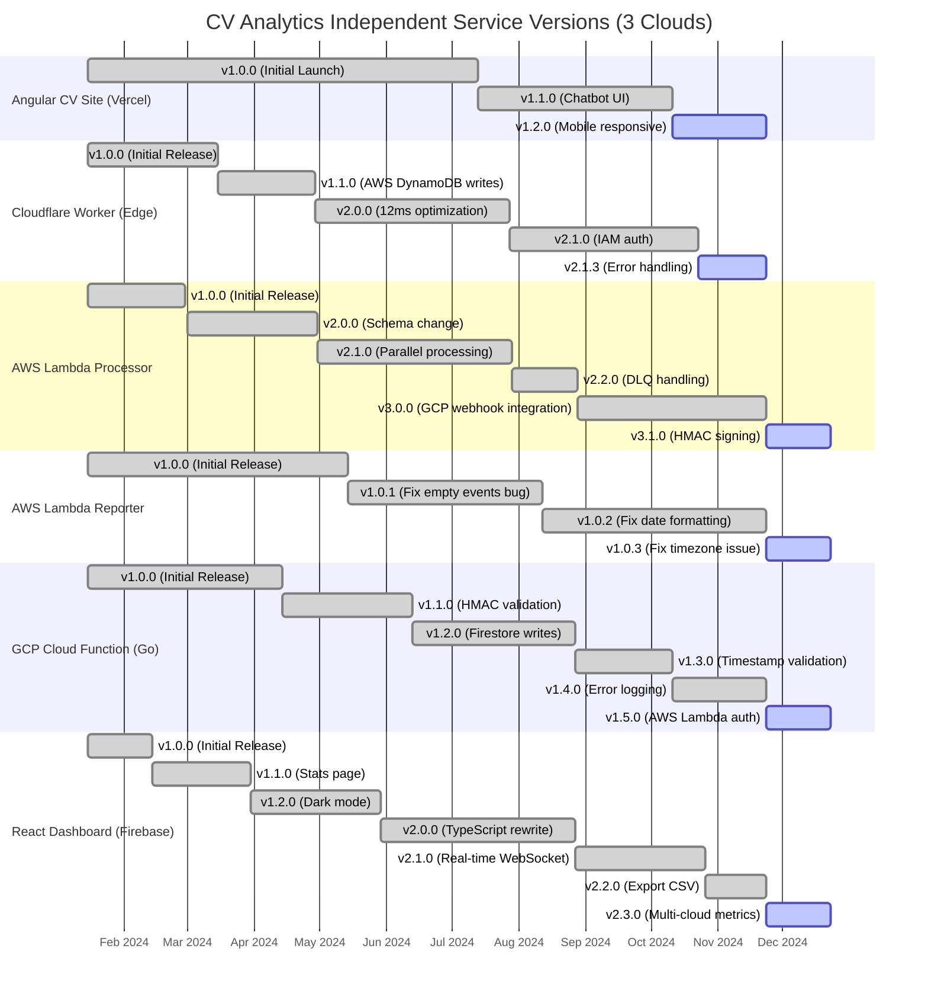
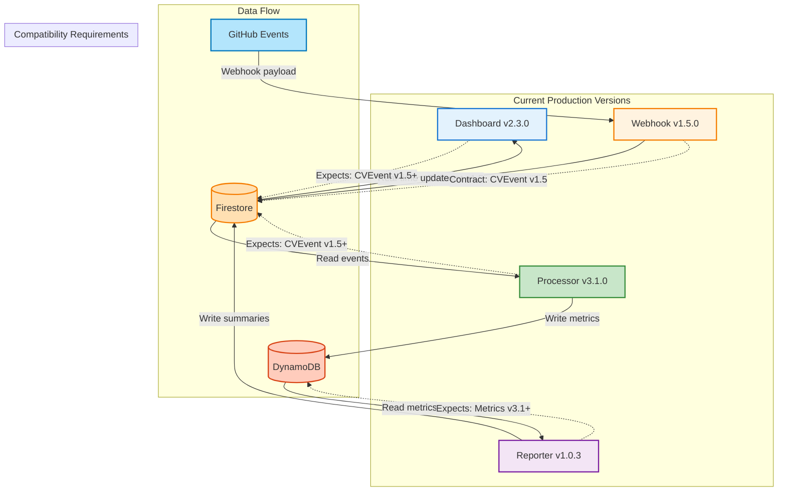

# Semantic Versioning for Microservices: Independent Evolution at Scale

*Deployed breaking change as v1.2.1 patch. Production crashed for 4 hours. Should have been v2.0.0 major.*

## Quick Summary

- ✓ **SemVer 2.0.0** (MAJOR.MINOR.PATCH) enables independent service evolution
- ✓ **Git tags** track deployments and releases per service
- ✓ **Breaking changes** are communicated through MAJOR version bumps
- ✓ **Deprecation policies** give consumers time to migrate
- ✓ **Automated versioning** in CI/CD reduces manual errors

---

## Introduction

In February 2024, I changed the CV Analytics event schema. Added a new field: `repository_visibility`. Seemed harmless. The webhook wrote events with this field. The processor expected the old schema. Production processor crashed for 4 hours before I noticed.

No version numbers. No changelog. No migration plan. Just a silent breaking change that broke downstream consumers.

After implementing semantic versioning, every service tracks its version. Breaking changes bump MAJOR versions. Consumers know when to expect changes. Migration guides explain how to adapt.

This post explains how CV Analytics uses SemVer 2.0.0 for independent service evolution:

**You'll learn:**
- ✓ SemVer 2.0.0 basics (MAJOR.MINOR.PATCH)
- ✓ Git tagging workflow for deployments
- ✓ Per-service independent versioning
- ✓ Handling breaking changes without downtime
- ✓ Deprecation policies and migration paths
- ✓ Automated versioning in CI/CD

**Why versioning matters for microservices:**

Microservices communicate via APIs (HTTP, message queues, gRPC). API changes break consumers:
- Field renames break JSON parsing
- New required fields break validation
- Removed endpoints break client code
- Schema changes break message processing

**Without versions:** No way to know if change is safe.
**With versions:** MAJOR bump signals breaking change.

**The cost of unversioned APIs:**

Every change is a potential breaking change:
1. **Fear of change**: Developers avoid refactoring (might break something)
2. **Coordination overhead**: Must notify all consumers before deploying
3. **Slow evolution**: Changes require coordinated releases
4. **Production incidents**: Silent breakages discovered by users
5. **No rollback strategy**: Can't deploy old version (no version tracking)

CV Analytics experienced all of these before implementing SemVer.

**SemVer as communication protocol:**

Semantic Versioning (SemVer) provides a shared language:
- **MAJOR**: Breaking changes (API incompatible with previous version)
- **MINOR**: New features (backwards-compatible additions)
- **PATCH**: Bug fixes (backwards-compatible fixes)

Version number communicates impact:
- `v1.0.0` → `v1.0.1`: Safe to upgrade (bug fix)
- `v1.0.0` → `v1.1.0`: Safe to upgrade (new feature, old code still works)
- `v1.0.0` → `v2.0.0`: **Breaking change** (requires code changes)

**How independent versioning enables autonomy:**

CV Analytics has 6 services across 3 clouds with independent versions:
- **Angular CV Site**: v1.2.0 (portfolio interface, infrequent updates)
- **Cloudflare Worker**: v2.1.3 (CV chatbot, stable 12ms performance)
- **AWS Lambda Processor**: v3.0.0 (evolved rapidly, 2 breaking changes)
- **AWS Lambda Reporter**: v1.0.2 (stable, only bug fixes)
- **GCP Cloud Function**: v1.5.0 (webhook receiver, stable HMAC validation)
- **React Dashboard**: v2.3.1 (mature, frequent UI updates)

Services evolve at different velocities across three clouds. Dashboard UI changes don't affect AWS Lambda. Processor breaking changes don't require Cloud Function updates (if webhook API maintains compatibility). Cloudflare Worker performance optimizations don't affect GCP.

Independent versioning = independent deployment = faster iteration.

Let's implement SemVer.

---

## Semantic Versioning Basics

Semantic Versioning (SemVer) uses three-part version numbers: MAJOR.MINOR.PATCH. Each component signals different types of changes.

### MAJOR.MINOR.PATCH Explained

**Format:**

```text
v1.2.3-alpha.1+build.20251123
│ │ │  │       │
│ │ │  │       └─ Build metadata
│ │ │  └─────────── Pre-release
│ │ └────────────── PATCH (bug fixes)
│ └──────────────── MINOR (new features, backwards-compatible)
└─────────────────── MAJOR (breaking changes)
```

---

## Git Tagging Workflow

Git tags mark specific commits as releases. CV Analytics uses annotated tags for all versions. Each deployment creates a tag.

### Tagging Process

```mermaid
graph LR
    COMMIT[Merge PR to main] --> AUTO[CI/CD determines version]
    AUTO --> TAG[Create annotated tag]
    TAG --> PUSH[Push tag to GitHub]
    PUSH --> RELEASE[Create GitHub Release]
    RELEASE --> DEPLOY[Deploy tagged version]
    DEPLOY --> VERIFY[Verify deployment]
    
    style COMMIT fill:#e3f2fd,stroke:#1976d2,stroke-width:2px
    style AUTO fill:#fff3e0,stroke:#f57c00,stroke-width:2px
    style TAG fill:#fff3e0,stroke:#f57c00,stroke-width:2px
    style PUSH fill:#fff3e0,stroke:#f57c00,stroke-width:2px
    style RELEASE fill:#c8e6c9,stroke:#388e3c,stroke-width:2px
    style DEPLOY fill:#c8e6c9,stroke:#388e3c,stroke-width:2px
    style VERIFY fill:#c8e6c9,stroke:#388e3c,stroke-width:2px
```



### Creating Annotated Tags

**Annotated tags** (recommended):
```bash
git tag -a v1.0.0 -m "Release v1.0.0: Initial stable release"
```

Annotated tags include:
- Tag name: `v1.0.0`
- Message: `"Release v1.0.0: Initial stable release"`
- Tagger name and email
- Timestamp
- GPG signature (optional)

**Lightweight tags** (not recommended):
```bash
git tag v1.0.0  # No -a flag
```

Lightweight tags are just pointers to commits (no metadata). CV Analytics uses annotated tags exclusively.

**View tag details:**
```bash
git show v1.0.0
```

Output:
```
tag v1.0.0
Tagger: Developer <dev@example.com>
Date:   Sat Nov 23 10:00:00 2024 +0000

Release v1.0.0: Initial stable release

commit a1b2c3d4e5f6...
Author: Developer <dev@example.com>
Date:   Sat Nov 23 09:55:00 2024 +0000

    feat: implement webhook receiver
```

### Pushing Tags to Remote

**Push single tag:**
```bash
git push origin v1.0.0
```

**Push all tags:**
```bash
git push origin --tags
```

**CV Analytics workflow:**
```bash
# After merging PR, create tag
git tag -a v1.5.0 -m "Release v1.5.0: Add repository visibility field"

# Push tag immediately
git push origin v1.5.0

# CI/CD detects new tag and deploys
```

**Tags trigger deployments:**
```yaml
# .github/workflows/deploy.yml
on:
  push:
    tags:
      - 'v*.*.*'  # Matches v1.0.0, v2.1.3, etc.

jobs:
  deploy:
    runs-on: ubuntu-latest
    steps:
      - uses: actions/checkout@v3
      - run: deploy
```

New tag `v1.5.0` pushed → Workflow triggered → Deployment to production.

### Tag Naming Conventions

**CV Analytics conventions:**

**Format:** `v{MAJOR}.{MINOR}.{PATCH}[-{PRERELEASE}][+{BUILD}]`

**Production releases:**
```
v1.0.0
v1.1.0
v1.1.1
v2.0.0
```

**Pre-release versions:**
```
v2.0.0-alpha.1
v2.0.0-alpha.2
v2.0.0-beta.1
v2.0.0-rc.1
```

**Per-service prefixes** (for monorepos):

If multiple services in one repository:
```
dashboard-v1.0.0
webhook-v1.0.0
processor-v1.0.0
reporter-v1.0.0
```

CV Analytics uses separate repositories (no prefix needed).

**Tag messages:**

Consistent format:
```bash
git tag -a v1.5.0 -m "Release v1.5.0: Brief description

Changes:
- Feature 1
- Feature 2
- Bug fix 3

Breaking changes: None"
```

### Listing and Checking Out Tags

**List all tags:**
```bash
git tag -l
```

Output:
```
v1.0.0
v1.1.0
v1.1.1
v1.2.0
v2.0.0
```

**List tags matching pattern:**
```bash
git tag -l "v1.*"
```

Output:
```
v1.0.0
v1.1.0
v1.1.1
v1.2.0
```

**Sort tags by version:**
```bash
git tag -l --sort=-version:refname
```

Output (descending order):
```
v2.0.0
v1.2.0
v1.1.1
v1.1.0
v1.0.0
```

**Checkout specific version:**
```bash
git checkout v1.0.0
```

Puts repository in "detached HEAD" state (viewing old code). Useful for:
- Debugging production issues ("what code is running?")
- Reproducing bugs in specific version
- Reviewing historical changes

**Checkout and create branch:**
```bash
git checkout -b hotfix-1.0.1 v1.0.0
```

Creates new branch from `v1.0.0` tag. Useful for backporting fixes.

**Delete tag (if created by mistake):**
```bash
# Delete local tag
git tag -d v1.0.0

# Delete remote tag
git push origin --delete v1.0.0
```

**CV Analytics tag deletion policy:** Never delete tags (immutable history).

### Tag-Based Deployments

**Workflow triggered by tag push:**

**Full example:**
```yaml
name: Deploy Tagged Release

on:
  push:
    tags:
      - 'v[0-9]+.[0-9]+.[0-9]+'
      - 'v[0-9]+.[0-9]+.[0-9]+-*'

jobs:
  deploy:
    runs-on: ubuntu-latest
    
    steps:
      - name: Checkout tag
        uses: actions/checkout@v3
        with:
          ref: ${{ github.ref }}  # Checkout the tag
      
      - name: Extract version
        id: version
        run: |
          VERSION=${GITHUB_REF#refs/tags/v}
          echo "VERSION=$VERSION" >> $GITHUB_OUTPUT
          echo "Deploying version $VERSION"
      
      - name: Build
        run: |
          npm ci
          npm run build
          echo "${{ steps.version.outputs.VERSION }}" > build/version.txt
      
      - name: Deploy to production
        run: |
          firebase deploy --only hosting
      
      - name: Create GitHub Release
        uses: actions/create-release@v1
        env:
          GITHUB_TOKEN: ${{ secrets.GITHUB_TOKEN }}
        with:
          tag_name: ${{ github.ref }}
          release_name: Release ${{ github.ref }}
          body: |
            Version ${{ steps.version.outputs.VERSION }}
            
            See [CHANGELOG.md](https://github.com/${{ github.repository }}/blob/main/CHANGELOG.md) for details.
          draft: false
          prerelease: false
      
      - name: Notify deployment
        run: |
          curl -X POST ${{ secrets.SLACK_WEBHOOK }} \
            -d '{"text":"Deployed ${{ github.repository }} version ${{ steps.version.outputs.VERSION }}"}'
```

**Deployment process:**

1. Developer merges PR to main
2. Developer creates tag:
   ```bash
   git tag -a v1.5.0 -m "Release v1.5.0"
   git push origin v1.5.0
   ```
3. GitHub Actions detects tag push
4. Workflow checks out tag
5. Workflow builds code from tag
6. Workflow deploys to production
7. Workflow creates GitHub Release
8. Workflow notifies team

**Benefits of tag-based deployments:**
- ✓ Exact code deployed is tagged (reproducible)
- ✓ Can redeploy old version (checkout tag, trigger workflow)
- ✓ Clear deployment history (list tags)
- ✓ Rollback is simple (deploy previous tag)

**Manual tag-based deployment:**
```bash
# Deploy specific version
git checkout v1.4.0
npm ci
npm run build
firebase deploy

# Return to main
git checkout main
```

CV Analytics uses automated tag-based deployments (never manual).

---

## Per-Service Versioning in CV Analytics

CV Analytics runs 6 services across 3 clouds (Cloudflare, AWS, GCP) with independent versions. Each service evolves at its own pace. No coordinated releases. Cross-cloud versioning adds complexity: AWS Lambda Processor depends on GCP Cloud Function webhook URL (infrastructure dependency), but services remain independently versionable.

### Service Version Timeline (Jan 2024 - Nov 2025)



### Version Evolution by Service

**Angular CV Site (v1.2.0):** Stable interface
- 3 releases in 22 months
- 0 MAJOR bumps (backwards-compatible UI)
- 2 MINOR bumps (chatbot UI, mobile responsive)
- Frontend changes don't affect backend
- Deploy frequency: 1x per quarter
- Cloud: Vercel (zero-downtime deploys)

**Cloudflare Worker (v2.1.3):** Performance-critical, stable API
- 5 releases in 22 months
- 1 MAJOR bump (12ms optimization required architecture change)
- 2 MINOR bumps (AWS integration, IAM auth)
- 3 PATCH bumps (error handling, edge cases)
- 50ms CPU limit drives optimization focus
- Deploy frequency: 1x per month
- Cloud: Cloudflare (250+ edge locations)

**AWS Lambda Processor (v3.1.0):** Rapid evolution, cross-cloud integration
- 6 releases in 22 months
- 2 MAJOR bumps (DynamoDB schema change, GCP webhook integration)
- 3 MINOR bumps (parallel processing, DLQ, HMAC signing)
- Internal service (can tolerate breaking changes)
- Cross-cloud dependency: Needs GCP webhook URL
- Deploy frequency: 1-2x per month
- Cloud: AWS us-east-1

**AWS Lambda Reporter (v1.0.3):** Minimal changes, only bug fixes
- 4 releases in 22 months
- 0 MAJOR bumps
- 0 MINOR bumps
- 3 PATCH bumps (bug fixes only)
- Stable functionality (scheduled weekly reports)
- Deploy frequency: 1x per quarter
- Cloud: AWS us-east-1

**GCP Cloud Function (v1.5.0):** Stable webhook receiver
- 6 releases in 22 months
- 0 MAJOR bumps (HMAC validation API stable)
- 5 MINOR bumps (Firestore writes, timestamp validation, AWS Lambda auth)
- Public endpoint requires security stability
- Cross-cloud consumer: AWS Lambda sends webhooks
- Deploy frequency: 1x per month
- Cloud: GCP us-central1 (Go runtime)

**React Dashboard (v2.3.0):** Most frequent updates
- 7 releases in 22 months
- 1 MAJOR bump (TypeScript rewrite)
- 6 MINOR bumps (stats, dark mode, real-time WebSocket, CSV export, multi-cloud metrics)
- UI changes don't affect backend services
- Deploy frequency: 2-3x per month
- Cloud: Firebase Hosting (global CDN)

### Independent Version Numbers Across 3 Clouds

No correlation between service versions. Each cloud provider hosts services at different version numbers:

**November 2025 versions:**

**Cloudflare:**
- Worker (Edge): v2.1.3

**AWS (us-east-1):**
- Lambda Processor: v3.1.0
- Lambda Reporter: v1.0.3

**GCP (us-central1):**
- Cloud Function: v1.5.0

**Frontend (Vercel + Firebase):**
- Angular CV Site: v1.2.0
- React Dashboard: v2.3.0

Each number tells a story:
- Angular v1.x: Original interface still works
- Cloudflare Worker v2.x: Had 1 major performance rewrite (12ms optimization)
- AWS Processor v3.x: Evolved through 2 breaking changes (schema + GCP integration)
- AWS Reporter v1.0.x: Unchanged since launch (only fixes)
- GCP Cloud Function v1.x: Original HMAC API still compatible
- React Dashboard v2.x: Had 1 major rewrite (TypeScript)

**Cross-cloud version independence:** AWS Lambda Processor at v3.1.0 works with GCP Cloud Function at v1.5.0. No requirement for version number synchronization across clouds.

### No Coordinated Releases (Cross-Cloud Independence)

**Traditional approach (monolith):**
```
Release v2.0.0:
- Update Angular CV site
- Update Cloudflare Worker
- Update AWS Lambda Processor
- Update AWS Lambda Reporter
- Update GCP Cloud Function
- Update React Dashboard
- Deploy all together across 3 clouds
- Hope nothing breaks
```

Slow. Risky. Coordination overhead across multiple cloud providers.

**CV Analytics approach (multi-cloud microservices):**
```
Angular CV Site v1.2.0:        Deploy to Vercel independently
Cloudflare Worker v2.1.3:      Deploy to Cloudflare Edge independently (different week)
AWS Lambda Processor v3.1.0:   Deploy to AWS independently (different day)
AWS Lambda Reporter v1.0.3:    Deploy to AWS independently (different month)
GCP Cloud Function v1.5.0:     Deploy to GCP independently (different week)
React Dashboard v2.3.0:        Deploy to Firebase independently (different day)
```

Fast. Safe. No coordination needed. Each cloud provider deployment is independent.

**Example: React Dashboard v2.3.0 deployment (November 2025)**

Dashboard adds multi-cloud metrics visualization. Only frontend changes. Backend services across 3 clouds unchanged:
- Angular CV Site: Still v1.2.0 (no update needed)
- Cloudflare Worker: Still v2.1.3 (no update needed)
- AWS Lambda Processor: Still v3.1.0 (no update needed)
- AWS Lambda Reporter: Still v1.0.3 (no update needed)
- GCP Cloud Function: Still v1.5.0 (no update needed)

Dashboard deploys alone to Firebase Hosting. Other services across Cloudflare, AWS, and GCP keep running.

**Exception: Cross-cloud dependency (AWS → GCP)**

AWS Lambda Processor v3.0.0 introduced GCP Cloud Function webhook integration. This was a coordinated deployment:
1. Deploy GCP Cloud Function v1.5.0 first (establish webhook URL)
2. Update Terraform with webhook URL
3. Deploy AWS Lambda Processor v3.0.0 (configured with GCP URL)

Breaking change required coordination, but services remain independently versionable. Future updates to either service don't require coordination unless API contract changes.

**Contracts, not coordination:**

Services maintain API contracts:
- Webhook provides events in stable format
- Processor consumes events (expects contract)
- Dashboard reads Firestore (stable schema)
- Reporter reads Firestore (same schema)

As long as contracts maintained, services evolve independently.

**Breaking the contract requires MAJOR version bump.**

---

## Handling Breaking Changes

Breaking changes are inevitable. APIs evolve. Data models change. The goal: minimise disruption to consumers.

### What Qualifies as Breaking

**Breaking changes** make existing client code fail:

**API changes:**
- ✗ Remove endpoint: `DELETE /api/users` removed
- ✗ Rename field: `userId` → `user_id`
- ✗ Change field type: `age: string` → `age: number`
- ✗ Remove field: `email` field deleted
- ✗ Add required field: New required `role` in POST body
- ✗ Change HTTP method: `GET /users` → `POST /users`
- ✗ Change response structure: `{users: [...]}` → `[...]`
- ✗ Stricter validation: `name` now requires 3+ characters

**Non-breaking changes:**
- ✓ Add optional field: New optional `phoneNumber`
- ✓ Add new endpoint: New `GET /api/stats`
- ✓ Relax validation: `name` now accepts 1+ characters
- ✓ Add enum value: `status` accepts new `pending` value
- ✓ Fix bugs: Incorrect calculation corrected
- ✓ Performance improvements: Same API, faster response

**CV Analytics processor v2.0.0 → v3.0.0 breaking change:**

```javascript
// v2.0.0 - Original event structure
interface CVEvent {
  type: string;           // "push", "pull_request", etc.
  repo: string;           // Repository name
  timestamp: number;      // Unix timestamp
  payload: object;        // GitHub payload
}

// Processor v2.x code
const processEvent = (event: CVEvent) => {
  const eventType = event.type;  // Read "type" field
  const repoName = event.repo;   // Read "repo" field
  // Process event
};
```

```javascript
// v3.0.0 - BREAKING CHANGE (field renames for clarity)
interface CVEvent {
  eventType: string;           // Renamed from "type"
  repositoryName: string;      // Renamed from "repo"
  timestamp: number;           // Unchanged
  payload: object;             // Unchanged
}

// Processor v3.x code (breaks v2.x consumers)
const processEvent = (event: CVEvent) => {
  const eventType = event.eventType;        // OLD CODE BREAKS HERE
  const repoName = event.repositoryName;    // OLD CODE BREAKS HERE
  // Process event
};
```

Consumers expecting `type` field get `undefined`. Code breaks.

### MAJOR Version Bump Protocol

**When breaking change needed:**

**Step 1: Document breaking change**
```markdown
# CHANGELOG.md

## v3.0.0 (2024-08-28) - BREAKING CHANGES

### Breaking Changes

- **Field rename**: `type` → `eventType` in CVEvent interface
- **Field rename**: `repo` → `repositoryName` in CVEvent interface

### Migration Guide

Update consumer code:

```diff
- const eventType = event.type;
+ const eventType = event.eventType;

- const repoName = event.repo;
+ const repoName = event.repositoryName;
```

### Why This Change?

- `type` is too generic (conflicts with TypeScript `type` keyword)
- `repo` is abbreviation (clarity over brevity)
```

**Step 2: Bump MAJOR version**
```bash
# v2.2.0 → v3.0.0
git tag -a v3.0.0 -m "Release v3.0.0: BREAKING CHANGES - Field renames

See CHANGELOG.md for migration guide."
git push origin v3.0.0
```

**Step 3: Notify consumers**
- Email to stakeholders
- Slack announcement
- GitHub Release with migration guide
- Update API documentation

**Step 4: Support period**

Run v2.x and v3.x in parallel (dual-version support).

### Migration Guides

**Effective migration guide structure:**

```markdown
# Migration Guide: v2.x → v3.0.0

## Overview

Version 3.0.0 renames event fields for clarity.

## Breaking Changes

### 1. Field Rename: `type` → `eventType`

**Before (v2.x):**
```javascript
const type = event.type;
```

**After (v3.0.0):**
```javascript
const type = event.eventType;
```

### 2. Field Rename: `repo` → `repositoryName`

**Before (v2.x):**
```javascript
const repo = event.repo;
```

**After (v3.0.0):**
```javascript
const repo = event.repositoryName;
```

## Step-by-Step Migration

1. **Update TypeScript interfaces:**
   ```typescript
   interface CVEvent {
     eventType: string;      // Changed
     repositoryName: string; // Changed
     timestamp: number;
     payload: object;
   }
   ```

2. **Find and replace in codebase:**
   ```bash
   grep -r "event.type" src/
   # Replace all with event.eventType
   
   grep -r "event.repo" src/
   # Replace all with event.repositoryName
   ```

3. **Update tests:**
   ```javascript
   // Old test
   expect(event.type).toBe('push');
   
   // New test
   expect(event.eventType).toBe('push');
   ```

4. **Deploy and verify:**
   - Deploy to staging
   - Run integration tests
   - Monitor logs for errors
   - Deploy to production

## Compatibility

- v3.0.0 is **NOT compatible** with v2.x consumers
- All consumers must update before upgrading
- Support period: v2.2.0 supported until 2025-02-28 (6 months)

## Need Help?

Contact: support@cv-analytics.com
```

### Dual-Version Support

**Running v1 and v2 simultaneously** during migration period:

**Approach 1: Versioned endpoints**

```javascript
// v1 endpoint (deprecated)
app.post('/v1/events', (req, res) => {
  const event = {
    type: req.body.type,           // Old field name
    repo: req.body.repo,           // Old field name
    timestamp: Date.now()
  };
  processEventV1(event);
});

// v2 endpoint (current)
app.post('/v2/events', (req, res) => {
  const event = {
    eventType: req.body.eventType,       // New field name
    repositoryName: req.body.repositoryName, // New field name
    timestamp: Date.now()
  };
  processEventV2(event);
});
```

Consumers migrate at their own pace:
- Old consumers: Call `/v1/events`
- New consumers: Call `/v2/events`

**Approach 2: Field aliasing**

```javascript
// Support both old and new field names
const processEvent = (event) => {
  const eventType = event.eventType || event.type;  // Support both
  const repoName = event.repositoryName || event.repo;  // Support both
  
  if (event.type) {
    console.warn('Deprecation warning: "type" field is deprecated, use "eventType"');
  }
  if (event.repo) {
    console.warn('Deprecation warning: "repo" field is deprecated, use "repositoryName"');
  }
  
  // Process event
};
```

Single endpoint supports both versions temporarily.

**Approach 3: Lambda versions**

```bash
# Deploy v2 as new Lambda version
aws lambda publish-version --function-name cv-processor

# v1 alias points to version 1
aws lambda update-alias \
  --function-name cv-processor \
  --name v1 \
  --function-version 1

# v2 alias points to version 2
aws lambda update-alias \
  --function-name cv-processor \
  --name v2 \
  --function-version 2
```

Consumers invoke by alias:
- `arn:aws:lambda:region:account:function:cv-processor:v1` (old)
- `arn:aws:lambda:region:account:function:cv-processor:v2` (new)

**CV Analytics approach:**

Processor v2→v3 migration used field aliasing for 6 months, then removed v2 support.

### Sunset Timelines

**Deprecation timeline template:**

```
Day 0:   Release v3.0.0 (breaking changes)
         Announce deprecation of v2.x
         Publish migration guide
         
Week 2:  Email reminder to v2.x consumers
         
Month 1: First deprecation warning in logs
         Monitor v2.x usage metrics
         
Month 3: Second email reminder
         Offer migration support
         
Month 6: Final warning (30 days to sunset)
         
Day 180: Remove v2.x support
         Return 410 Gone for v2.x endpoints
```

**CV Analytics sunset policy:**
- MAJOR version support: 6 months after next MAJOR release
- MINOR version support: Until next MAJOR release
- PATCH version support: Until next MINOR or MAJOR release

**Example:**
- v2.2.0 released: 2024-07-29
- v3.0.0 released: 2024-08-28
- v2.x sunset: 2025-02-28 (6 months after v3.0.0)

After sunset, v2.x endpoints return:
```json
{
  "error": "API version deprecated",
  "message": "v2.x is no longer supported. Please upgrade to v3.x.",
  "migrationGuide": "https://docs.cv-analytics.com/migration-v2-to-v3"
}
```

---

## Deprecation Policies

Deprecation is not removal. It's a transition period where old functionality still works but is marked for future removal.

### Announce Deprecation in Advance

**Minimum notice period:** 6 months for CV Analytics.

**Deprecation announcement channels:**

**1. CHANGELOG.md:**
```markdown
## v1.5.0 (2024-11-23)

### Deprecated

- **`event.type` field**: Deprecated in favour of `event.eventType`. 
  Will be removed in v2.0.0 (planned for 2025-05-23).
  
- **`event.repo` field**: Deprecated in favour of `event.repositoryName`. 
  Will be removed in v2.0.0 (planned for 2025-05-23).
```

**2. API documentation:**
```markdown
## CVEvent Interface

| Field | Type | Status | Description |
|-------|------|--------|-------------|
| eventType | string | **Current** | Event type (push, pull_request, etc.) |
| type | string | **DEPRECATED** | Use `eventType` instead. Removed in v2.0.0. |
| repositoryName | string | **Current** | Repository name |
| repo | string | **DEPRECATED** | Use `repositoryName` instead. Removed in v2.0.0. |
```

**3. Code comments:**
```typescript
interface CVEvent {
  eventType: string;
  
  /**
   * @deprecated Use eventType instead. Will be removed in v2.0.0 (2025-05-23).
   */
  type?: string;
  
  repositoryName: string;
  
  /**
   * @deprecated Use repositoryName instead. Will be removed in v2.0.0 (2025-05-23).
   */
  repo?: string;
}
```

**4. Runtime warnings:**
```javascript
const processEvent = (event) => {
  if (event.type !== undefined) {
    console.warn(
      'DEPRECATION WARNING: event.type is deprecated. ' +
      'Use event.eventType instead. ' +
      'This field will be removed in v2.0.0 (2025-05-23).'
    );
  }
  
  const eventType = event.eventType || event.type;
  // Continue processing
};
```

**5. HTTP headers:**
```http
HTTP/1.1 200 OK
Deprecation: true
Sunset: Sat, 23 May 2025 00:00:00 GMT
Link: <https://docs.cv-analytics.com/migration-v2>; rel="deprecation"
```

### Support Period

**CV Analytics support periods:**

**MAJOR version deprecation:** 6 months
- v1.x deprecated when v2.0.0 released
- v1.x supported for 6 months after v2.0.0
- v1.x removed after 6 months

**MINOR version deprecation:** Until next MAJOR
- v1.4.x deprecated when v1.5.0 released
- v1.4.x supported until v2.0.0 released
- No explicit removal (superseded by v2.0.0)

**Feature deprecation within same MAJOR:** 12 months
- Feature deprecated in v1.5.0
- Feature removed in v2.0.0 (at least 12 months later)

**Critical security issues:** Immediate removal
- If feature has security vulnerability
- Immediate deprecation + removal
- Hotfix released (PATCH bump)

### Clear Migration Documentation

**Migration guide template:**

```markdown
# Deprecation Notice: event.type Field

## Status

- **Deprecated in:** v1.5.0 (2024-11-23)
- **Removed in:** v2.0.0 (planned for 2025-05-23)
- **Replacement:** `event.eventType`

## Why Deprecated?

The field name `type` is too generic and conflicts with:
- TypeScript `type` keyword
- JavaScript `typeof` confusion
- Unclear intent (event type? data type?)

The new field `eventType` is explicit and clear.

## Migration Steps

### 1. Update TypeScript types

```diff
interface CVEvent {
-  type: string;
+  eventType: string;
}
```

### 2. Update code references

```diff
-const eventType = event.type;
+const eventType = event.eventType;
```

### 3. Update tests

```diff
expect(event).toHaveProperty('type');
+expect(event).toHaveProperty('eventType');
```

### 4. Search codebase

```bash
# Find all references
grep -r "event\.type" src/
grep -r "event\['type'\]" src/
```

## Backwards Compatibility

**v1.5.x (current):** Both fields supported
```javascript
{
  "eventType": "push",  // New field
  "type": "push"        // Deprecated but still works
}
```

**v2.0.0 (future):** Only new field
```javascript
{
  "eventType": "push"   // Only this field exists
}
```

## Timeline

- **Now - 2025-05-23:** Use new field, old field still works
- **2025-05-23+:** Old field removed, only new field works

## Need Help?

Contact: support@cv-analytics.com
```

### Monitoring Deprecated Endpoint Usage

**Track deprecation warnings:**

```javascript
const deprecationMetrics = {
  'event.type': 0,
  'event.repo': 0
};

const processEvent = (event) => {
  if (event.type !== undefined) {
    deprecationMetrics['event.type']++;
    
    // Log to CloudWatch/Cloud Logging
    logger.warn('Deprecated field used', {
      field: 'event.type',
      consumer: req.headers['user-agent'],
      timestamp: Date.now()
    });
  }
  
  // Continue processing
};

// Export metrics every hour
setInterval(() => {
  console.log('Deprecation usage:', deprecationMetrics);
  // Send to monitoring system
}, 3600000);
```

**CloudWatch custom metrics:**

```javascript
const AWS = require('aws-sdk');
const cloudwatch = new AWS.CloudWatch();

const trackDeprecation = (fieldName) => {
  cloudwatch.putMetricData({
    Namespace: 'CVAnalytics/Deprecations',
    MetricData: [{
      MetricName: 'DeprecatedFieldUsage',
      Value: 1,
      Unit: 'Count',
      Dimensions: [{
        Name: 'FieldName',
        Value: fieldName
      }]
    }]
  }).promise();
};
```

**Create CloudWatch alarms:**

```bash
aws cloudwatch put-metric-alarm \
  --alarm-name deprecated-field-usage \
  --alarm-description "Alert when deprecated fields still used" \
  --metric-name DeprecatedFieldUsage \
  --namespace CVAnalytics/Deprecations \
  --statistic Sum \
  --period 86400 \
  --threshold 100 \
  --comparison-operator GreaterThanThreshold
```

**Dashboard for deprecation tracking:**

Track weekly usage of deprecated fields. Goal: Zero usage before sunset.

**Weekly deprecation report:**

```javascript
const generateDeprecationReport = async () => {
  const metrics = await getDeprecationMetrics();
  
  const report = `
Deprecation Report (Week of ${new Date().toISOString()})

Deprecated Field Usage:
- event.type: ${metrics['event.type']} calls
- event.repo: ${metrics['event.repo']} calls

Target: 0 calls before 2025-05-23
Days remaining: ${daysUntilSunset()}

Action required: ${metrics['event.type'] > 0 ? 'YES' : 'NO'}
  `;
  
  // Email to stakeholders
  await sendEmail(report);
};
```

### Graceful Shutdown Procedures

**Sunset day workflow:**

**T-30 days: Final warning**
```javascript
const processEvent = (event) => {
  if (event.type !== undefined) {
    logger.error(
      'FINAL WARNING: event.type will be removed in 30 days. ' +
      'Update your code immediately. ' +
      'See https://docs.cv-analytics.com/migration-v2'
    );
  }
};
```

**T-7 days: Block new consumers**
```javascript
if (isNewConsumer() && event.type !== undefined) {
  throw new Error(
    'Deprecated field usage not allowed for new consumers. ' +
    'Use event.eventType instead.'
  );
}
```

**T-0 days (sunset): Remove support**
```javascript
// v2.0.0 - Removed deprecated fields
const processEvent = (event) => {
  if (event.type !== undefined) {
    throw new Error(
      'Deprecated field "type" is no longer supported. ' +
      'Use "eventType" instead. ' +
      'See https://docs.cv-analytics.com/migration-v2'
    );
  }
  
  const eventType = event.eventType;  // Only new field
  // Process event
};
```

**Return 410 Gone for deprecated endpoints:**

```javascript
app.post('/v1/events', (req, res) => {
  res.status(410).json({
    error: 'Endpoint deprecated',
    message: 'v1 API is no longer supported as of 2025-05-23',
    migrationGuide: 'https://docs.cv-analytics.com/migration-v2',
    currentVersion: 'v2',
    currentEndpoint: '/v2/events'
  });
});
```

**HTTP 410 Gone** (not 404) signals permanent removal.

---

## CI/CD Integration: Automated Versioning

Manual versioning is error-prone. Forget to bump version? Deploy v1.0.0 again. Bump wrong component? v1.1.0 should have been v2.0.0.

CV Analytics uses **semantic-release** for automated version bumps based on commit messages.

### Automatic Version Bumps on Merge

**Workflow:**

1. Developer writes code with conventional commits
2. PR merged to main
3. CI/CD analyses commit messages
4. CI/CD determines version bump (MAJOR/MINOR/PATCH)
5. CI/CD creates git tag
6. CI/CD generates changelog
7. CI/CD creates GitHub Release
8. CI/CD deploys new version

Zero manual intervention.

### Conventional Commits

**Format:** `<type>(<scope>): <description>`

**Types that affect versioning:**

**feat:** New feature (MINOR bump)
```bash
git commit -m "feat: add dark mode to dashboard"
# v1.0.0 → v1.1.0
```

**fix:** Bug fix (PATCH bump)
```bash
git commit -m "fix: correct timezone calculation in reporter"
# v1.0.0 → v1.0.1
```

**BREAKING CHANGE:** Breaking change (MAJOR bump)
```bash
git commit -m "feat: rename event.type to event.eventType

BREAKING CHANGE: event.type field removed, use event.eventType instead"
# v1.0.0 → v2.0.0
```

**Alternative BREAKING CHANGE syntax:**
```bash
git commit -m "feat!: rename event fields"
# Exclamation mark indicates breaking change
# v1.0.0 → v2.0.0
```

**Other types (no version bump):**
- `docs:` Documentation changes
- `style:` Code style (formatting, whitespace)
- `refactor:` Code refactoring (no functional change)
- `test:` Test changes
- `chore:` Build process, dependencies

**Examples:**

```bash
# MINOR bump (new feature)
git commit -m "feat(dashboard): add CSV export button"

# PATCH bump (bug fix)
git commit -m "fix(webhook): handle empty payload gracefully"

# MAJOR bump (breaking change)
git commit -m "feat(processor): change event schema

BREAKING CHANGE: event.repo renamed to event.repositoryName"

# No version bump (docs)
git commit -m "docs: update README with new examples"

# PATCH bump (security fix)
git commit -m "fix(webhook): validate HMAC signature length"

# MINOR bump (new optional feature)
git commit -m "feat(webhook): add optional visibility field to events"
```

**Scope** (optional but recommended):
- `dashboard`, `webhook`, `processor`, `reporter`
- Helps identify which service changed

### Semantic-Release Tool

**Installation:**

```bash
npm install --save-dev semantic-release
npm install --save-dev @semantic-release/changelog
npm install --save-dev @semantic-release/git
```

**Configuration** (`.releaserc.json`):

```json
{
  "branches": ["main"],
  "plugins": [
    "@semantic-release/commit-analyzer",
    "@semantic-release/release-notes-generator",
    "@semantic-release/changelog",
    "@semantic-release/npm",
    "@semantic-release/github",
    [
      "@semantic-release/git",
      {
        "assets": ["CHANGELOG.md", "package.json"],
        "message": "chore(release): ${nextRelease.version} [skip ci]\n\n${nextRelease.notes}"
      }
    ]
  ]
}
```

**What semantic-release does:**

1. **Analyse commits** since last release
2. **Determine version bump** based on commit types
3. **Generate release notes** from commits
4. **Update CHANGELOG.md** with new version
5. **Bump version** in package.json
6. **Create git tag** (v1.2.0)
7. **Push tag** to GitHub
8. **Create GitHub Release** with notes
9. **Publish to npm** (optional)

**Full GitHub Actions workflow:**

```yaml
name: Release

on:
  push:
    branches:
      - main

jobs:
  release:
    runs-on: ubuntu-latest
    
    permissions:
      contents: write  # Create releases
      issues: write    # Comment on issues
      pull-requests: write  # Comment on PRs
    
    steps:
      - name: Checkout code
        uses: actions/checkout@v3
        with:
          fetch-depth: 0  # Full history for semantic-release
          persist-credentials: false
      
      - name: Setup Node.js
        uses: actions/setup-node@v3
        with:
          node-version: '18'
      
      - name: Install dependencies
        run: npm ci
      
      - name: Run tests
        run: npm test
      
      - name: Semantic Release
        uses: cycjimmy/semantic-release-action@v3
        env:
          GITHUB_TOKEN: ${{ secrets.GITHUB_TOKEN }}
        with:
          extra_plugins: |
            @semantic-release/changelog
            @semantic-release/git
      
      - name: Deploy if new version released
        if: steps.semantic-release.outputs.new_release_published == 'true'
        run: |
          echo "New version: ${{ steps.semantic-release.outputs.new_release_version }}"
          npm run deploy
```

**Example run:**

```bash
# Commits since last release (v1.0.0):
# - feat: add dark mode
# - fix: correct date formatting
# - docs: update README

# semantic-release determines:
# - feat = MINOR bump
# - fix = PATCH bump
# - docs = no bump
# Result: v1.0.0 → v1.1.0 (MINOR beats PATCH)

# Creates tag v1.1.0
# Generates CHANGELOG.md:
# ## v1.1.0 (2024-11-23)
# 
# ### Features
# - add dark mode
# 
# ### Bug Fixes
# - correct date formatting
```

### Changelog Generation

**Automated CHANGELOG.md:**

```markdown
# Changelog

All notable changes to this project will be documented in this file.

## [1.1.0](https://github.com/user/repo/compare/v1.0.0...v1.1.0) (2024-11-23)

### Features

- add dark mode to dashboard ([a1b2c3d](https://github.com/user/repo/commit/a1b2c3d))
- add CSV export functionality ([e5f6g7h](https://github.com/user/repo/commit/e5f6g7h))

### Bug Fixes

- correct timezone calculation ([i9j0k1l](https://github.com/user/repo/commit/i9j0k1l))

## [1.0.0](https://github.com/user/repo/releases/tag/v1.0.0) (2024-01-15)

Initial release
```

**Changelog benefits:**
- Automatic generation (no manual writing)
- Links to commits
- Links to compare view
- Grouped by type (Features, Bug Fixes, Breaking Changes)
- Chronological order

### Release Notes Automation

**GitHub Release created automatically:**

**Title:** v1.1.0

**Body:**
```markdown
# What's Changed

## Features
- Add dark mode to dashboard by @developer in #123
- Add CSV export functionality by @developer in #456

## Bug Fixes
- Correct timezone calculation by @developer in #789

**Full Changelog**: https://github.com/user/repo/compare/v1.0.0...v1.1.0
```

**Release assets:**
- Source code (zip)
- Source code (tar.gz)
- Custom assets (optional: binaries, packages)

**Notification:**
- GitHub sends notifications to watchers
- RSS feed updated
- Webhooks triggered

**Custom release notes template:**

```javascript
// .releaserc.js
module.exports = {
  plugins: [
    [
      '@semantic-release/release-notes-generator',
      {
        preset: 'conventionalcommits',
        presetConfig: {
          types: [
            { type: 'feat', section: 'Features' },
            { type: 'fix', section: 'Bug Fixes' },
            { type: 'perf', section: 'Performance Improvements' },
            { type: 'revert', section: 'Reverts' },
            { type: 'docs', section: 'Documentation', hidden: false },
            { type: 'style', section: 'Styles', hidden: true },
            { type: 'chore', section: 'Miscellaneous', hidden: true },
            { type: 'refactor', section: 'Code Refactoring', hidden: true },
            { type: 'test', section: 'Tests', hidden: true },
            { type: 'build', section: 'Build System', hidden: true },
            { type: 'ci', section: 'CI', hidden: true }
          ]
        }
      }
    ]
  ]
};
```

**CV Analytics automated versioning results:**

**Before (manual):**
- Forgot to bump version: 3 times
- Bumped wrong component: 5 times  
- Inconsistent CHANGELOG: Always
- Time per release: 15 minutes

**After (automated):**
- Forgot to bump: 0 times (impossible)
- Wrong bump: 0 times (calculated from commits)
- Consistent CHANGELOG: Always
- Time per release: 0 minutes (automated)

**Developer experience:**

```bash
# Old way
git commit -m "add dark mode"
git push
# Now: manually update version in package.json
# Now: manually update CHANGELOG.md
# Now: manually create git tag
# Now: manually create GitHub Release
# Now: manually deploy

# New way
git commit -m "feat: add dark mode"
git push
# Done. Everything automated.
```

---

## Version Compatibility Matrix

Which service versions work together? CV Analytics tracks compatibility between services.

### Service Compatibility (November 2025)



### Compatibility Rules

**Rule 1: Webhook → Firestore → Processor**

Webhook writes CVEvent format. Processor reads CVEvent format.

**Compatible versions:**
- Webhook v1.0.0 - v1.5.0 → Processor v1.0.0 - v2.2.0 ✓
- Webhook v1.5.0 → Processor v3.0.0 - v3.1.0 ✓ (processor handles new fields)

**Incompatible versions:**
- Webhook v2.0.0 (hypothetical, breaking schema) → Processor v3.1.0 ✗

**Rule 2: Processor → DynamoDB → Reporter**

Processor writes metrics format. Reporter reads metrics format.

**Compatible versions:**
- Processor v3.0.0 - v3.1.0 → Reporter v1.0.0 - v1.0.3 ✓

**Rule 3: Firestore → Dashboard**

Dashboard reads CVEvent format directly from Firestore.

**Compatible versions:**
- Dashboard v1.x → CVEvent v1.0.0 - v1.5.0 ✓
- Dashboard v2.x → CVEvent v1.0.0 - v1.5.0 ✓ (TypeScript rewrite, same data)

### Compatibility Matrix Table

| Webhook | Processor | Reporter | Dashboard | Status |
|---------|-----------|----------|-----------|--------|
| v1.5.0 | v3.1.0 | v1.0.3 | v2.3.0 | ✓ Production |
| v1.5.0 | v3.0.0 | v1.0.3 | v2.3.0 | ✓ Compatible |
| v1.4.0 | v3.1.0 | v1.0.3 | v2.3.0 | ✓ Compatible (missing optional field) |
| v1.5.0 | v2.2.0 | v1.0.3 | v2.3.0 | ✗ Incompatible (processor expects v3 schema) |
| v1.5.0 | v3.1.0 | v1.0.0 | v2.3.0 | ✓ Compatible (reporter bug fixes) |
| v2.0.0 | v3.1.0 | v1.0.3 | v2.3.0 | ✗ Incompatible (webhook v2 doesn't exist yet) |

### Testing Compatibility

**Integration tests:**

```javascript
// test/integration/webhook-processor.test.js
describe('Webhook → Processor compatibility', () => {
  it('processor v3.1.0 handles webhook v1.5.0 events', async () => {
    // Webhook v1.5.0 event format
    const event = {
      eventType: 'push',
      repositoryName: 'test-repo',
      visibility: 'public',  // New in v1.5.0
      timestamp: Date.now(),
      payload: {}
    };
    
    // Write to Firestore (simulating webhook)
    await firestore.collection('cv_events').add(event);
    
    // Processor v3.1.0 processes event
    const result = await processor.processEvent(event);
    
    expect(result.status).toBe('success');
    expect(result.eventType).toBe('push');
  });
  
  it('processor v3.1.0 handles webhook v1.4.0 events (missing optional field)', async () => {
    // Webhook v1.4.0 event format (no visibility field)
    const event = {
      eventType: 'push',
      repositoryName: 'test-repo',
      // visibility field missing
      timestamp: Date.now(),
      payload: {}
    };
    
    // Processor should handle gracefully
    const result = await processor.processEvent(event);
    
    expect(result.status).toBe('success');
    expect(result.visibility).toBe('unknown');  // Default value
  });
});
```

**Contract testing:**

Use Pact or similar for consumer-driven contracts:

```javascript
// Processor (consumer) defines expected contract
const { Pact } = require('@pact-foundation/pact');

const provider = new Pact({
  consumer: 'Processor',
  provider: 'Webhook'
});

provider
  .addInteraction({
    state: 'webhook sends push event',
    uponReceiving: 'a push event',
    withRequest: {
      method: 'GET',
      path: '/events/123'
    },
    willRespondWith: {
      status: 200,
      body: {
        eventType: 'push',
        repositoryName: 'test-repo',
        timestamp: Pact.like(1234567890)
      }
    }
  })
  .then(() => {
    // Test processor against contract
  });
```

### Version Pinning vs Ranges

**Pinning (exact version):**

```json
{
  "dependencies": {
    "webhook-client": "1.5.0"  // Exact version
  }
}
```

Pros: Predictable, reproducible.
Cons: No automatic bug fixes.

**Ranges (semver ranges):**

```json
{
  "dependencies": {
    "webhook-client": "^1.5.0"  // 1.5.0 <= version < 2.0.0
  }
}
```

Pros: Automatic PATCH and MINOR updates.
Cons: Potential unexpected changes.

**CV Analytics approach:**

Internal services (same team): Use ranges `^1.5.0`
- Trust SemVer guarantees
- Get bug fixes automatically
- Get new features automatically

External services (different teams): Pin exact versions `1.5.0`
- Explicit upgrade decision
- Test before upgrading
- Controlled rollout

**Range examples:**

```json
"^1.5.0"  // 1.5.0 <= v < 2.0.0 (allows MINOR and PATCH)
"~1.5.0"  // 1.5.0 <= v < 1.6.0 (allows PATCH only)
"1.5.x"   // 1.5.0 <= v < 1.6.0 (same as ~)
">=1.5.0" // v >= 1.5.0 (any version >= 1.5.0)
"1.5.0"   // Exactly 1.5.0
```

### Backwards Compatibility Guarantees

**CV Analytics SemVer guarantees:**

**Within same MAJOR version:**
- ✓ No breaking changes
- ✓ New features backwards-compatible
- ✓ Bug fixes don't change API
- ✓ v1.5.0 code works with v1.9.0 data

**Example:**

```javascript
// Webhook v1.5.0 adds optional visibility field
{
  eventType: 'push',
  repositoryName: 'test-repo',
  visibility: 'public'  // NEW OPTIONAL
}

// Processor v3.0.0 (written before v1.5.0) still works
const processEvent = (event) => {
  const { eventType, repositoryName } = event;
  // visibility field ignored (optional)
  // Process event normally
};
```

**Processor doesn't break because:**
- Field is optional (default value used)
- Existing fields unchanged
- No required fields added

**Across MAJOR versions:**
- ✗ Breaking changes expected
- ✗ Migration required
- ✗ v1.x code may not work with v2.x data

**Guarantee enforcement:**

API contract tests run on every PR:

```yaml
# .github/workflows/contract-tests.yml
name: API Contract Tests

on: pull_request

jobs:
  test:
    runs-on: ubuntu-latest
    steps:
      - uses: actions/checkout@v3
      - run: npm test -- --testPathPattern=contract
```

Fails if backwards compatibility broken.

---

## Practical Takeaways

Implementing semantic versioning in 3 weeks:

### Week 1: Foundation

**Day 1-2: Adopt SemVer 2.0.0**
- ✓ Choose initial version: v1.0.0 (if stable) or v0.1.0 (if pre-release)
- ✓ Document version format in README
- ✓ Add version to package.json / build config

**Day 3-4: Setup git tagging**
- ✓ Create first annotated tag: `git tag -a v1.0.0 -m "Initial release"`
- ✓ Push tag: `git push origin v1.0.0`
- ✓ Document tagging process in CONTRIBUTING.md

**Day 5-7: Conventional Commits**
- ✓ Adopt Conventional Commits specification
- ✓ Configure commitlint:
  ```bash
  npm install --save-dev @commitlint/cli @commitlint/config-conventional
  ```
- ✓ Add pre-commit hook to enforce format

### Week 2: Automation

**Day 8-10: Setup semantic-release**
- ✓ Install semantic-release and plugins
- ✓ Configure `.releaserc.json`
- ✓ Test locally: `npx semantic-release --dry-run`

**Day 11-12: GitHub Actions workflow**
- ✓ Create release workflow (triggered on push to main)
- ✓ Test on feature branch
- ✓ Merge and verify automatic release

**Day 13-14: Changelog automation**
- ✓ Enable @semantic-release/changelog plugin
- ✓ Generate initial CHANGELOG.md
- ✓ Verify updates on next release

### Week 3: Policies

**Day 15-17: Breaking change policy**
- ✓ Document what qualifies as breaking
- ✓ Establish migration guide template
- ✓ Define support periods (e.g., 6 months)

**Day 18-19: Deprecation workflow**
- ✓ Add deprecation warning system
- ✓ Create deprecation notice template
- ✓ Setup monitoring for deprecated feature usage

**Day 20-21: Compatibility testing**
- ✓ Write integration tests for version compatibility
- ✓ Create compatibility matrix document
- ✓ Add contract tests (optional but recommended)

### Key Principles

**1. Use SemVer 2.0.0 consistently**

Every service follows same rules:
- MAJOR: Breaking changes
- MINOR: New features (backwards-compatible)
- PATCH: Bug fixes

**2. Git tag every release**

No release without tag:
```bash
git tag -a v1.5.0 -m "Release v1.5.0"
git push origin v1.5.0
```

**3. MAJOR bumps for breaking changes**

Field rename? MAJOR bump.
Remove endpoint? MAJOR bump.
Change response structure? MAJOR bump.

**4. Deprecate before removing**

Minimum 6-month notice:
1. Mark as deprecated (keep working)
2. Add warnings
3. Provide migration guide
4. Remove after support period

**5. Automate version bumps in CI/CD**

Manual versioning fails. Use semantic-release:
- Analyses commits
- Determines version bump
- Creates tag
- Generates changelog
- Creates release

### Success Metrics

**Version clarity:**
- Before: Version in package.json, git tag, GitHub Release all different
- After: Single source of truth (git tag)

**Release efficiency:**
- Before: 15 minutes per release (manual steps)
- After: 0 minutes (fully automated)

**Breaking change communication:**
- Before: 3 incidents where consumers unaware of breaking changes
- After: 0 incidents (MAJOR version signals breaking change)

**Changelog consistency:**
- Before: Manually written, often forgotten
- After: Always generated, always accurate

CV Analytics achieved these improvements after 3 weeks of SemVer implementation.

---

## What's Next

**Part 7: Real-Time Dashboard with React and Firestore**

Services versioned independently. Now: building the frontend that visualizes everything.

Part 7 covers:
- ✓ React + TypeScript + Vite setup
- ✓ Firestore real-time listeners
- ✓ Data visualization with Recharts
- ✓ Firebase Hosting with CDN
- ✓ Performance optimization

**Focus:** Real-time WebSocket updates without polling.

---

## Further Reading

- [Semantic Versioning 2.0.0](https://semver.org/)
- [Conventional Commits](https://www.conventionalcommits.org/)
- [Semantic Release](https://github.com/semantic-release/semantic-release)
