# Semantic Versioning for Microservices: Independent Evolution at Scale

## Quick Summary

- ✓ **SemVer 2.0.0** (MAJOR.MINOR.PATCH) enables independent service evolution
- ✓ **Git tags** track deployments and releases per service
- ✓ **Breaking changes** are communicated through MAJOR version bumps
- ✓ **Deprecation policies** give consumers time to migrate
- ✓ **Automated versioning** in CI/CD reduces manual errors

---

## Introduction

In February 2024, I changed the CV Analytics event schema. Added a new field: `repository_visibility`. Seemed harmless. The webhook wrote events with this field. The processor expected the old schema. Production processor crashed for 4 hours before I noticed.

No version numbers. No changelog. No migration plan. Just a silent breaking change that broke downstream consumers.

After implementing semantic versioning, every service tracks its version. Breaking changes bump MAJOR versions. Consumers know when to expect changes. Migration guides explain how to adapt.

This post explains how CV Analytics uses SemVer 2.0.0 for independent service evolution:

**You'll learn:**
- ✓ SemVer 2.0.0 basics (MAJOR.MINOR.PATCH)
- ✓ Git tagging workflow for deployments
- ✓ Per-service independent versioning
- ✓ Handling breaking changes without downtime
- ✓ Deprecation policies and migration paths
- ✓ Automated versioning in CI/CD

**Why versioning matters for microservices:**

Microservices communicate via APIs (HTTP, message queues, gRPC). API changes break consumers:
- Field renames break JSON parsing
- New required fields break validation
- Removed endpoints break client code
- Schema changes break message processing

**Without versions:** No way to know if change is safe.
**With versions:** MAJOR bump signals breaking change.

**The cost of unversioned APIs:**

Every change is a potential breaking change:
1. **Fear of change**: Developers avoid refactoring (might break something)
2. **Coordination overhead**: Must notify all consumers before deploying
3. **Slow evolution**: Changes require coordinated releases
4. **Production incidents**: Silent breakages discovered by users
5. **No rollback strategy**: Can't deploy old version (no version tracking)

CV Analytics experienced all of these before implementing SemVer.

**SemVer as communication protocol:**

Semantic Versioning (SemVer) provides a shared language:
- **MAJOR**: Breaking changes (API incompatible with previous version)
- **MINOR**: New features (backwards-compatible additions)
- **PATCH**: Bug fixes (backwards-compatible fixes)

Version number communicates impact:
- `v1.0.0` → `v1.0.1`: Safe to upgrade (bug fix)
- `v1.0.0` → `v1.1.0`: Safe to upgrade (new feature, old code still works)
- `v1.0.0` → `v2.0.0`: **Breaking change** (requires code changes)

**How independent versioning enables autonomy:**

CV Analytics has 4 services with independent versions:
- **Dashboard**: v2.3.1 (mature, frequent UI updates)
- **Webhook**: v1.5.0 (stable, infrequent changes)
- **Processor**: v3.0.0 (evolved rapidly, 2 breaking changes)
- **Reporter**: v1.0.2 (stable, only bug fixes)

Services evolve at different velocities. Dashboard UI changes don't affect webhook. Processor breaking changes don't require dashboard updates (if webhook maintains compatibility).

Independent versioning = independent deployment = faster iteration.

Let's implement SemVer.

---

## Semantic Versioning Basics

[Content to be written]

**Topics:**
- MAJOR.MINOR.PATCH explained
- When to bump each component
- Pre-release versions (alpha, beta, rc)
- Metadata and build numbers
- SemVer 2.0.0 specification

**Format:**
```
v1.2.3-alpha.1+build.20251123
│ │ │  │       │
│ │ │  │       └─ Build metadata
│ │ │  └─────────── Pre-release
│ │ └────────────── PATCH (bug fixes)
│ └──────────────── MINOR (new features, backwards-compatible)
└─────────────────── MAJOR (breaking changes)
```

---

## Git Tagging Workflow

Git tags mark specific commits as releases. CV Analytics uses annotated tags for all versions. Each deployment creates a tag.

### Tagging Process

```mermaid
graph LR
    COMMIT[Merge PR to main] --> AUTO[CI/CD determines version]
    AUTO --> TAG[Create annotated tag]
    TAG --> PUSH[Push tag to GitHub]
    PUSH --> RELEASE[Create GitHub Release]
    RELEASE --> DEPLOY[Deploy tagged version]
    DEPLOY --> VERIFY[Verify deployment]
    
    style COMMIT fill:#e3f2fd,stroke:#1976d2,stroke-width:2px
    style AUTO fill:#fff3e0,stroke:#f57c00,stroke-width:2px
    style TAG fill:#fff3e0,stroke:#f57c00,stroke-width:2px
    style PUSH fill:#fff3e0,stroke:#f57c00,stroke-width:2px
    style RELEASE fill:#c8e6c9,stroke:#388e3c,stroke-width:2px
    style DEPLOY fill:#c8e6c9,stroke:#388e3c,stroke-width:2px
    style VERIFY fill:#c8e6c9,stroke:#388e3c,stroke-width:2px
```



### Creating Annotated Tags

**Annotated tags** (recommended):
```bash
git tag -a v1.0.0 -m "Release v1.0.0: Initial stable release"
```

Annotated tags include:
- Tag name: `v1.0.0`
- Message: `"Release v1.0.0: Initial stable release"`
- Tagger name and email
- Timestamp
- GPG signature (optional)

**Lightweight tags** (not recommended):
```bash
git tag v1.0.0  # No -a flag
```

Lightweight tags are just pointers to commits (no metadata). CV Analytics uses annotated tags exclusively.

**View tag details:**
```bash
git show v1.0.0
```

Output:
```
tag v1.0.0
Tagger: Developer <dev@example.com>
Date:   Sat Nov 23 10:00:00 2024 +0000

Release v1.0.0: Initial stable release

commit a1b2c3d4e5f6...
Author: Developer <dev@example.com>
Date:   Sat Nov 23 09:55:00 2024 +0000

    feat: implement webhook receiver
```

### Pushing Tags to Remote

**Push single tag:**
```bash
git push origin v1.0.0
```

**Push all tags:**
```bash
git push origin --tags
```

**CV Analytics workflow:**
```bash
# After merging PR, create tag
git tag -a v1.5.0 -m "Release v1.5.0: Add repository visibility field"

# Push tag immediately
git push origin v1.5.0

# CI/CD detects new tag and deploys
```

**Tags trigger deployments:**
```yaml
# .github/workflows/deploy.yml
on:
  push:
    tags:
      - 'v*.*.*'  # Matches v1.0.0, v2.1.3, etc.

jobs:
  deploy:
    runs-on: ubuntu-latest
    steps:
      - uses: actions/checkout@v3
      - run: deploy
```

New tag `v1.5.0` pushed → Workflow triggered → Deployment to production.

### Tag Naming Conventions

**CV Analytics conventions:**

**Format:** `v{MAJOR}.{MINOR}.{PATCH}[-{PRERELEASE}][+{BUILD}]`

**Production releases:**
```
v1.0.0
v1.1.0
v1.1.1
v2.0.0
```

**Pre-release versions:**
```
v2.0.0-alpha.1
v2.0.0-alpha.2
v2.0.0-beta.1
v2.0.0-rc.1
```

**Per-service prefixes** (for monorepos):

If multiple services in one repository:
```
dashboard-v1.0.0
webhook-v1.0.0
processor-v1.0.0
reporter-v1.0.0
```

CV Analytics uses separate repositories (no prefix needed).

**Tag messages:**

Consistent format:
```bash
git tag -a v1.5.0 -m "Release v1.5.0: Brief description

Changes:
- Feature 1
- Feature 2
- Bug fix 3

Breaking changes: None"
```

### Listing and Checking Out Tags

**List all tags:**
```bash
git tag -l
```

Output:
```
v1.0.0
v1.1.0
v1.1.1
v1.2.0
v2.0.0
```

**List tags matching pattern:**
```bash
git tag -l "v1.*"
```

Output:
```
v1.0.0
v1.1.0
v1.1.1
v1.2.0
```

**Sort tags by version:**
```bash
git tag -l --sort=-version:refname
```

Output (descending order):
```
v2.0.0
v1.2.0
v1.1.1
v1.1.0
v1.0.0
```

**Checkout specific version:**
```bash
git checkout v1.0.0
```

Puts repository in "detached HEAD" state (viewing old code). Useful for:
- Debugging production issues ("what code is running?")
- Reproducing bugs in specific version
- Reviewing historical changes

**Checkout and create branch:**
```bash
git checkout -b hotfix-1.0.1 v1.0.0
```

Creates new branch from `v1.0.0` tag. Useful for backporting fixes.

**Delete tag (if created by mistake):**
```bash
# Delete local tag
git tag -d v1.0.0

# Delete remote tag
git push origin --delete v1.0.0
```

**CV Analytics tag deletion policy:** Never delete tags (immutable history).

### Tag-Based Deployments

**Workflow triggered by tag push:**

**Full example:**
```yaml
name: Deploy Tagged Release

on:
  push:
    tags:
      - 'v[0-9]+.[0-9]+.[0-9]+'
      - 'v[0-9]+.[0-9]+.[0-9]+-*'

jobs:
  deploy:
    runs-on: ubuntu-latest
    
    steps:
      - name: Checkout tag
        uses: actions/checkout@v3
        with:
          ref: ${{ github.ref }}  # Checkout the tag
      
      - name: Extract version
        id: version
        run: |
          VERSION=${GITHUB_REF#refs/tags/v}
          echo "VERSION=$VERSION" >> $GITHUB_OUTPUT
          echo "Deploying version $VERSION"
      
      - name: Build
        run: |
          npm ci
          npm run build
          echo "${{ steps.version.outputs.VERSION }}" > build/version.txt
      
      - name: Deploy to production
        run: |
          firebase deploy --only hosting
      
      - name: Create GitHub Release
        uses: actions/create-release@v1
        env:
          GITHUB_TOKEN: ${{ secrets.GITHUB_TOKEN }}
        with:
          tag_name: ${{ github.ref }}
          release_name: Release ${{ github.ref }}
          body: |
            Version ${{ steps.version.outputs.VERSION }}
            
            See [CHANGELOG.md](https://github.com/${{ github.repository }}/blob/main/CHANGELOG.md) for details.
          draft: false
          prerelease: false
      
      - name: Notify deployment
        run: |
          curl -X POST ${{ secrets.SLACK_WEBHOOK }} \
            -d '{"text":"Deployed ${{ github.repository }} version ${{ steps.version.outputs.VERSION }}"}'
```

**Deployment process:**

1. Developer merges PR to main
2. Developer creates tag:
   ```bash
   git tag -a v1.5.0 -m "Release v1.5.0"
   git push origin v1.5.0
   ```
3. GitHub Actions detects tag push
4. Workflow checks out tag
5. Workflow builds code from tag
6. Workflow deploys to production
7. Workflow creates GitHub Release
8. Workflow notifies team

**Benefits of tag-based deployments:**
- ✓ Exact code deployed is tagged (reproducible)
- ✓ Can redeploy old version (checkout tag, trigger workflow)
- ✓ Clear deployment history (list tags)
- ✓ Rollback is simple (deploy previous tag)

**Manual tag-based deployment:**
```bash
# Deploy specific version
git checkout v1.4.0
npm ci
npm run build
firebase deploy

# Return to main
git checkout main
```

CV Analytics uses automated tag-based deployments (never manual).

---

## Per-Service Versioning in CV Analytics

[Content to be written]

**Topics:**
- Dashboard: v1.0.0
- Webhook Receiver: v1.0.0
- Processor: v1.0.0
- Reporter: v1.0.0
- Independent version numbers
- No coordinated releases

**Mermaid diagram:** Service versions over time (independent evolution)

---

## Handling Breaking Changes

[Content to be written]

**Topics:**
- What qualifies as breaking
- MAJOR version bump protocol
- Migration guides
- Dual-version support (v1 and v2 running simultaneously)
- Sunset timelines

**Example breaking change:**
```javascript
// v1.0.0 - Original API
{
  "userId": "123",
  "name": "John"
}

// v2.0.0 - Breaking change (field rename)
{
  "userId": "123",
  "fullName": "John"  // Changed from "name"
}
```

---

## Deprecation Policies

[Content to be written]

**Topics:**
- Announce deprecation in advance
- Support period (e.g., 6 months)
- Clear migration documentation
- Monitoring deprecated endpoint usage
- Graceful shutdown procedures

---

## CI/CD Integration: Automated Versioning

[Content to be written]

**Topics:**
- Automatic version bumps on merge
- Conventional Commits (feat, fix, BREAKING CHANGE)
- Semantic-release tool
- Changelog generation
- Release notes automation

**GitHub Actions example:**
```yaml
name: Release
on:
  push:
    branches: [main]
jobs:
  release:
    runs-on: ubuntu-latest
    steps:
      - uses: actions/checkout@v3
      - uses: cycjimmy/semantic-release-action@v3
```

---

## Version Compatibility Matrix

[Content to be written]

**Topics:**
- Which service versions work together
- Testing compatibility
- Version pinning vs ranges
- Backwards compatibility guarantees

**Mermaid diagram:** Compatibility matrix

---

## Practical Takeaways

[Content to be written]

**Key points:**
- ✓ Use SemVer 2.0.0 consistently
- ✓ Git tag every release
- ✓ MAJOR bumps for breaking changes
- ✓ Deprecate before removing
- ✓ Automate version bumps in CI/CD

---

## What's Next

**Part 7: Real-Time Dashboard with React and Firestore**

Services versioned independently. Now: building the frontend that visualizes everything.

Part 7 covers:
- ✓ React + TypeScript + Vite setup
- ✓ Firestore real-time listeners
- ✓ Data visualization with Recharts
- ✓ Firebase Hosting with CDN
- ✓ Performance optimization

**Focus:** Real-time WebSocket updates without polling.

---

## Further Reading

- [Semantic Versioning 2.0.0](https://semver.org/)
- [Conventional Commits](https://www.conventionalcommits.org/)
- [Semantic Release](https://github.com/semantic-release/semantic-release)
