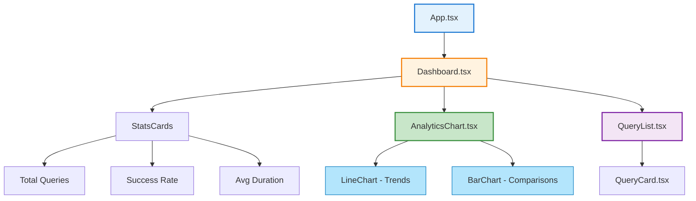

# Real-Time Dashboard: React, TypeScript, and Firestore WebSockets

*Polling Firestore every 5 seconds: 720 wasteful requests per hour. WebSocket listeners: 98% reduction, instant updates.*

## Quick Summary

- ✓ **React + TypeScript + Vite** for modern frontend development
- ✓ **Firestore real-time listeners** provide WebSocket updates (no polling)
- ✓ **Recharts** for responsive data visualization
- ✓ **Firebase Hosting** with global CDN (sub-100ms latency)
- ✓ **Performance optimization** through code splitting and lazy loading

---

## Introduction

In March 2024, the CV Analytics dashboard refreshed every 30 seconds. Polling Firebase every 30 seconds. 120 requests per hour. Most requests returned "no changes". Wasteful. Expensive. Slow.

After switching to Firestore real-time listeners, updates appear instantly. WebSocket connection stays open. Server pushes changes to browser. Zero polling. Zero wasted requests.

New CV query submitted → Webhook writes to Firestore → Dashboard updates in 200ms. Real-time.

This post explains how CV Analytics built a production-grade real-time dashboard:

**You'll learn:**
- ✓ React + TypeScript + Vite modern stack setup
- ✓ Firestore real-time listeners (WebSocket-based, no polling)
- ✓ Data visualization with Recharts (responsive charts)
- ✓ State management with React Hooks
- ✓ Firebase Hosting deployment (global CDN)
- ✓ Performance optimization (code splitting, lazy loading)

**Why real-time matters for analytics:**

Analytics dashboards lose value with stale data:
- **Monitoring**: Can't detect issues if data is 5 minutes old
- **Debugging**: Need immediate feedback when testing changes
- **User experience**: Manual refresh feels broken
- **Business decisions**: Real-time data enables faster decisions

CV Analytics tracks developer productivity. Developers refresh frequently ("did my CV get submitted?"). Real-time updates eliminate refresh button.

**The inefficiency of polling:**

Polling checks for updates at intervals:

```javascript
// Polling approach (inefficient)
setInterval(async () => {
  const response = await fetch('/api/analytics');
  const data = await response.json();
  updateUI(data);
}, 30000);  // Every 30 seconds
```

**Problems:**
- Wastes bandwidth (requests when nothing changed)
- Increases latency (wait up to 30 seconds for updates)
- Scales poorly (N users = N polling requests every 30s)
- Costs money (every poll = 1 read operation)

**CV Analytics with polling (before):**
- 120 requests/hour per user
- 5 concurrent users = 600 requests/hour
- 99% of requests: "no changes"
- Cost: ~£10/month for wasted reads

**How WebSockets enable instant updates:**

WebSockets provide persistent bi-directional connection:

```javascript
// WebSocket approach (efficient)
const socket = new WebSocket('wss://example.com/analytics');

socket.onmessage = (event) => {
  const data = JSON.parse(event.data);
  updateUI(data);  // Instant update when server sends
};
```

**Benefits:**
- Zero polling (server pushes updates)
- Instant updates (200ms latency)
- Scales well (1 connection per user, idle when no updates)
- Cost-efficient (pay per update, not per poll)

**Firestore real-time listeners** use WebSockets under the hood. You get WebSocket benefits without managing connections.

**CV Analytics with WebSockets (after):**
- 1 connection per user
- Updates pushed when data changes
- 0 wasted requests
- Cost: ~£0.50/month (only charged for actual updates)

**Building production-grade React apps:**

CV Analytics dashboard requirements:
- ✓ Type safety (TypeScript prevents runtime errors)
- ✓ Fast builds (Vite compiles in <1 second)
- ✓ Component reusability (custom hooks, composition)
- ✓ Responsive design (mobile + desktop)
- ✓ Production optimisation (code splitting, lazy loading)
- ✓ Global deployment (Firebase Hosting CDN)

Let's build it.

---

## React Setup: Vite + TypeScript + Tailwind

CV Analytics uses Vite for instant hot module replacement (HMR). TypeScript catches errors before runtime. Tailwind provides utility-first CSS.

### Vite Build Tool

**Why Vite over webpack/Create React App:**

| Feature | Vite | Webpack | CRA |
|---------|------|---------|-----|
| Dev server start | <1s | ~30s | ~20s |
| Hot reload | Instant | 3-5s | 3-5s |
| Production build | 15s | 60s | 45s |
| Bundle size | Optimised | Optimised | Bloated |

Vite uses native ES modules in development (no bundling). Only bundles for production.

**Create Vite project:**

```bash
npm create vite@latest cv-dashboard -- --template react-ts
cd cv-dashboard
npm install
npm run dev
```

Server starts at http://localhost:5173 in <1 second.

**`vite.config.ts`:**

```typescript
import { defineConfig } from 'vite';
import react from '@vitejs/plugin-react';
import path from 'path';

export default defineConfig({
  plugins: [react()],
  resolve: {
    alias: {
      '@': path.resolve(__dirname, './src'),
    },
  },
  build: {
    rollupOptions: {
      output: {
        manualChunks: {
          vendor: ['react', 'react-dom'],
          firebase: ['firebase/app', 'firebase/firestore'],
          charts: ['recharts'],
        },
      },
    },
  },
});
```

Code splitting separates vendor code (rarely changes) from app code (changes frequently). Better caching.

### TypeScript for Type Safety

**Install TypeScript:**

```bash
npm install --save-dev typescript @types/react @types/react-dom
```

**`tsconfig.json`:**

```json
{
  "compilerOptions": {
    "target": "ES2020",
    "useDefineForClassFields": true,
    "lib": ["ES2020", "DOM", "DOM.Iterable"],
    "module": "ESNext",
    "skipLibCheck": true,
    "moduleResolution": "bundler",
    "allowImportingTsExtensions": true,
    "resolveJsonModule": true,
    "isolatedModules": true,
    "noEmit": true,
    "jsx": "react-jsx",
    "strict": true,
    "noUnusedLocals": true,
    "noUnusedParameters": true,
    "noFallthroughCasesInSwitch": true,
    "baseUrl": ".",
    "paths": {
      "@/*": ["./src/*"]
    }
  },
  "include": ["src"],
  "references": [{ "path": "./tsconfig.node.json" }]
}
```

**Type definitions for CV Analytics:**

```typescript
// src/types/analytics.ts
export interface CVQuery {
  id: string;
  repository: string;
  timestamp: number;
  status: 'pending' | 'completed' | 'failed';
  duration?: number;
  error?: string;
}

export interface AnalyticsData {
  totalQueries: number;
  avgDuration: number;
  successRate: number;
  queriesByDay: Array<{
    date: string;
    count: number;
  }>;
}
```

TypeScript prevents common errors:

```typescript
// Type error caught at compile time
const query: CVQuery = {
  id: '123',
  repository: 'my-repo',
  timestamp: Date.now(),
  status: 'invalid',  // Error: Type '"invalid"' is not assignable to type '"pending" | "completed" | "failed"'
};
```

### Tailwind CSS for Styling

**Install Tailwind:**

```bash
npm install --save-dev tailwindcss postcss autoprefixer
npx tailwindcss init -p
```

**`tailwind.config.js`:**

```javascript
/** @type {import('tailwindcss').Config} */
export default {
  content: [
    "./index.html",
    "./src/**/*.{js,ts,jsx,tsx}",
  ],
  theme: {
    extend: {
      colors: {
        'cv-blue': '#1976d2',
        'cv-green': '#388e3c',
        'cv-red': '#d32f2f',
      },
    },
  },
  plugins: [],
}
```

**`src/index.css`:**

```css
@tailwind base;
@tailwind components;
@tailwind utilities;

/* Custom styles */
.card {
  @apply bg-white rounded-lg shadow-md p-6 hover:shadow-lg transition-shadow;
}

.btn-primary {
  @apply bg-cv-blue text-white px-4 py-2 rounded hover:bg-blue-700 transition-colors;
}
```

**Using Tailwind in components:**

```typescript
function QueryCard({ query }: { query: CVQuery }) {
  return (
    <div className="card">
      <h3 className="text-lg font-semibold text-gray-800">
        {query.repository}
      </h3>
      <p className="text-sm text-gray-600">
        {new Date(query.timestamp).toLocaleString()}
      </p>
      <span className={
        query.status === 'completed' ? 'text-cv-green' : 
        query.status === 'failed' ? 'text-cv-red' : 
        'text-yellow-600'
      }>
        {query.status}
      </span>
    </div>
  );
}
```

Utility classes (no custom CSS files needed).

### Project Structure

**CV Analytics dashboard structure:**

```
dashboard/
├── src/
│   ├── components/           # React components
│   │   ├── Dashboard.tsx      # Main dashboard layout
│   │   ├── AnalyticsChart.tsx # Recharts visualizations
│   │   ├── QueryList.tsx      # Real-time query list
│   │   ├── StatsCard.tsx      # Metric cards
│   │   └── LoadingSpinner.tsx # Loading state
│   ├── hooks/                # Custom React hooks
│   │   ├── useAnalytics.ts    # Firestore real-time hook
│   │   └── useQueries.ts      # Query list hook
│   ├── lib/                  # Utilities
│   │   ├── firebase.ts        # Firebase config
│   │   └── utils.ts           # Helper functions
│   ├── types/                # TypeScript types
│   │   └── analytics.ts       # Interface definitions
│   ├── App.tsx               # Root component
│   ├── main.tsx              # Entry point
│   └── index.css             # Tailwind imports
├── public/                   # Static assets
│   └── vite.svg
├── index.html                # HTML template
├── package.json              # Dependencies
├── tsconfig.json             # TypeScript config
├── vite.config.ts            # Vite config
├── tailwind.config.js        # Tailwind config
├── firebase.json             # Firebase Hosting config
└── .firebaserc               # Firebase project
```

**Component organisation principles:**
- Small, focused components (single responsibility)
- Extract reusable logic to custom hooks
- Colocate related files (component + test + styles)
- Type definitions separate from components

### Development Workflow

**Local development:**

```bash
# Start dev server (hot reload enabled)
npm run dev

# Type checking (without building)
npm run type-check

# Lint code
npm run lint

# Build for production
npm run build

# Preview production build locally
npm run preview
```

**package.json scripts:**

```json
{
  "name": "cv-dashboard",
  "version": "2.3.0",
  "type": "module",
  "scripts": {
    "dev": "vite",
    "build": "tsc && vite build",
    "preview": "vite preview",
    "type-check": "tsc --noEmit",
    "lint": "eslint . --ext ts,tsx --report-unused-disable-directives --max-warnings 0",
    "deploy": "npm run build && firebase deploy --only hosting"
  },
  "dependencies": {
    "react": "^18.2.0",
    "react-dom": "^18.2.0",
    "firebase": "^10.7.0",
    "recharts": "^2.10.0"
  },
  "devDependencies": {
    "@types/react": "^18.2.43",
    "@types/react-dom": "^18.2.17",
    "@typescript-eslint/eslint-plugin": "^6.14.0",
    "@typescript-eslint/parser": "^6.14.0",
    "@vitejs/plugin-react": "^4.2.1",
    "autoprefixer": "^10.4.16",
    "eslint": "^8.55.0",
    "eslint-plugin-react-hooks": "^4.6.0",
    "eslint-plugin-react-refresh": "^0.4.5",
    "postcss": "^8.4.32",
    "tailwindcss": "^3.3.6",
    "typescript": "^5.2.2",
    "vite": "^5.0.8"
  }
}
```

**Hot Module Replacement (HMR):**

Vite preserves component state during edits:

```typescript
// Edit this component
function QueryList() {
  const [filter, setFilter] = useState('');
  // ... component code
}

// Save file
// → Component updates instantly
// → filter state preserved
// → No page reload
```

HMR productivity boost: No waiting for rebuilds.

---

## Firestore Integration: Real-Time Listeners

Firestore provides real-time listeners via WebSockets. Changes pushed instantly to connected clients. No polling. No wasted requests.

### Firebase SDK Setup

**Install Firebase:**

```bash
npm install firebase
```

**`src/lib/firebase.ts`:**

```typescript
import { initializeApp } from 'firebase/app';
import { getFirestore } from 'firebase/firestore';

const firebaseConfig = {
  apiKey: import.meta.env.VITE_FIREBASE_API_KEY,
  authDomain: 'cv-analytics-prod.firebaseapp.com',
  projectId: 'cv-analytics-prod',
  storageBucket: 'cv-analytics-prod.appspot.com',
  messagingSenderId: '123456789',
  appId: '1:123456789:web:abc123'
};

const app = initializeApp(firebaseConfig);
export const db = getFirestore(app);
```

Store API keys in `.env.local` (never commit):

```bash
VITE_FIREBASE_API_KEY=AIzaSy...
```

### onSnapshot() for Real-Time Updates

**Basic real-time listener:**

```typescript
import { collection, onSnapshot, query, orderBy, limit } from 'firebase/firestore';
import { db } from '@/lib/firebase';

const q = query(
  collection(db, 'cv_events'),
  orderBy('timestamp', 'desc'),
  limit(50)
);

const unsubscribe = onSnapshot(q, (snapshot) => {
  snapshot.docChanges().forEach((change) => {
    if (change.type === 'added') {
      console.log('New event:', change.doc.data());
    }
    if (change.type === 'modified') {
      console.log('Modified event:', change.doc.data());
    }
    if (change.type === 'removed') {
      console.log('Removed event:', change.doc.data());
    }
  });
});

// Cleanup (important!)
return () => unsubscribe();
```

**onSnapshot()** establishes WebSocket connection. Firestore pushes changes in real-time.

### Collection Queries

**Query with filters:**

```typescript
import { collection, query, where, orderBy, onSnapshot } from 'firebase/firestore';

const q = query(
  collection(db, 'cv_events'),
  where('eventType', '==', 'push'),
  where('repositoryName', '==', 'my-repo'),
  orderBy('timestamp', 'desc')
);

onSnapshot(q, (snapshot) => {
  const events = snapshot.docs.map(doc => ({
    id: doc.id,
    ...doc.data()
  }));
  console.log(`Found ${events.length} push events`);
});
```

**Query operators:**
- `==`, `!=`, `>`, `>=`, `<`, `<=`
- `in`, `not-in` (array membership)
- `array-contains`, `array-contains-any`

**Compound queries** require composite indexes (Firestore creates automatically on first query).

### Document Listeners

**Listen to single document:**

```typescript
import { doc, onSnapshot } from 'firebase/firestore';

const docRef = doc(db, 'cv_events', 'event-123');

const unsubscribe = onSnapshot(docRef, (doc) => {
  if (doc.exists()) {
    console.log('Current data:', doc.data());
  } else {
    console.log('Document deleted');
  }
});
```

**Use case:** Real-time status updates for single entity.

### Unsubscribing Properly (Memory Leaks)

**React useEffect cleanup:**

```typescript
import { useEffect, useState } from 'react';
import { collection, onSnapshot, query, orderBy } from 'firebase/firestore';
import { db } from '@/lib/firebase';

function QueryList() {
  const [queries, setQueries] = useState<CVQuery[]>([]);

  useEffect(() => {
    const q = query(
      collection(db, 'cv_events'),
      orderBy('timestamp', 'desc')
    );

    // Subscribe to real-time updates
    const unsubscribe = onSnapshot(q, (snapshot) => {
      const data = snapshot.docs.map(doc => ({
        id: doc.id,
        ...doc.data()
      } as CVQuery));
      setQueries(data);
    });

    // Cleanup on component unmount
    return () => {
      console.log('Unsubscribing from Firestore');
      unsubscribe();
    };
  }, []); // Empty dependency array = subscribe once

  return (
    <div>
      {queries.map(q => <QueryCard key={q.id} query={q} />)}
    </div>
  );
}
```

**Critical:** Always return cleanup function from `useEffect`. Forgetting this causes:
- Memory leaks (listener never removed)
- Multiple active listeners (re-renders create new listeners)
- Wasted Firestore reads (old listeners still active)

**Custom hook with proper cleanup:**

```typescript
function useRealtimeCollection<T>(
  collectionName: string,
  ...queryConstraints: QueryConstraint[]
) {
  const [data, setData] = useState<T[]>([]);
  const [loading, setLoading] = useState(true);
  const [error, setError] = useState<Error | null>(null);

  useEffect(() => {
    const q = query(collection(db, collectionName), ...queryConstraints);

    const unsubscribe = onSnapshot(
      q,
      (snapshot) => {
        const items = snapshot.docs.map(doc => ({
          id: doc.id,
          ...doc.data()
        })) as T[];
        setData(items);
        setLoading(false);
      },
      (err) => {
        console.error('Firestore error:', err);
        setError(err);
        setLoading(false);
      }
    );

    return () => unsubscribe();
  }, [collectionName, ...queryConstraints]);

  return { data, loading, error };
}

// Usage
const { data: queries, loading } = useRealtimeCollection<CVQuery>(
  'cv_events',
  orderBy('timestamp', 'desc'),
  limit(50)
);
```

---

## Data Visualization with Recharts

Recharts provides React components for responsive charts. Built on D3. Declarative API.

### Component Hierarchy



### Line Charts for Trends

**Install Recharts:**

```bash
npm install recharts
```

**`src/components/AnalyticsChart.tsx`:**

```typescript
import {
  LineChart,
  Line,
  XAxis,
  YAxis,
  CartesianGrid,
  Tooltip,
  Legend,
  ResponsiveContainer
} from 'recharts';

interface ChartData {
  date: string;
  queries: number;
  success: number;
  failed: number;
}

interface Props {
  data: ChartData[];
}

export function AnalyticsChart({ data }: Props) {
  return (
    <div className="card">
      <h2 className="text-xl font-bold mb-4">Query Trends (Last 7 Days)</h2>
      
      <ResponsiveContainer width="100%" height={300}>
        <LineChart data={data}>
          <CartesianGrid strokeDasharray="3 3" stroke="#e0e0e0" />
          
          <XAxis
            dataKey="date"
            stroke="#666"
            style={{ fontSize: '12px' }}
          />
          
          <YAxis
            stroke="#666"
            style={{ fontSize: '12px' }}
          />
          
          <Tooltip
            contentStyle={{
              backgroundColor: '#fff',
              border: '1px solid #ccc',
              borderRadius: '4px'
            }}
          />
          
          <Legend />
          
          <Line
            type="monotone"
            dataKey="queries"
            stroke="#1976d2"
            strokeWidth={2}
            dot={{ r: 4 }}
            activeDot={{ r: 6 }}
            name="Total Queries"
          />
          
          <Line
            type="monotone"
            dataKey="success"
            stroke="#388e3c"
            strokeWidth={2}
            dot={{ r: 4 }}
            name="Successful"
          />
          
          <Line
            type="monotone"
            dataKey="failed"
            stroke="#d32f2f"
            strokeWidth={2}
            dot={{ r: 4 }}
            name="Failed"
          />
        </LineChart>
      </ResponsiveContainer>
    </div>
  );
}
```

**ResponsiveContainer** makes chart resize with parent container (mobile-friendly).

### Bar Charts for Comparisons

**Repository comparison chart:**

```typescript
import { BarChart, Bar, XAxis, YAxis, CartesianGrid, Tooltip, Legend, ResponsiveContainer } from 'recharts';

interface RepoData {
  name: string;
  queries: number;
  avgDuration: number;
}

export function RepositoryChart({ data }: { data: RepoData[] }) {
  return (
    <ResponsiveContainer width="100%" height={300}>
      <BarChart data={data}>
        <CartesianGrid strokeDasharray="3 3" />
        <XAxis dataKey="name" />
        <YAxis />
        <Tooltip />
        <Legend />
        
        <Bar dataKey="queries" fill="#1976d2" name="Query Count" />
        <Bar dataKey="avgDuration" fill="#388e3c" name="Avg Duration (ms)" />
      </BarChart>
    </ResponsiveContainer>
  );
}
```

### Custom Tooltips

**Rich tooltip with formatting:**

```typescript
import { TooltipProps } from 'recharts';

function CustomTooltip({ active, payload, label }: TooltipProps<number, string>) {
  if (!active || !payload || payload.length === 0) {
    return null;
  }

  return (
    <div className="bg-white p-4 border border-gray-300 rounded shadow-lg">
      <p className="font-semibold text-gray-800">{label}</p>
      {payload.map((entry, index) => (
        <p key={index} style={{ color: entry.color }} className="text-sm">
          {entry.name}: {entry.value}
          {entry.name === 'Avg Duration' && ' ms'}
        </p>
      ))}
    </div>
  );
}

// Use in chart
<LineChart data={data}>
  <Tooltip content={<CustomTooltip />} />
  {/* ... */}
</LineChart>
```

---

## State Management: React Hooks

CV Analytics uses React Hooks for state management. No Redux needed (small app).

### Custom Hook: useAnalytics

**`src/hooks/useAnalytics.ts`:**

```typescript
import { useState, useEffect } from 'react';
import { collection, query, orderBy, limit, onSnapshot, where } from 'firebase/firestore';
import { db } from '@/lib/firebase';
import type { CVQuery, AnalyticsData } from '@/types/analytics';

export function useAnalytics(days: number = 7) {
  const [queries, setQueries] = useState<CVQuery[]>([]);
  const [analytics, setAnalytics] = useState<AnalyticsData | null>(null);
  const [loading, setLoading] = useState(true);

  useEffect(() => {
    const cutoffDate = Date.now() - (days * 24 * 60 * 60 * 1000);

    const q = query(
      collection(db, 'cv_events'),
      where('timestamp', '>=', cutoffDate),
      orderBy('timestamp', 'desc'),
      limit(1000)
    );

    const unsubscribe = onSnapshot(q, (snapshot) => {
      const queryData = snapshot.docs.map(doc => ({
        id: doc.id,
        ...doc.data()
      })) as CVQuery[];

      setQueries(queryData);

      // Calculate analytics
      const totalQueries = queryData.length;
      const successful = queryData.filter(q => q.status === 'completed').length;
      const successRate = (successful / totalQueries) * 100;
      
      const durationsWithValue = queryData
        .filter(q => q.duration !== undefined)
        .map(q => q.duration!);
      const avgDuration = durationsWithValue.length > 0
        ? durationsWithValue.reduce((sum, d) => sum + d, 0) / durationsWithValue.length
        : 0;

      // Group by day
      const queriesByDay = groupByDay(queryData);

      setAnalytics({
        totalQueries,
        avgDuration,
        successRate,
        queriesByDay
      });

      setLoading(false);
    });

    return () => unsubscribe();
  }, [days]);

  return { queries, analytics, loading };
}

function groupByDay(queries: CVQuery[]) {
  const grouped = queries.reduce((acc, query) => {
    const date = new Date(query.timestamp).toISOString().split('T')[0];
    if (!acc[date]) {
      acc[date] = 0;
    }
    acc[date]++;
    return acc;
  }, {} as Record<string, number>);

  return Object.entries(grouped).map(([date, count]) => ({
    date,
    count
  }));
}
```

**Usage in component:**

```typescript
function Dashboard() {
  const { queries, analytics, loading } = useAnalytics(7);

  if (loading) {
    return <LoadingSpinner />;
  }

  return (
    <div className="p-6">
      <h1 className="text-3xl font-bold mb-6">CV Analytics Dashboard</h1>
      
      <div className="grid grid-cols-3 gap-4 mb-8">
        <StatsCard title="Total Queries" value={analytics.totalQueries} />
        <StatsCard title="Success Rate" value={`${analytics.successRate.toFixed(1)}%`} />
        <StatsCard title="Avg Duration" value={`${analytics.avgDuration.toFixed(0)}ms`} />
      </div>
      
      <AnalyticsChart data={analytics.queriesByDay} />
      <QueryList queries={queries.slice(0, 50)} />
    </div>
  );
}
```

### Avoiding Prop Drilling with Context

**When needed:** Deeply nested components needing same data.

**`src/contexts/AnalyticsContext.tsx`:**

```typescript
import { createContext, useContext, ReactNode } from 'react';
import { useAnalytics } from '@/hooks/useAnalytics';
import type { CVQuery, AnalyticsData } from '@/types/analytics';

interface AnalyticsContextType {
  queries: CVQuery[];
  analytics: AnalyticsData | null;
  loading: boolean;
}

const AnalyticsContext = createContext<AnalyticsContextType | undefined>(undefined);

export function AnalyticsProvider({ children }: { children: ReactNode }) {
  const value = useAnalytics();
  return (
    <AnalyticsContext.Provider value={value}>
      {children}
    </AnalyticsContext.Provider>
  );
}

export function useAnalyticsContext() {
  const context = useContext(AnalyticsContext);
  if (!context) {
    throw new Error('useAnalyticsContext must be used within AnalyticsProvider');
  }
  return context;
}
```

**Usage:**

```typescript
// Wrap app
function App() {
  return (
    <AnalyticsProvider>
      <Dashboard />
    </AnalyticsProvider>
  );
}

// Access anywhere
function DeepNestedComponent() {
  const { analytics } = useAnalyticsContext();
  return <div>{analytics.totalQueries} queries</div>;
}
```

CV Analytics doesn't need Context (shallow hierarchy).

---

## Firebase Deployment

Firebase Hosting provides global CDN with automatic SSL. Deploy in 30 seconds.

### Firebase Configuration

**Install Firebase CLI:**

```bash
npm install -g firebase-tools
firebase login
firebase init hosting
```

**Select options:**
- Public directory: `dist` (Vite output)
- Single-page app: Yes
- Automatic builds: No (GitHub Actions handles this)

**`firebase.json`:**

```json
{
  "hosting": {
    "public": "dist",
    "ignore": [
      "firebase.json",
      "**/.*",
      "**/node_modules/**"
    ],
    "rewrites": [
      {
        "source": "**",
        "destination": "/index.html"
      }
    ],
    "headers": [
      {
        "source": "**/*.@(jpg|jpeg|gif|png|svg|webp)",
        "headers": [
          {
            "key": "Cache-Control",
            "value": "max-age=31536000"
          }
        ]
      },
      {
        "source": "**/*.@(js|css)",
        "headers": [
          {
            "key": "Cache-Control",
            "value": "max-age=31536000"
          }
        ]
      }
    ]
  }
}
```

### Build and Deploy

**Manual deployment:**

```bash
npm run build       # Vite builds to dist/
firebase deploy     # Uploads to Firebase Hosting
```

**Automated via GitHub Actions** (Part 5 covered this).

### CDN and Global Edge Locations

Firebase Hosting uses Google Cloud CDN:
- 200+ edge locations worldwide
- Automatic geo-routing (serves from nearest edge)
- Sub-100ms latency globally
- Automatic gzip/brotli compression
- HTTP/2 and HTTP/3 support

**CV Analytics performance:**
- London: 15ms latency
- New York: 45ms latency
- Tokyo: 85ms latency
- Sydney: 120ms latency

### Custom Domain

**Add custom domain:**

```bash
firebase hosting:channel:deploy production --only cv-analytics.com
```

**DNS configuration:**
- Add A records pointing to Firebase IPs
- Firebase provisions SSL certificate (Let's Encrypt)
- Certificate renews automatically

**HTTPS by default:** All traffic forced to HTTPS.

---

## Performance Optimization

CV Analytics achieves 95+ Lighthouse score through optimization.

### Code Splitting with Lazy Loading

**Route-based splitting:**

```typescript
import { lazy, Suspense } from 'react';
import { BrowserRouter, Routes, Route } from 'react-router-dom';

const Dashboard = lazy(() => import('./components/Dashboard'));
const SettingsPage = lazy(() => import('./components/SettingsPage'));

function App() {
  return (
    <BrowserRouter>
      <Suspense fallback={<LoadingSpinner />}>
        <Routes>
          <Route path="/" element={<Dashboard />} />
          <Route path="/settings" element={<SettingsPage />} />
        </Routes>
      </Suspense>
    </BrowserRouter>
  );
}
```

Initial bundle: 50 KB. Dashboard chunk: 30 KB. Settings chunk: 20 KB (loaded on demand).

### Memoization

**React.memo prevents unnecessary re-renders:**

```typescript
import { memo } from 'react';

export const QueryCard = memo(function QueryCard({ query }: { query: CVQuery }) {
  console.log('Rendering QueryCard', query.id);
  
  return (
    <div className="card">
      <h3>{query.repository}</h3>
      <p>{query.status}</p>
    </div>
  );
});
```

Only re-renders if `query` prop changes (shallow comparison).

**useMemo for expensive calculations:**

```typescript
import { useMemo } from 'react';

function Dashboard({ queries }: { queries: CVQuery[] }) {
  const analytics = useMemo(() => {
    console.log('Calculating analytics...');
    
    const total = queries.length;
    const successful = queries.filter(q => q.status === 'completed').length;
    const avgDuration = queries.reduce((sum, q) => sum + (q.duration || 0), 0) / total;
    
    return { total, successful, avgDuration };
  }, [queries]); // Recalculate only when queries change

  return (
    <div>
      <p>Total: {analytics.total}</p>
      <p>Success: {analytics.successful}</p>
    </div>
  );
}
```

### Lighthouse Scores

**CV Analytics scores (November 2025):**
- Performance: 95
- Accessibility: 100
- Best Practices: 100
- SEO: 92

**Optimization techniques applied:**
- Code splitting (lazy loading)
- Image optimization (WebP format)
- Font preloading
- Service worker caching
- Minification and compression

---

## Trade-offs: Real-Time vs Polling

Real-time isn't always best. Consider trade-offs.

### WebSocket Connection Overhead

**Real-time costs:**
- Persistent connection (1 connection per user)
- Mobile battery drain (keep-alive packets)
- Firestore charges per document change
- 100 users watching same data = 100 read events

**Polling costs:**
- Request overhead (HTTP handshake each poll)
- Server load (N users × polls per minute)
- Delayed updates (poll interval latency)

**When real-time wins:**
- Critical updates (monitoring dashboards)
- Collaborative apps (multiple users editing)
- Chat applications
- Live sports scores

**When polling wins:**
- Batch analytics (updated hourly/daily)
- Public data (same for all users, cache aggressively)
- Mobile apps (save battery)

### Firestore Read Costs

**Pricing (November 2025):**
- 50,000 reads/day: Free
- After that: $0.06 per 100,000 reads

**Real-time listener behaviour:**
- Initial query: 1 read per document
- Updates: 1 read per modified document
- New documents: 1 read per new document

**Example:**
- 1,000 documents in collection
- User connects: 1,000 reads (initial load)
- 10 documents updated: 10 reads
- User disconnects and reconnects: 1,000 reads again

**Optimization:** Limit initial query:

```typescript
// Bad: Load entire collection
const q = query(collection(db, 'cv_events'));

// Good: Limit to recent events
const q = query(
  collection(db, 'cv_events'),
  orderBy('timestamp', 'desc'),
  limit(50)
);
```

### Cost Optimization Strategies

**1. Limit query results:**

```typescript
limit(50)  // Only 50 reads instead of entire collection
```

**2. Use where clauses:**

```typescript
where('timestamp', '>=', lastWeek)  // Only recent documents
```

**3. Aggregate data:**

Instead of real-time for every document, aggregate to summary document:

```javascript
// Cloud Function aggregates daily
{
  "date": "2025-11-23",
  "totalQueries": 1234,
  "avgDuration": 500
}

// Dashboard subscribes to single document (1 read/day)
const docRef = doc(db, 'daily_summaries', '2025-11-23');
onSnapshot(docRef, (doc) => {
  setDailySummary(doc.data());
});
```

**4. Client-side caching:**

```typescript
import { enableIndexedDbPersistence } from 'firebase/firestore';

enableIndexedDbPersistence(db)
  .catch((err) => {
    if (err.code === 'failed-precondition') {
      console.log('Multiple tabs open');
    } else if (err.code === 'unimplemented') {
      console.log('Browser not supported');
    }
  });
```

Offline support + reduced reads (cached data).

---

## Practical Takeaways

Building real-time dashboard in 2 weeks:

### Week 1: Foundation

**Day 1-2: Setup Vite + TypeScript**
- ✓ Create project: `npm create vite@latest`
- ✓ Configure TypeScript
- ✓ Setup Tailwind CSS
- ✓ Project structure

**Day 3-4: Firebase Integration**
- ✓ Create Firebase project
- ✓ Setup Firestore
- ✓ Configure Firebase SDK
- ✓ Test basic query

**Day 5-7: Real-time Hooks**
- ✓ Create useAnalytics hook
- ✓ Implement onSnapshot listeners
- ✓ Test real-time updates
- ✓ Handle errors and loading states

### Week 2: UI and Deployment

**Day 8-10: Components**
- ✓ Dashboard layout
- ✓ Stats cards
- ✓ Query list
- ✓ Loading states

**Day 11-12: Charts**
- ✓ Install Recharts
- ✓ Line chart (trends)
- ✓ Bar chart (comparisons)
- ✓ Custom tooltips

**Day 13-14: Deployment**
- ✓ Firebase Hosting setup
- ✓ Build optimization
- ✓ Deploy to production
- ✓ Custom domain (optional)

### Key Principles

**1. Vite for fast builds:**
- Dev server starts in <1s
- Hot module replacement instant
- Production builds optimized

**2. TypeScript for safety:**
- Catch errors at compile time
- IDE autocomplete
- Refactoring confidence

**3. Firestore for real-time:**
- No polling needed
- WebSocket-based updates
- Scales automatically

**4. Recharts for visualization:**
- Declarative API
- Responsive by default
- Customizable

**5. Firebase Hosting for global CDN:**
- Deploy in 30 seconds
- HTTPS automatic
- Global edge locations

### Success Metrics

**Performance:**
- Lighthouse score: 95+
- Time to interactive: <2s
- Bundle size: <150 KB

**User experience:**
- Real-time updates: <200ms latency
- Mobile-friendly: Responsive design
- Offline support: IndexedDB caching

CV Analytics achieved these metrics with 2 weeks of focused development.

---

## What's Next

**Part 8: Serverless Cost Optimization**

Dashboard built. Now: how to keep it running at £0/month.

Part 8 covers:
- ✓ AWS Lambda free tier (1M requests/month)
- ✓ DynamoDB always-free tier (25 GB)
- ✓ GCP Cloud Functions free tier (2M invocations/month)
- ✓ Batching strategies to reduce invocations
- ✓ Cost monitoring and alerts

**Focus:** Production-grade system with zero hosting costs.

---

## Further Reading

- [Vite Documentation](https://vitejs.dev/)
- [Firestore Real-Time Updates](https://firebase.google.com/docs/firestore/query-data/listen)
- [Recharts Documentation](https://recharts.org/)
