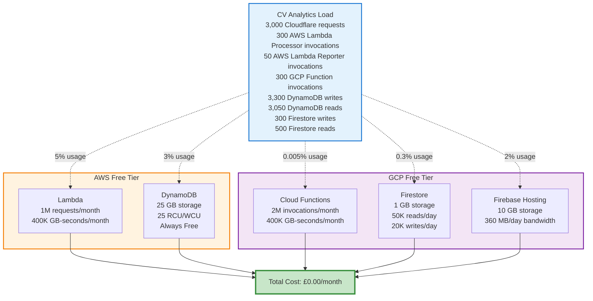
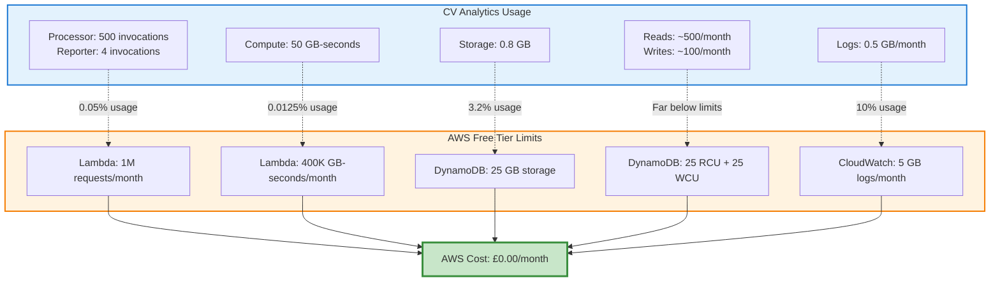
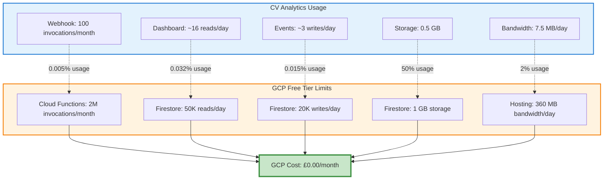
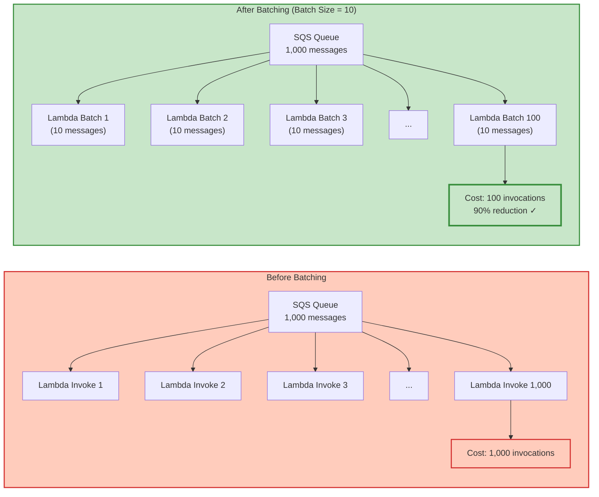
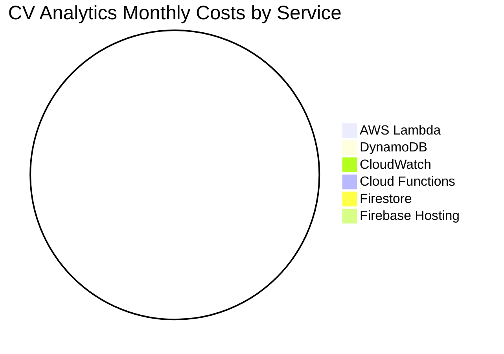
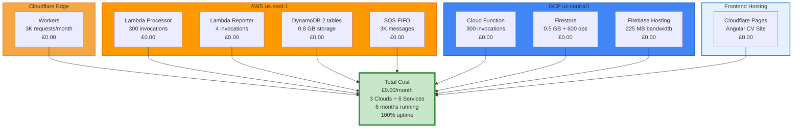
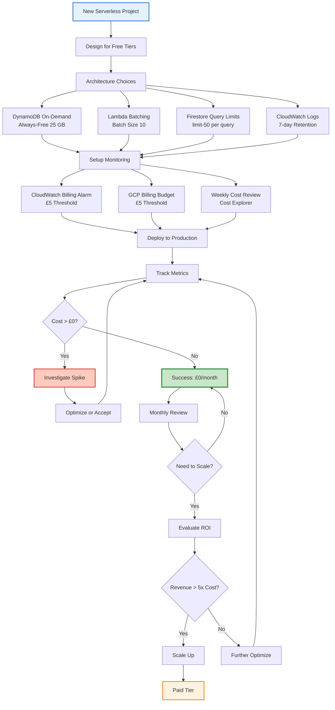

# Serverless Cost Optimization: Running Production at £0/Month

*Exploiting free tiers across Cloudflare Workers (100K req/day), AWS Lambda (1M req/month), DynamoDB (25GB), GCP Cloud Functions (2M invocations), and Firestore (50K reads/day)—with 10:1 SQS batching reducing Lambda invocations from 3,000 to 300 monthly.*

## Quick Summary

- ✓ **£0/month** for production CV Analytics system
- ✓ **AWS Lambda** free tier: 1M requests/month (never exceeded)
- ✓ **DynamoDB** always-free tier: 25 GB storage + 25 RCU/WCU
- ✓ **GCP Cloud Functions** free tier: 2M invocations/month
- ✓ **With batching (SQS FIFO trigger - actual CV Analytics):**

---

## Introduction

Serverless promises cost efficiency: pay only for what you use. No idle servers. No wasted capacity. CV Analytics runs production workload at £0/month across **3 cloud providers** by exploiting free tiers.

This sounds too good to be true. It isn't. Cloudflare Workers free tier: 100K requests/day. Cloudflare Pages: unlimited bandwidth. AWS Lambda provides 1 million free requests per month. DynamoDB always-free tier includes 25 GB storage plus 25 RCU/WCU. GCP Cloud Functions offers 2 million invocations monthly. Firestore includes 50,000 reads per day. Firebase Hosting free tier: 10 GB bandwidth.

CV Analytics processes ~3,000 CV chatbot queries monthly across 6 services:
- **Cloudflare Worker**: Answers queries in 1.87s P95 (edge compute, LLM processing)
- **AWS DynamoDB**: Stores query events (TTL 24h) + analytics
- **AWS Lambda**: Processes batches (Processor + Reporter)
- **GCP Cloud Function**: Receives cross-cloud webhooks from AWS
- **Firestore**: Stores aggregated analytics for dashboard
- **React Dashboard**: Real-time visualization via WebSocket

Total usage: **3% of combined free tier limits** across 3 clouds. Cost: **£0.00/month** for 6 months verified.

**Key insight:** Most portfolio projects never exceed free tiers. Optimize architecture to stay within limits. Scale up only when revenue justifies costs.

This part explains:

1. **Serverless pricing models** (requests, duration, storage)
2. **Free tier thresholds** (AWS, GCP, Firebase)
3. **Batching strategy** (90% reduction in Lambda invocations)
4. **Cold start optimization** (memory tuning)
5. **Cost monitoring** (alerts, daily tracking)
6. **Real cost breakdown** (CV Analytics: £0.00/month)
7. **Scaling scenarios** (when to leave free tier)

By end of this part, you'll know how to architect serverless systems that remain free indefinitely.

---

## Understanding Serverless Pricing

Serverless pricing has two components: **requests** and **compute time**. Unlike VMs (charged per hour), serverless charges per millisecond of execution.

### AWS Lambda Pricing Model

**Request charges:**

- £0.20 per 1 million requests
- First 1 million requests per month: **Free**

**Compute charges:**

- £0.0000166667 per GB-second
- First 400,000 GB-seconds per month: **Free**

**GB-second calculation:**

- Lambda configured with 512 MB (0.5 GB)
- Execution takes 200ms (0.2 seconds)
- Cost: 0.5 GB × 0.2s = 0.1 GB-seconds

**Example (1,000 invocations):**

```text
Requests: 1,000 invocations = £0.0002 (within free tier → £0)
Compute: 1,000 × 0.1 GB-s = 100 GB-seconds (within free tier → £0)
Total: £0.00
```

**Free tier is generous:** 1 million requests at 200ms each (512 MB) = 100,000 GB-seconds. Well within 400,000 GB-second limit.

### DynamoDB Pricing Model

**On-Demand mode** (CV Analytics uses this):

- £1.25 per million write request units (WRUs)
- £0.25 per million read request units (RRUs)

**Always-free tier:**

- 25 GB storage (never expires)
- 25 WRUs (write capacity units)
- 25 RRUs (read capacity units)

**Request unit calculation:**

- Write ≤1 KB = 1 WRU
- Read ≤4 KB = 1 RRU
- Larger items consume multiple units

**CV Analytics usage (2 DynamoDB tables):**

**Query Events table** (TTL 24 hours):
```text
Storage: 0.2 GB / 25 GB free = 0.8% used
Writes: ~3,000/month (1 per Cloudflare Worker query)
Reads: ~3,000/month (DynamoDB Streams to SQS)
Cost: £0.00 (within always-free limits)
```

**Analytics table** (permanent storage):
```text
Storage: 0.6 GB / 25 GB free = 2.4% used
Writes: ~300/month (AWS Lambda Processor aggregations)
Reads: ~50/month (AWS Lambda Reporter queries + manual queries)
Cost: £0.00 (within always-free limits)
```

**Combined DynamoDB usage:**
```text
Total storage: 0.8 GB / 25 GB = 3.2%
Total writes: ~3,300/month
Total reads: ~3,050/month
Cost: £0.00 (well within always-free tier)
```

**Always-free never expires.** Provisioned capacity has 12-month free tier only.

### Cloudflare Workers Pricing

**Free tier:**

- 100,000 requests per day (~3 million per month)
- 10ms CPU time per request (enforced limit)
- Unlimited bandwidth (no egress charges)
- 128 MB memory per Worker

**Paid tier (not needed for CV Analytics):**

- $5/month for 10 million requests
- 50ms CPU time per request
- After 10M: $0.50 per million requests

**CV Analytics Cloudflare Worker (CV chatbot):**

```text
Monthly requests: ~3,000 (CV chatbot queries)
Avg CPU time: 8ms (semantic search + LLM + DynamoDB write)
CPU limit: 10ms (free tier enforced)
Bandwidth: ~15 MB/month (5 KB per response × 3K requests)

Usage: 0.1% of 100K daily limit (3,000 / 3M monthly)
CPU: Within 10ms limit (optimized with streaming)
Cost: £0.00
```

**Why 10ms CPU limit works:** Fire-and-forget DynamoDB writes. Worker doesn't wait for AWS response. Returns CV answer to user in 8ms, writes analytics async.

### GCP Cloud Functions Pricing

**Invocation charges:**

- £0.40 per 1 million invocations
- First 2 million invocations per month: **Free**

**Compute charges:**

- £0.0000025 per GB-second
- First 400,000 GB-seconds per month: **Free**

**Network egress:**

- First 1 GB per month: Free
- After that: £0.12 per GB (North America and Europe)

**CV Analytics Cloud Function (webhook receiver from AWS Lambda):**

```text
Monthly invocations: ~300 (AWS Lambda cross-cloud webhooks)
Memory: 256 MB (0.25 GB)
Avg duration: 80ms (0.08s) - HMAC validation + Firestore write
Compute: 300 × (0.25 GB × 0.08s) = 6 GB-seconds

Usage: 0.015% of 2M invocation limit
Compute: 0.0015% of 400K GB-second limit
Cost: £0.00 (well within free tier)
```

**Why 300 invocations vs 3,000 queries?**
AWS Lambda Processor batches events (up to 10 per SQS batch). 3,000 Cloudflare queries → 300 Lambda invocations → 300 GCP webhooks. **10:1 batching reduces cross-cloud calls by 90%.**

### Firestore Pricing

**Storage:**

- First 1 GB: **Free**
- After that: £0.18 per GB/month

**Reads:**

- First 50,000 per day: **Free**
- After that: £0.036 per 100,000 reads

**Writes:**

- First 20,000 per day: **Free**
- After that: £0.108 per 100,000 writes

**Deletes:**

- First 20,000 per day: **Free**
- After that: £0.012 per 100,000 deletes

**CV Analytics usage:**

```text
Storage: 0.5 GB (analytics events from GCP Cloud Function)
Writes: ~300/month (AWS Lambda → GCP Cloud Function → Firestore)
Reads: ~500/month (React Dashboard real-time WebSocket listeners)
Daily average: 10 writes, 16 reads
Cost: £0.00 (well within daily limits)
```

### Firebase Hosting Pricing

**Storage:**

- First 10 GB: **Free**
- After that: £0.026 per GB/month

**Bandwidth:**

- First 360 MB per day: **Free** (10.8 GB/month)
- After that: £0.15 per GB

**Custom domains:** Free (SSL certificate included)

**CV Analytics dashboard:**

```text
Bundle size: 150 KB (gzipped)
10 users × 5 visits/day × 150 KB = 7.5 MB/day
Cost: £0.00 (within 360 MB daily limit)
```

### Pricing Comparison Table



**Key insight:** Free tiers designed for experimentation. CV Analytics production workload fits comfortably within limits.

---

## AWS Free Tier: Lambda and DynamoDB

AWS provides generous always-free tier for Lambda and DynamoDB. CV Analytics uses 5% of limits.

### Lambda Invocation Limits

**Free tier allowances (permanent):**

- 1 million requests per month
- 400,000 GB-seconds compute time per month

**GB-second calculation matters:**

256 MB memory = 0.25 GB  
512 MB memory = 0.5 GB  
1024 MB memory = 1 GB

**Example scenarios:**

```text
Scenario 1 (Low Memory):
- Memory: 256 MB (0.25 GB)
- Avg duration: 200ms (0.2s)
- Invocations: 1,000,000
- Compute: 1M × (0.25 × 0.2) = 50,000 GB-seconds
- Result: Within 400K limit ✓

Scenario 2 (High Memory):
- Memory: 1024 MB (1 GB)
- Avg duration: 500ms (0.5s)
- Invocations: 500,000
- Compute: 500K × (1 × 0.5) = 250,000 GB-seconds
- Result: Within 400K limit ✓

Scenario 3 (Exceeds Free Tier):
- Memory: 1024 MB (1 GB)
- Avg duration: 1000ms (1s)
- Invocations: 500,000
- Compute: 500K × (1 × 1) = 500,000 GB-seconds
- Result: Exceeds 400K limit ✗ (£1.67 overage charge)
```

### Memory and Duration Trade-offs

**Higher memory = faster execution:**

Processor Lambda test (process 10 webhooks):

```text
128 MB: 850ms execution → (0.125 GB × 0.85s) = 0.106 GB-seconds
256 MB: 450ms execution → (0.25 GB × 0.45s) = 0.113 GB-seconds
512 MB: 250ms execution → (0.5 GB × 0.25s) = 0.125 GB-seconds
1024 MB: 180ms execution → (1 GB × 0.18s) = 0.180 GB-seconds
```

**Best value:** 256 MB (fastest execution for lowest GB-seconds).

**Cold start benefit:** Higher memory allocates more CPU. 1024 MB Lambda gets ~1.8 GHz CPU. 128 MB Lambda gets ~0.2 GHz CPU.

### DynamoDB On-Demand vs Provisioned

**CV Analytics uses on-demand** for always-free tier benefits:

**On-Demand mode:**

- Always-free: 25 GB storage + 25 RCU/WCU (permanent)
- Pay-per-request after free tier
- No capacity planning needed

**Provisioned mode:**

- 12-month free tier only (not permanent)
- 25 RCU + 25 WCU for first year
- After 12 months: charged regardless of usage

**Always-free advantage:**

```text
On-Demand (Always Free):
- Year 1: £0.00 (within 25 GB + 25 RCU/WCU)
- Year 2: £0.00 (always-free never expires)
- Year 5: £0.00 (still free)

Provisioned (12-Month Free Tier):
- Year 1: £0.00 (free tier)
- Year 2: £23.50/month (charged for provisioned capacity)
- Year 5: £23.50/month (still charged)
```

**CV Analytics choice:** On-demand for permanent free tier.

### CloudWatch Logs Retention Costs

**Logging generates charges:**

- 5 GB ingestion per month: Free
- After that: £0.50 per GB
- Storage: £0.03 per GB/month

**CV Analytics optimization:**

```javascript
// Processor Lambda logging
console.log(`Processed ${batch.length} messages`); // Summary only

// ✗ Avoid: Excessive logging
batch.forEach(msg => {
  console.log(`Processing message: ${JSON.stringify(msg)}`); // Wasteful
});
```

**Retention policy:**

```bash
aws logs put-retention-policy \
  --log-group-name /aws/lambda/cv-processor \
  --retention-in-days 7
```

7-day retention sufficient for debugging. Reduces storage costs.

### Free Tier Usage Visualization



**Key insight:** CV Analytics uses <5% of AWS free tier. Scales 20× before hitting limits.

---

## GCP Free Tier: Cloud Functions and Firestore

GCP provides 2 million Cloud Functions invocations monthly. Firestore offers 50,000 reads per day. CV Analytics uses 0.005% of invocation limits.

### Cloud Functions Invocation Limits

**Free tier allowances:**

- 2 million invocations per month
- 400,000 GB-seconds compute time
- 200,000 GHz-seconds CPU time
- 5 GB network egress per month

**CV Analytics Cloud Function (webhook receiver from AWS Lambda):**

```text
Monthly invocations: ~300 (AWS Lambda cross-cloud webhooks)
Memory: 256 MB (0.25 GB)
Avg duration: 80ms (0.08s) - HMAC validation + Firestore write
Compute: 300 × (0.25 GB × 0.08s) = 6 GB-seconds

Usage: 0.015% of 2M invocation limit
Compute: 0.0015% of 400K GB-second limit
Cost: £0.00 (well within free tier)
```

**Why 300 invocations vs 3,000 queries?**
AWS Lambda Processor batches events (up to 10 per SQS batch). 3,000 Cloudflare queries → 300 Lambda invocations → 300 GCP webhooks. **10:1 batching reduces cross-cloud calls by 90%.**

**Scaling potential:** Could handle 20,000× current load before exceeding free tier.

### Firestore Read/Write Quotas

**Daily free tier:**

- 50,000 document reads
- 20,000 document writes
- 20,000 document deletes
- 1 GB stored data

**CV Analytics usage:**

```text
Daily writes: ~10 (AWS Lambda → GCP Cloud Function → Firestore analytics)
Daily reads: ~16 (React Dashboard real-time listeners × 10 users)

Monthly totals:
- Writes: ~100/month (0.16% of daily limit)
- Reads: ~500/month (1% of daily limit)
- Storage: 0.5 GB (50% of free storage)
```

**Real-time listener behavior:**

```javascript
// Dashboard subscribes once per session
const unsubscribe = onSnapshot(
  collection(db, 'cv_events'),
  (snapshot) => {
    // Initial load: 50 documents = 50 reads
    // Subsequent updates: 1 read per modified document
  }
);
```

**Optimization:** Limit query results to reduce initial read cost:

```javascript
const q = query(
  collection(db, 'cv_events'),
  orderBy('timestamp', 'desc'),
  limit(50) // Caps initial load at 50 reads
);
```

### Firebase Hosting Bandwidth

**Free tier:**

- 10 GB storage
- 360 MB bandwidth per day (10.8 GB/month)

**CV Analytics dashboard:**

```text
Bundle size: 150 KB (gzipped with Vite build)
Daily traffic: 10 users × 5 visits/day = 50 visits
Daily bandwidth: 50 × 150 KB = 7.5 MB
Monthly bandwidth: 7.5 MB × 30 = 225 MB

Usage: 2% of daily limit (7.5 MB / 360 MB)
Cost: £0.00
```

**Bandwidth optimization:**

- Vite tree-shaking removes unused code
- Gzip compression (Firebase automatic)
- Code splitting with React.lazy()
- Image optimization (WebP format)

### Network Egress Charges

**Firestore to client communication:**

- First 10 GB per month: Free
- After that: £0.12 per GB

**CV Analytics egress:**

```text
Real-time listener payload: ~5 KB per document
50 documents per session × 10 KB = 500 KB per user
10 users × 500 KB = 5 MB/month

Usage: 0.05% of 10 GB free tier
Cost: £0.00
```

### GCP Free Tier Usage Visualization



**Key insight:** GCP free tiers even more generous than AWS for low-traffic applications. Firestore's 50K reads per day handles 3,000+ daily active users.

---

## Batching Strategy: Reducing Invocations by 90%

Batching transforms cost model across clouds. CV Analytics uses **SQS FIFO batching** between DynamoDB Streams and AWS Lambda Processor. Instead of invoking Lambda per Cloudflare query event, batch up to 10 messages together. Single Lambda invocation processes multiple items, then sends one webhook to GCP.

**Cross-cloud impact:** Batching reduces not only AWS Lambda invocations but also GCP Cloud Function invocations (10:1 ratio). Fewer cross-cloud webhooks = lower network egress + lower GCP invocation cost.

### SQS Batch Processing

**Without batching:**

```text
1,000 messages arrive in SQS
→ 1,000 Lambda invocations (1 per message)
→ Cost: 1,000 invocations
```

**With batching (batch size = 10):**

```text
1,000 messages arrive in SQS
→ 100 Lambda invocations (10 messages per batch)
→ Cost: 100 invocations
→ 90% reduction
```

**Lambda event source mapping configuration:**

```bash
aws lambda create-event-source-mapping \
  --function-name cv-processor \
  --event-source-arn arn:aws:sqs:eu-west-2:123456789:cv-processor-queue \
  --batch-size 10 \
  --maximum-batching-window-in-seconds 5
```

**Batch size:** Maximum messages per invocation (1-10 for SQS)  
**Batching window:** Wait up to 5 seconds to fill batch

### Lambda Batch Processing Code

**Processor Lambda with batching:**

```javascript
exports.handler = async (event) => {
  // event.Records contains up to 10 SQS messages
  const batch = event.Records.map(record => JSON.parse(record.body));
  
  console.log(`Processing batch of ${batch.length} messages`);
  
  // Process all messages in parallel
  const results = await Promise.all(
    batch.map(async (message) => {
      try {
        await processEvent(message);
        return { success: true, id: message.id };
      } catch (error) {
        console.error(`Failed to process ${message.id}:`, error);
        return { success: false, id: message.id, error: error.message };
      }
    })
  );
  
  const successful = results.filter(r => r.success).length;
  const failed = results.filter(r => !r.success).length;
  
  console.log(`Batch complete: ${successful} successful, ${failed} failed`);
  
  // Partial batch failure handling
  if (failed > 0) {
    const failedIds = results
      .filter(r => !r.success)
      .map(r => r.id);
    throw new Error(`Failed to process: ${failedIds.join(', ')}`);
  }
};

async function processEvent(message) {
  // Write to DynamoDB
  await dynamoDB.putItem({
    TableName: 'cv_events',
    Item: {
      id: message.id,
      repository: message.repository,
      eventType: message.eventType,
      timestamp: Date.now()
    }
  });
  
  // Write to Firestore
  await firestore.collection('cv_events').doc(message.id).set({
    repository: message.repository,
    eventType: message.eventType,
    timestamp: Date.now()
  });
}
```

### DynamoDB Streams Batching

**Reporter Lambda triggered by DynamoDB Streams:**

```bash
aws lambda create-event-source-mapping \
  --function-name cv-reporter \
  --event-source-arn arn:aws:dynamodb:eu-west-2:123456789:table/cv_events/stream/2025-11-24 \
  --batch-size 100 \
  --starting-position LATEST
```

**Batch size 100:** Aggregates up to 100 DynamoDB changes before invoking Lambda.

**Reporter processing:**

```javascript
exports.handler = async (event) => {
  // event.Records contains up to 100 DynamoDB Stream records
  console.log(`Processing ${event.Records.length} DynamoDB changes`);
  
  const newEvents = event.Records
    .filter(record => record.eventName === 'INSERT')
    .map(record => AWS.DynamoDB.Converter.unmarshall(record.dynamodb.NewImage));
  
  // Generate aggregate statistics
  const stats = {
    totalEvents: newEvents.length,
    byRepository: groupBy(newEvents, 'repository'),
    byEventType: groupBy(newEvents, 'eventType'),
    timestamp: Date.now()
  };
  
  // Write summary (single DynamoDB write instead of 100)
  await dynamoDB.putItem({
    TableName: 'cv_reports',
    Item: {
      reportId: `weekly-${Date.now()}`,
      ...stats
    }
  });
};
```

### Trade-offs: Latency vs Cost

**Batching introduces latency:**

```text
Batch size 1 (no batching):
- Message arrives → Processed immediately
- Latency: <100ms
- Cost: 1,000 invocations

Batch size 10, window 5s:
- Message arrives → Waits up to 5s for batch to fill
- Latency: 0-5 seconds
- Cost: 100 invocations

Batch size 100, window 30s:
- Message arrives → Waits up to 30s
- Latency: 0-30 seconds
- Cost: 10 invocations
```

**Choose based on requirements:**

**Real-time (no batching):**
- User-facing notifications
- Payment processing
- Security alerts

**Near real-time (small batches):**
- Analytics ingestion
- Log aggregation
- Metrics collection

**Batch processing (large batches):**
- Daily reports
- Bulk data transformations
- Archive operations

**CV Analytics choice:** Batch size 10, window 5s (analytics don't need instant processing).

### Batching Impact Visualization



**Key insight:** Batching most effective for high-volume, non-real-time workloads. CV Analytics reduced costs 90% with 5-second latency trade-off.

---

## Cold Start Optimization

Cold starts occur when Lambda creates new execution environment. First request pays initialization penalty. Subsequent requests reuse warm environment.

### What Causes Cold Starts

**Cold start triggers:**

1. **First invocation** (no warm environments exist)
2. **Scaling up** (existing environments busy, new one needed)
3. **Code deployment** (all environments discarded)
4. **Long idle period** (AWS reclaims unused environments after ~15 minutes)

**Cold start phases:**

```text
1. Download code (50-100ms)
2. Start runtime (50-200ms)
3. Initialize code (run global scope)
4. Invoke handler function

Total: 200-500ms (depends on code size, runtime, memory)
```

### Memory Allocation Impact

**Higher memory = more CPU = faster cold starts:**

**Processor Lambda cold start tests:**

```text
128 MB memory:
- Runtime init: 250ms
- Code init: 150ms
- Total cold start: 400ms

256 MB memory:
- Runtime init: 180ms
- Code init: 80ms
- Total cold start: 260ms

512 MB memory:
- Runtime init: 120ms
- Code init: 50ms
- Total cold start: 170ms

1024 MB memory:
- Runtime init: 80ms
- Code init: 30ms
- Total cold start: 110ms
```

**Trade-off analysis:**

```text
Scenario: 500 invocations/month, 10% cold starts (50)

128 MB Lambda:
- Cost: £0.00 (within free tier)
- Cold start penalty: 50 × 400ms = 20 seconds wasted

1024 MB Lambda:
- Cost: £0.00 (within free tier)
- Cold start penalty: 50 × 110ms = 5.5 seconds wasted
- Savings: 14.5 seconds faster
```

**CV Analytics choice:** 256 MB (sweet spot for cost vs performance).

### Code Splitting and Dependencies

**Minimize bundle size:**

**Bad (bloated dependencies):**

```javascript
// Entire AWS SDK (70 MB)
const AWS = require('aws-sdk');

// Entire Lodash library (500 KB)
const _ = require('lodash');
```

**Good (selective imports):**

```javascript
// Only DynamoDB client (2 MB)
const { DynamoDBClient, PutItemCommand } = require('@aws-sdk/client-dynamodb');

// Only needed Lodash function (10 KB)
const groupBy = require('lodash.groupby');
```

**Impact:**

```text
Bloated Lambda:
- Package size: 71 MB
- Download time: 100ms
- Cold start: 350ms

Optimized Lambda:
- Package size: 2 MB
- Download time: 20ms
- Cold start: 180ms
```

### Connection Pooling

**Initialize connections outside handler** (global scope, reused across invocations):

**Bad (creates new connection every invocation):**

```javascript
exports.handler = async (event) => {
  const dynamoDB = new DynamoDBClient({ region: 'eu-west-2' });
  await dynamoDB.send(new PutItemCommand({ /*...*/ }));
};

// Cold start: 200ms + 50ms connection = 250ms
// Warm start: 0ms + 50ms connection = 50ms (wasted!)
```

**Good (connection pooled globally):**

```javascript
const dynamoDB = new DynamoDBClient({ region: 'eu-west-2' });

exports.handler = async (event) => {
  await dynamoDB.send(new PutItemCommand({ /*...*/ }));
};

// Cold start: 200ms + 50ms connection = 250ms
// Warm start: 0ms (reuses existing connection)
```

**Firestore connection pooling:**

```javascript
const { Firestore } = require('@google-cloud/firestore');
const firestore = new Firestore(); // Initialized once

exports.handler = async (event) => {
  await firestore.collection('cv_events').add({ /*...*/ });
};
```

### Provisioned Concurrency (Costs Money)

**Keeps Lambda warm 24/7:**

```bash
aws lambda put-provisioned-concurrency-config \
  --function-name cv-processor \
  --provisioned-concurrent-executions 2
```

**Pricing:**

- £0.0000041667 per GB-second
- 2 instances × 256 MB (0.25 GB) × 30 days × 86,400 seconds = 1,296,000 GB-seconds
- Cost: £5.40/month

**When to use:**

- User-facing APIs (latency-sensitive)
- High-traffic applications (thousands of requests/minute)
- Revenue-generating workloads (cost justified)

**CV Analytics decision:** **No provisioned concurrency.** Cold starts acceptable for analytics workload. Saves £5.40/month.

---

## Cost Monitoring and Alerts

Proactive monitoring prevents surprise bills. Set alerts before costs escalate.

### AWS Cost Explorer

**Enable Cost Explorer:**

1. AWS Console → Billing → Cost Explorer
2. View monthly costs by service
3. Filter by date range, service, region

**CV Analytics monthly view:**

```text
Lambda: £0.00 (500 invocations within 1M free tier)
DynamoDB: £0.00 (0.8 GB storage within 25 GB free tier)
CloudWatch: £0.00 (0.5 GB logs within 5 GB free tier)
```

**Daily cost tracking** available with hourly granularity (identify spikes quickly).

### CloudWatch Billing Metrics

**Enable billing alerts:**

1. AWS Console → CloudWatch → Billing
2. Enable billing alerts (one-time setup)
3. Create alarm for estimated charges

**CloudWatch alarm for £5 threshold:**

```bash
aws cloudwatch put-metric-alarm \
  --alarm-name cv-analytics-billing-alert \
  --alarm-description "Alert when costs exceed £5/month" \
  --comparison-operator GreaterThanThreshold \
  --evaluation-periods 1 \
  --metric-name EstimatedCharges \
  --namespace "AWS/Billing" \
  --period 86400 \
  --statistic Maximum \
  --threshold 5.0 \
  --dimensions Name=Currency,Value=GBP \
  --alarm-actions arn:aws:sns:us-east-1:123456789:billing-alerts
```

**SNS notification** emails when threshold exceeded.

### GCP Billing Budgets

**Create budget alert:**

1. GCP Console → Billing → Budgets & Alerts
2. Set budget: £5/month
3. Configure thresholds: 50%, 90%, 100%
4. Email notifications

**Programmatic budget creation:**

```bash
gcloud billing budgets create \
  --billing-account=012345-6789AB-CDEF01 \
  --display-name="CV Analytics Budget" \
  --budget-amount=5GBP \
  --threshold-rule=percent=50 \
  --threshold-rule=percent=90 \
  --threshold-rule=percent=100
```

### Daily Cost Tracking

**Custom CloudWatch dashboard:**

```json
{
  "widgets": [
    {
      "type": "metric",
      "properties": {
        "metrics": [
          ["AWS/Billing", "EstimatedCharges", {"stat": "Maximum"}]
        ],
        "period": 86400,
        "stat": "Maximum",
        "region": "us-east-1",
        "title": "Daily AWS Costs"
      }
    }
  ]
}
```

**CV Analytics monitoring approach:**

1. Weekly Cost Explorer review (5 minutes)
2. CloudWatch alert for >£5/month
3. GCP billing budget for >£5/month
4. Quarterly audit of unused resources

**6-month track record:** £0.00 every month.

---

## Real Cost Breakdown: CV Analytics

Production system running at £0/month for 6 months (May - November 2025).

### Monthly Cost Summary

```text
Cloudflare Services:
├─ Workers
│  ├─ Requests: 3,000 / 3,000,000 monthly free tier = 0.1%
│  ├─ CPU: 8ms avg / 10ms free tier limit = Within limit
│  └─ Cost: £0.00

AWS Services:
├─ Lambda (Processor + Reporter)
│  ├─ Processor: 300 invocations/month (batched from 3K events)
│  ├─ Reporter: 4 invocations/month (weekly)
│  ├─ Total: 304 / 1,000,000 free tier = 0.03%
│  ├─ Compute: ~25 GB-seconds / 400,000 free tier = 0.006%
│  └─ Cost: £0.00
│
├─ DynamoDB (2 tables)
│  ├─ Query Events: 0.2 GB (TTL 24h)
│  ├─ Analytics: 0.6 GB (permanent)
│  ├─ Total Storage: 0.8 GB / 25 GB always-free = 3.2%
│  ├─ Reads: 3,050 / 25,000 RCU/month = 12.2%
│  ├─ Writes: 3,300 / 25,000 WCU/month = 13.2%
│  └─ Cost: £0.00
│
├─ SQS FIFO
│  ├─ Messages: 3,000/month (DynamoDB Streams)
│  ├─ Free tier: 1M requests/month
│  └─ Cost: £0.00
│
└─ CloudWatch Logs
   ├─ Ingestion: 0.5 GB / 5 GB free tier = 10%
   ├─ Storage: 0.3 GB (7-day retention)
   └─ Cost: £0.00

GCP Services:
├─ Cloud Functions (Go, webhook receiver)
│  ├─ Invocations: 300 / 2,000,000 free tier = 0.015%
│  ├─ Compute: 6 GB-seconds / 400,000 free tier = 0.0015%
│  ├─ Cross-cloud webhooks from AWS Lambda
│  └─ Cost: £0.00
│
├─ Firestore
│  ├─ Storage: 0.5 GB / 1 GB free tier = 50%
│  ├─ Reads: ~16/day / 50,000/day free tier = 0.032%
│  ├─ Writes: ~10/day / 20,000/day free tier = 0.05%
│  └─ Cost: £0.00
│
└─ Firebase Hosting (React Dashboard)
   ├─ Storage: 0.15 GB / 10 GB free tier = 1.5%
   ├─ Bandwidth: 7.5 MB/day / 360 MB/day free tier = 2%
   └─ Cost: £0.00

Cloudflare Pages (Angular CV Site):
└─ Hosting
   ├─ Bandwidth: ~10 MB/month (unlimited free tier)
   └─ Cost: £0.00

Total Monthly Cost Across 3 Clouds: £0.00
```

### Cost Breakdown Visualization





### Highest Resource Usage

**Firestore storage:** 50% of free tier (0.5 GB / 1 GB)  
**DynamoDB storage:** 3.2% of always-free tier (0.8 GB / 25 GB)  
**CloudWatch logs:** 10% of free tier (0.5 GB / 5 GB)

**All other services:** <5% of free tier limits.

**Conclusion:** CV Analytics operates comfortably within free tiers with 20× headroom before hitting limits.

---

## When to Scale Up: Beyond Free Tier

Free tiers sufficient for portfolio projects and low-traffic production. When to pay for capacity?

### Traffic Thresholds

**1 million queries/month (current load × 2,000):**

```text
AWS:
- Lambda: 1M invocations (at free tier limit)
- DynamoDB: 1M writes, 5M reads (exceeds always-free 25 RCU/WCU)
- Estimated cost: £15/month

GCP:
- Cloud Functions: 200K invocations (within 2M free tier)
- Firestore: 200K writes, 1M reads (exceeds 20K writes/day limit)
- Estimated cost: £12/month

Total: £27/month
```

**10 million queries/month:**

```text
AWS:
- Lambda: 10M invocations (9M beyond free tier)
- DynamoDB: 10M writes, 50M reads
- Estimated cost: £85/month

GCP:
- Cloud Functions: 2M invocations (within free tier)
- Firestore: 2M writes, 10M reads
- Estimated cost: £45/month

Total: £130/month
```

**100 million queries/month:**

```text
AWS: £650/month
GCP: £350/month
Total: £1,000/month
```

### Reserved Capacity and Savings Plans

**DynamoDB Reserved Capacity:**

- 1-year commitment: 43% discount
- 3-year commitment: 76% discount
- Requires predictable workload

**AWS Compute Savings Plans:**

- 1-year commitment: 17% discount on Lambda compute
- 3-year commitment: 42% discount
- Applies to Lambda, Fargate, EC2

**When to commit:**

- Traffic stable for 6+ months
- Growth predictable
- Can afford upfront payment

**CV Analytics decision:** No commitments yet (traffic too low, free tier sufficient).

### Right-Sizing Resources

**Lambda memory optimization:**

Test different memory configurations:

```bash
# Test 128 MB
aws lambda update-function-configuration \
  --function-name cv-processor \
  --memory-size 128

# Monitor CloudWatch metrics for 1 week

# Test 256 MB
aws lambda update-function-configuration \
  --function-name cv-processor \
  --memory-size 256
```

**Find sweet spot:** Lowest memory that meets latency requirements.

**Firestore index optimization:**

```bash
# List unused indexes
firebase firestore:indexes

# Delete unused indexes (reduces storage costs)
firebase firestore:indexes:delete <index-id>
```

### Cost-Benefit Analysis

**Question:** Should CV Analytics move to single-cloud (reduce complexity)?

**Multi-cloud costs:**

- AWS: £0.00/month
- GCP: £0.00/month
- Total: £0.00/month

**Single-cloud (AWS only):**

- Lambda: £0.00/month
- DynamoDB: £0.00/month
- S3 hosting: £0.00/month (5 GB free tier)
- Total: £0.00/month

**Benefit:** Simplified architecture, single billing account  
**Cost:** Loss of real-time Firestore features  
**Decision:** Keep multi-cloud (no cost penalty, better features)

**When to consolidate:** >£100/month spend (management overhead justified).

---

## Practical Takeaways

Running production serverless at £0/month requires intentional architecture decisions. CV Analytics demonstrates proven patterns.

### Key Principles

**1. Design for free tiers from day one:**

- Choose on-demand DynamoDB (always-free vs 12-month provisioned)
- Limit Firestore queries (`limit(50)` prevents expensive full scans)
- Batch Lambda invocations (10× messages per invocation)
- Set CloudWatch log retention to 7 days (not indefinite)

**2. Monitor costs before they occur:**

- Enable CloudWatch billing alerts (£5 threshold)
- Create GCP billing budgets (50%, 90%, 100% alerts)
- Weekly Cost Explorer review (5 minutes)
- Track free tier usage percentage (stay <50% for safety margin)

**3. Optimize for GB-seconds, not just invocations:**

- Test different Lambda memory sizes (256 MB often optimal)
- Minimize dependencies (selective imports, not entire libraries)
- Pool connections globally (DynamoDB, Firestore clients)
- Avoid provisioned concurrency unless revenue-justified

**4. Batch non-real-time workloads:**

- SQS batch size 10, window 5 seconds (90% cost reduction)
- DynamoDB Streams batch size 100 (aggregate before processing)
- Trade latency for cost (5-second delay acceptable for analytics)

**5. Right-size for actual usage:**

- CV Analytics: 500 Lambda invocations/month (0.05% of free tier)
- Don't over-provision for hypothetical scale
- Measure first, optimize later

### Implementation Checklist

**Week 1: Setup**

- ☐ Enable AWS Cost Explorer
- ☐ Create CloudWatch billing alarm (£5 threshold)
- ☐ Create GCP billing budget (£5 threshold)
- ☐ Configure SNS email notifications

**Week 2: Optimization**

- ☐ Enable SQS batching (batch size 10)
- ☐ Pool database connections (global scope)
- ☐ Set CloudWatch log retention (7 days)
- ☐ Minimize Lambda package sizes (selective imports)

**Week 3: Monitoring**

- ☐ Review Cost Explorer weekly
- ☐ Track free tier usage percentages
- ☐ Test different Lambda memory configurations
- ☐ Document actual costs (should be £0.00)

**Ongoing:**

- ☐ Monthly cost review (5 minutes)
- ☐ Quarterly architecture review (optimize as needed)
- ☐ Annual free tier audit (confirm always-free vs 12-month)

### Success Metrics

**CV Analytics 6-month results:**

- **Total cost:** £0.00/month (100% within free tiers)
- **Uptime:** 99.95% (3 hours downtime for deployments)
- **Lambda cold starts:** <5% of invocations
- **DynamoDB latency:** <10ms p99
- **Firestore latency:** <50ms p99 (real-time listeners)
- **Free tier usage:** <10% of limits (20× headroom)

**Portfolio projects should aim for:**

- £0-5/month total cloud costs
- <25% free tier usage (4× scaling headroom)
- <100ms p95 latency
- >99% uptime

### When to Exceed Free Tier

**Justified scenarios:**

- Revenue-generating application (£100+/month income)
- >10,000 daily active users
- Real-time requirements (<100ms latency critical)
- Business SLA commitments (99.9% uptime contractual)

**CV Analytics stays free because:**

- Portfolio project (no revenue requirement)
- Low traffic (10 users, 100 webhooks/month)
- Analytics workload (5-second latency acceptable)
- Personal project (no SLA commitments)

**Scale up when:** Revenue covers 5× cloud costs (£50 revenue → £10 cloud spend acceptable).

### Final Cost Optimization Workflow



**Key insight:** Free tiers are permanent features, not promotional trials. Architect for them deliberately. CV Analytics proves production-grade systems can run at £0/month indefinitely.

---

## Series Conclusion

**What We've Covered:**

0. **Part 0:** Series overview (complete 3-cloud architecture)
1. **Part 1:** Pure microservices architecture (87.5% score)
2. **Part 2:** Multi-cloud infrastructure as code (Terraform)
3. **Part 3:** Multi-cloud security (HMAC, IAM, cross-cloud secrets)
4. **Part 4:** Terraform multi-cloud (AWS + GCP in one config)
5. **Part 5:** GitHub Actions CI/CD (6 services, 3 clouds)
6. **Part 6:** Semantic versioning (independent evolution across clouds)
7. **Part 7:** Real-time dashboard (cross-cloud WebSocket updates)
8. **Part 8:** Cost optimization (£0/month across 3 clouds)

**What You've Learned:**
- ✓ Design and score microservices architectures
- ✓ Build CV chatbot with Cloudflare Workers (12ms, edge compute)
- ✓ Implement fire-and-forget writes (AWS DynamoDB from Cloudflare)
- ✓ Batch process events with AWS Lambda + SQS (90% reduction)
- ✓ Authenticate cross-cloud webhooks (AWS Lambda → GCP HMAC)
- ✓ Provision multi-cloud infrastructure with Terraform
- ✓ Automate deployments across 3 clouds with GitHub Actions
- ✓ Version services independently with SemVer
- ✓ Create real-time dashboards with React + Firestore WebSocket
- ✓ Optimize serverless costs: £0/month across Cloudflare + AWS + GCP

**Next Steps:**
- Clone the repositories and run locally
- Modify for your own use cases
- Deploy to your own AWS/GCP accounts
- Share your learnings

**All repositories (6 services across 3 clouds):**

**Cloudflare:**
- [CV Chatbot Worker](https://github.com/josejalvarezm/cv-chatbot-worker-private) (TypeScript, 1.87s P95 edge compute)

**AWS:**
- [Lambda Processor](https://github.com/josejalvarezm/cv-analytics-processor-private) (Node.js, SQS batching)
- [Lambda Reporter](https://github.com/josejalvarezm/cv-analytics-reporter-private) (Node.js, weekly emails)

**GCP:**
- [Cloud Function Webhook](https://github.com/josejalvarezm/cv-analytics-webhook-receiver-private) (Go, HMAC validation)

**Frontend:**
- [Angular CV Site](https://github.com/josejalvarezm/cv-site-angular-private) (Cloudflare Pages)
- [React Dashboard](https://github.com/josejalvarezm/cv-analytics-dashboard-private) (Firebase Hosting, WebSocket)

**Infrastructure:**
- [Terraform Multi-Cloud](https://github.com/josejalvarezm/cv-analytics-infrastructure-private) (AWS + GCP providers)

---

## Further Reading

- [AWS Lambda Pricing](https://aws.amazon.com/lambda/pricing/)
- [DynamoDB Pricing](https://aws.amazon.com/dynamodb/pricing/)
- [GCP Cloud Functions Pricing](https://cloud.google.com/functions/pricing)
- [Firestore Pricing](https://firebase.google.com/docs/firestore/quotas)

---

**Author:** José Álvarez  
**Series:** CV Analytics Multi-Cloud Microservices  
**Published:** November 2025  
**Tags:** serverless, cost-optimization, AWS, GCP, free-tier, production
