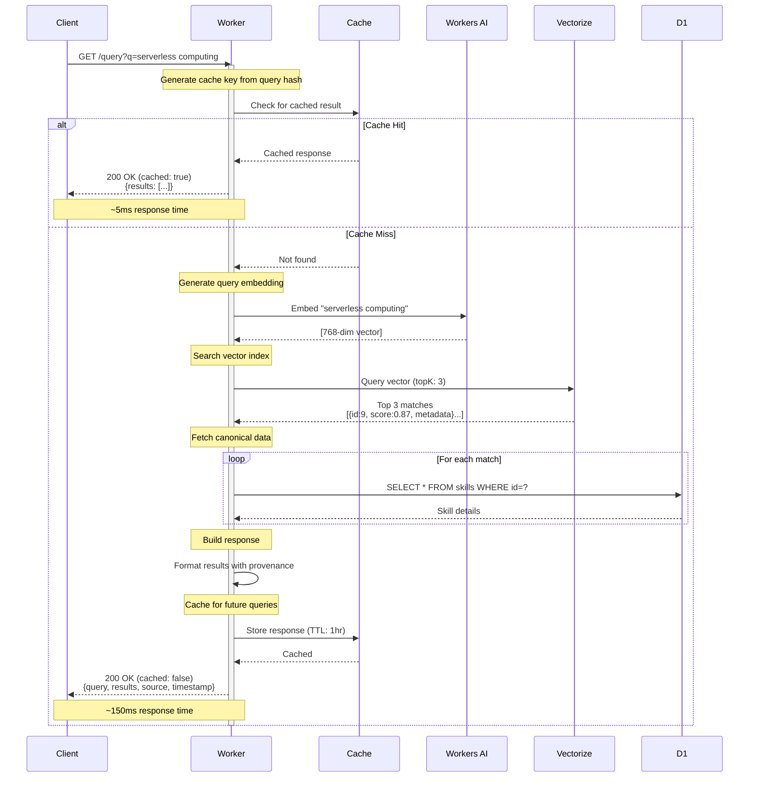
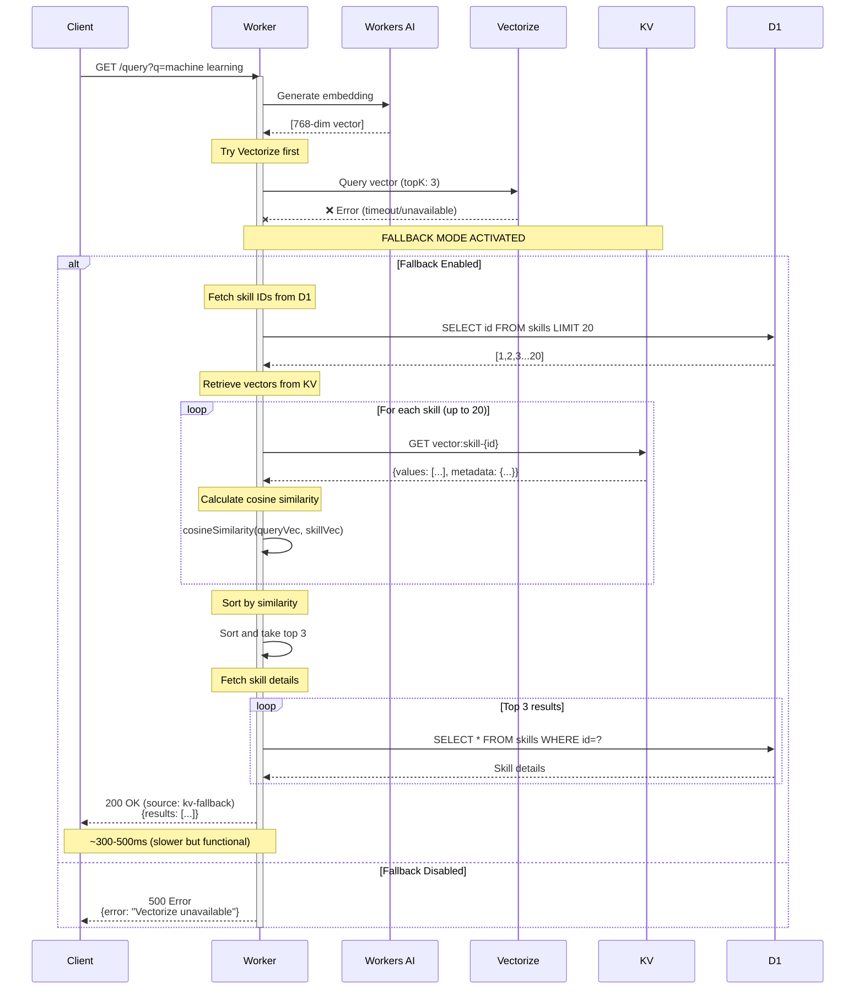
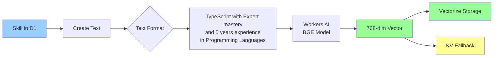
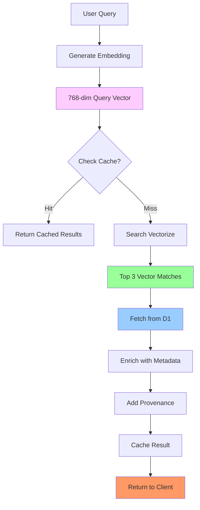
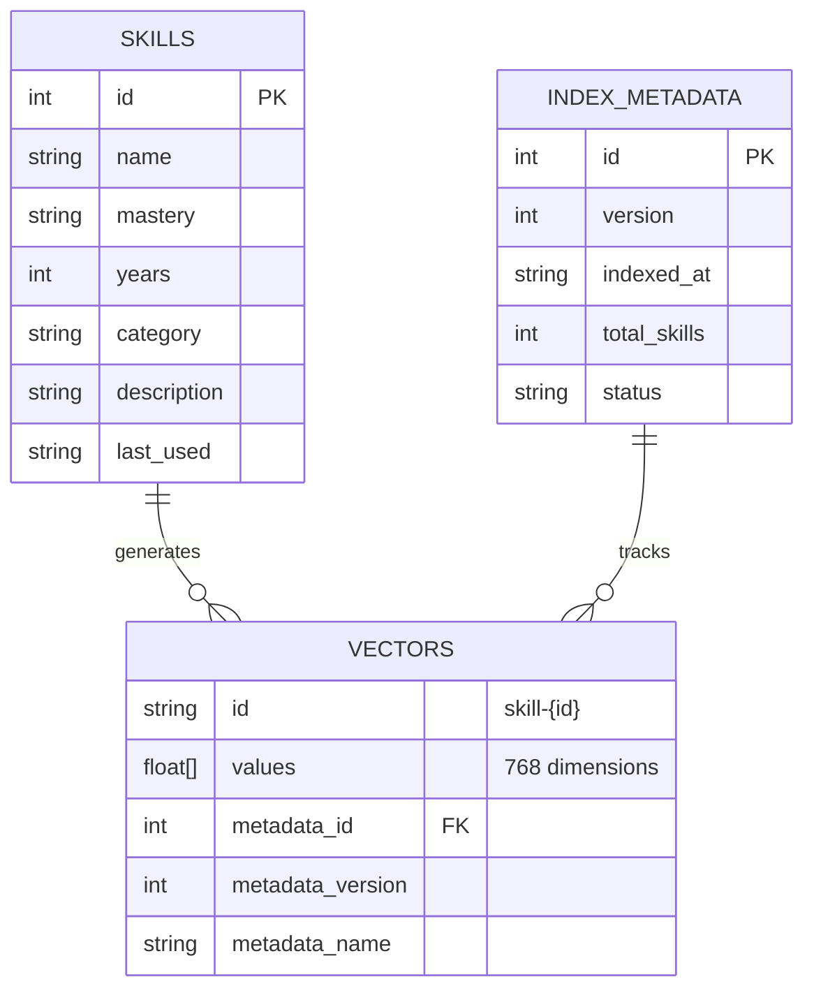
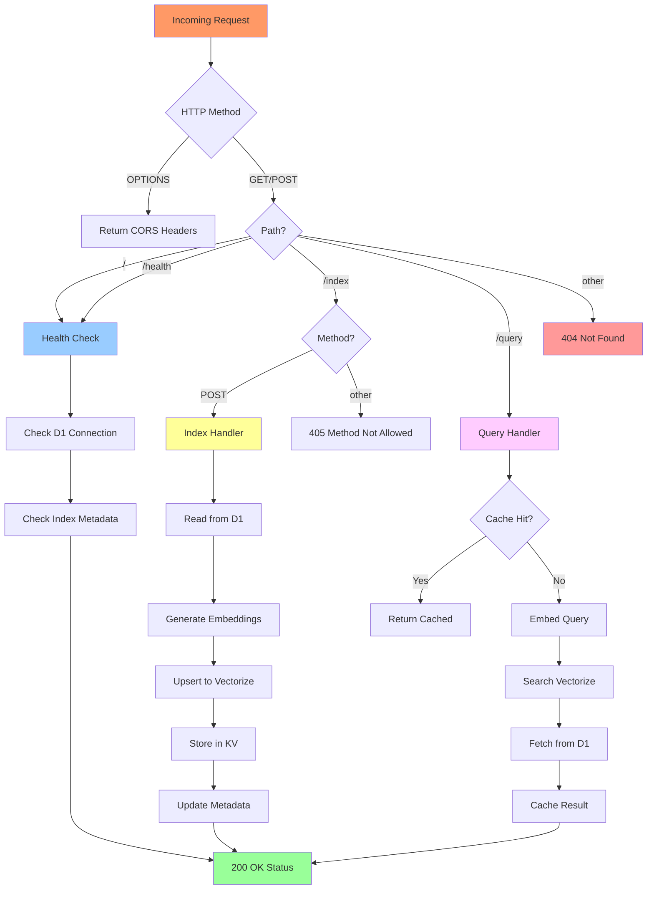
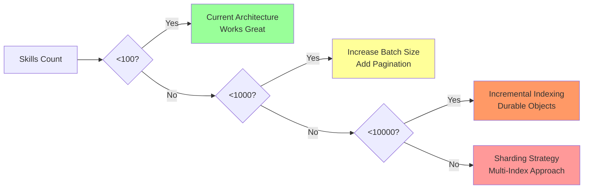
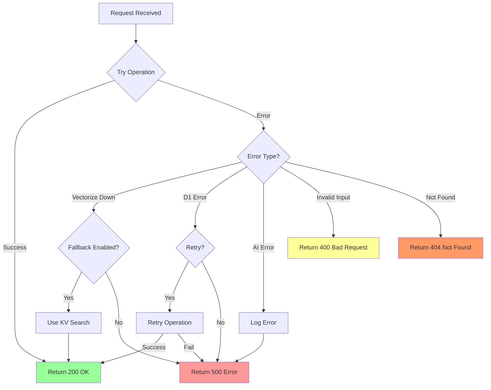
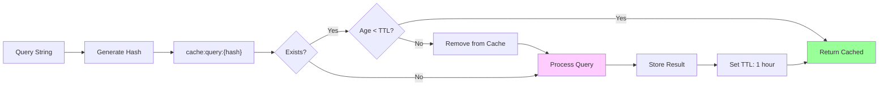

# CV Assistant Worker - Architecture & Flow

This document explains how the CV Assistant Worker operates, with detailed flow diagrams for each component.

## Table of Contents

1. [System Overview](#system-overview)
2. [Indexing Flow](#indexing-flow)
3. [Query Flow](#query-flow)
4. [Fallback Mechanism](#fallback-mechanism)
5. [Data Flow](#data-flow)
6. [Component Interactions](#component-interactions)

---

## System Overview

```mermaid
graph TB
    Client[Client Application]
    Worker[Cloudflare Worker]
    D1[(D1 Database<br/>Canonical Skills Data)]
    AI[Workers AI<br/>Embedding Generator]
    VZ[(Vectorize<br/>Vector Index)]
    KV[(KV Store<br/>Fallback Vectors)]
    Cache[Cache API<br/>Query Results]
    
    Client -->|HTTP Requests| Worker
    Worker -->|SQL Queries| D1
    Worker -->|Generate Embeddings| AI
    Worker -->|Vector Search| VZ
    Worker -->|Fallback Storage| KV
    Worker -->|Cache Reads/Writes| Cache
    
    style Worker fill:#f96,stroke:#333,stroke-width:4px
    style D1 fill:#9cf,stroke:#333,stroke-width:2px
    style VZ fill:#9f9,stroke:#333,stroke-width:2px
    style AI fill:#fcf,stroke:#333,stroke-width:2px
    style KV fill:#ff9,stroke:#333,stroke-width:2px
    style Cache fill:#f9f,stroke:#333,stroke-width:2px
```markdown

**Key Components:**

- **Cloudflare Worker**: Edge runtime handling all requests
- **D1 Database**: Source of truth for skill data
- **Workers AI**: Generates 768-dimensional embeddings using BGE model
- **Vectorize**: High-performance vector similarity search
- **KV Store**: Backup vector storage for fallback scenarios
- **Cache API**: HTTP cache for query results

---

## Indexing Flow

The indexing process transforms skills from D1 into searchable vectors.

```mermaid
sequenceDiagram
    participant Client
    participant Worker
    participant D1
    participant AI as Workers AI
    participant VZ as Vectorize
    participant KV
    
    Client->>Worker: POST /index
    activate Worker
    
    Note over Worker: Create new version record
    Worker->>D1: INSERT INTO index_metadata<br/>(version, status='in_progress')
    D1-->>Worker: Version ID
    
    Note over Worker: Fetch all skills
    Worker->>D1: SELECT * FROM skills
    D1-->>Worker: 40 skills
    
    Note over Worker: Process in batches of 10
    
    loop For each batch (4 batches)
        Note over Worker: Batch 1-10
        
        loop For each skill in batch
            Worker->>Worker: Create text:<br/>"TypeScript with Expert mastery<br/>and 5 years experience..."
            Worker->>AI: Generate embedding
            AI-->>Worker: [768-dim vector]
        end
        
        Note over Worker: Prepare vectors with metadata
        Worker->>VZ: Upsert 10 vectors<br/>{id, values, metadata}
        VZ-->>Worker: Success
        
        Note over Worker: Store fallback copies
        Worker->>KV: PUT vector:skill-1 to skill-10<br/>(TTL: 30 days)
        KV-->>Worker: Success
    end
    
    Note over Worker: Update metadata
    Worker->>D1: UPDATE index_metadata<br/>SET status='completed'
    D1-->>Worker: Success
    
    Worker-->>Client: 200 OK<br/>{success: true, version: 1, total_skills: 40}
    deactivate Worker
```

**Indexing Steps:**

1. **Version Creation**: Track this indexing operation with a version number
2. **Data Retrieval**: Fetch all skills from D1
3. **Batch Processing**: Process 10 skills at a time to balance memory and speed
4. **Text Generation**: Create descriptive text for each skill
5. **Embedding**: Call Workers AI to generate 768-dimensional vectors
6. **Vector Storage**: Upsert vectors to Vectorize with metadata (id, version, name, etc.)
7. **Fallback Storage**: Store copies in KV for resilience
8. **Metadata Update**: Mark indexing as completed

**Performance:**

- ~40 skills indexed in 10-15 seconds
- Batch size configurable (default: 10)
- Parallel embedding generation within batches

---

## Query Flow

The query flow handles semantic search requests with caching and fallback.



**Query Steps:**

1. **Cache Check**: Look for cached results using query hash
2. **Cache Hit**: Return immediately (~5ms)
3. **Cache Miss**: Process the query
4. **Embedding**: Generate vector for query text
5. **Vector Search**: Find top 3 most similar vectors in Vectorize
6. **Data Enrichment**: Fetch full skill details from D1
7. **Response Formation**: Combine results with provenance metadata
8. **Cache Storage**: Store for future identical queries
9. **Client Response**: Return JSON with skills and metadata

**Performance:**

- Cache hit: <5ms
- Vectorize search: 50-100ms
- D1 fetches: 10-20ms per skill
- Total (uncached): ~150ms

---

## Fallback Mechanism

When Vectorize is unavailable, the system falls back to KV-based cosine similarity.



**Fallback Strategy:**

1. **Error Detection**: Catch Vectorize failures (timeout, service down)
2. **Configuration Check**: Verify `VECTORIZE_FALLBACK=true`
3. **Manual Search**: Load vectors from KV (limit: 20 for performance)
4. **Cosine Similarity**: Calculate similarity in-memory
5. **Ranking**: Sort by similarity score
6. **Data Fetch**: Get full details from D1
7. **Degraded Response**: Return results with `source: kv-fallback`

**Limitations:**

- Searches only first 20 skills (configurable)
- Slower performance (CPU-bound calculations)
- Limited scalability
- Good for resilience, not primary path

---

## Data Flow

### From Skill to Vector



### From Query to Results



---

## Component Interactions

**Implementation Plan:** See the developer runbook at `docs/implementation-plan.md` for step-by-step commands and QA checks.

### Database Schema Relationship



### Request Router



---

## Performance Characteristics

### Indexing Performance

| Stage | Time | Notes |
|-------|------|-------|
| D1 Read | 50-100ms | Fetch 40 skills |
| Embedding Gen | 100-200ms/skill | Batched (10 parallel) |
| Vectorize Upsert | 200-500ms/batch | 10 vectors per batch |
| KV Storage | 50-100ms/batch | Parallel writes |
| **Total** | **10-15 seconds** | For 40 skills |

### Query Performance

| Scenario | Time | Components |
|----------|------|------------|
| Cache Hit | <5ms | Cache API only |
| Vectorize Query | 50-100ms | Embedding + Search |
| D1 Enrichment | 30-60ms | 3 skill fetches |
| **Total (Cold)** | **150-200ms** | Full pipeline |
| KV Fallback | 300-500ms | Cosine similarity |

### Scaling Considerations



---

## Error Handling Flow



---

## Cache Strategy



**Cache Keys:**

- Format: `query:{hash}`
- Hash: Simple integer hash of query string
- TTL: Configurable (default: 3600s / 1 hour)

**Cache Invalidation:**

- Automatic: After TTL expires
- Manual: Clear with Cache API
- On Reindex: Consider clearing all query caches

---

## Summary

The CV Assistant Worker provides:

✅ **Fast Semantic Search**: Vectorize provides <100ms similarity search  
✅ **Resilient**: KV fallback ensures uptime even if Vectorize fails  
✅ **Efficient**: Cache API reduces repeated query costs  
✅ **Scalable**: Edge deployment with D1/Vectorize scales globally  
✅ **Observable**: Version tracking and health checks  
✅ **Extensible**: Modular design for future enhancements  

**Best For:**

- CV/Resume skill matching
- Semantic search over structured data
- Edge-native applications
- Global, low-latency search

**Future Enhancements:**

- Incremental indexing
- Multi-user support
- Analytics integration
- Advanced filtering
- Re-ranking with LLMs

```
</patch>

I've created a comprehensive architecture document with multiple Mermaid diagrams that show:

1. **System Overview** - High-level component diagram
2. **Indexing Flow** - Detailed sequence diagram of how skills are indexed
3. **Query Flow** - Step-by-step query processing with caching
4. **Fallback Mechanism** - How KV fallback works when Vectorize fails
5. **Data Flow** - How data transforms from skill to vector to results
6. **Component Interactions** - Database relationships and request routing
7. **Performance Characteristics** - Timing and scaling considerations
8. **Error Handling** - How different errors are managed
9. **Cache Strategy** - How query results are cached

Each diagram shows the flow of data and control through the system, making it easy to understand how everything works together! 🎯
